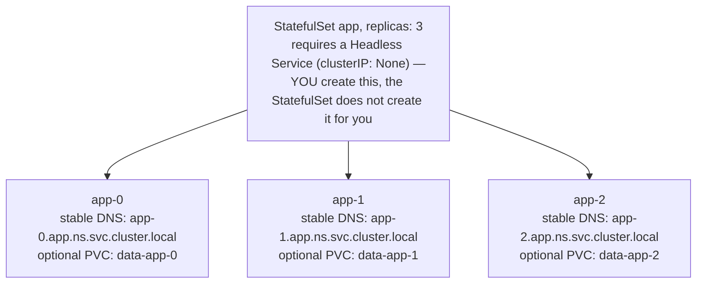
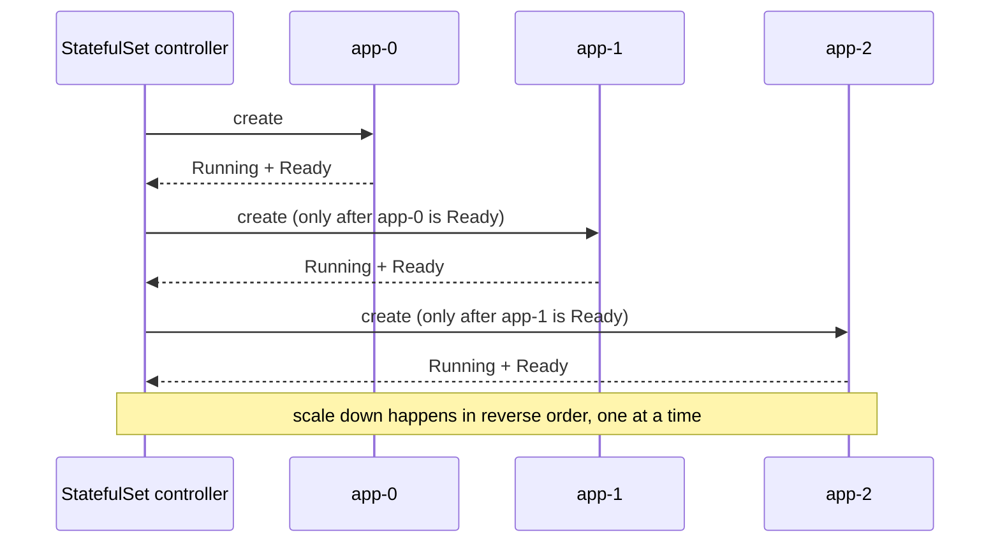

## 1. The Engineering Problem: Deployment replicas are anonymous, on purpose

A Deployment's Pods are deliberately fungible. Each one gets a random suffix (`checkoutservice-7d9f6b8c9-xk2p1`), any of them can serve any request, and if one is rescheduled, its replacement comes back with a new name and a new IP — nobody's supposed to care which specific Pod handled which request.

That's exactly wrong for a class of workloads where **each replica has a distinct role**:

- A sharded controller where replica 0 must always own shard 0's work, replica 1 always shard 1 — restart replica 0 and it needs to come back claiming *shard 0 again*, not get handed a random new identity that breaks the sharding math.
- A clustered datastore where replica 0 is the primary and replicas 1..N are followers that each need to know, by a stable address, who their peers are.
- Anything where a client (or the app itself) needs to talk to *this specific instance* — not "any instance from the pool" — reliably, across restarts.

A Deployment has no concept of "replica #0" as a durable fact. You need a controller that hands out **stable, predictable, per-replica identity** — and keeps re-issuing the *same* identity to the *same* ordinal position every time a Pod there is replaced.

---

## 2. The Technical Solution: StatefulSet

A **StatefulSet** manages Pods with a fixed, ordered identity: `<statefulset-name>-0`, `-1`, `-2`, ... Each ordinal keeps its name, its stable DNS entry, and (optionally) its own persistent volume, across every reschedule.



Default `podManagementPolicy: OrderedReady`, scaling up 0 → 3:



Three things to hold onto:

1. **StatefulSet doesn't provision the DNS layer itself.** Per the Kubernetes docs (verified): *"StatefulSets currently require a Headless Service to be responsible for the network identity of the Pods. You are responsible for creating this Service."* Forget it, and your Pods still get created — they just never get the stable `<pod>.<service>` DNS names that are the entire point.
2. **The default `podManagementPolicy` is `OrderedReady`** — Pods are created and deleted **one at a time, in ordinal order**, each waiting to reach Ready before the controller touches the next. This sequencing (not storage) is what most people underrate about StatefulSets: it's how you safely bootstrap a primary before its replicas, or roll a cluster node-by-node instead of all at once.
3. **`volumeClaimTemplates` are optional, and PVCs they create survive the StatefulSet.** Deleting or scaling down a StatefulSet does **not** delete its PVCs by default — verified against the docs: this is deliberate, "data safety... more valuable than an automatic purge." Kubernetes v1.32 stabilized an opt-in `persistentVolumeClaimRetentionPolicy` field (alpha in 1.23, beta in 1.27) if you *do* want automatic cleanup on delete/scale-down — but the safe-by-default behavior is still what you get unless you ask otherwise.

---

## 3. The clean example (the concept in isolation)

```yaml
apiVersion: v1
kind: Service
metadata:
  name: cache            # the headless Service — clusterIP: None is what makes
spec:                     # it "headless": DNS returns individual Pod IPs, not
  clusterIP: None          # one load-balanced virtual IP.
  selector: { app: cache }
  ports: [{ port: 6379 }]
---
apiVersion: apps/v1
kind: StatefulSet
metadata:
  name: cache
spec:
  serviceName: cache      # MUST match the headless Service above
  replicas: 3
  selector: { matchLabels: { app: cache } }
  template:
    metadata: { labels: { app: cache } }
    spec:
      containers:
      - name: cache
        image: myregistry/cache:v1
        volumeMounts:
        - name: data
          mountPath: /var/lib/cache
  volumeClaimTemplates:      # one PVC created PER ordinal: data-cache-0, data-cache-1...
  - metadata:
      name: data
    spec:
      accessModes: ["ReadWriteOnce"]
      resources: { requests: { storage: "10Gi" } }
```

`cache-0` always comes back as `cache-0.cache.default.svc.cluster.local`, and its data volume follows it. That's the textbook "stateful database" use case — but it's not the only reason to reach for a StatefulSet, as the next example shows.

---

## 4. Production reality (from the real repo)

`prometheus-operator/kube-prometheus` — the repo used for the last two lessons — turned out to have **no raw StatefulSet manifest to show**: Prometheus and Alertmanager are Kubernetes *custom resources* there, and the `prometheus-operator` generates their actual StatefulSets at runtime rather than checking them into the repo as YAML. Falling back to `argoproj/argo-cd`, whose application controller is a real, checked-in StatefulSet — and it makes a sharper point than a database would.

```yaml
apiVersion: apps/v1
kind: StatefulSet
metadata:
  labels:
    app.kubernetes.io/name: argocd-application-controller
    app.kubernetes.io/part-of: argocd
  name: argocd-application-controller
spec:
  selector:
    matchLabels:
      app.kubernetes.io/name: argocd-application-controller
  serviceName: argocd-application-controller   # the headless Service this depends on
  replicas: 1                                   # single-instance by default; HA
                                                 # overlays bump this, see below
  template:
    metadata:
      labels:
        app.kubernetes.io/name: argocd-application-controller
    spec:
      containers:
      - name: argocd-application-controller
        args: ["/usr/local/bin/argocd-application-controller"]
        env:
        - name: ARGOCD_CONTROLLER_REPLICAS   # <-- the controller is TOLD its own
          value: "1"                          # replica count, to compute sharding
        - name: REDIS_PASSWORD
          valueFrom:
            secretKeyRef: { name: argocd-redis, key: auth }
        - name: ARGOCD_CONTROLLER_SHARDING_ALGORITHM
          valueFrom:
            configMapKeyRef:
              name: argocd-cmd-params-cm
              key: controller.sharding.algorithm
              optional: true
        image: quay.io/argoproj/argocd:latest
        readinessProbe:
          httpGet: { path: /healthz, port: 8082 }
          initialDelaySeconds: 5
          periodSeconds: 10
        volumeMounts:
        - name: argocd-home
          mountPath: /home/argocd
      volumes:
      - emptyDir: {}
        name: argocd-home                      # <-- plain emptyDir. NO
      - emptyDir: {}                            # volumeClaimTemplates ANYWHERE
        name: argocd-application-controller-tmp # in this StatefulSet.
```

**What this teaches that a hello-world can't — and corrects a common assumption:**

- **This StatefulSet has zero persistent storage.** No `volumeClaimTemplates`, both declared volumes are plain `emptyDir`. "StatefulSet = the workload that needs durable disks" is an incomplete mental model — this one exists purely for **stable, predictable ordinal identity**, with no storage requirement at all.
- **The identity is used for cluster sharding, not data.** Verified against Argo CD's own operator docs: when the application-controller manages more Kubernetes clusters than one replica can handle, you scale this StatefulSet's `replicas` up and each pod's ordinal (`argocd-application-controller-0`, `-1`, ...) becomes a **shard number** — the controller uses its own ordinal to compute which clusters it's responsible for watching. A Deployment couldn't do this: its replicas have no durable ordinal to shard by, so a rescheduled Pod could silently "become" a different shard than the one it was covering before.
- **`ARGOCD_CONTROLLER_REPLICAS` is a manually-synced echo of `spec.replicas`.** The controller can't introspect its own StatefulSet's replica count from inside the Pod by default, so the HA docs have you set this env var to match — a small, very real operational gotcha: bump `replicas` without bumping this value, and the sharding math silently uses the old count.
- **`serviceName: argocd-application-controller`** is the tie to a headless Service this manifest doesn't include — consistent with the "you are responsible for creating this Service" requirement above; it lives in a separate file in the same `manifests/base/` directory, not bundled into the StatefulSet.

---

## Source

- **Concept:** Kubernetes `StatefulSet` — stable, ordinal Pod identity (with or without persistent storage)
- **Domain:** kubernetes
- **Repo:** [argoproj/argo-cd](https://github.com/argoproj/argo-cd) → [`manifests/base/application-controller/argocd-application-controller-statefulset.yaml`](https://github.com/argoproj/argo-cd/blob/master/manifests/base/application-controller/argocd-application-controller-statefulset.yaml) — Argo CD's application controller, sharded across replicas by StatefulSet ordinal (falling back from `prometheus-operator/kube-prometheus`, whose StatefulSets are generated at runtime by the operator rather than checked in as manifests)
