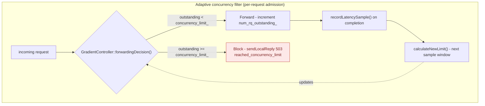
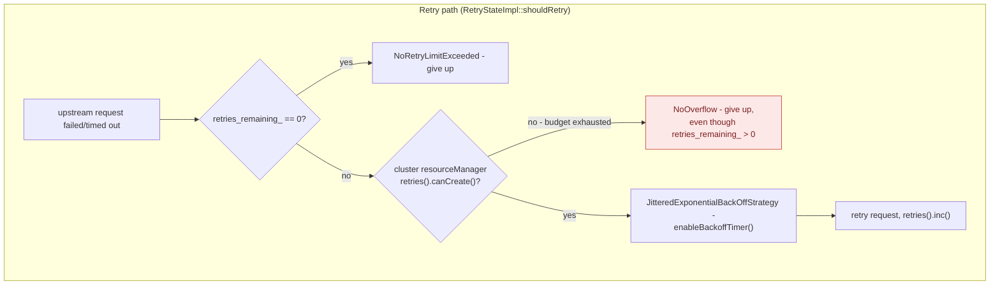

**TL;DR:** Why does a fixed concurrency limit or a fixed retry count eventually make an outage worse, not better? Because a static limit is either too low most of the time or too high exactly when the backend is already struggling, and a static retry count multiplies load on a system that's failing *because* it's overloaded — the fix is a limit that adapts to measured latency in real time, plus a retry budget that caps total in-flight retries across the whole client population, not per-request.

> **In plain English (30 sec):** Like a fuse — if service fails 5 times, stop calling for 30s.

**Real repo:** [`envoyproxy/envoy`](https://github.com/envoyproxy/envoy)

## 1. The Engineering Problem: static limits and unconditional retries both assume a backend that never degrades

Two "obvious" resilience mechanisms actively make cascading failure worse once a backend starts to slow down, and both share the same root cause: they were sized for the happy path.

**A fixed concurrency limit is a guess.** Set it too low and you throttle a healthy backend during normal traffic variance, wasting capacity. Set it too high — the common failure mode, because teams size it for burst traffic and never revisit it — and when the backend's latency creeps up (a downstream dependency slows, a GC pause, a noisy neighbor), the fixed limit keeps admitting the same number of concurrent requests into a system that can no longer drain them at the same rate. Queues build, latency compounds, and the fixed limit did nothing to signal or prevent it.

**Unconditional retry is worse: it actively amplifies the problem it's trying to work around.** If a backend is returning errors or timing out because it's overloaded, every client independently retrying failed requests means the aggregate request rate against that backend *increases* exactly when it needs to decrease. This is the retry storm: N clients each retrying 3 times on failure turns one unit of offered load into up to 4x the load on an already-struggling service, and if the retries themselves get slow (because the backend really is degraded), clients pile up more retries on top of the ones still in flight. This is widely cited as the single most common self-inflicted cause of cascading failure in distributed systems — a resilience mechanism a team added specifically to *survive* transient failures instead detonates the outage into a full one.

What both problems need is the same shape of fix: a signal-driven limit instead of a static number, and a shared, bounded budget instead of each caller acting independently.

---

## 2. The Technical Solution: measure, then bound — adaptive concurrency, load shedding, and a retry circuit breaker

Envoy's `adaptive_concurrency` HTTP filter replaces a fixed concurrency cap with one derived continuously from measured request latency (the "gradient" algorithm, based on Netflix's concurrency-limits library). Separately, Envoy's router applies a **retry circuit breaker** — a resource limit on the *cluster*, not the individual request — that bounds the total number of in-flight retries across every caller talking to that upstream, regardless of how many individual clients decide to retry.





Core truths these two diagrams are showing:

- **Load shedding is an admission decision made per-request, before the request consumes any downstream capacity** — `forwardingDecision()` is a compare-and-swap against the *current* limit, checked before the request is forwarded, not after it fails. A shed request costs the caller a fast 503, not a slow timeout.
- **The concurrency limit is not configured — it's computed, continuously, from the ratio of two measured round-trip times** (detailed in section 4). This is what makes it "adaptive": it rises when the backend is fast and falls automatically when the backend slows down, without a human resizing anything.
- **The retry budget lives on the cluster (shared across every caller), not on any single request's retry policy.** `retries_remaining_` (per-request) and `cluster_.resourceManager(priority_).retries().canCreate()` (cluster-wide, shared) are two *independent* gates — a request can still have retries left in its own policy and still be refused a retry because the shared budget is exhausted. That shared gate is specifically what prevents the storm: it caps *aggregate* retry volume, which a per-request retry count alone cannot do.

---

## 3. The clean example (concept in isolation)

A minimal Envoy cluster config showing both mechanisms together — a concurrency budget derived from latency, and a bounded, jittered retry policy:

```yaml
# adaptive concurrency: no hardcoded limit - only bounds and sampling parameters
http_filters:
- name: envoy.filters.http.adaptive_concurrency
  typed_config:
    "@type": type.googleapis.com/envoy.extensions.filters.http.adaptive_concurrency.v3.AdaptiveConcurrency
    gradient_controller_config:
      min_rtt_calc_params:
        interval: 30s        # how often minRTT (the healthy baseline) is re-measured
        request_count: 50    # samples needed before trusting a new minRTT
      concurrency_limit_params:
        max_concurrency_limit: 1000   # ceiling, not the working value
        concurrency_update_interval: 0.1s

# retry budget: bounds RETRIES specifically, separate from the connection-pool circuit breaker
circuit_breakers:
  thresholds:
  - priority: DEFAULT
    max_retries: 3   # max concurrent in-flight retries for this cluster - shared budget

route_config:
  virtual_hosts:
  - routes:
    - route:
        retry_policy:
          retry_on: "5xx"
          num_retries: 2                 # per-request cap
          retry_back_off:
            base_interval: 0.025s        # matches upstream.base_retry_backoff_ms default
            max_interval: 0.25s          # 10x base, matching RetryStateImpl's default cap
```

---

## 4. Production reality (from `envoyproxy/envoy`)

```
envoy/source/
├── extensions/filters/http/adaptive_concurrency/
│   ├── adaptive_concurrency_filter.cc      # per-request admit/shed decision
│   └── controller/gradient_controller.cc   # the latency-driven limit calculation
└── common/router/
    └── retry_state_impl.cc                  # retry gating: per-request count + cluster-wide budget
```

**Load shedding — the admission check that runs on every request:**

```cpp
// adaptive_concurrency_filter.cc
Http::FilterHeadersStatus AdaptiveConcurrencyFilter::decodeHeaders(
    Http::RequestHeaderMap&, bool) {
  if (!config_->filterEnabled() || decoder_callbacks_->streamInfo().healthCheck()) {
    return Http::FilterHeadersStatus::Continue;   // health checks never sampled or shed
  }

  if (controller_->forwardingDecision() == Controller::RequestForwardingAction::Block) {
    decoder_callbacks_->sendLocalReply(
        config_->concurrencyLimitExceededStatus(),   // 503 by default, configurable
        "reached concurrency limit", nullptr, std::nullopt,
        "reached_concurrency_limit");
    return Http::FilterHeadersStatus::StopIteration;   // shed HERE - never forwarded upstream
  }
  // ... deferred_sample_task_ records this request's latency when it completes
}
```

**Adaptive concurrency — the gradient calculation that derives the limit from measured latency:**

```cpp
// gradient_controller.cc
uint32_t GradientController::calculateNewLimit() {
  // buffered_min_rtt: the healthy baseline RTT, inflated by a configured buffer
  const auto buffered_min_rtt =
      min_rtt_.count() + min_rtt_.count() * config_.minRTTBufferPercent();

  // gradient > 1 means "current latency is BETTER than baseline" - room to grow.
  // gradient < 1 means "current latency is WORSE than baseline" - back off.
  const double raw_gradient =
      static_cast<double>(buffered_min_rtt) / sample_rtt_.count();
  const double gradient = std::max<double>(0.5, std::min<double>(2.0, raw_gradient));

  const double limit = concurrencyLimit() * gradient;
  const double burst_headroom = sqrt(limit);   // small allowance for legitimate bursts

  const uint32_t new_limit = limit + burst_headroom;
  return std::max<uint32_t>(config_.minConcurrency(),
                            std::min<uint32_t>(config_.maxConcurrencyLimit(), new_limit));
}
```

**Retry storm prevention — the shared budget checked before any retry is scheduled:**

```cpp
// retry_state_impl.cc
RetryStatus RetryStateImpl::shouldRetry(RetryDecision would_retry, DoRetryCallback callback) {
  if (retries_remaining_ == 0) {
    return RetryStatus::NoRetryLimitExceeded;   // this request's own policy is exhausted
  }
  retries_remaining_--;

  // canCreate() checks the CLUSTER-WIDE retry resource - shared across every
  // caller/request currently retrying against this upstream, not just this one
  if (!cluster_.resourceManager(priority_).retries().canCreate()) {
    return RetryStatus::NoOverflow;   // budget exhausted, even with retries_remaining_ > 0
  }

  cluster_.resourceManager(priority_).retries().inc();
  backoff_callback_ = callback;
  enableBackoffTimer();   // JitteredExponentialBackOffStrategy - never immediate retry
  return RetryStatus::Yes;
}
```

What this teaches that a hello-world can't:

- **`calculateNewLimit()` clamps the gradient to `[0.5, 2.0]` before applying it.** An unclamped gradient would let one bad sample window collapse the limit toward zero or spike it toward the ceiling in a single step — the clamp is what keeps the adaptation smooth instead of oscillating, a detail no simplified explanation of "measure latency, adjust the limit" would surface.
- **`min_rtt_` and `sample_rtt_` are two separately-measured values, not one.** `min_rtt_` is recalculated periodically in a dedicated sampling window (`enterMinRTTSamplingWindow()`, gated by `min_rtt_calc_interval_`) specifically because a backend's "healthy baseline" latency itself drifts over time (a slow rolling deploy, added downstream hops) — using a single fixed baseline forever would make the gradient meaningless months after the limit was first tuned.
- **`retries().canCreate()` is checked *in addition to* `retries_remaining_`, not instead of it.** These enforce different things: `retries_remaining_` bounds how many times *one* logical request retries; the cluster resource manager bounds how many retries are in flight *across the whole cluster at once*. A system under real load can have every individual request well within its own retry budget and still have the shared gate refuse new retries — that's the mechanism actually stopping the storm, and it only shows up when you look at both checks together, not either one alone.
- **The backoff is jittered exponential, and retries never fire on the same event-loop tick as the failure.** `enableBackoffTimer()` always schedules through a timer (never `Immediately` for backoff retries) — this spreads a herd of simultaneously-failing requests' retries out in time instead of all of them hammering the backend again at once, which compounds the cluster-wide budget's effect.

Known-stale fact: "circuit breaker" in Envoy's config does *not* mean the classic Hystrix-style closed/open/half-open state machine most tutorials describe — Envoy's `circuit_breakers` block (`max_connections`, `max_pending_requests`, `max_requests`, `max_retries`) is a set of static resource limits per priority level, checked synchronously on each request, with no time-based half-open recovery state at all. The gradient controller shown here is Envoy's actual adaptive mechanism; the thing literally named "circuit breaker" in Envoy is closer to a bulkhead/resource cap than the pattern the name usually evokes elsewhere.

---

## 5. Review checklist

- **Is a concurrency limit hardcoded anywhere it could instead be derived from measured latency** — and if adaptive concurrency is in use, are `min_rtt_calc_params.interval` and `request_count` set often enough to track real baseline drift, not left at a value copied from an unrelated service's config?
- **Does the retry policy have both a per-request `num_retries` and a cluster-level `max_retries` circuit breaker** — a retry policy with no cluster-wide budget is exactly the unconditional-retry failure mode section 1 describes, regardless of how conservative the per-request count looks.
- **Is the retry backoff jittered, or is it a fixed interval?** A fixed interval retried by many clients simultaneously re-synchronizes them into another simultaneous wave against the backend — `JitteredExponentialBackOffStrategy` exists specifically to avoid that.
- **Does load shedding return fast (a 503 before the request reaches the backend) or does a saturated system just let requests queue and time out slowly?** A slow failure ties up client-side resources (threads, connections) far longer than a fast one and defeats the purpose of shedding in the first place — check that `concurrency_limit_exceeded_status` (or equivalent) is actually wired to reject early, not just log.

## 6. FAQ

**Q: What's the actual difference between load shedding and adaptive concurrency here — aren't they the same filter?**
A: They're the same filter (`adaptive_concurrency`) doing two related jobs. Adaptive concurrency is the *computation* — `calculateNewLimit()` deriving a moving target from latency. Load shedding is the *enforcement* — `forwardingDecision()` in `adaptive_concurrency_filter.cc` comparing outstanding requests against whatever that computed limit currently is and rejecting with a 503 when it's exceeded. One without the other doesn't work: a computed limit that isn't enforced is just a stat, and enforcement against a static limit is just a plain (non-adaptive) admission control.

**Q: Why measure a percentile (`sample_aggregate_percentile`) of latency instead of the average?**
A: `processLatencySamplesAndClear()` uses `hist_approx_quantile()` against a configured percentile (50th by default) rather than a mean specifically because a mean is skewed by a small number of very slow outliers in ways that don't reflect what most requests are actually experiencing — the same reason SLOs are usually expressed as p50/p99, not average latency.

**Q: Does the retry circuit breaker (`max_retries`) apply separately from the connection-pool circuit breaker (`max_pending_requests`, `max_connections`)?**
A: Yes — Envoy's `circuit_breakers.thresholds` block configures each resource type independently per priority level. `retries().canCreate()` in `retry_state_impl.cc` checks only the retry-specific budget; a cluster can be well within its connection limits and still refuse new retries because the retry budget specifically is exhausted, which is exactly the isolation that stops retries from starving out fresh, non-retried requests for the same connection pool.

**Q: Could a service just set `num_retries` to 0 and skip all of this?**
A: That trades one failure mode for another — with zero retries, any transient blip (a single dropped connection, a GC pause under 25ms) becomes a hard failure the caller has to handle itself, instead of being smoothed over by one bounded, jittered retry. The mechanisms here exist because "retry" and "don't retry" are both wrong as blanket answers; the shared budget is what makes a bounded amount of retry safe.

**Q: Is `burst_headroom` in `calculateNewLimit()` just padding, or does it do something specific?**
A: It's `sqrt(limit)`, added on top of the gradient-scaled limit specifically to tolerate a legitimate burst without immediately treating it as a latency regression — without it, a brief, healthy spike in concurrent requests (not a real slowdown) would get read as "sample RTT rose relative to min RTT" on the very next window and shrink the limit reactively, which is the opposite of what an adaptive limit should do for load that the backend can actually still handle.

---

## Source

- **Concept:** Advanced resilience patterns (load shedding, adaptive concurrency, retry storms)
- **Domain:** microservices
- **Repo:** [envoyproxy/envoy](https://github.com/envoyproxy/envoy) → [`source/extensions/filters/http/adaptive_concurrency/adaptive_concurrency_filter.cc`](https://github.com/envoyproxy/envoy/blob/main/source/extensions/filters/http/adaptive_concurrency/adaptive_concurrency_filter.cc), [`source/extensions/filters/http/adaptive_concurrency/controller/gradient_controller.cc`](https://github.com/envoyproxy/envoy/blob/main/source/extensions/filters/http/adaptive_concurrency/controller/gradient_controller.cc), [`source/common/router/retry_state_impl.cc`](https://github.com/envoyproxy/envoy/blob/main/source/common/router/retry_state_impl.cc) — the CNCF-graduated edge and service proxy.


