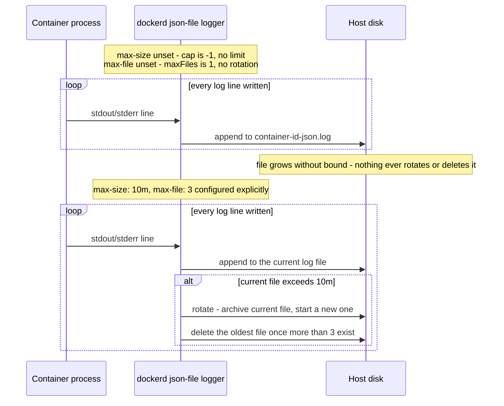
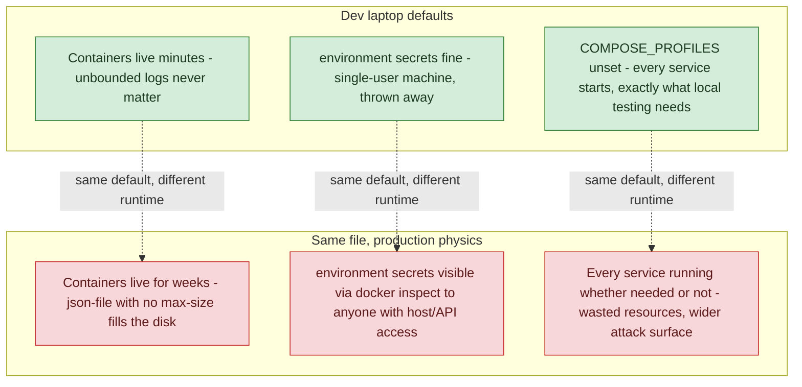

**TL;DR:** Why does the exact `docker-compose.yml` that works fine on a laptop turn into a full disk and an exposed credential in production? Docker's default logging driver (`json-file`) never rotates or caps a container's log file unless `max-size`/`max-file` are set explicitly, environment-variable "secrets" are always visible via `docker inspect` regardless of which compose key set them, and neither problem shows up on a laptop where containers run for minutes and get thrown away — only in production, where the same container runs for weeks.

**Real repos:** [`getsentry/self-hosted`](https://github.com/getsentry/self-hosted), [`moby/moby`](https://github.com/moby/moby)

## 1. The Engineering Problem: dev and prod run the *same* compose file under *different* physics

A developer runs `docker compose up`, works for an hour, tears it down. Log volume is trivial, secrets live in a `.env` file nobody else reads, and every service in the file starts because every service is needed for local testing. None of that is a problem — until the identical file, or one barely modified from it, becomes the production deployment.

In production, three defaults that were invisible in dev become real failure modes:

- **Logging.** A container that runs for months, not minutes, writes gigabytes of stdout/stderr. Docker's default logging driver has no built-in ceiling — the disk fills, and it fills silently, because nothing about `docker compose up` warns you the log file has no cap.
- **Secrets.** An `environment:` block (or an `env_file:`) that was fine for a throwaway local Postgres password becomes a real credential — a database password, an API key — sitting in plaintext, retrievable by anyone who can run `docker inspect` against the container or read `/proc/<pid>/environ` inside its namespace.
- **"Which services actually run here."** Dev needs every service to exercise the whole stack locally. Production often doesn't — optional Kafka consumers, feature-flagged subsystems, or debug tooling that dev relies on can be pure waste (or an actual liability) running unattended in production, if the compose file has no mechanism to vary what starts per environment.

None of these are Docker bugs. They're defaults that are *correct for a dev laptop* and *silently wrong for a long-running production host* — the gap is entirely in what changes (or doesn't) between the two.

---

## 2. The Technical Solution: make the environment-specific parts explicit, not implicit

### Logging: the default driver has no ceiling until you give it one

Docker's default `json-file` logging driver is implemented in `dockerd` itself (`daemon/logger/jsonfilelog`), and its defaults are a deliberate "no limit unless asked" design: no size cap, one file, meaning no rotation ever triggers.



### Secrets: the mechanism that actually hides a value is a file, not an environment variable

`environment:` and `env_file:` in Compose both land the value in the container's environment at runtime — and anything in a container's environment is visible to `docker inspect <container>` and to any process running inside that container's namespace. Neither compose key hides a secret from inspection; the difference between them is only whether the *value* is checked into git, not whether it's exposed at runtime. The mechanism that actually keeps a secret out of `docker inspect` is mounting it as a **file** the application reads, generated once outside the image and outside version control.

### "Which services run here": profiles, not a second compose file

Compose's `profiles:` key lets a single `docker-compose.yml` describe every possible service, while `COMPOSE_PROFILES` (an environment variable, set differently per environment) decides which of them actually start on `docker compose up` — without hand-maintaining a parallel `docker-compose.prod.yml` that drifts out of sync with the dev version over time.



Core truths: **`logging`, secret-mounting, and `profiles` are all opt-in** — Compose has no "production mode" flag that changes any of these defaults for you; **the failure isn't in Docker's defaults being wrong, it's in a single file being asked to describe two different operating environments without being told how they differ.**

---

## 3. The clean example (concept in isolation)

```yaml
services:
  api:
    image: myapp:1.0
    logging:
      driver: json-file
      options:
        max-size: "10m"   # cap PER FILE before rotation triggers
        max-file: "3"     # keep at most 3 rotated files - roughly a 30m ceiling total
    volumes:
      # secret generated once at deploy time, mounted as a FILE -
      # never an env var, so it never shows up in `docker inspect`
      - ./secrets/api-credentials.json:/run/secrets/api-credentials.json:ro
    profiles:
      - production   # only starts when COMPOSE_PROFILES includes "production"
```

---

## 4. Production reality (from `getsentry/self-hosted` and `moby/moby`)

```
getsentry/self-hosted/
├── .env                            # non-secret defaults, committed to git
├── docker-compose.yml              # profiles: [feature-complete] gates optional services
└── install/
    ├── generate-secret-key.sh      # writes Sentry's system.secret-key at install time
    └── ensure-relay-credentials.sh # generates relay/credentials.json, never committed

moby/moby/
└── daemon/logger/jsonfilelog/
    └── jsonfilelog.go              # the json-file driver's actual default-cap logic
```

**`daemon/logger/jsonfilelog/jsonfilelog.go`** is where "no limit unless configured" is literally implemented — `capval` and `maxFiles` are the exact values fed into the rotation writer:

```go
// daemon/logger/jsonfilelog/jsonfilelog.go — New()
var capval int64 = -1
if capacity, ok := info.Config["max-size"]; ok {
	capval, err = units.FromHumanSize(capacity)
	// ...
}
maxFiles := 1
if maxFileString, ok := info.Config["max-file"]; ok {
	maxFiles, err = strconv.Atoi(maxFileString)
	// ...
}
// ...
writer, err := loggerutils.NewLogFile(info.LogPath, capval, maxFiles, compress, decodeFunc, 0o640, getTailReader)
```

**`install/generate-secret-key.sh`** generates Sentry's application secret key at install time and writes it directly into a config file that's bind-mounted into the container — not passed as an environment variable:

```bash
# install/generate-secret-key.sh
if grep -xq "system.secret-key: '!!changeme!!'" $SENTRY_CONFIG_YML; then
  SECRET_KEY=$(
    export LC_ALL=C
    head /dev/urandom | tr -dc "a-z0-9@#%^&*(-_=+)" | head -c 50 | sed -e 's/[\/&]/\\&/g'
  )
  sed -i -e 's/^system.secret-key:.*$/system.secret-key: '"'$SECRET_KEY'"'/' $SENTRY_CONFIG_YML
  echo "Secret key written to $SENTRY_CONFIG_YML"
fi
```

**`install/ensure-relay-credentials.sh`** follows the same file-based pattern for Relay's signing keypair — generated once, written to a JSON file, and explicitly never regenerated if it already exists:

```bash
# install/ensure-relay-credentials.sh
RELAY_CREDENTIALS_JSON=relay/credentials.json

if [[ -f "$RELAY_CREDENTIALS_JSON" ]]; then
  echo "$RELAY_CREDENTIALS_JSON already exists, skipped creation."
else
  creds="$dcr --no-deps -T relay credentials"
  $creds generate --stdout >"$RELAY_CREDENTIALS_JSON".tmp
  mv "$RELAY_CREDENTIALS_JSON".tmp "$RELAY_CREDENTIALS_JSON"
  # ... fails loudly here if generation didn't actually produce credentials
fi
```

**`docker-compose.yml`** and **`.env`** together show the `profiles` mechanism gating an entire tier of optional Kafka consumers behind a single variable:

```yaml
# docker-compose.yml
snuba-transactions-consumer:
  <<: *snuba_defaults
  command: rust-consumer --storage transactions --consumer-group transactions_group ...
  profiles:
    - feature-complete
```

```bash
# .env
# Set COMPOSE_PROFILES to "feature-complete" to enable all features
# To enable errors monitoring only, set COMPOSE_PROFILES=errors-only
COMPOSE_PROFILES=feature-complete
```

What this teaches that a hello-world can't:

- **`generate-secret-key.sh` only ever runs once per install** — the `grep -xq "system.secret-key: '!!changeme!!'"` guard means the script is idempotent: re-running the installer never overwrites an already-generated secret, which matters because this same script runs on every upgrade, not just the first install.
- **`ensure-relay-credentials.sh` writes to a `.tmp` file and `mv`s it into place, then verifies the result before declaring success** — a real production script assumes the generation step itself can fail partway (an empty file, a truncated write) and fails loudly rather than leaving a broken credentials file that a later step silently trusts.
- **`COMPOSE_PROFILES` in `.env` is a committed *default*, not a secret** — real Sentry installs override it per-environment (`errors-only` for lighter deployments, `feature-complete` for the full stack), the same variable-driven mechanism as the clean example's `profiles: [production]`, just applied at repo scale across dozens of optional services instead of one.

Known-stale fact: the standalone `docker-compose` Python binary read `docker-compose.override.yml` automatically with no extra flags; the current `docker compose` CLI plugin (v2) preserves that same override-file convention, but combining it with `profiles:` (a newer addition) is the more maintainable current pattern for environment-specific service sets — reaching for a full parallel compose file per environment is legacy advice now that both mechanisms exist in the same tool.

---

## 5. Review checklist

- **Does every service's `logging:` block set `max-size`/`max-file` explicitly**, or is it relying on `json-file`'s built-in defaults (`capval = -1`, `maxFiles = 1`, per `jsonfilelog.go`) that never cap or rotate.
- **Are secrets generated into files mounted at runtime (like `system.secret-key`/`relay/credentials.json`)**, rather than passed via `environment:`/`env_file:` — remembering that both compose keys are equally visible to `docker inspect`, so the file-vs-env-var choice is the actual control, not which YAML key was used.
- **Are secret-generation scripts idempotent and fail loudly on partial output**, the way `generate-secret-key.sh`'s `grep` guard and `ensure-relay-credentials.sh`'s tmp-file-plus-verify pattern do — a script that silently overwrites or silently accepts an empty credentials file is a production incident waiting to happen.
- **Does the compose file use `profiles:` (or `COMPOSE_PROFILES` set per environment) to control which services actually start**, or does `docker compose up` with no flags start the same full service set in production that dev uses for local testing.

---

## 6. FAQ

**Q: Does setting `max-size`/`max-file` delete old logs, or just stop the current file from growing?**

A: Both. `jsonfilelog.go`'s `New()` passes `capval` (from `max-size`) and `maxFiles` (from `max-file`) into `loggerutils.NewLogFile`, the writer that actually rotates: once the current file exceeds `capval`, it's archived and a new one starts, and once more than `maxFiles` rotated files exist, the oldest is deleted. Leaving both unset (`capval = -1`, `maxFiles = 1`) means neither rotation nor deletion ever triggers — the single file just grows.

**Q: If `env_file:` still exposes secrets to `docker inspect`, why bother separating secrets into their own file at all?**

A: The security benefit of `env_file:` over inline `environment:` is only about not committing the *value* into `docker-compose.yml` itself — it's still visible at runtime either way. The pattern that actually hides a secret from `docker inspect` is what Sentry's `generate-secret-key.sh` and `ensure-relay-credentials.sh` do: write it to a file that's bind-mounted into the container and read by the application directly, never passed through the environment at all.

**Q: Why generate secrets at install time instead of baking them into the image?**

A: A secret baked into an image is the same secret for every deployment of that image, and it leaks the moment the image is ever pushed to a registry someone can pull — the exact opposite of a secret. Generating it at install time (as `generate-secret-key.sh` does, guarded so it never runs twice) means each deployment gets its own value, and the value never touches the image layers or the registry at all.

**Q: What's the actual difference between `COMPOSE_PROFILES` and maintaining a separate `docker-compose.prod.yml`?**

A: `profiles:` keeps one source of truth — every service is defined once, in one file — and an environment variable decides which subset starts. A parallel prod-only compose file requires manually keeping every shared service definition in sync across two files, which is exactly the kind of drift that causes "it worked in the file we tested" incidents.

**Q: Does `docker-compose.override.yml` replace the need for `profiles:`?**

A: No — they solve different parts of the same problem and combine well. `docker-compose.override.yml` is for overriding *values* (a different image tag, an added volume) on services that already exist in the base file; `profiles:` decides *whether a service starts at all*. Sentry's repo uses `profiles:` for the "which of these 30+ optional services run" question and documents `docker-compose.override.yml` separately for host-specific tweaks like custom CA certificates.

---

## Source

- **Concept:** Docker in production patterns (logging drivers, secrets management, environment-specific service sets)
- **Domain:** docker
- **Repo:** [getsentry/self-hosted](https://github.com/getsentry/self-hosted) → [`docker-compose.yml`](https://github.com/getsentry/self-hosted/blob/master/docker-compose.yml), [`.env`](https://github.com/getsentry/self-hosted/blob/master/.env), [`install/generate-secret-key.sh`](https://github.com/getsentry/self-hosted/blob/master/install/generate-secret-key.sh), [`install/ensure-relay-credentials.sh`](https://github.com/getsentry/self-hosted/blob/master/install/ensure-relay-credentials.sh) — Sentry's real self-hosted production deployment.
- **Repo:** [moby/moby](https://github.com/moby/moby) → [`daemon/logger/jsonfilelog/jsonfilelog.go`](https://github.com/moby/moby/blob/master/daemon/logger/jsonfilelog/jsonfilelog.go) — the Docker Engine's own default logging driver implementation.
