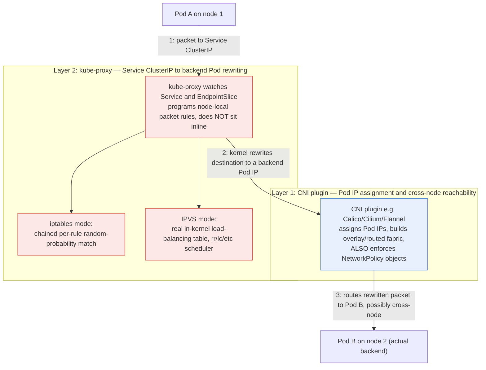

**TL;DR:** A `Service`'s `ClusterIP` isn't backed by a running load-balancer process anywhere in the cluster — `kube-proxy` programs packet-rewriting rules directly into each node's own network stack, and which mechanism it uses (`iptables` vs `IPVS`) changes real behavior: `iptables` mode doesn't actually do round-robin, it chains per-rule random-probability matches, while `IPVS` mode uses a genuine in-kernel load-balancing table with real scheduling algorithms. Underneath that, a separate mechanism entirely — the **CNI plugin** — is what makes Pod-to-Pod IPs routable at all, and is also what actually enforces `NetworkPolicy`, which `kube-proxy` has no role in. From `kube-proxy`'s real `iptables`/`ipvs` proxier source, and `ahmetb/kubernetes-network-policy-recipes` for the CNI-enforced layer.

## 1. The Engineering Problem

A Pod that calls `http://checkout.default.svc.cluster.local` expects that DNS name to resolve to a stable `ClusterIP`, and expects traffic sent there to land on one of potentially many backend Pods, load-balanced, even as Pods are created and destroyed continuously. Naively, this looks like it needs a running proxy process somewhere in the request path — but Kubernetes clusters routinely handle enormous connection volumes with no such process actually sitting inline. The real mechanism is stranger and more interesting: `kube-proxy` doesn't proxy traffic through itself at all (despite the name) — it watches the API server for `Service`/`EndpointSlice` changes and rewrites the *node's own kernel packet-forwarding rules* so the kernel does the redirection, with zero added latency from a userspace hop.

A second, easily conflated problem sits one layer below this: how does a Pod get a real, routable IP in the first place, and how does traffic between two Pods on different nodes actually reach each other? That's not `kube-proxy`'s job at all — it's the **CNI (Container Network Interface) plugin**'s, a separate component entirely, and confusing the two is a common source of debugging dead ends ("my Service isn't load balancing" and "my Pods can't reach each other across nodes" are different components' problems).

## 2. The Technical Solution

**`kube-proxy`** runs on every node and reconciles `Service`/`EndpointSlice` objects into node-local packet-forwarding rules, in one of a few interchangeable *modes* — `iptables` (the long-standing default), `IPVS` (kernel-level load balancing, added for scale), and a newer `nftables` mode. **The CNI plugin** (Calico, Cilium, Flannel, etc.) is what actually assigns Pod IPs and builds the underlying network fabric those rules operate on — and it's also the component that enforces `NetworkPolicy`, since `NetworkPolicy` objects are inert without a CNI plugin that implements the enforcement.



Two core truths this diagram is showing:

- **`kube-proxy` rewrites rules, it doesn't relay packets.** The actual data path never passes through a `kube-proxy` process — the kernel's own netfilter/IPVS subsystem does the rewriting, based on rules `kube-proxy` programmed ahead of time from watching the API server.
- **CNI and `kube-proxy` are two independent layers with different failure modes.** A cluster with a broken CNI plugin has Pods that can't reach each other's raw IPs at all, regardless of `kube-proxy`; a cluster with a correctly-functioning CNI but a stalled `kube-proxy` has reachable Pod IPs but stale or missing Service load-balancing.

## 3. The clean example (concept in isolation)

`kube-proxy`'s mode is a single field in its `KubeProxyConfiguration`, but it changes the underlying mechanism entirely:

```yaml
apiVersion: kubeproxy.config.k8s.io/v1alpha1
kind: KubeProxyConfiguration
mode: "ipvs"          # "iptables" (long-time default) | "ipvs" | "nftables"
ipvs:
  # scheduler determines HOW ipvs picks a backend per new connection —
  # rr = round robin, this is a REAL round robin, unlike iptables mode
  scheduler: "rr"
```

A `NetworkPolicy` — inert on its own; only enforced if the cluster's CNI plugin implements it (this is the entire reason `ahmetb/kubernetes-network-policy-recipes` exists as a curated set of tested examples):

```yaml
kind: NetworkPolicy
apiVersion: networking.k8s.io/v1
metadata:
  name: default-deny-all
  namespace: default
spec:
  # empty podSelector = applies to every Pod in this namespace
  podSelector: {}
  # no ingress rules listed = all incoming traffic to selected
  # pods is dropped by the CNI plugin's enforcement layer
  ingress: []
```

## 4. Production reality (from the real repo)

Two real sources for the two layers: `kube-proxy`'s own mode-specific proxier implementations in `kubernetes/kubernetes`, and `ahmetb/kubernetes-network-policy-recipes` — the community-canonical, CI-tested `NetworkPolicy` examples (maintained by a former Google Cloud engineer) that exercise CNI-level enforcement.

```
kubernetes/kubernetes
└── pkg/proxy/
    ├── iptables/proxier.go     # random-probability chained rules
    └── ipvs/proxier.go         # real in-kernel scheduler selection

ahmetb/kubernetes-network-policy-recipes
└── 04-deny-traffic-from-other-namespaces.md   # CNI-enforced isolation
```

`iptables` mode's actual load-balancing mechanism — this is NOT round-robin, despite widespread assumption. Each backend gets a chained rule matched with decreasing probability, evaluated in order by the kernel per-packet:

```go
// pkg/proxy/iptables/proxier.go
// This assumes proxier.mu is held
func (proxier *Proxier) probability(n int) string {
	if n >= len(proxier.precomputedProbabilities) {
		proxier.precomputeProbabilities(n)
	}
	return proxier.precomputedProbabilities[n]
}
```

Each backend rule uses `iptables -m statistic --mode random --probability P` — for N backends, the first gets probability `1/N`, the second `1/(N-1)` of what's left, and so on. The kernel evaluates rules top-to-bottom and stops at the first match, so this chain of decreasing probabilities produces an approximately even split — but it is genuinely random per-connection, not a rotating pointer, and has no memory of which backend was picked last.

`IPVS` mode, by contrast, configures a real kernel load-balancing subsystem with an actual scheduler algorithm as a first-class setting:

```go
// pkg/proxy/ipvs/proxier.go — NewProxier
scheduler := config.IPVS.Scheduler
if scheduler == "" {
	logger.Info("IPVS scheduler not specified, use rr by default")
	scheduler = defaultScheduler // "rr" — genuine round robin
}
```

`IPVS` supports schedulers `iptables` mode has no equivalent for at all — `rr` (round robin), `lc` (least connection), `dh` (destination hashing for session affinity), and others — configured once at the proxier level and applied by the kernel's IPVS subsystem to every Service, not synthesized per-Service from probability chains.

The CNI-enforced layer — a real, tested `NetworkPolicy` recipe showing what `kube-proxy` has **no involvement in whatsoever**:

```yaml
# 04-deny-traffic-from-other-namespaces.md
kind: NetworkPolicy
apiVersion: networking.k8s.io/v1
metadata:
  namespace: default
  name: deny-from-other-namespaces
spec:
  podSelector:
    matchLabels: {}
  ingress:
  - from:
    - podSelector: {}
```

The recipe's own annotation is precise about what this selects: `namespace: default` scopes it, an empty `podSelector.matchLabels` matches every Pod in that namespace, and an empty `ingress.from.podSelector` matches every Pod *within the same namespace* — so this allows same-namespace traffic while blocking every other namespace, entirely at the CNI plugin's packet-filtering layer, before `kube-proxy`'s rules are ever reached.

**What this teaches that a hello-world can't:**

- **"iptables mode is round robin" is a widespread, stale claim.** The actual mechanism is a chain of independent random-probability matches — statistically similar to round robin over many connections, but with no state tracking which backend was used last, and no fairness guarantee for any single client's short connection burst.
- **Only `IPVS` mode exposes a real scheduler choice** (`rr`, `lc`, `dh`, `sh`, etc.) as an explicit, kernel-native setting — this is the concrete reason production clusters at high Service/backend scale often run `IPVS` mode: `iptables` mode's rule chains grow linearly with backend count and are evaluated sequentially per packet, while `IPVS`'s hash-table lookup doesn't degrade the same way.
- **A `NetworkPolicy`'s enforcement point is entirely outside `kube-proxy`.** `kube-proxy` only ever deals with Service-to-backend rewriting; it has no code path that reads `NetworkPolicy` objects at all. If a cluster's CNI plugin doesn't implement policy enforcement (some don't, by design), applying `NetworkPolicy` objects changes nothing — `kubectl apply` succeeds, but the isolation silently doesn't happen.
- **A newer `nftables` proxy mode exists and changes the implementation again** — it replaces the `iptables` backend's rule-chain approach with the newer `nftables` kernel subsystem, aiming for better performance at scale than legacy `iptables` mode without requiring the separate `IPVS` kernel modules. Which mode a lesson (or a production cluster) is describing matters — don't assume "iptables mode" behavior applies cluster-wide without checking `KubeProxyConfiguration.mode`.

## 5. Review checklist

- Is `kube-proxy`'s `mode` known and deliberate for this cluster (`iptables`, `ipvs`, or `nftables`), rather than assumed to be whichever one a tutorial described? The performance and scheduling-algorithm characteristics genuinely differ.
- If diagnosing uneven load across backend Pods, is the investigation looking at the right layer — `kube-proxy`'s mode/scheduler (Service-to-Pod distribution) versus the CNI plugin (Pod-to-Pod reachability) — rather than conflating the two?
- Does every namespace running Pods that shouldn't be reachable cluster-wide have an explicit default-deny `NetworkPolicy`, and has it been verified that the cluster's CNI plugin actually implements `NetworkPolicy` enforcement (not all do)?
- For `IPVS` mode specifically, is a scheduler (`ipvs.scheduler`) chosen deliberately for the workload's connection pattern (`rr` for uniform short connections, `lc`/`sh` for long-lived or session-affinity-sensitive ones) rather than left at the implicit `rr` default?

## 6. FAQ

**Q: Does switching `kube-proxy` from `iptables` to `IPVS` mode change how `NetworkPolicy` is enforced?**
A: No — `NetworkPolicy` enforcement is entirely the CNI plugin's responsibility, a separate component and code path from `kube-proxy`'s Service-rewriting rules in either mode. Changing `kube-proxy`'s mode only changes Service-to-backend load balancing behavior.

**Q: If `iptables` mode isn't true round robin, does that matter in practice?**
A: For most workloads, no — the probability-chain approach converges to a roughly even distribution over many connections. It matters when a workload has very few, very long-lived connections (e.g. a handful of gRPC streams), where per-connection randomness can produce a visibly uneven split that a real round-robin or least-connection scheduler wouldn't.

**Q: Why would a cluster choose `iptables` mode at all if `IPVS` has more scheduling options?**
A: `IPVS` mode requires specific kernel modules to be loaded and available on every node, which isn't guaranteed on every environment (some managed/restricted node images don't ship them). `iptables` mode has no such kernel-module dependency, which is part of why it remained the long-standing default despite the scaling tradeoffs.

**Q: What does the CNI plugin actually do to a Pod's raw IP-to-IP traffic that `kube-proxy` never touches?**
A: The CNI plugin builds the actual data-plane fabric — assigning each Pod a routable IP from the cluster's Pod CIDR, and either routing or encapsulating (overlay) packets between nodes so that Pod IPs are reachable cluster-wide. `kube-proxy` never assigns IPs or builds routes; it only rewrites the *destination* of packets already addressed to a Service's `ClusterIP`, using the fabric the CNI plugin already built.

**Q: Does `04-deny-traffic-from-other-namespaces.md`'s policy block traffic from `kube-system` too?**
A: Yes — the recipe's own note calls this out explicitly: the policy applies to any namespace but `kube-system` is suggested as an exception to apply it *to*, since blocking traffic *from* kube-system-run components (like some CNI or monitoring agents) into application namespaces can break unrelated cluster functionality if applied without exceptions.

---

## Source

- **Concept:** Kubernetes network model — kube-proxy modes and the CNI enforcement layer
- **Domain:** kubernetes
- **Repo:** [kubernetes/kubernetes](https://github.com/kubernetes/kubernetes) → [`pkg/proxy/iptables/proxier.go`](https://github.com/kubernetes/kubernetes/blob/master/pkg/proxy/iptables/proxier.go), [`pkg/proxy/ipvs/proxier.go`](https://github.com/kubernetes/kubernetes/blob/master/pkg/proxy/ipvs/proxier.go) — kube-proxy's own mode-specific proxier implementations; [ahmetb/kubernetes-network-policy-recipes](https://github.com/ahmetb/kubernetes-network-policy-recipes) → [`04-deny-traffic-from-other-namespaces.md`](https://github.com/ahmetb/kubernetes-network-policy-recipes/blob/master/04-deny-traffic-from-other-namespaces.md) — the community-canonical, CI-tested NetworkPolicy recipe collection.

---

**Next in the Kubernetes series:** [Multi-Tenancy Patterns: Why a Namespace Alone Isn't Tenant Isolation]({{ '/kubernetes/multi-tenancy-namespace-isolation-quotas-netpol-at-scale/' | relative_url }})


