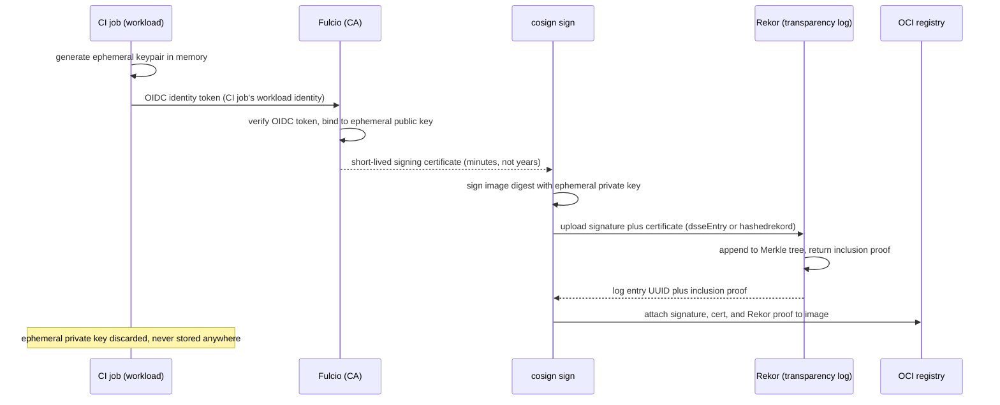

**TL;DR:** How do you trust that a container image running in production is the exact one your CI pipeline built, and not something swapped in afterward? Cosign signs the image with a certificate issued for a one-time, workload-scoped OIDC identity instead of a long-lived private key, then publishes the signature to Rekor — a public, append-only transparency log — so anyone verifying the image can prove the signature existed at a specific time, was never quietly re-issued, and traces back to a real CI identity, not a stolen key.

**Real repo:** [`sigstore/cosign`](https://github.com/sigstore/cosign)

## 1. The Engineering Problem: a signed image is only as trustworthy as the key that signed it

Image signing existed before Sigstore — GPG-sign a container image with a private key, ship the public key alongside, verify on pull. But that model has a supply-chain-shaped hole in it: the private key has to live *somewhere* — a CI secret, a build server's disk, an engineer's laptop — for the entire lifetime it's valid for signing. Steal that key once, and every image "signed" with it looks legitimate forever, because the verification math has no concept of *when* a signature happened, only *whether* it's cryptographically valid. Key rotation helps, but it's a manual, easy-to-skip operational burden layered on top of a system that's fundamentally trusting a long-lived secret's custody.

There's a second, quieter problem: even with a private key never leaking, nothing stops the key's *holder* from signing a malicious image and claiming it's legitimate — the signature only proves "whoever has this key signed this," not "this image came from the CI pipeline it claims to." A compromised or malicious CI job with signing access can produce a perfectly valid signature over a backdoored image.

---

## 2. The Technical Solution: no long-lived key, and a public log that makes back-dating impossible

Cosign's **keyless signing** flow removes the long-lived private key from the picture entirely. It generates an ephemeral key pair in memory, proves the signer's identity to a certificate authority (Fulcio) via a short-lived OIDC token — the CI job's own workload identity, not a human's — gets back a certificate valid for minutes, signs with the ephemeral key, and then immediately discards it. The certificate itself, not a stored key, is what carries the provenance: "this specific OIDC identity, at this specific CI job, signed this specific image digest."

That solves *who* signed it. **Rekor**, Sigstore's transparency log, solves *when*: every signature (and the certificate that authorized it) gets appended to a public, tamper-evident Merkle-tree log. Verification doesn't just check "is this signature valid" — it checks "does this signature appear in the log with an inclusion proof," which makes it structurally impossible to mint a signature today and claim it happened months ago, because the log entry's position in the tree is itself evidence of when it was added.



Three core truths to hold:

- **The certificate is the identity, not the key.** Fulcio's certificate embeds the OIDC identity (e.g. a GitHub Actions workflow's `sub` claim) as a certificate extension — verification checks "was this signed by *this specific CI workflow*," not just "was this signed by *some* valid key."
- **The transparency log is what makes forgery detectable, not just prevented.** Even if Fulcio's root trust were somehow compromised, a forged entry would still have to appear in Rekor's public log — which means it's discoverable by monitoring, not just theoretically preventable.
- **Ephemeral means there's nothing left to steal.** The private key exists only in the signing process's memory for the duration of one signing operation — there's no key file, no KMS secret, no long-lived credential an attacker can exfiltrate to sign future images.

## 3. The clean example (concept in isolation)

```bash
# Traditional key-based signing: a long-lived private key must exist
# somewhere for as long as it's valid — a standing liability.
cosign generate-key-pair                       # writes cosign.key, cosign.pub to disk
cosign sign --key cosign.key myregistry/app:v1  # key must be present at sign time
cosign verify --key cosign.pub myregistry/app:v1

# Keyless signing: no key file ever exists on disk.
# --yes skips the interactive confirmation (used in CI where there's no
# human to prompt); the CI environment's own OIDC token provides identity.
cosign sign --yes myregistry/app:v1
#   1. generates an ephemeral keypair in memory
#   2. exchanges the CI job's OIDC token for a Fulcio certificate
#   3. signs with the ephemeral key, uploads signature + cert to Rekor
#   4. discards the ephemeral key — nothing persists to steal

# Verification pins identity, not just checks "is this signed by someone":
cosign verify \
  --certificate-identity="https://github.com/myorg/myrepo/.github/workflows/release.yml@refs/heads/main" \
  --certificate-oidc-issuer="https://token.actions.githubusercontent.com" \
  myregistry/app:v1
```

## 4. Production reality (from `sigstore/cosign`)

The repo's layout for this mechanism:

```
cosign/
├── cmd/cosign/cli/sign/
│   └── sign.go            # SignCmd: orchestrates the keyless sign flow
└── pkg/cosign/
    ├── tlog.go             # Rekor upload + transparency-log key handling
    └── verifiers.go        # claim verification against the signed payload
```

`pkg/cosign/tlog.go` is where the transparency-log mechanics live — this is the code that builds the entry cosign uploads to Rekor and later verifies came back with a valid log ID:

```go
// pkg/cosign/tlog.go

// TransparencyLogPubKey contains the ECDSA verification key and the current status
// of the key according to TUF metadata, whether it's active or expired.
type TransparencyLogPubKey struct {
	PubKey crypto.PublicKey
	Status tuf.StatusKind
}

// This is a map of TransparencyLog public keys indexed by log ID that's used
// in verification.
type TrustedTransparencyLogPubKeys struct {
	Keys map[string]TransparencyLogPubKey
}

// GetTransparencyLogID generates a SHA256 hash of a DER-encoded public key.
// (see RFC 6962 S3.2)
// In CT V1 the log id is a hash of the public key.
func GetTransparencyLogID(pub crypto.PublicKey) (string, error) {
	pubBytes, err := x509.MarshalPKIXPublicKey(pub)
	if err != nil {
		return "", err
	}
	digest := sha256.Sum256(pubBytes)
	return hex.EncodeToString(digest[:]), nil
}

// GetRekorPubs retrieves trusted Rekor public keys from the embedded or cached
// TUF root. If expired, makes a network call to retrieve the updated targets.
// There are two Env variable that can be used to override this behaviour:
// SIGSTORE_REKOR_PUBLIC_KEY - If specified, location of the file that contains
// the Rekor Public Key on local filesystem
func GetRekorPubs(ctx context.Context) (*TrustedTransparencyLogPubKeys, error) {
	publicKeys := NewTrustedTransparencyLogPubKeys()
	altRekorPub := env.Getenv(env.VariableSigstoreRekorPublicKey)
	// ...
}
```

What this teaches that a hello-world can't:

- **The Rekor public key itself comes from TUF, not a hardcoded constant.** `GetRekorPubs` pulls the trusted Rekor keys from TUF (The Update Framework) metadata rather than embedding a single static key in the binary — that's how Sigstore rotates its own transparency-log signing keys without breaking verification of every image signed under the old key: `TransparencyLogPubKey.Status` tracks whether a given key is still `Active` or has been `Expired`, and an expired key can still validate old log entries even after rotation.
- **`GetTransparencyLogID` is RFC 6962 (Certificate Transparency) machinery, reused, not reinvented.** Sigstore's Rekor log uses the exact same Merkle-tree log-ID derivation (SHA-256 of the DER-encoded public key) that Certificate Transparency logs use for TLS certificates — supply chain transparency logging is the same mechanism CT pioneered for the web PKI, applied to build artifacts instead of certificates.
- **The map is keyed by log ID because Sigstore runs (and has run) more than one Rekor instance/key generation** — `TrustedTransparencyLogPubKeys.Keys map[string]TransparencyLogPubKey` has to support verifying an inclusion proof against whichever specific log instance signed it, not assume there's exactly one log key that never changes.

`pkg/cosign/verifiers.go` shows the other half — once a signature and its Rekor entry check out cryptographically, the *claim* still has to be checked against the actual artifact:

```go
// pkg/cosign/verifiers.go

// SimpleClaimVerifier verifies that sig.Payload() is a SimpleContainerImage
// payload which references the given image digest and contains the given
// annotations.
func SimpleClaimVerifier(sig oci.Signature, imageDigest v1.Hash, annotations map[string]interface{}) error {
	p, err := sig.Payload()
	if err != nil {
		return err
	}

	ss := &payload.SimpleContainerImage{}
	if err := json.Unmarshal(p, ss); err != nil {
		return err
	}

	foundDgst := ss.Critical.Image.DockerManifestDigest
	if foundDgst != imageDigest.String() {
		return fmt.Errorf("invalid or missing digest in claim: %s", foundDgst)
	}
	// ...
	return nil
}
```

This is the step that stops a valid, correctly-signed signature from being replayed against the *wrong* image: `foundDgst != imageDigest.String()` explicitly compares the digest embedded inside the signed payload against the digest of the image actually being verified. A cryptographically-valid Sigstore signature for `app:v1`'s digest doesn't automatically verify `app:v2` — the claim itself, not just the signature envelope, has to match the artifact in front of you. `IntotoSubjectClaimVerifier` (same file) does the equivalent check for in-toto attestations — including SBOM and SLSA provenance attestations, which cosign signs and verifies through this same claim-matching path rather than a separate mechanism.

## 5. Review checklist

- **Is verification pinned to a specific `--certificate-identity` and `--certificate-oidc-issuer`, not just "is it signed by anyone"?** A keyless signature with no identity constraint only proves *some* OIDC-authenticated party signed the image — that's meaningfully weaker than proving it was *this specific* release workflow.
- **Does the deploy path actually call `cosign verify` (or an admission controller doing the equivalent), or does signing happen without anything ever checking it?** Signing an image with no enforced verification gate on the deploy side is a compliance checkbox, not a security control.
- **Are SBOM/SLSA-provenance attestations verified via `IntotoSubjectClaimVerifier`'s subject-digest match, not trusted independent of the image digest?** An attestation that isn't bound to the exact digest being deployed can be swapped onto a different image.
- **Is the Rekor log ID / TUF root being kept current** (per `GetRekorPubs`'s TUF-driven refresh), rather than a stale, hardcoded Rekor public key that would silently fail to validate entries logged under a rotated key?

## 6. FAQ

**Q: If the signing key only exists for one operation, how does anyone verify a signature later — isn't the key gone?**
A: Verification never needs the *private* key — only the ephemeral *public* key, which is embedded in the Fulcio certificate that was uploaded to Rekor alongside the signature. The certificate plus the Rekor inclusion proof is the complete, permanent verification record; the private key was only ever needed for the few seconds it took to produce the signature.

**Q: What actually stops someone from generating their own OIDC token and getting a Fulcio certificate for an identity they don't own?**
A: Fulcio doesn't trust the token's claims blindly — it validates the OIDC token against the actual identity provider (e.g. GitHub Actions' OIDC issuer), which cryptographically attests to the workflow, repo, and ref that requested the token. You can't self-issue a token claiming to be `myorg/myrepo`'s release workflow; the issuer that signed the token has to actually be GitHub (or whichever real IdP), which only issues that claim to the real workflow run.

**Q: Does SBOM/SLSA verification happen through a different code path than image signature verification?**
A: No — this lesson's `verifiers.go` excerpt shows both `SimpleClaimVerifier` (image signatures) and `IntotoSubjectClaimVerifier` (in-toto attestations, which is the wrapper format cosign uses for SBOMs and SLSA provenance) doing the same fundamental check: does the claim's embedded digest match the artifact being verified. SBOM and provenance data ride on the same Fulcio-certificate-plus-Rekor-log infrastructure as image signatures, not a separate trust system.

**Q: Why go through Rekor at all if Fulcio's certificate already proves who signed the image?**
A: The certificate proves *who* signed it, but Fulcio's certificates are deliberately short-lived (minutes) precisely because there's no ongoing revocation infrastructure to check later — a long-lived cert would need a CRL/OCSP-style check-in. Rekor's public, append-only log is what lets a verifier months later confirm the signing event genuinely happened at a specific point in time and hasn't been fabricated after the fact, which a certificate's validity window alone can't provide once that window has closed.

**Q: What's the actual difference between key-based and keyless signing in terms of what an attacker has to compromise?**
A: With key-based signing, compromising one static secret (the private key file, wherever it's stored) lets an attacker sign anything indefinitely. With keyless signing, an attacker would need to compromise the CI/CD identity provider itself (or a live, running CI job's OIDC token, valid only for that job's brief lifetime) — there's no static artifact sitting in a secrets store waiting to be stolen.

---

## Source

- **Concept:** Supply chain security — keyless container image signing (SBOM/SLSA attestation, sigstore/cosign)
- **Domain:** security
- **Repo:** [sigstore/cosign](https://github.com/sigstore/cosign) → [`pkg/cosign/tlog.go`](https://github.com/sigstore/cosign/blob/main/pkg/cosign/tlog.go), [`pkg/cosign/verifiers.go`](https://github.com/sigstore/cosign/blob/main/pkg/cosign/verifiers.go), [`cmd/cosign/cli/sign/sign.go`](https://github.com/sigstore/cosign/blob/main/cmd/cosign/cli/sign/sign.go) — the reference container image signing tool for the Sigstore keyless-signing and transparency-log ecosystem.

---

**Next in the Security series:** [Zero Trust Architecture: Why the Identity-Aware Proxy Re-Checks Every Request, Not Just the Network Perimeter]({{ '/security/zero-trust-architecture-identity-aware-proxy-beyondcorp/' | relative_url }})


