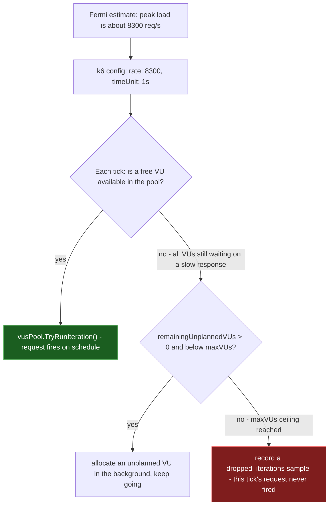

**TL;DR:** Why isn't "spin up 200 virtual users and see what happens" a valid capacity test? Because virtual-user count and request rate are only related through response time, and response time is exactly the thing you're trying to find the limits of — so a VU-count-based load test silently changes the request rate the moment the system under test slows down, which is precisely when you most need the rate to hold steady. k6's `constant-arrival-rate` executor decouples the two: you specify the target rate directly (iterations per time unit) and k6 dynamically allocates however many VUs it takes to sustain it, up to a hard `maxVUs` ceiling — and when even that ceiling isn't enough, it emits a `dropped_iterations` metric instead of silently letting the real rate fall below your target. That gap between target and delivered rate *is* the capacity finding.

> **In plain English (30 sec):** Code you already write — Map, function, API call, just bigger.

**Real repo:** [`grafana/k6`](https://github.com/grafana/k6)

## 1. The Engineering Problem: a back-of-envelope estimate is a rate, but most load tests measure users

Capacity planning starts with Fermi estimation: "we expect 2 million daily active users, each opens the app 8 times a day, each session fires roughly 15 requests, spread unevenly over a day with a 3x peak-to-average ratio — so peak load is roughly 2,000,000 × 8 × 15 / 86,400 × 3 ≈ 8,300 requests/second." That's a rate. It's the number capacity planning actually needs to answer: how many requests per second must this system sustain at peak, and where does it fall over first.

The naive way to validate that estimate is to configure a load generator with a fixed pool of "virtual users" (VUs) — say, 500 — each looping "send request, wait for response, repeat" as fast as it can, and see what request rate comes out the other end. This looks like it's testing the same thing, but it's testing something structurally different: **the resulting request rate is a function of the system's own response time**, not an input you controlled. If your system responds in 50ms, 500 VUs in a tight loop produce roughly 500 / 0.05s = 10,000 req/s. If the same system slows to 500ms under load — which is exactly the failure mode capacity planning exists to catch — those same 500 VUs now only produce 500 / 0.5s = 1,000 req/s. **The load test's own delivered rate collapses right when the system is closest to its actual limit**, so the test quietly stops applying the pressure you set out to apply, at the exact moment you most needed it to hold.

This is why "concurrent users" and "requests per second" get conflated so often in capacity planning conversations, and why that conflation is dangerous: they're only equal at one specific, usually-unstated response time, and that response time is the variable under test.

---

## 2. The Technical Solution: specify the rate directly, let VU count float, and measure what the system couldn't sustain

k6's `constant-arrival-rate` executor inverts the naive model. Instead of fixing VU count and observing the resulting rate, you fix the **arrival rate** — iterations per `timeUnit` — directly, and k6 dynamically manages however many VUs it takes to hit that rate, scaling from `preAllocatedVUs` up to a hard `maxVUs` ceiling as response times fluctuate.



Three core truths this design makes visible that a VU-count test can't:

1. **The target rate is an input, not an output.** `rate` and `timeUnit` in the config are what your Fermi estimate produces directly — you don't have to reverse-engineer a VU count from an assumed response time, because the executor's whole job is to hold the rate steady regardless of how response time moves.
2. **VU allocation is itself bounded, on purpose.** `preAllocatedVUs` starts a warm pool; if in-flight requests pile up because the system is slowing down, k6 allocates more VUs up to `maxVUs` — but `maxVUs` is a deliberate hard ceiling, not an accident. It represents "the most concurrent in-flight requests we're willing to let this test hold open," which is itself a capacity-planning decision (how much concurrency is realistic for real clients to sustain against this system).
3. **A dropped iteration is the actual bottleneck finding, not an error to fix in the test.** When every allocated VU is still waiting on a slow response and `maxVUs` is exhausted, k6 doesn't quietly let the rate fall — it drops that tick's iteration and records it as a metric. The rate at which iterations get dropped as you push `rate` upward, holding `maxVUs` generous, is a direct measurement of where the system's real capacity ends.

---

## 3. The clean example (concept in isolation)

```javascript
// capacity-check.js — minimal constant-arrival-rate scenario
import http from 'k6/http';

export const options = {
  scenarios: {
    checkout_peak: {
      executor: 'constant-arrival-rate',

      // The number straight out of the back-of-envelope math:
      // 8,300 req/s at peak, from (DAU * sessions/day * reqs/session / seconds/day) * peak_ratio.
      rate: 8300,
      timeUnit: '1s',

      // How long to sustain the target rate - long enough to see the
      // system reach steady state, not just absorb a burst.
      duration: '5m',

      // Warm pool of VUs started immediately - avoids VU-spin-up latency
      // being mistaken for system latency at the start of the test.
      preAllocatedVUs: 400,

      // Hard ceiling: how much real concurrency we believe production
      // clients could realistically hold open against this system.
      // If the test needs more than this to hit 8300 req/s, that ceiling
      // itself is a capacity-planning finding, not just a test-config bug.
      maxVUs: 2000,
    },
  },
  thresholds: {
    // A pass/fail bottleneck check, not just a chart to eyeball afterward.
    http_req_duration: ['p(95)<300'],
    // If more than 1% of ticks couldn't get a VU in time, the target
    // rate was not actually sustained - the estimate exceeded real capacity.
    dropped_iterations: ['count<83'],
  },
};

export default function () {
  http.get('https://staging.example.com/checkout/summary');
}
```

---

## 4. Production reality (from `grafana/k6`)

```
grafana/k6/
├── lib/executor/
│   └── constant_arrival_rate.go   # Config + the Run loop that schedules ticks and drops overflow
└── metrics/
    └── thresholds.go              # Pass/fail evaluation against sink values like dropped_iterations
```

**The config surface — what a `rate`/`maxVUs` mismatch actually validates:**

```go
// lib/executor/constant_arrival_rate.go (ConstantArrivalRateConfig.Validate, elided)

if !carc.Rate.Valid {
    errors = append(errors, fmt.Errorf("the iteration rate isn't specified"))
} else if carc.Rate.Int64 <= 0 {
    errors = append(errors, fmt.Errorf("the iteration rate must be more than 0"))
}

// ...

if !carc.MaxVUs.Valid {
    carc.MaxVUs.Int64 = carc.PreAllocatedVUs.Int64
} else if carc.MaxVUs.Int64 < carc.PreAllocatedVUs.Int64 {
    errors = append(errors, fmt.Errorf("maxVUs can't be less than preAllocatedVUs"))
}
```

**The scheduling loop — the actual moment a tick becomes a dropped iteration:**

```go
// lib/executor/constant_arrival_rate.go (ConstantArrivalRate.Run, elided)

for li, gi := 0, start; ; li, gi = li+1, gi+offsets[li%len(offsets)] {
    t := notScaledTickerPeriod*time.Duration(gi) - time.Since(startTime)
    timer.Reset(t)
    select {
    case <-timer.C:
        if vusPool.TryRunIteration() {
            continue
        }

        // Since there aren't any free VUs available, consider this iteration
        // dropped - we aren't going to try to recover it, but

        metrics.PushIfNotDone(parentCtx, out, metrics.Sample{
            TimeSeries: metrics.TimeSeries{
                Metric: droppedIterationMetric,
                Tags:   metricTags,
            },
            Time:  time.Now(),
            Value: 1,
        })

        if remainingUnplannedVUs == 0 {
            if !shownWarning {
                car.logger.Warningf("Insufficient VUs, reached %d active VUs and cannot initialize more", maxVUs)
                shownWarning = true
            }
            continue
        }

        select {
        case makeUnplannedVUCh <- struct{}{}:
            remainingUnplannedVUs--
        default:
        }

    case <-regDurationCtx.Done():
        return nil
    }
}
```

**The pass/fail evaluation — how a threshold like `dropped_iterations: ['count<83']` gets enforced:**

```go
// metrics/thresholds.go (Threshold.runNoTaint, elided)

func (t *Threshold) runNoTaint(sinks map[string]float64) (bool, error) {
    lhs, ok := sinks[t.parsed.SinkKey()]
    if !ok {
        return true, nil
    }

    var passes bool
    switch t.parsed.Operator {
    case ">":
        passes = lhs > t.parsed.Value
    case ">=":
        passes = lhs >= t.parsed.Value
    case "<=":
        passes = lhs <= t.parsed.Value
    case "<":
        passes = lhs < t.parsed.Value
    // ... "==", "===", "!=" elided ...
    }

    return passes, nil
}
```

What this teaches that a hello-world can't:

- **The scheduling loop computes each tick's target fire time independently (`notScaledTickerPeriod*time.Duration(gi)`) from the test's start time, not from when the previous request finished.** This is the actual mechanism that keeps arrival rate constant regardless of response time — each iteration's "when should this have fired" is fixed at test-plan time, so a slow response doesn't push later ticks later, it just makes them more likely to find `vusPool.TryRunIteration()` returning false.
- **`vusPool.TryRunIteration()` failing doesn't retry or queue — it drops immediately and moves to the next tick.** There's no backlog buildup where slow responses cause later requests to queue up and fire in a burst once things recover; a missed tick is gone, which is what makes `dropped_iterations` a clean per-interval signal of "capacity exceeded right here" rather than a smeared-out artifact of queueing.
- **The warning log (`"Insufficient VUs, reached %d active VUs and cannot initialize more"`) fires exactly once (`shownWarning`), separately from the metric.** The metric is what a threshold evaluates automatically in CI; the log line is what a human reads when triaging why a run failed — the two are deliberately kept as separate signals rather than one flooding the other.

Known-stale fact: "run more virtual users to simulate more load" is the wrong lever once a system slows under real load — beyond a certain point, adding VUs to a fixed-VU test just means more requests queued behind the same slow endpoint, not a higher delivered rate. Constant-arrival-rate testing exists specifically because concurrency (VUs) and throughput (requests/second) decouple exactly when a system is under the stress capacity planning cares about; this is also just Little's Law in reverse (`concurrency = arrival_rate × response_time`) — as response time grows, the concurrency needed to sustain a fixed arrival rate grows with it, which is exactly what `maxVUs` is there to cap.

---

## 5. Review checklist

- **Is the test driven by `rate`/`timeUnit` (or `constant-arrival-rate`/`ramping-arrival-rate`), not a fixed VU count, whenever the goal is validating a target requests/second figure from a back-of-envelope estimate?** A `constant-vus` scenario answers "how does response time change under N concurrent users," a different question from "can this system sustain X req/s."
- **Is `maxVUs` set deliberately, based on how much real concurrency is plausible for actual clients, rather than left at a default or set arbitrarily high "to be safe"?** An unrealistically high `maxVUs` can mask a real bottleneck by letting the test allocate more concurrent load than production traffic patterns ever would.
- **Does a threshold gate on `dropped_iterations`, not just on `http_req_duration` percentiles?** A P95 latency threshold can still pass while the target rate was never actually delivered, if enough iterations silently dropped instead of running slow — the dropped-iteration count is what confirms the rate you set is the rate you got.
- **Was the arrival rate itself derived from a stated Fermi estimate (DAU, requests per session, peak-to-average ratio), not picked as a round number?** A load test only validates the estimate it was built to check; an arbitrary `rate: 5000` doesn't tell you whether the system can handle *your* actual projected peak.

## 6. FAQ

### Why does a VU-count-based load test understate load exactly when it matters most?
Because in a fixed-VU loop, delivered request rate equals `VU_count / average_response_time`. As the system under test slows down under real stress, that same fixed VU count produces a *lower* rate, not the same one — the test's own applied pressure eases off right as the system approaches its actual limit, which is the one moment capacity planning most needs the pressure held constant.

### What does k6's `dropped_iterations` metric actually measure?
It counts scheduled ticks where `vusPool.TryRunIteration()` found no free VU and the executor was already at `maxVUs`, so that iteration's request never fired at all — visible directly in `ConstantArrivalRate.Run`'s scheduling loop. It's distinct from a slow or failed HTTP response; it means the target rate itself could not be sustained.

### How do `preAllocatedVUs` and `maxVUs` relate to Little's Law?
Little's Law says `concurrency = arrival_rate × response_time`. `preAllocatedVUs` is a warm-start estimate of that product at the target rate and expected response time; `maxVUs` is a hard ceiling on how much concurrency (and therefore how much response-time growth) the test — and by extension, the capacity plan — is willing to tolerate before it starts recording dropped iterations instead of silently absorbing more load.

### Why is a threshold like `dropped_iterations: ['count<83']` a capacity-planning artifact and not just a test-config detail?
Because `Threshold.runNoTaint` turns it into a hard pass/fail gate, the same target rate can be re-run after every deploy and answer the same binary capacity question automatically — "did we sustain the peak-load Fermi estimate" — instead of requiring a human to eyeball a latency chart and judge it informally each time.

### Isn't `ramping-arrival-rate` a better fit than `constant-arrival-rate` for a bottleneck-identification test?
For finding *where* capacity breaks down, yes — `ramping-arrival-rate` steps the target rate up over time so the specific rate at which `dropped_iterations` starts climbing pinpoints the bottleneck. `constant-arrival-rate` at a single target rate is the right tool for a narrower question: "can this system sustain the one number our Fermi estimate already committed to."

---

## Source

- **Concept:** Capacity planning & back-of-envelope math — Fermi estimation, load testing, bottleneck identification
- **Domain:** system-design
- **Repo:** [grafana/k6](https://github.com/grafana/k6) → [`lib/executor/constant_arrival_rate.go`](https://github.com/grafana/k6/blob/master/lib/executor/constant_arrival_rate.go), [`metrics/thresholds.go`](https://github.com/grafana/k6/blob/master/metrics/thresholds.go) — the real load-testing tool's rate-driven executor and its threshold pass/fail engine. (Note: the project moved from `k6-io/k6` to `grafana/k6` after Grafana Labs' acquisition of the k6 project; `k6-io/k6` raw URLs now 404.)

---

**Next in the System Design series:** [API Design for Scale: Versioning, Cursor Pagination, and Idempotency Keys as System Contracts]({{ '/system-design/api-design-for-scale-versioning-pagination-idempotency/' | relative_url }})


