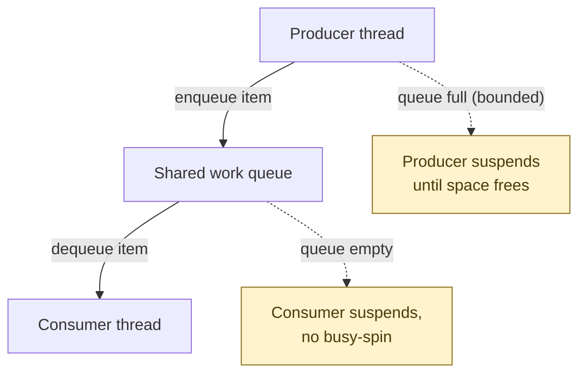
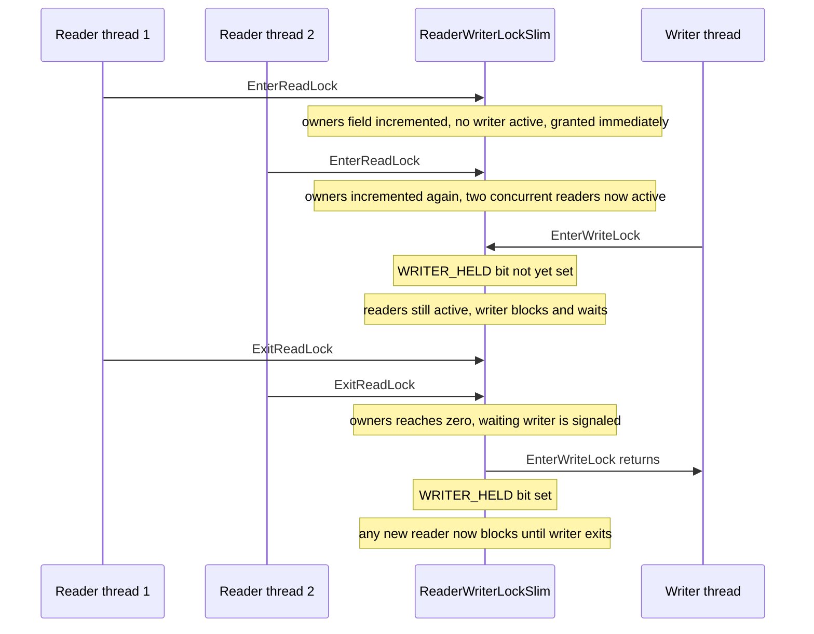
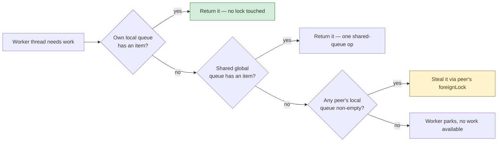

**TL;DR:** Why does a single shared lock around a work queue, or around a read-mostly cache, fall over under real concurrent load — and what do production runtimes actually do instead of "just add a lock"? They keep almost all synchronization local to one thread (a private queue, a packed counter) and only reach for a shared, contended resource when local state runs out — that's the same idea behind producer-consumer queues, reader-writer locks, and thread pools, and .NET's runtime implements all three with it.

## 1. The Engineering Problem

Three concurrency mistakes keep showing up in code review, and they all have the same root cause: treating "thread-safe" as "wrap it in one lock."

**A single-lock work queue serializes everything, including work that doesn't conflict.** A naive producer-consumer setup — `Queue<T>` guarded by one `lock` — means every producer thread and every consumer thread contends for that exact same lock on every single enqueue and dequeue. Under bursty load with many producer and consumer threads, the lock itself becomes the bottleneck: threads spend more wall-clock time waiting to acquire the lock than doing the work the queue exists to coordinate.

**A single exclusive lock defeats the purpose of having concurrent readers.** If a cache or config store uses `lock (obj)` for both reads and writes, then a hundred threads that only want to *read* the same unchanging value still serialize behind each other, one at a time — even though none of them would ever conflict with another reader. The lock is protecting against writers, but it's charging readers the same tax.

**Spawning a raw OS thread per unit of work doesn't scale.** `new Thread(() => DoWork()).Start()` for every incoming request or task looks simple, but each `Thread` reserves roughly a megabyte of stack and costs real kernel time to create and schedule. Under a burst of a few thousand concurrent units of work, the OS scheduler spends more time context-switching between threads than any of them spend doing actual work — the classic thread-per-task collapse.

All three problems share a shape: naive code reaches for **one shared lock protecting one shared data structure**, and that single point of contention is exactly what falls over first under load.

## 2. The Technical Solution

Production concurrency primitives solve this by pushing as much state and synchronization as possible down to **per-thread local state**, and only falling back to something shared and lock-protected when the local state is exhausted.



That's the textbook picture of producer-consumer: a queue decouples the *rate* at which producers create work from the *rate* at which consumers process it. But a naive implementation of that picture — one queue, one lock — is exactly the bottleneck described above. Two production-grade refinements fix it, and both show up in .NET's actual runtime source below:

1. **Reader-writer locks pack "how many readers are active" and "is a writer active" into a single word**, not two separate counters guarded by their own locks — so one atomic-ish update can check and update both facts together, and concurrent readers only touch a shared counter, never a shared exclusive lock.
2. **A thread pool's work queue is producer-consumer at scale: give every worker thread its own *local* queue, and only fall back to a shared *global* queue — or steal from a peer's local queue — when the local one is empty.** Producers (anything calling `QueueUserWorkItem`, or a `Task` continuation) push to whichever queue is cheapest to reach; consumers (worker threads) check local state first and only pay the cost of shared synchronization as a last resort.



Zoomed in on the thread pool's dequeue order — the mechanism that keeps most work off the shared, contended queue entirely:



Two core truths to hold:

- **A bounded queue's real job isn't storage — it's the signal that lets a producer suspend without busy-waiting and a consumer resume the instant work appears**, without either side polling. Whether that signal is a blocked-thread list or an async continuation is an implementation detail; the decoupling is the point.
- **"Reader-writer lock" is not two locks glued together — production implementations use one packed integer as the single source of truth**, because a lock built from two independently-updated counters (one for readers, one for "is a writer waiting") can't be checked atomically without a third lock protecting *them*, which defeats the purpose.

## 3. The clean example (concept in isolation)

Three minimal, purpose-built snippets — the ideas in isolation, before the runtime's optimized versions below.

**Producer-consumer, the textbook version (a bounded queue with `Monitor.Wait`/`Pulse`):**

```csharp
class BoundedQueue<T>
{
    private readonly Queue<T> _items = new();
    private readonly int _capacity;
    private readonly object _gate = new();

    public BoundedQueue(int capacity) => _capacity = capacity;

    public void Enqueue(T item)
    {
        lock (_gate)
        {
            // Producer suspends here — no busy-spin — until a consumer drains an item.
            while (_items.Count >= _capacity)
                Monitor.Wait(_gate);

            _items.Enqueue(item);
            Monitor.Pulse(_gate); // wake one waiting consumer, if any
        }
    }

    public T Dequeue()
    {
        lock (_gate)
        {
            // Consumer suspends here until a producer adds an item.
            while (_items.Count == 0)
                Monitor.Wait(_gate);

            T item = _items.Dequeue();
            Monitor.Pulse(_gate); // wake one waiting producer, if any
            return item;
        }
    }
}
```

**Reader-writer lock, the textbook version (`ReaderWriterLockSlim` as the public API already gives you):**

```csharp
class Cache
{
    private readonly ReaderWriterLockSlim _lock = new();
    private Dictionary<string, string> _data = new();

    public string? Get(string key)
    {
        _lock.EnterReadLock();  // many readers allowed concurrently
        try { return _data.GetValueOrDefault(key); }
        finally { _lock.ExitReadLock(); }
    }

    public void Set(string key, string value)
    {
        _lock.EnterWriteLock(); // exclusive — blocks until all readers exit
        try { _data[key] = value; }
        finally { _lock.ExitWriteLock(); }
    }
}
```

**A hand-rolled thread pool, the textbook version (fixed worker count, one shared queue — the naive version this lesson's production reality improves on):**

```csharp
class NaiveThreadPool
{
    private readonly BlockingCollection<Action> _work = new();

    public NaiveThreadPool(int workerCount)
    {
        for (int i = 0; i < workerCount; i++)
            new Thread(WorkerLoop) { IsBackground = true }.Start();
    }

    public void QueueWork(Action action) => _work.Add(action);

    private void WorkerLoop()
    {
        // Every worker pulls from the SAME shared queue — this is
        // the single-lock bottleneck section 1 described, at scale.
        foreach (var action in _work.GetConsumingEnumerable())
            action();
    }
}
```

## 4. Production reality (from the real repo)

```
runtime/src/libraries/System.Private.CoreLib/src/System/Threading/
├── ThreadPoolWorkQueue.cs   — global + per-thread local work-stealing queues
└── ReaderWriterLockSlim.cs  — reader/writer state packed into one field
```

**The thread pool's `Enqueue` — producers pick the cheapest queue they can reach.** A thread that's already a pool worker pushes to its *own* local queue (no contention with anyone); anything else lands in the shared global queue:

```csharp
// src/libraries/System.Private.CoreLib/src/System/Threading/ThreadPoolWorkQueue.cs
public void Enqueue(object callback, bool forceGlobal)
{
    ThreadPoolWorkQueueThreadLocals? tl;
    // A pool worker enqueuing its own follow-up work pushes to ITS OWN
    // local queue — no lock, no contention with any other thread.
    if (!forceGlobal && (tl = ThreadPoolWorkQueueThreadLocals.threadLocals) != null)
    {
        tl.workStealingQueue.LocalPush(callback);
    }
    else
    {
        // Anything else (an ASP.NET request thread calling QueueUserWorkItem,
        // a timer callback) has no local queue of its own — falls back to
        // the shared global queue, the one place contention is unavoidable.
        WorkQueue queue =
            s_assignableWorkItemQueueCount > 0 && (tl = ThreadPoolWorkQueueThreadLocals.threadLocals) != null
                ? tl.assignedGlobalWorkItemQueue
                : workItems;
        queue.Enqueue(callback);
    }

    ThreadPool.EnsureWorkerRequested();
}
```

**`Dequeue` — consumers check local state first, shared state last, and steal only as a final resort.** This ordering is the whole mechanism: most dequeues never touch a shared, lock-protected structure at all:

```csharp
// src/libraries/System.Private.CoreLib/src/System/Threading/ThreadPoolWorkQueue.cs
public object? Dequeue(ThreadPoolWorkQueueThreadLocals tl, ref bool missedSteal)
{
    // 1. Own local queue first — cheapest possible path, no contention.
    object? workItem = tl.workStealingQueue.LocalPop();
    if (workItem != null)
    {
        return workItem;
    }

    // ... high-priority and assigned-queue checks elided ...

    // 2. The shared global queue — only reached when local work ran out.
    if (workItems.TryDequeue(out workItem))
    {
        return workItem;
    }

    // 3. Last resort: steal from another worker's local queue.
    WorkStealingQueue localWsq = tl.workStealingQueue;
    WorkStealingQueue[] queues = WorkStealingQueueList.Queues;
    int c = queues.Length;
    int maxIndex = c - 1;
    uint randomValue = tl.random.NextUInt32();
    for (int i = (int)(randomValue % (uint)c); c > 0; i = i < maxIndex ? i + 1 : 0, c--)
    {
        WorkStealingQueue otherQueue = queues[i];
        if (otherQueue != localWsq && otherQueue.CanSteal)
        {
            workItem = otherQueue.TrySteal(ref missedSteal);
            if (workItem != null)
            {
                return workItem;
            }
        }
    }

    return null;
}
```

**`WorkStealingQueue.LocalPush` — the fast path never locks at all.** The owning thread only takes `m_foreignLock` when its local ring buffer needs resizing; the common case is a single volatile write:

```csharp
// src/libraries/System.Private.CoreLib/src/System/Threading/ThreadPoolWorkQueue.cs
public void LocalPush(object obj)
{
    int tail = m_tailIndex;

    // When there are at least 2 elements' worth of space, take the fast path.
    if (tail < m_headIndex + m_mask)
    {
        m_array[tail & m_mask] = obj;
        // Volatile write makes the slot "appear" in the queue —
        // no lock needed for the owning thread's own push.
        m_tailIndex = tail + 1;
    }
    else
    {
        // Only contends with a STEALING thread, via m_foreignLock —
        // never with another producer, since only the owner pushes here.
        // ... resize-and-lock path elided ...
    }
}
```

**`ReaderWriterLockSlim` — reader count and writer state packed into one `uint`.** No separate reader-count field and writer-flag field to keep in sync — one field, checked with bitwise operations:

```csharp
// src/libraries/System.Private.CoreLib/src/System/Threading/ReaderWriterLockSlim.cs
private const uint WRITER_HELD      = 0x80000000;
private const uint WAITING_WRITERS  = 0x40000000;
private const uint WAITING_UPGRADER = 0x20000000;
private const uint MAX_READER       = 0x10000000 - 2;
private const uint READER_MASK      = 0x10000000 - 1;

private uint _owners;
```

**`TryEnterReadLockCore` — the fast path for the common, uncontended case is three lines under a short-held spinlock, not a full wait-handle block:**

```csharp
// src/libraries/System.Private.CoreLib/src/System/Threading/ReaderWriterLockSlim.cs
while (true)
{
    // We can enter a read lock if only read-locks have been given out
    // and a writer is not trying to get in.
    if (_owners < MAX_READER)
    {
        // Good case, there is no contention, we are basically done.
        _owners++;       // indicate we have another reader
        lrwc.readercount++;
        break;
    }

    if (timeout.IsExpired)
    {
        _spinLock.Exit();
        return false;
    }

    if (spinCount < MaxSpinCount && ShouldSpinForEnterAnyRead())
    {
        // Spin a bounded number of times before giving up the CPU —
        // most contention resolves faster than an OS wait-handle round trip.
        _spinLock.Exit();
        spinCount++;
        SpinWait(spinCount);
        _spinLock.Enter(EnterSpinLockReason.EnterAnyRead);
        continue;
    }

    // Genuinely contended: fall back to a real wait handle.
    retVal = WaitOnEvent(_readEvent, ref _numReadWaiters, timeout, EnterLockType.Read);
    if (!retVal) { return false; }
}
```

What this teaches that a hello-world can't:

- **`_owners < MAX_READER` is the entire "no writer active" check, for free.** Because `WRITER_HELD` occupies the top bit (`0x80000000`) and reader counts live in the low bits below `MAX_READER` (`0x10000000 - 2`), the moment a writer sets `WRITER_HELD`, `_owners` jumps to a value far above `MAX_READER` — so the exact same comparison that checks "is there room for another reader" also, as a side effect of the bit layout, checks "is a writer active." One comparison, two facts, no separate writer-flag field to go out of sync with the reader count.
- **Contention is handled in three escalating tiers, not one.** Uncontended: increment `_owners` under a short spinlock, done. Briefly contended: spin a bounded number of times (`ShouldSpinForEnterAnyRead`) betting the writer releases soon, avoiding an expensive OS wait-handle round trip. Genuinely contended: fall back to `WaitOnEvent`, a real kernel wait handle. Each tier is progressively more expensive and is reached progressively less often — the design bets that most lock acquisitions are cheap and only pays the expensive path when it's actually needed.
- **`LocalPush`'s fast path never touches `m_foreignLock` at all** — that lock exists purely to arbitrate between the owning thread (which only ever pushes/pops its own queue's ends) and a *stealing* thread (which pops from the opposite end). Because only one thread ever pushes to a given local queue, the common case needs no lock whatsoever; the lock is reserved for the cross-thread steal case, which by design happens far less often than local push/pop.
- **`Dequeue`'s three-tier order (local, then global, then steal) is a direct load-balancing policy, not an accident.** Checking local first keeps a busy worker on its own uncontended queue. Falling back to global before stealing means a worker that legitimately has no local work grabs unclaimed work before taking it away from a peer that might still need it. Stealing last means the (relatively) expensive cross-thread synchronization in `TrySteal` is reserved for the case where every other option is genuinely exhausted.

## 5. Review checklist

- If a queue sits between a producer and a consumer running at different rates, confirm it's bounded and that the full-queue behavior (block, drop, or fail) is a deliberate choice — an unbounded queue with no backpressure just moves the memory-exhaustion problem later, not away.
- If code holds a `lock` around both reads and writes of a shared structure that's read far more often than it's written, check whether a `ReaderWriterLockSlim` (or an immutable/copy-on-write structure) would let concurrent readers stop serializing behind each other.
- If a lock is entered recursively on the same thread, confirm `LockRecursionPolicy.SupportsRecursion` was explicitly opted into — the default policy throws `LockRecursionException` specifically because unexamined recursive locking is a common source of subtle deadlocks, not an oversight to work around silently.
- If code spawns `new Thread(...)` per unit of work instead of `ThreadPool.QueueUserWorkItem` or `Task.Run`, ask why — the pool's local-queue-plus-work-stealing design exists precisely to avoid the per-thread creation cost and the global-queue contention a hand-rolled pool would otherwise hit.

## 6. FAQ

**Q: Does .NET's `ThreadPool` use one queue or many?**
A: Both, by design. There's one shared `workItems` global queue plus one `WorkStealingQueue` per active worker thread. `Enqueue` prefers a worker's own local queue when the caller is already a pool thread; `Dequeue` checks local first, then the global queue, then steals from a peer's local queue as a last resort — see `ThreadPoolWorkQueue.Enqueue`/`Dequeue` above.

**Q: Why doesn't `ReaderWriterLockSlim` just use two separate fields — one `int` for reader count and one `bool` for "writer active"?**
A: Because two independently-updated fields can't be checked together atomically without a third mechanism protecting *both* of them — which is exactly the contention problem a reader-writer lock exists to avoid. Packing both facts into one `uint` (`_owners`, with `WRITER_HELD` as the top bit and the reader count in the low bits) means a single read of one field tells you both "how many readers are active" and "is a writer active."

**Q: Why does `TryEnterReadLockCore` spin before falling back to `WaitOnEvent`?**
A: Because an OS wait handle round-trip (parking the thread, context-switching away, and being woken later) costs far more than a few CPU cycles of spinning, and most lock contention in practice resolves within microseconds. `ShouldSpinForEnterAnyRead` bounds the spin count (`MaxSpinCount`) so a genuinely long-held write lock still falls back to a real wait handle instead of spinning forever and burning CPU.

**Q: Isn't work-stealing just moving the contention problem from "one shared queue" to "stealing from a peer's queue"?**
A: It moves contention from "every dequeue" to "only the dequeues that happen after a worker's own queue AND the global queue are both empty." `WorkStealingQueue.TrySteal` and the owning thread's `LocalPush`/`LocalPop` do contend with each other via `m_foreignLock`, but that lock is only taken on the steal path and on local-queue resize — the much more common local push/pop never touches it at all.

**Q: Is the hand-rolled `NaiveThreadPool` in section 3 actually how `System.Threading.ThreadPool` used to work?**
A: Conceptually, yes — a single shared `BlockingCollection`-style queue with a fixed set of workers pulling from it is the textbook starting point every thread pool design improves on. The real .NET pool's per-thread local queues and work-stealing exist specifically to remove the contention that design has under load, not to add unnecessary complexity.

---

## Source

- **Concept:** Producer-consumer, reader-writer lock, and thread pool as concurrency patterns
- **Domain:** design-patterns
- **Repo:** [dotnet/runtime](https://github.com/dotnet/runtime) → [`src/libraries/System.Private.CoreLib/src/System/Threading/ThreadPoolWorkQueue.cs`](https://github.com/dotnet/runtime/blob/main/src/libraries/System.Private.CoreLib/src/System/Threading/ThreadPoolWorkQueue.cs) and [`ReaderWriterLockSlim.cs`](https://github.com/dotnet/runtime/blob/main/src/libraries/System.Private.CoreLib/src/System/Threading/ReaderWriterLockSlim.cs) — the actual global/local work-stealing queue and packed-state reader-writer lock backing .NET's `ThreadPool` and `ReaderWriterLockSlim`.

---

**Next in the Design Patterns series:** [Microservices Patterns as Code: What Sidecar, Ambassador, BFF, and Event-Driven Actually Compile To]({{ '/design-patterns/microservices-patterns-as-code-sidecar-ambassador-bff-event-driven/' | relative_url }})
