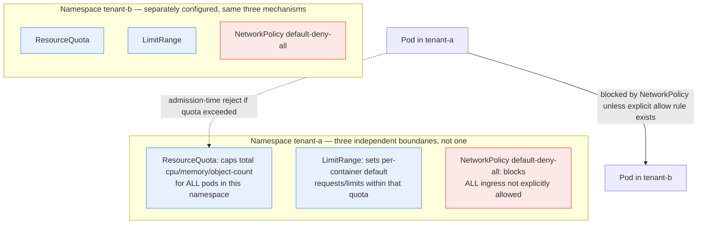

**TL;DR:** Creating a `Namespace` per tenant gives you naming isolation and an RBAC scoping boundary — nothing more. Without a `ResourceQuota`, one tenant's workload can consume the entire cluster's CPU/memory and starve every other tenant; without a default-deny `NetworkPolicy`, every Pod in every namespace can reach every other Pod in the cluster by default, tenant boundaries or not. Real multi-tenant clusters compose namespace-scoped `ResourceQuota`/`LimitRange` objects with namespace-scoped `NetworkPolicy` isolation — two independently-applied mechanisms, not one. From `kubernetes/website`'s real quota examples and `ahmetb/kubernetes-network-policy-recipes`' real isolation recipes.

## 1. The Engineering Problem

A platform team onboarding multiple teams (or, in a SaaS context, multiple customers) onto one cluster often starts with the obvious move: one `Namespace` per tenant. This genuinely buys something — `kubectl` commands, RBAC `Role`/`RoleBinding` scoping, and object naming all become tenant-scoped for free. But a `Namespace` on its own is a naming and API-scoping boundary, not a resource or network boundary. Two concrete failure modes follow directly from this gap:

First, without any quota, a single tenant's runaway Deployment (a bad autoscaling config, a memory leak, a genuine traffic spike) can consume unbounded CPU/memory on shared nodes, degrading every other tenant sharing that capacity — a noisy-neighbor problem with no cluster-level mechanism preventing it by default. Second, without any network restriction, Kubernetes' default networking model is deliberately flat and permissive: any Pod can send traffic to any other Pod's IP across the entire cluster, regardless of namespace. A tenant's Pod can reach another tenant's database Service by IP or DNS name unless something explicitly blocks it — the isolation a tenant might reasonably assume "namespace = boundary" gives them simply doesn't exist until it's built.

## 2. The Technical Solution

**`ResourceQuota`** is a namespace-scoped object that caps the total compute/object-count consumption across all Pods in that namespace, enforced by an admission-time check — a Pod request that would exceed the namespace's quota is rejected outright, not throttled after the fact. **`LimitRange`** complements it by setting per-container/per-Pod defaults and bounds within that same namespace, so quota consumption is predictable even when individual manifests omit `resources.requests`/`limits`. Neither of these interacts with the network layer at all — network isolation between tenant namespaces is a completely separate mechanism: a namespace-scoped **default-deny `NetworkPolicy`**, enforced by the cluster's CNI plugin (see Topic 19), that blocks all ingress by default and requires explicit allow-rules for any legitimate cross-tenant traffic.



Two core truths this diagram is showing:

- **Quota and network isolation are orthogonal mechanisms, both required, neither implying the other.** A namespace with a tight `ResourceQuota` and no `NetworkPolicy` is fully resource-isolated but fully network-open to every other tenant; the reverse is equally possible. Real multi-tenancy needs both, applied independently to every tenant namespace.
- **Every one of these objects is per-namespace and must be created per-tenant.** There's no cluster-wide "apply this quota to all namespaces" primitive in the base API — a new tenant namespace with no `ResourceQuota`/`NetworkPolicy` yet applied is fully unbounded and fully open by default, the exact same starting state as a cluster with none of this configured at all.

## 3. The clean example (concept in isolation)

The three objects a tenant namespace actually needs, applied together:

```yaml
# 1. ResourceQuota — hard ceiling on this namespace's total consumption
apiVersion: v1
kind: ResourceQuota
metadata:
  name: tenant-a-quota
  namespace: tenant-a
spec:
  hard:
    requests.cpu: "10"
    requests.memory: 20Gi
    limits.cpu: "20"
    limits.memory: 40Gi
    # caps OBJECT COUNT too, not just compute —
    # prevents a tenant from creating thousands of tiny Pods
    pods: "50"
---
# 2. LimitRange — so a Pod that omits resources still counts
# predictably against the quota above
apiVersion: v1
kind: LimitRange
metadata:
  name: tenant-a-limits
  namespace: tenant-a
spec:
  limits:
    - type: Container
      defaultRequest: { cpu: 100m, memory: 128Mi }
      default: { cpu: 500m, memory: 512Mi }
---
# 3. NetworkPolicy — blocks all ingress not explicitly allowed,
# a COMPLETELY SEPARATE mechanism from the quota above
apiVersion: networking.k8s.io/v1
kind: NetworkPolicy
metadata:
  name: default-deny-all
  namespace: tenant-a
spec:
  podSelector: {}
  ingress: []
```

## 4. Production reality (from the real repo)

Two real, independently-maintained sources cover the two halves: `kubernetes/website`'s own CI-tested `ResourceQuota` examples, and `ahmetb/kubernetes-network-policy-recipes`' real namespace-isolation `NetworkPolicy`.

```
kubernetes/website
└── content/en/examples/policy/
    └── priority-class-resourcequota.yaml   # quota scoped by PriorityClass

ahmetb/kubernetes-network-policy-recipes
└── 03-deny-all-non-whitelisted-traffic-in-the-namespace.md   # default-deny
└── 04-deny-traffic-from-other-namespaces.md                  # cross-tenant deny
```

A real quota scoped by `PriorityClass` rather than a blanket per-namespace cap — this is a genuinely more advanced multi-tenancy pattern than the clean example above: it lets a platform team reserve quota specifically for cluster-critical workloads, independent of which namespace they land in:

```yaml
# content/en/examples/policy/priority-class-resourcequota.yaml
apiVersion: v1
kind: ResourceQuota
metadata:
  name: pods-cluster-services
spec:
  scopeSelector:
    matchExpressions:
      - operator: In
        scopeName: PriorityClass
        # this quota only counts pods carrying the
        # "cluster-services" PriorityClass toward its limit —
        # ordinary tenant workloads at default priority
        # don't consume this budget at all
        values: ["cluster-services"]
```

`kubernetes/website`'s own comment on this pattern (from the surrounding docs this example ships with) is explicit that `scopeSelector`-based quotas are how a platform team prevents a flood of low-priority tenant Pods from starving cluster-critical ones — a different axis than the per-namespace cap in the clean example, and one that composes with it rather than replacing it.

The default-deny recipe that makes namespace isolation real, with the recipe's own annotated reasoning for each field:

```yaml
# 03-deny-all-non-whitelisted-traffic-in-the-namespace.md
kind: NetworkPolicy
apiVersion: networking.k8s.io/v1
metadata:
  name: default-deny-all
  namespace: default
spec:
  # empty podSelector matches ALL pods in this namespace —
  # the policy applies cluster-tenant-wide, not per-app
  podSelector: {}
  # no ingress rules at all — NOT the same as podSelector: {}
  # under `from`; an absent ingress list means "no traffic allowed,
  # full stop," the safe default a tenant namespace should start from
  ingress: []
```

The recipe's own use-case framing for the next layer, cross-namespace denial, states the multi-tenancy angle directly: *"You host applications from different customers in separate Kubernetes namespaces and you would like to block traffic coming from outside a namespace."* That recipe (`04-deny-traffic-from-other-namespaces.md`, covered in Topic 19) is the same-namespace-allow, other-namespace-deny variant — the one that actually matches a "tenants can talk to their own services, not each other's" requirement, rather than blocking everything indiscriminately.

**What this teaches that a hello-world can't:**

- **`scopeSelector`-based quotas scope by object attribute (`PriorityClass`), not just namespace.** This is the mechanism a platform team uses to protect cluster-critical add-ons from a noisy tenant, orthogonal to the per-tenant-namespace cap most multi-tenancy guides stop at.
- **`ingress: []` and no `ingress` field at all are the same "deny everything" state** — but `ingress: [{}]` (a single empty rule) means the opposite, "allow everything." This is a one-character-away footgun the recipe's own annotations call out explicitly, and one of the most common real misconfigurations in default-deny policies.
- **Quota rejection is admission-time, not a soft throttle.** A Pod create request that would push the namespace over `hard.requests.cpu` is rejected outright by the API server before it's ever scheduled — the tenant sees an immediate `403`-style quota-exceeded error, not a Pod that starts and gets OOM-killed or CPU-throttled later.
- **Every mechanism here is opt-in per namespace, with no cluster-wide inheritance.** A new tenant namespace created without explicitly applying all three objects (quota, limit range, default-deny policy) starts in the fully-open, fully-unbounded state — multi-tenancy at scale means these have to be templated (via GitOps, an admission webhook, or a namespace-provisioning pipeline) rather than applied by hand per tenant.

## 5. Review checklist

- Does every tenant namespace have both a `ResourceQuota` and a `LimitRange` — not just one? A `ResourceQuota` alone still admits Pods with no `resources` fields at all in some quota configurations (`LimitRange` is what forces a default), while a `LimitRange` alone caps individual Pods but not the namespace's aggregate consumption.
- Does the tenant's default-deny `NetworkPolicy` use `ingress: []` (deny all) rather than the easily-confused `ingress: [{}]` (allow all) — and has this specific distinction actually been tested, not just read?
- For clusters using `scopeSelector`-based `PriorityClass` quotas to protect cluster-critical workloads, is that quota's `values` list kept in sync with which `PriorityClass` names are actually considered cluster-critical, as new ones get added?
- Is tenant-namespace provisioning (quota + limit range + default-deny policy, together) templated through GitOps or a namespace-provisioning pipeline, rather than something a human applies by hand per new tenant — a manual step is a guaranteed eventual gap.

## 6. FAQ

**Q: If a namespace has a `ResourceQuota`, does that also stop one tenant's Pods from reaching another tenant's Pods over the network?**
A: No — `ResourceQuota` only governs compute/object-count consumption within its own namespace; it has no network-layer effect whatsoever. Network isolation requires a separate `NetworkPolicy`, enforced by the cluster's CNI plugin, not the API server's quota admission logic.

**Q: Does `ingress: []` on a `NetworkPolicy` block traffic between Pods in the SAME namespace too?**
A: Yes, and this often surprises teams — an empty `ingress` list with a `podSelector: {}` matching all Pods blocks ALL ingress, including same-namespace traffic. Topic 19's `04-deny-traffic-from-other-namespaces.md` recipe is the variant that specifically preserves same-namespace traffic (via `ingress.from.podSelector: {}`) while blocking cross-namespace traffic — a materially different rule from the blanket deny-all shown here.

**Q: Why scope a quota by `PriorityClass` instead of just giving cluster-critical workloads their own namespace with a separate quota?**
A: Cluster-critical add-ons (like DNS, ingress controllers, or monitoring agents) are sometimes legitimately deployed across multiple namespaces, or a platform team wants a budget that applies regardless of which namespace a `cluster-services`-priority Pod lands in. `scopeSelector` decouples the quota's scope from namespace boundaries entirely, which a purely per-namespace `ResourceQuota` can't express.

**Q: Does a `LimitRange`'s `defaultRequest` retroactively apply to Pods that were created before the `LimitRange` existed?**
A: No — `LimitRange` only affects admission-time defaulting for new Pod creations (and updates that don't set the field) after it exists. Pods already running with no `resources.requests` keep consuming without a tracked request against the quota until they're recreated.

**Q: Is a `Namespace` boundary ever sufficient for tenant isolation on its own, with no quota or NetworkPolicy?**
A: Only for the narrowest definition of isolation — separate `kubectl` namespacing and RBAC scoping. For anything resembling real multi-tenancy (protecting tenants from each other's resource consumption or network reachability), both a `ResourceQuota`/`LimitRange` pair and a default-deny `NetworkPolicy` are required, and neither is implied by namespace creation alone.

---

## Source

- **Concept:** Multi-tenancy patterns — namespace isolation, resource quotas, and network policies at scale
- **Domain:** kubernetes
- **Repo:** [kubernetes/website](https://github.com/kubernetes/website) → [`content/en/examples/policy/priority-class-resourcequota.yaml`](https://github.com/kubernetes/website/blob/main/content/en/examples/policy/priority-class-resourcequota.yaml) — the Kubernetes project's own CI-tested reference example; [ahmetb/kubernetes-network-policy-recipes](https://github.com/ahmetb/kubernetes-network-policy-recipes) → [`03-deny-all-non-whitelisted-traffic-in-the-namespace.md`](https://github.com/ahmetb/kubernetes-network-policy-recipes/blob/master/03-deny-all-non-whitelisted-traffic-in-the-namespace.md) — the community-canonical, CI-tested NetworkPolicy recipe collection.


