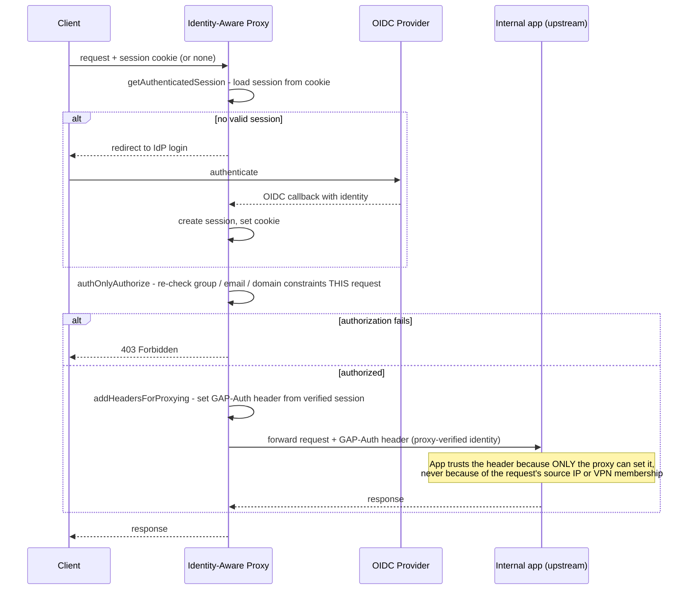

**TL;DR:** If a request is coming from inside the corporate VPN, why isn't that enough to trust it? Because network location proves nothing about *who* is making the request or whether their access is still valid right now — so a zero-trust identity-aware proxy re-authenticates and re-authorizes every single request against a live session, and passes the upstream application only an identity it verified itself, never a network-position claim.

**Real repo:** [`oauth2-proxy/oauth2-proxy`](https://github.com/oauth2-proxy/oauth2-proxy)

## 1. The Engineering Problem: "inside the network" was never the same thing as "authorized"

The perimeter model — firewall the network boundary, trust anything already inside it — made an implicit bet: if you can reach this IP range, you must be a legitimate employee on a legitimate device. That bet breaks down for reasons that have nothing to do with attacker sophistication: VPN credentials get phished same as any other credential; a compromised laptop is "inside the network" the moment it's on VPN; a contractor's overly broad VPN access reaches internal services that have nothing to do with their actual job; and once an attacker is inside the perimeter, most internal services historically assumed *anything reaching them* was already trusted, so there was often no second check at the application layer at all.

The deeper problem is that network position is a single point-in-time fact ("this packet arrived from an internal IP") being asked to answer a question it was never designed to answer: "is *this specific request*, right now, from *this specific identity*, allowed to touch *this specific resource*?" A VPN client that authenticated once, an hour ago, tells you nothing about whether that session should still be trusted this second — a revoked employee, a stolen session cookie, or a device that's since been flagged as compromised all still look identical to "inside the network" from the firewall's point of view.

---

## 2. The Technical Solution: authenticate and authorize the request, not the network path

Google's BeyondCorp model (the origin of "zero trust" as a concrete architecture, not just a slogan) inverted the assumption: no request is trusted by default because of where it came from — every request must independently prove identity and pass an authorization check, whether it originates from the office network or the public internet. The mechanism that makes this practical without rewriting every internal application is an **identity-aware proxy (IAP)**: a proxy that sits in front of internal services, terminates authentication itself, and only forwards a request onward once it has independently verified who's calling — the upstream application never has to implement its own login flow, but it also never implicitly trusts the network it's reachable from.



Three core truths to hold:

- **Every request re-runs both checks, not just the first one.** A session being valid at login time doesn't exempt request #500 from being re-evaluated — `getAuthenticatedSession` and the authorization constraints run on every proxied request, so a revoked session or a since-failed authorization constraint is caught immediately, not just at the next login.
- **The upstream app trusts a proxy-set header, never the network.** The internal application is deployed such that it's *only* reachable through the proxy (or is configured to trust the identity header only from the proxy's IP) — the app itself never re-derives trust from where the connection appears to originate.
- **Authentication and authorization are separate, sequential checks — not one combined "is this a valid session" gate.** A session can be authenticated (this really is a logged-in user) yet still fail authorization (this user isn't in the allowed group for this specific route) — collapsing those into one check is exactly the kind of gap that lets an authenticated-but-unauthorized identity slip through.

## 3. The clean example (concept in isolation)

```python
# Perimeter model: trust follows network position, checked once
def handle_request(req):
    if req.source_ip in CORPORATE_VPN_RANGE:
        return upstream_app.handle(req)   # implicitly trusted, no re-check
    return deny(req)

# Identity-aware proxy model: trust is re-derived from identity, every request
def handle_request(req):
    session = get_authenticated_session(req)        # re-validated, not cached-forever
    if session is None:
        return redirect_to_login(req)

    if not authorize(req, session):                 # separate, per-request check
        return forbidden(req)

    req.headers["X-Verified-Identity"] = session.email   # proxy-set, app trusts THIS
    return upstream_app.handle(req)                      # never trusts req.source_ip
```

## 4. Production reality (from `oauth2-proxy/oauth2-proxy`)

`oauth2-proxy` is the widely deployed open-source identity-aware proxy pattern — commonly placed in front of internal dashboards, admin tools, and Kubernetes services (via nginx `auth_request` or as an ingress-level authenticator) to add exactly this "authenticate and authorize every request, then hand the app a verified identity" behavior without changing the upstream app at all. All three pieces below live in one file:

```
oauth2-proxy/
└── oauthproxy.go   # getAuthenticatedSession, authOnlyAuthorize, addHeadersForProxying
```

The per-request re-check — this runs on *every* proxied request, not just at login:

```go
// oauthproxy.go

func (p *OAuthProxy) getAuthenticatedSession(rw http.ResponseWriter, req *http.Request) (*sessionsapi.SessionState, error) {
	session := middlewareapi.GetRequestScope(req).Session

	// Check this after loading the session so that if a valid session exists,
	// we can add headers from it
	if p.IsAllowedRequest(req) {
		return session, nil
	}

	if session == nil {
		return nil, ErrNeedsLogin
	}

	invalidEmail := session.Email != "" && !p.Validator(session.Email)
	authorized, err := p.provider.Authorize(req.Context(), session)
	if err != nil {
		logger.Errorf("Error with authorization: %v", err)
	}

	if invalidEmail || !authorized {
		cause := "unauthorized"
		if invalidEmail {
			cause = "invalid email"
		}
		logger.PrintAuthf(session.Email, req, logger.AuthFailure,
			"Invalid authorization via session (%s): removing session %s", cause, session)
		// Invalid session, clear it
		err := p.ClearSessionCookie(rw, req)
		if err != nil {
			logger.Errorf("Error clearing session cookie: %v", err)
		}
		return nil, ErrAccessDenied
	}

	return session, nil
}
```

What this teaches that a hello-world can't:

- **`p.provider.Authorize(req.Context(), session)` runs on every call, not once at login.** A session cookie proves the user logged in successfully at some point; it does not prove their access is still valid *right now* — `Authorize` gives the identity provider a chance to say "this account's authorization has since changed" on the current request, which is exactly the re-check a perimeter/VPN model has no equivalent of.
- **A failed re-check actively clears the session (`p.ClearSessionCookie`), it doesn't just deny this one request.** The proxy distinguishes between "you're not logged in yet" (`ErrNeedsLogin`, prompts a fresh login) and "your session became invalid" (`ErrAccessDenied`, actively revokes the stale cookie) — a subtle but important distinction for not leaving a half-trusted session lying around in the browser.
- **`invalidEmail` and `authorized` are two independent checks combined with `||`**, not one boolean — an account can fail because its email no longer matches an allowed pattern (e.g. someone changed their primary email) even if the *authorization* provider call would have succeeded, and vice versa. Collapsing these into a single flag would lose the distinct failure reason logged in `cause`.

The authorization step that runs after authentication succeeds — a genuinely separate check, not folded into the session-validity check above:

```go
// oauthproxy.go

// authOnlyAuthorize handles special authorization logic that is only done
// on the AuthOnly endpoint for use with Nginx subrequest architectures.
func authOnlyAuthorize(req *http.Request, s *sessionsapi.SessionState) bool {
	// Allow requests previously allowed to be bypassed
	if s == nil {
		return true
	}

	constraints := []func(*http.Request, *sessionsapi.SessionState) bool{
		checkAllowedGroups,
		checkAllowedEmailDomains,
		checkAllowedEmails,
	}

	for _, constraint := range constraints {
		if !constraint(req, s) {
			return false
		}
	}

	return true
}
```

And the boundary between the proxy's trust domain and the upstream app's — the only thing the app ever receives about the caller's identity:

```go
// oauthproxy.go

func (p *OAuthProxy) addHeadersForProxying(rw http.ResponseWriter, session *sessionsapi.SessionState) {
	if session == nil {
		return
	}
	if session.Email == "" {
		rw.Header().Set("GAP-Auth", session.User)
	} else {
		rw.Header().Set("GAP-Auth", session.Email)
	}
}
```

`authOnlyAuthorize` running a list of independent `constraints` (group membership, email domain, explicit allow-list) *after* `getAuthenticatedSession` already confirmed the session is valid is the concrete separation this lesson's opening claim rests on: being a real, authenticated identity and being *authorized for this specific route* are evaluated by different functions, at different points in the request path — a route can tighten `checkAllowedGroups` without touching authentication at all. And `GAP-Auth` is the entire zero-trust contract in one line: the upstream app receives a header the proxy set from a session *it* verified — the app has no way to distinguish a proxy-verified request from a spoofed one except by trusting that only the proxy can reach it and set that header, which is why the deployment topology (app unreachable except through the proxy) is as load-bearing as the code itself.

## 5. Review checklist

- **Does the internal/upstream app actually enforce that it's only reachable through the proxy** (network policy, security group, or an equivalent that isn't itself trusting the request's source IP), or does the `GAP-Auth`-style header get trusted from any caller who happens to set it?
- **Are authentication failure (`ErrNeedsLogin`) and authorization failure (`ErrAccessDenied`) handled differently**, matching this lesson's distinction — a not-yet-logged-in user should be redirected to login, not silently denied in a way indistinguishable from a revoked account?
- **Is `provider.Authorize` (or the equivalent live re-check) actually being called per-request**, or has the deployment cached "this session was valid" for longer than the session/cookie lifetime intends, effectively re-introducing perimeter-style implicit trust?
- **Are the `constraints` (`checkAllowedGroups`, `checkAllowedEmailDomains`, `checkAllowedEmails`) scoped per route/upstream, not one global allow-list** — a single blanket authorization rule for every internal service defeats the purpose of re-checking authorization per request in the first place.

## 6. FAQ

**Q: If every request re-checks authentication, doesn't that add latency to every single call?**
A: `getAuthenticatedSession` first checks the local session (from the cookie, already loaded into request scope) before making any external `provider.Authorize` call — the session lookup itself is fast and local; the network-calling authorization re-check is the part that costs latency, and it's exactly the check zero trust needs to actually be re-run, not skipped for performance.

**Q: What's actually different between this and just putting an app behind a VPN plus an app-level login page?**
A: A VPN-plus-login model still often has the VPN itself as an implicit trust boundary — internal service-to-service calls, or endpoints an app forgot to gate behind its own login, inherit "on the VPN" as sufficient trust. The identity-aware proxy pattern moves the check to the network edge of *every individual service*, so there's no internal path that's reachable without going through `getAuthenticatedSession` and `authOnlyAuthorize` — nothing is "internal enough" to skip the check.

**Q: Why does `authOnlyAuthorize` return `true` immediately when `s == nil`?**
A: That's the `AuthOnly` endpoint's specific contract for Nginx subrequest architectures (`auth_request`) — a nil session at that point means the caller already fell through a different, less restrictive path upstream in `getAuthenticatedSession` that explicitly allowed the request (`IsAllowedRequest`, e.g. a public route that doesn't require auth at all). It's not a fallback to open trust; it's honoring an already-made "this route doesn't need authorization" decision rather than re-deciding it.

**Q: Does this replace network-level controls (firewalls, network policies) entirely?**
A: No — zero trust doesn't argue network controls are useless, it argues they're insufficient as the *only* control. In this repo's model, restricting which hosts can even reach the upstream app (so only the proxy can) is still a real, load-bearing part of the design — it's just no longer the thing that decides whether a specific request is authorized, only part of what makes the `GAP-Auth` header trustworthy in the first place.

**Q: How is this related to Workload Identity Federation, covered earlier in this GCP curriculum?**
A: Same underlying principle, different layer — Workload Identity Federation replaces a long-lived cloud credential with a short-lived token tied to a verified workload identity, so trust is re-derived from identity rather than a standing secret. The identity-aware proxy applies that same "derive trust from a freshly verified identity, not a standing artifact (network position, in this case)" principle to end-user access instead of service-to-service credentials.

---

## Source

- **Concept:** Zero trust architecture — BeyondCorp model, identity-aware proxy, per-request re-authentication and re-authorization
- **Domain:** security
- **Repo:** [oauth2-proxy/oauth2-proxy](https://github.com/oauth2-proxy/oauth2-proxy) → [`oauthproxy.go`](https://github.com/oauth2-proxy/oauth2-proxy/blob/master/oauthproxy.go) — the widely deployed open-source identity-aware proxy, commonly run in front of internal services via nginx `auth_request` or as a Kubernetes ingress authenticator.

---

**Next in the Security series:** [Threat Modeling: Why STRIDE Categories Depend on the Diagram Element, Not a Fixed Checklist]({{ '/security/threat-modeling-stride-dread-attack-trees/' | relative_url }})
