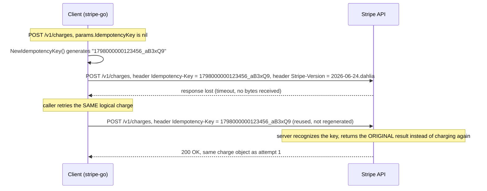

**TL;DR:** Why do production APIs version by date instead of `v1`/`v2`, paginate by cursor instead of page number, and require clients to generate their own idempotency key instead of just deduplicating on the server? Because each of those choices is a contract that has to survive the server changing its internals without warning every caller: dated versioning lets the server evolve field-by-field instead of forcing every client onto a big-bang cutover, cursor pagination lets the underlying data shift between requests (or shard across nodes) without skipping or repeating rows, and a client-generated idempotency key is the only signal that survives a response actually getting lost on the way back — a server can't invent that signal after the fact. Stripe's real Go client (`stripe-go`) implements all three as actual request-building code, not just documented conventions.

> **In plain English (30 sec):** Code you already write — Map, function, API call, just bigger.

**Real repo:** [`stripe/stripe-go`](https://github.com/stripe/stripe-go)

## 1. The Engineering Problem: an API's internals will change, but its callers can't all upgrade at once

An API design decision made once has to keep working for years, against callers you can't force to redeploy on your schedule. Three specific pressures make the naive defaults break down at scale:

1. **"Just ship breaking changes and tell people to upgrade" doesn't work when callers number in the thousands and update on their own timeline.** A `v1` → `v2` cutover that changes a field's meaning either forces a synchronized flag-day migration across every integration, or forces the server to run two incompatible code paths side by side indefinitely — neither scales cleanly past a handful of callers.
2. **"Paginate with `?page=3`" breaks the moment the underlying dataset changes between requests.** If a row is inserted or deleted while a client is paging through offset-based results, every subsequent page shifts by one — the client silently skips a row or sees a duplicate, and neither the client nor the server can tell which happened. It also assumes the whole result set can be counted and offset into cheaply, which stops being true once the data is sharded across nodes.
3. **"If a write might have failed, just retry it" reintroduces the exact double-charge risk covered in this domain's RPC failure semantics topic — but here at the API-contract level, not the transport level.** The server genuinely cannot tell "this is a retry of a request I already processed" from "this is a brand-new, coincidentally identical request" unless the *client* hands it a signal that survives the original response being lost.

Every one of these is really the same underlying problem: the API is a long-lived contract between two parties who can't coordinate deploys, so the contract has to be designed to tolerate the server changing shape underneath it without the client noticing or breaking.

---

## 2. The Technical Solution: version by date, paginate by cursor, key writes by a client-owned token

**Versioning by dated snapshot, not `v1`/`v2`.** Stripe's client sends a `Stripe-Version` header on every request, set to a dated string like `2026-06-24.dahlia` rather than a coarse major version number. Each account is pinned to whatever version it integrated against; the server can add new versions constantly without ever forcing a mass migration, because a caller only moves forward when it deliberately opts in.

**Pagination by opaque cursor (the last-seen object's ID), not offset.** Stripe's `ListParams` take `StartingAfter`/`EndingBefore` — an object ID from the previous page — instead of a page number, and the server has to know nothing about "which page this is," only "give me the next N items after this specific one." That's stable under concurrent inserts/deletes and doesn't require the server to compute a total count or an absolute row offset.

**Idempotency by a key the client generates and owns.** Every write request carries an `Idempotency-Key` header; if the client already had one from a previous attempt, it reuses it — that's the whole mechanism that makes a retried "charge this card" safe.



Core truths this mechanism depends on:

1. **The idempotency key is generated client-side, before the first attempt, and must be reused verbatim on any retry of that same logical operation.** If the client regenerates a fresh key on retry, the server has no way to recognize it as a repeat — the whole guarantee lives in the client holding onto that one value across attempts, not in anything the server can infer from the request body.
2. **A pagination cursor is opaque and relative, never an absolute position.** `StartingAfter` means "after this specific object," not "row number N" — so it stays correct even if rows before it were deleted, and it doesn't require the server to agree on a stable total count with the client.
3. **A version pin is per-account state, resolved once per request, not a URL path segment the client has to remember to update.** `Stripe-Version` travels as a header set from account configuration, which is what lets the server run many simultaneous dated versions against the same underlying data model instead of maintaining parallel `/v1/` and `/v2/` code paths.

---

## 3. The clean example (concept in isolation)

```go
// capacity-checkout.go — the three contracts in isolation, framework-agnostic

// 1. VERSIONING: pinned per account/config, sent on every request as a header -
// never baked into the URL path, so the server can add versions without a
// path-breaking release.
const apiVersion = "2026-06-24.dahlia"

// 2. IDEMPOTENCY: generated ONCE per logical write, held by the caller across
// every retry of that same operation.
func newIdempotencyKey() string {
    now := time.Now().UnixNano()
    buf := make([]byte, 4)
    rand.Read(buf)
    return fmt.Sprintf("%v_%v", now, base64.URLEncoding.EncodeToString(buf)[:6])
}

func chargeCard(client *http.Client, amount int64, key string) (*http.Response, error) {
    req, _ := http.NewRequest("POST", "https://api.example.com/v1/charges", nil)
    req.Header.Set("Stripe-Version", apiVersion)
    // Reuse the SAME key on every retry of this one logical charge -
    // regenerating it here would defeat the whole mechanism.
    req.Header.Set("Idempotency-Key", key)
    return client.Do(req)
}

// 3. PAGINATION: cursor is the last-seen object's own ID, not a page number -
// stays correct even if rows are inserted or deleted between calls.
type ListPage struct {
    Data    []Charge
    HasMore bool
}

func nextPage(client *http.Client, startingAfter string) (*ListPage, error) {
    url := "https://api.example.com/v1/charges?limit=100"
    if startingAfter != "" {
        url += "&starting_after=" + startingAfter
    }
    // ... issue GET, parse ListPage ...
    return nil, nil
}
```

---

## 4. Production reality (from `stripe/stripe-go`)

```
stripe/stripe-go/
├── api_version.go   # APIVersion - the dated string sent on every request
├── params.go         # ListParams (cursor pagination) + IdempotencyKey field
├── iter.go            # Iter - the actual bidirectional cursor-walking logic
└── stripe.go          # where both headers actually get attached to the outgoing request
```

**Versioning — a generated, dated constant, not a hand-maintained major version:**

```go
// api_version.go
//
// File generated from our OpenAPI spec
//

package stripe

const (
    APIVersion      string = "2026-06-24.dahlia"
    APIMajorVersion string = "dahlia"
)
```

**Idempotency — the header attached only on write methods, and only generated if the caller didn't already supply one:**

```go
// stripe.go (APIBackend.Call request-building, elided)

if params != nil {
    if params.Context != nil {
        req = req.WithContext(params.Context)
    }

    if params.IdempotencyKey != nil {
        idempotencyKey := strings.TrimSpace(*params.IdempotencyKey)
        if len(idempotencyKey) > 255 {
            return nil, errors.New("cannot use an idempotency key longer than 255 characters")
        }

        req.Header.Add("Idempotency-Key", idempotencyKey)
    } else if isHTTPWriteMethod(method) {
        req.Header.Add("Idempotency-Key", NewIdempotencyKey())
    }
    // ... StripeAccount / StripeContext headers elided ...
}
```

```go
// params.go

// SetIdempotencyKey sets a value for the Idempotency-Key header.
func (p *Params) SetIdempotencyKey(val string) {
    p.IdempotencyKey = &val
}

// NewIdempotencyKey generates a new idempotency key that
// can be used on a request.
func NewIdempotencyKey() string {
    now := time.Now().UnixNano()
    buf := make([]byte, 4)
    if _, err := rand.Read(buf); err != nil {
        panic(err)
    }
    return fmt.Sprintf("%v_%v", now, base64.URLEncoding.EncodeToString(buf)[:6])
}
```

**Pagination — the cursor fields on every list request, and the bidirectional walk:**

```go
// params.go (ListParams, elided)

type ListParams struct {
    Context context.Context `form:"-"`

    EndingBefore *string `form:"ending_before"`
    Filters      Filters `form:"*"`
    Limit        *int64  `form:"limit"`

    // Single: load just one page instead of auto-walking every page.
    Single bool `form:"-"`

    StartingAfter *string `form:"starting_after"`
}
```

```go
// iter.go (Iter.Next / Iter.getPage, elided)

func (it *Iter) Next() bool {
    if len(it.values) == 0 && it.meta.HasMore && !it.listParams.Single {
        // determine if we're moving forward or backwards in paging
        if it.listParams.EndingBefore != nil {
            it.listParams.EndingBefore = String(listItemID(it.cur))
            it.formValues.Set(EndingBefore, *it.listParams.EndingBefore)
        } else {
            it.listParams.StartingAfter = String(listItemID(it.cur))
            it.formValues.Set(StartingAfter, *it.listParams.StartingAfter)
        }
        it.getPage()
    }
    if len(it.values) == 0 {
        return false
    }
    it.cur = it.values[0]
    it.values = it.values[1:]
    return true
}

func (it *Iter) getPage() {
    it.values, it.list, it.err = it.query(it.listParams.GetParams(), it.formValues)
    it.meta = it.list.GetListMeta()

    if it.listParams.EndingBefore != nil {
        // We are moving backward,
        // but items arrive in forward order.
        reverse(it.values)
    }
}
```

What this teaches that a hello-world can't:

- **The cursor is always a real object's ID (`listItemID(it.cur)`), taken from the last item actually seen — never a number the client invents.** This is what makes the pagination correct under concurrent writes: the client is always saying "give me what comes after *this specific thing I already have*," which stays meaningful even if items before it were deleted, unlike an offset that silently shifts.
- **The idempotency key is only auto-generated for write methods (`isHTTPWriteMethod(method)`) — GET requests never get one.** Reads are naturally idempotent (repeating a GET can't duplicate a side effect), so the mechanism only spends its complexity budget where it's actually needed: charges, transfers, refunds, and other state-changing calls.
- **`IdempotencyKey` is a field on `Params`, threaded through every write call's signature, not a global client setting.** This forces the key to be scoped to one specific logical operation rather than accidentally shared across unrelated calls — a caller has to deliberately generate and hold one key per operation it intends to retry safely, which is exactly the discipline the mechanism depends on.

Known-stale fact: URL-path versioning (`/v1/`, `/v2/`) is still common, but treating it as the only real option is outdated — dated, per-account version pinning (Stripe's `Stripe-Version` header) is the production pattern for APIs that need to ship hundreds of small breaking changes per year without ever forcing a synchronized mass migration; each account effectively runs its own frozen snapshot of the API shape until it deliberately opts into a newer one.

---

## 5. Review checklist

- **Does every write endpoint accept and honor an idempotency key, and does the client library generate one automatically when the caller didn't supply one (`isHTTPWriteMethod` gate)?** A write endpoint with no idempotency mechanism at all means every network-level retry (see this domain's RPC failure semantics topic) is a potential duplicate charge, message, or side effect.
- **Is list pagination driven by an opaque cursor derived from a real row/object identity (`listItemID`), not a client-supplied page number or offset?** An offset-based `?page=N` parameter breaks correctness the moment rows are inserted or deleted mid-pagination, and doesn't survive the underlying data being sharded.
- **Is the API version resolved from account/request configuration (a header or resolved server-side state) rather than hardcoded into the URL path?** A path-based version forces every breaking change to wait for a coordinated `/v2/` cutover; a header-based, per-account pin lets the server evolve continuously while each caller stays frozen on the version it integrated against.
- **Is the idempotency key scoped to one logical operation and reused — not regenerated — across retries of that same operation?** Check any retry-handling code path specifically: a helper that calls `NewIdempotencyKey()` again on every attempt silently defeats the entire guarantee, even though the header is technically present on every request.

## 6. FAQ

### Why does Stripe's client generate the idempotency key on the client, not let the server assign one?
Because the value of the key is that it survives the *response* getting lost — if the server assigned the key and returned it in that same lost response, the client would have no key to retry with. The client has to own the key from before the first attempt so it has something stable to send again regardless of what happened to the first response.

### What actually stops a client from breaking pagination correctness with `StartingAfter`?
Nothing forces the client to use it correctly, but `Iter.Next()` in `iter.go` handles it automatically: it always sets `StartingAfter` to `listItemID(it.cur)` — the ID of the last item the client actually received — rather than letting a caller hand-construct an arbitrary cursor value. As long as callers use the iterator instead of hand-rolling cursor values, the mechanism can't drift from "the real last-seen item."

### Does a dated version string like `2026-06-24.dahlia` mean the server maintains a separate deployment per version?
No — the version pin selects which shape of request/response transformation to apply on top of one underlying implementation, not a separate running service. This is what makes dated versioning scale to hundreds of versions in practice: the cost of an old version is a transformation layer, not a whole parallel deployment.

### Why does `stripe-go` reject an idempotency key longer than 255 characters instead of just truncating it?
`stripe.go`'s request-building code returns an explicit error (`"cannot use an idempotency key longer than 255 characters"`) rather than silently truncating. Truncating would risk two different long keys colliding on the same truncated value, which would make the server think two unrelated write requests were retries of each other — a silent correctness bug worse than a loud client-side error.

### Is `Idempotency-Key` handling in `stripe-go` any different from the retry-safety mechanism covered in this domain's RPC failure semantics topic?
They solve related but distinct layers of the same problem. The RPC failure semantics topic (Envoy's `retriable_request_headers` and per-try timeouts) is about a proxy deciding whether *it* is allowed to automatically retry a request it's forwarding. `Idempotency-Key` here is the API-level contract the *application* client uses so that even a manually-triggered retry — a user clicking "pay" twice, or an application-level retry outside any proxy — is still safe against duplication.

---

## Source

- **Concept:** API design for scale — versioning, pagination, idempotency at the system level
- **Domain:** system-design
- **Repo:** [stripe/stripe-go](https://github.com/stripe/stripe-go) → [`api_version.go`](https://github.com/stripe/stripe-go/blob/master/api_version.go), [`params.go`](https://github.com/stripe/stripe-go/blob/master/params.go), [`iter.go`](https://github.com/stripe/stripe-go/blob/master/iter.go), [`stripe.go`](https://github.com/stripe/stripe-go/blob/master/stripe.go) — the official Go client for Stripe's production payments API.

---

**Next in the System Design series:** [Real-World System Design Case Studies: How a Chat Homeserver Composes Rate Limiting, Cursor Pagination, and Sharded Delivery]({{ '/system-design/real-world-system-design-case-studies-chat-homeserver/' | relative_url }})


