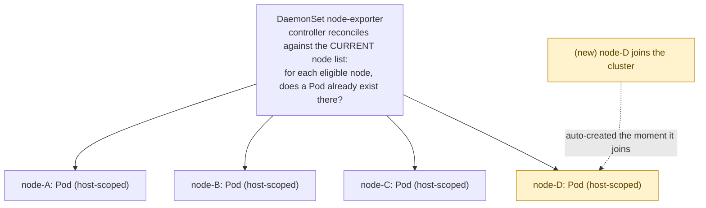

## 1. The Engineering Problem: some workloads are per-node, not per-application

A Deployment answers "run N copies of this, spread wherever the scheduler thinks is best." That's the wrong question for a class of workloads that need to observe or manage the **node itself**: a metrics agent scraping host CPU/disk/network stats, a log collector reading the node's container logs, a CNI plugin managing the node's network interfaces.

Try to force this into a Deployment and it breaks in two directions at once:

- **Under-coverage.** Set `replicas: 10` for a 10-node cluster and hope the scheduler spreads exactly one Pod per node — nothing guarantees that. The default scheduler optimizes for its own bin-packing and spreading heuristics, not "exactly one instance per node, no exceptions." Two Pods could land on the same node while another node runs zero — and a node running zero is a node you're now blind on.
- **No awareness of cluster size changing.** Add a node to the cluster and a Deployment has no idea a new node even exists — it has a fixed target replica count, not "one per node, whatever that number currently is." You'd need to manually recompute and bump `replicas` every time the cluster scales.

You need a controller whose entire job is "one Pod, on every node that matches these criteria, always — automatically adding a Pod when a node joins, removing it when a node leaves."

---

## 2. The Technical Solution: DaemonSet

A **DaemonSet** doesn't take a `replicas` count at all — it takes a Pod template and a node-matching criterion, and ensures exactly one matching Pod exists on every eligible node, continuously.



A node cordoned/tainted without a matching toleration has its Pod evicted, and no replacement is scheduled elsewhere — there's nowhere "elsewhere" to go, since DaemonSet Pods are tied to a specific node.

Three things to hold onto:

1. **The default scheduler still does the binding — this is a corrected stale fact.** Verified against the current Kubernetes docs: the DaemonSet controller creates each Pod and stamps it with node affinity matching a specific node, but *"after the Pod is created, the default scheduler typically takes over and then binds the Pod to the target host."* Older material describing the DaemonSet controller as bypassing the scheduler entirely describes pre-1.17 behavior — it hasn't been accurate for a long time.
2. **"Every node" is filtered by `nodeSelector`/affinity, and taints still apply.** A DaemonSet Pod is scheduled like any other Pod with respect to taints — if you want it on control-plane/master nodes too (which are tainted by default to repel ordinary workloads), you need an explicit `tolerations` entry, commonly a blanket `operator: Exists`.
3. **Rolling updates are per-node, not percentage-of-a-pool.** `updateStrategy.type` defaults to `RollingUpdate`, controlled by `maxUnavailable` (default `1`) — and, verified against the current docs, a `maxSurge` field also exists (default `0`), which reached GA in **Kubernetes v1.25**. With `maxSurge` at its default of zero, updating a node's Pod means deleting the old one *before* the new one starts — unlike a Deployment, a DaemonSet can never run two copies on the same node to avoid a gap, unless you explicitly opt into surge.

---

## 3. The clean example (the concept in isolation)

```yaml
apiVersion: apps/v1
kind: DaemonSet
metadata:
  name: node-agent
spec:
  selector:
    matchLabels: { app: node-agent }
  updateStrategy:
    type: RollingUpdate
    rollingUpdate:
      maxUnavailable: 1
  template:
    metadata:
      labels: { app: node-agent }
    spec:
      tolerations:
      - operator: Exists          # run on every node, INCLUDING tainted ones
      hostNetwork: true            # observe the node's actual network, not a
                                    # Pod-private network namespace
      containers:
      - name: agent
        image: mycompany/node-agent:v1
        volumeMounts:
        - name: proc
          mountPath: /host/proc
          readOnly: true
      volumes:
      - name: proc
        hostPath:
          path: /proc               # mounts the NODE's filesystem into the Pod
```

Now the real thing this pattern exists for.

---

## 4. Production reality (from the real repo)

`kubernetes/ingress-nginx` — the suggested repo for this topic — turns out to define **no DaemonSet anywhere in its manifests**; it runs as a Deployment even in its bare-metal guide, using `hostNetwork`/`hostPort` instead where node-level exposure is needed. Falling back to `prometheus-operator/kube-prometheus`'s **node-exporter**, whose entire reason to exist is "scrape this exact node's hardware metrics" — about as textbook a DaemonSet workload as exists. No license header in source; verbatim below.

```yaml
apiVersion: apps/v1
kind: DaemonSet
metadata:
  name: node-exporter
  namespace: monitoring
spec:
  selector:
    matchLabels:
      app.kubernetes.io/name: node-exporter
  template:
    spec:
      containers:
      - name: node-exporter                # container 1: reads host metrics
        args:
        - --web.listen-address=127.0.0.1:9101   # bound to LOCALHOST only —
        - --path.sysfs=/host/sys                 # not reachable off-node directly
        image: quay.io/prometheus/node-exporter:v1.12.0
        # ... securityContext elided: narrow capabilities added, NOT privileged: true ...
        volumeMounts:
        - mountPath: /host/sys
          mountPropagation: HostToContainer   # host mount changes propagate live
          name: sys
          readOnly: true
        - mountPath: /host/root
          mountPropagation: HostToContainer
          name: root
          readOnly: true

      - name: kube-rbac-proxy       # container 2: sidecar, same Pod (recall the Pod
        args:                        # lesson — both containers share localhost)
        - --secure-listen-address=[$(IP)]:9100
        - --upstream=http://127.0.0.1:9101/   # <-- proxies to container 1 over
        env:                                    #     localhost, inside the same Pod
        - name: IP
          valueFrom:
            fieldRef: { fieldPath: status.podIP }
        image: quay.io/brancz/kube-rbac-proxy:v0.22.1
        ports:
        - containerPort: 9100
          hostPort: 9100               # <-- exposed on the NODE's own port 9100,
          name: https                   # not just the Pod's network namespace

      hostNetwork: true                # shares the node's real network namespace —
      hostPID: true                    # a deliberate exception to Pod network
                                        # isolation, required to see host-level
                                        # interfaces and processes at all
      priorityClassName: system-cluster-critical   # protects this Pod from being
                                                     # evicted under node resource
                                                     # pressure — exactly when you
                                                     # need node metrics most
      tolerations:
      - operator: Exists              # blanket toleration: runs on EVERY node,
                                       # including tainted control-plane nodes
      volumes:
      - hostPath: { path: /sys }
        name: sys
      - hostPath: { path: / }
        name: root
  updateStrategy:
    rollingUpdate:
      maxUnavailable: 10%             # across a large fleet, update 10% of nodes'
    type: RollingUpdate                # Pods at a time, not one-by-one or all-at-once
```

**What this teaches that a hello-world can't:**

- **`hostNetwork: true` + `hostPID: true` deliberately break the Pod isolation from earlier in this series.** Every other lesson leaned on "a Pod gets its own network namespace." Here that's turned *off* on purpose — node-exporter's whole job is reading the node's real interfaces and process table, so it opts out of the sandbox that normally protects it from (and isolates it from) the host.
- **The two-container sidecar pattern is the Pod-sharing mechanism from lesson one, doing real work.** `node-exporter` binds only to `127.0.0.1:9101` — deliberately unreachable from outside the Pod. `kube-rbac-proxy` is what actually exposes `hostPort: 9100`, adding TLS + RBAC auth in front of metrics that would otherwise be wide open on every node. Splitting "collect the data" from "authenticate access to the data" into two containers, talking over the shared Pod `localhost`, is the same mechanism as the two-container example in this series' first lesson — just with a real security reason behind it.
- **`hostPath` volumes only make sense because this is one-Pod-per-node.** Mounting `/sys` and `/` from the host is meaningless for a normal Deployment Pod that could land anywhere — but for a DaemonSet, "this Pod's host" is a well-defined, stable concept, which is exactly what makes reading the node's own filesystem safe and correct here.
- **`tolerations: [{operator: Exists}]` is what gets this onto control-plane nodes.** Without it, this DaemonSet would silently skip every tainted node — including the control plane, which absolutely still needs its CPU/memory/disk monitored. This single line is the difference between "monitors the fleet" and "monitors the fleet, except the part that matters most when it's under load."

---

## Source

- **Concept:** Kubernetes `DaemonSet` — guaranteed one-Pod-per-node scheduling
- **Domain:** kubernetes
- **Repo:** [prometheus-operator/kube-prometheus](https://github.com/prometheus-operator/kube-prometheus) → [`manifests/nodeExporter-daemonset.yaml`](https://github.com/prometheus-operator/kube-prometheus/blob/main/manifests/nodeExporter-daemonset.yaml) — the production Prometheus + Alertmanager + Grafana monitoring stack (falling back from `kubernetes/ingress-nginx`, which defines no DaemonSet anywhere in its manifests)
