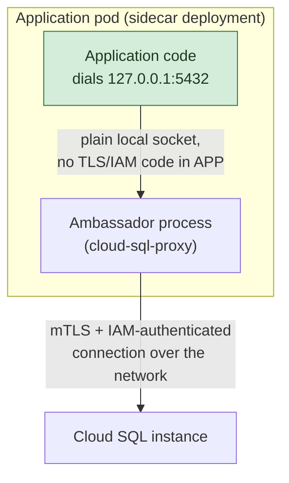
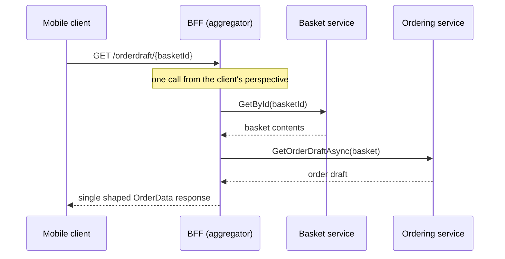
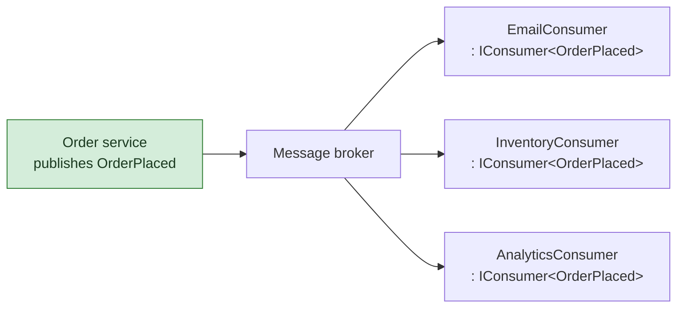

**TL;DR:** What do "sidecar," "ambassador," "BFF," and "event-driven" actually look like once you stop drawing boxes and arrows and read the code? A sidecar/ambassador is a small companion process the application dials over `localhost` instead of the real remote endpoint; a BFF is one dedicated controller that fans out to several backend calls and hands the client back a single shaped response; and event-driven is a narrow interface — one `Consume` method — that a broker's dispatcher invokes by convention, not a direct method call the producer makes.

## 1. The Engineering Problem

Four separate pains, each solved by treating a diagram-level "pattern" as a concrete piece of code rather than a deployment topology alone.

**Every service that talks to a secured backend duplicates the same auth boilerplate.** If ten services each need to connect to Cloud SQL with IAM-based authentication and rotating short-lived certificates, and each service embeds that TLS/IAM logic directly in its own connection code, then updating the auth mechanism means editing and redeploying ten services in lockstep — in ten different points of a codebase that might even be in different languages.

**A client that needs data from several services makes several round trips, and needs to know the whole backend topology.** A mobile app screen that needs basket contents and order history has to call the basket service and the ordering service separately if there's no aggregation layer — two round trips over a mobile network, plus the client now has to know both services' addresses, contracts, and versioning, none of which is the client's concern.

**A producer that calls every interested consumer directly creates N×M coupling.** If an "order placed" event needs to trigger email confirmation, inventory reservation, and analytics, and the order service calls each of those three endpoints directly, then every new consumer means editing the order service's code — the producer has to know who's listening, which defeats the point of decoupling producers from consumers in the first place.

## 2. The Technical Solution

Each "microservices pattern" here is a concrete code shape, not just a box on a diagram:

- **Sidecar / Ambassador as code: a companion process the application talks to over `localhost`, which does the real remote work on the app's behalf.** The app's code stays a plain socket connection to `127.0.0.1`; the ambassador process — deployed alongside the app as a sidecar container — owns the TLS handshake, IAM token exchange, and certificate rotation. Upgrading the auth mechanism means shipping a new ambassador binary, not touching any application code.
- **BFF (Backend-for-Frontend) as code: one dedicated controller per client type that fans out to N backend calls and returns one response shaped for that client.** The client makes exactly one call; the BFF owns the knowledge of which backend services to call and how to combine their responses.
- **Event-driven as code: a narrow `IConsumer<TMessage>` interface a broker's dispatcher invokes, not a method the producer calls directly.** The producer publishes a typed message and knows nothing about who — if anyone — consumes it. Any number of independently-deployed consumers can implement the same interface; the broker's dispatch loop, not the producer, decides who gets called.







Core truths to hold:

- **Sidecar describes *where* a helper process runs (alongside the app, same pod/host); ambassador describes *what* it does (proxies outbound calls on the app's behalf).** The same binary — `cloud-sql-proxy` below — is deployed as a sidecar and functions as an ambassador; the two words describe the topology and the role, not two different pieces of software.
- **A BFF is not a generic API gateway — it's *client-specific*.** A gateway routes and terminates cross-cutting concerns for all clients; a BFF's whole reason to exist is that a mobile client and a web client want *differently shaped* responses from the *same* backend services, so each gets its own dedicated aggregator rather than sharing one generic layer.
- **Event-driven decoupling lives entirely in the fact that `IConsumer<T>` is a marker the broker discovers, not a reference the producer holds.** The producer's code has zero knowledge of `EmailConsumer` or any other implementation — the broker's registration/dispatch mechanism is what turns "publish a message" into "N independent handlers run," and that mechanism is exactly what makes adding consumer #4 a zero-change operation for the producer.

## 3. The clean example (concept in isolation)

**Ambassador, the textbook version (a local proxy that owns auth the app never sees):**

```csharp
// The application only ever does this — no TLS, no token exchange here:
using var conn = new NpgsqlConnection("Host=127.0.0.1;Port=5432;...");
await conn.OpenAsync();

// Meanwhile, a SEPARATE ambassador process/container listens on 127.0.0.1:5432
// and does the real work on the app's behalf:
async Task RunAmbassador()
{
    var listener = new TcpListener(IPAddress.Loopback, 5432);
    listener.Start();
    while (true)
    {
        var clientConn = await listener.AcceptTcpClientAsync();
        // Dial the REAL backend with mTLS + a short-lived IAM token —
        // logic the application code never has to know exists.
        var backendConn = await DialWithIamAuthAsync();
        _ = PipeBytesBothWaysAsync(clientConn, backendConn);
    }
}
```

**BFF, the textbook version (one aggregator endpoint, two backend calls, one response):**

```csharp
[HttpGet("draft/{basketId}")]
public async Task<OrderData> GetOrderDraft(string basketId)
{
    var basket = await _basketService.GetById(basketId);   // call #1
    var draft = await _orderingService.GetOrderDraft(basket); // call #2
    return draft; // client gets ONE response, never sees two backend calls
}
```

**Event-driven, the textbook version (a narrow interface the broker discovers, not one the producer calls):**

```csharp
public interface IConsumer<in TMessage> where TMessage : class
{
    Task Consume(ConsumeContext<TMessage> context);
}

// The producer publishes and moves on — it holds no reference
// to any consumer, doesn't know if zero or ten are listening:
await _bus.Publish(new OrderPlaced(orderId));

// Elsewhere, entirely independently deployed:
public class EmailConsumer : IConsumer<OrderPlaced>
{
    public Task Consume(ConsumeContext<OrderPlaced> context) =>
        SendConfirmationEmailAsync(context.Message);
}
```

## 4. Production reality (from the real repos)

Three separate repos, each supplying the real version of one pattern:

```
cloud-sql-proxy/internal/proxy/proxy.go              — ambassador/sidecar

eShopOnContainers/src/ApiGateways/Mobile.Bff.Shopping/aggregator/Controllers/
└── OrderController.cs                                — BFF

MassTransit/src/MassTransit.Abstractions/
├── IConsumer.cs                                       — event-driven consumer interface
└── Contexts/ConsumeContext.cs                          — the context passed into Consume
```

**Ambassador — `cloud-sql-proxy`'s `serveSocketMount`: accept on a local socket, dial the real backend with auth the caller never sees.** This is the literal code behind the diagram above — every application connection is a `cConn` (from the local listener); every proxied connection to Cloud SQL is a separate `sConn` the ambassador dials with its own credentials:

```go
// internal/proxy/proxy.go
func (c *Client) serveSocketMount(_ context.Context, s *socketMount) error {
    for {
        cConn, err := s.Accept()
        if err != nil {
            // ... transient-error retry elided ...
            return err
        }
        // Handle each accepted connection independently.
        go func() {
            c.logger.Infof("[%s] Accepted connection from %s", s.inst, cConn.RemoteAddr())

            count := atomic.AddUint64(&c.connCount, 1)
            defer atomic.AddUint64(&c.connCount, ^uint64(0))

            // Give a max of 30 seconds to connect to the instance.
            ctx, cancel := context.WithTimeout(context.Background(), 30*time.Second)
            defer cancel()

            // The APPLICATION never runs this line — the ambassador does,
            // using its own IAM-based dialer, entirely out of the app's code.
            sConn, err := c.dialer.Dial(ctx, s.inst, s.dialOpts...)
            if err != nil {
                c.logger.Errorf("[%s] failed to connect to instance: %v", s.inst, err)
                _ = cConn.Close()
                return
            }
            c.proxyConn(s.inst, cConn, sConn)
        }()
    }
}
```

**BFF — eShopOnContainers' mobile aggregator `OrderController`: one endpoint, two backend service calls, one response shape:**

```csharp
// src/ApiGateways/Mobile.Bff.Shopping/aggregator/Controllers/OrderController.cs
public class OrderController : ControllerBase
{
    private readonly IBasketService _basketService;
    private readonly IOrderingService _orderingService;

    public OrderController(IBasketService basketService, IOrderingService orderingService)
    {
        _basketService = basketService;
        _orderingService = orderingService;
    }

    [Route("draft/{basketId}")]
    [HttpGet]
    public async Task<ActionResult<OrderData>> GetOrderDraftAsync(string basketId)
    {
        if (string.IsNullOrEmpty(basketId))
        {
            return BadRequest("Need a valid basketid");
        }
        // Get the basket data and build an order draft based on it —
        // TWO backend calls, but the mobile client only ever makes ONE.
        var basket = await _basketService.GetById(basketId);

        if (basket == null)
        {
            return BadRequest($"No basket found for id {basketId}");
        }

        return await _orderingService.GetOrderDraftAsync(basket);
    }
}
```

**Event-driven — MassTransit's actual `IConsumer<T>`, the interface a broker's dispatcher discovers and invokes:**

```csharp
// src/MassTransit.Abstractions/IConsumer.cs
public interface IConsumer<in TMessage> :
    IConsumer
    where TMessage : class
{
    Task Consume(ConsumeContext<TMessage> context);
}

// Marker interface used to assist identification in IoC containers.
// Not to be used directly — internal reflection only.
public interface IConsumer
{
}
```

`ConsumeContext<T>` — what the broker hands each consumer, carrying the message plus everything about how it arrived:

```csharp
// src/MassTransit.Abstractions/Contexts/ConsumeContext.cs
public interface ConsumeContext :
    PipeContext,
    MessageContext,
    IPublishEndpoint,
    ISendEndpointProvider
{
    /// The received message context
    ReceiveContext ReceiveContext { get; }

    /// Returns the specified message type if available, otherwise returns false
    bool TryGetMessage<T>([NotNullWhen(true)] out ConsumeContext<T>? consumeContext)
        where T : class;

    // ... response/scheduling members elided ...
}
```

What this teaches that a hello-world can't:

- **The ambassador's `Dial` call and the application's connection call are in *different processes entirely* — the ambassador pattern's whole value is that boundary.** `serveSocketMount` accepts `cConn` from whatever is listening on the local socket (the application, unaware of IAM auth) and separately dials `sConn` (the real, authenticated connection). `proxyConn` — not shown here — then just pipes bytes between the two. The application's code never imports `cloudsqlconn`, never sees a certificate, and never changes when the proxy's dialer implementation is upgraded.
- **`OrderController` deliberately returns `IActionResult`/`ActionResult<OrderData>` shaped for exactly one client, not the raw shape either backend service returns.** Nothing here is generic — `GetOrderDraftAsync` exists specifically because the *mobile* shopping experience needs basket-plus-draft-order in one round trip; the equivalent web BFF in the same repo is free to shape its own response differently for a different client, because BFFs are explicitly not meant to be shared.
- **`IConsumer<in TMessage>` is contravariant (`in TMessage`) and message-type-generic, but the interface itself carries zero knowledge of *how* `Consume` gets called.** That's deliberate — MassTransit's own dispatch/registration machinery (not shown here, and genuinely broker/transport-specific) is what turns "a class implements this interface" into "this class's `Consume` runs when a matching message arrives." The interface is intentionally the entire contract; everything about *discovery* is the framework's job, not the consumer's.
- **`ConsumeContext<T>` bundles the message with `ReceiveContext`, `IPublishEndpoint`, and `ISendEndpointProvider` in one object** — a consumer can inspect how the message arrived (`ReceiveContext`) and publish or send new messages (`IPublishEndpoint`/`ISendEndpointProvider`) from inside the same `Consume` call, which is how event-driven chains (one event triggering another) compose without consumers needing a separately injected bus reference.

## 5. Review checklist

- If a service embeds its own TLS/IAM/cert-rotation logic to reach a secured backend, ask whether an ambassador sidecar (a small, independently-updatable companion process the app dials over `localhost`) would remove that duplication — check whether the auth logic actually changed independently of the app's business logic recently, which is the real signal an ambassador would have helped.
- If a BFF's controller starts accepting a `clientType` parameter or branching its response shape by caller, that's a sign it's drifting into being a shared gateway again — a BFF's value depends on staying dedicated to one client's needs, not becoming a second general-purpose aggregation layer.
- If a producer's code holds a direct reference to a specific consumer class or calls its method directly "just this once," the N×M coupling problem event-driven publish/consume exists to prevent has already crept back in — check that `Publish`/`Send` calls never import a concrete `IConsumer<T>` implementation.
- If a new `IConsumer<T>` implementation requires editing the producer's code to register it, the decoupling is incomplete — registration should be entirely on the consumer/broker-configuration side, never something the producer's deployment needs to know about.

## 6. FAQ

**Q: Is a sidecar the same thing as an ambassador?**
A: No — sidecar is a deployment topology (a helper process running alongside the main application, same pod or host), and ambassador is a role (a proxy that owns outbound network concerns on the app's behalf). `cloud-sql-proxy` is deployed as a sidecar container *and* functions as an ambassador for Cloud SQL connections — the same binary, described from two different angles. Not every sidecar is an ambassador (a logging or metrics-scraping sidecar isn't proxying anything); not every ambassador has to run as a sidecar, though it usually does for locality.

**Q: Why does the ambassador in `cloud-sql-proxy` use a `localhost` socket instead of, say, environment-variable-based credentials the app reads directly?**
A: Because the whole point is that the application's connection code never needs to change when the auth mechanism does. A `localhost` TCP/Unix socket lets any database client library the app already uses (Npgsql, pg, whatever) connect exactly as if it were talking to a real, unauthenticated local database — the IAM token exchange and mTLS handshake happen entirely inside `serveSocketMount`'s `dialer.Dial` call, on the other side of that socket.

**Q: How is a BFF different from just adding more endpoints to an existing API Gateway?**
A: An API gateway typically applies the same routing/cross-cutting rules to every client. A BFF is deliberately scoped to one client type — `OrderController`'s `GetOrderDraftAsync` exists because the mobile shopping app specifically needs basket-plus-draft-order combined; a web client with a different UX might not want that exact combination. Sharing one aggregator across very different clients tends to grow conditional branches per client, which is the anti-pattern a dedicated BFF avoids.

**Q: What actually invokes `EmailConsumer.Consume` — does the order service call it?**
A: No, and that's the entire mechanism. The order service calls `_bus.Publish(new OrderPlaced(...))` and nothing else — it holds no reference to `EmailConsumer`. MassTransit's transport-specific dispatch logic (registered separately, typically via `AddConsumer<EmailConsumer>()` in the consumer's own service) is what receives the message off the broker and calls `Consume` on a `ConsumeContext<OrderPlaced>` it constructs. `IConsumer<T>` above is the entire contract the consumer has to fulfill; discovery and invocation are the framework's job.

**Q: Does `ConsumeContext<T>` let a consumer publish new events from inside `Consume`?**
A: Yes — `ConsumeContext` extends both `IPublishEndpoint` and `ISendEndpointProvider`, so a consumer can call `context.Publish(new InventoryReserved(...))` directly from inside its own `Consume` method. That's how event chains compose (order placed → inventory reserved → shipment scheduled) without each consumer needing a separately injected bus reference — the context it's handed already carries that capability.

---

## Source

- **Concept:** Sidecar, Ambassador, BFF, and event-driven patterns as executable code
- **Domain:** design-patterns
- **Repo:** [GoogleCloudPlatform/cloud-sql-proxy](https://github.com/GoogleCloudPlatform/cloud-sql-proxy) → [`internal/proxy/proxy.go`](https://github.com/GoogleCloudPlatform/cloud-sql-proxy/blob/main/internal/proxy/proxy.go) — the real sidecar/ambassador proxy Google ships for authenticated Cloud SQL connections; [dotnet-architecture/eShopOnContainers](https://github.com/dotnet-architecture/eShopOnContainers) → [`src/ApiGateways/Mobile.Bff.Shopping/aggregator/Controllers/OrderController.cs`](https://github.com/dotnet-architecture/eShopOnContainers/blob/main/src/ApiGateways/Mobile.Bff.Shopping/aggregator/Controllers/OrderController.cs) — the mobile BFF aggregator; [MassTransit/MassTransit](https://github.com/MassTransit/MassTransit) → [`src/MassTransit.Abstractions/IConsumer.cs`](https://github.com/MassTransit/MassTransit/blob/master/src/MassTransit.Abstractions/IConsumer.cs) and [`Contexts/ConsumeContext.cs`](https://github.com/MassTransit/MassTransit/blob/master/src/MassTransit.Abstractions/Contexts/ConsumeContext.cs) — the real consumer interface and context a production message broker dispatches to.
