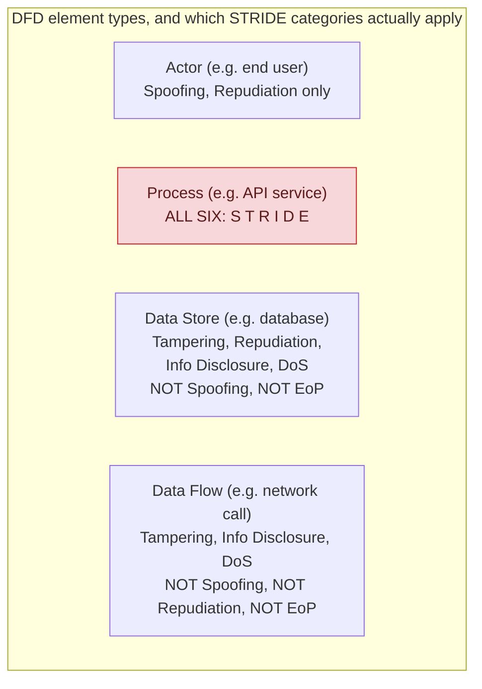

**TL;DR:** Why do threat modeling exercises so often turn into a shallow six-box checklist that gets filled in once and never questioned? Because STRIDE isn't "ask these six questions about the whole system" — it's six threat categories, each of which only applies to *specific kinds* of diagram elements (an actor can be spoofed, a data store cannot), and skipping that element-type filter is exactly what produces the generic, low-signal threat lists this exercise gets a bad reputation for.

**Real repo:** [`OWASP/threat-dragon`](https://github.com/OWASP/threat-dragon)

## 1. The Engineering Problem: security review that happens after the design is already built

The most common failure mode for application security isn't a subtle cryptographic flaw — it's a design decision made early (which service talks to which, where trust boundaries sit, what a component is allowed to assume about its caller) that nobody examined for how an adversary could abuse it, because "security review" happened as a late-stage code audit against an architecture that was already locked in. By the time a pen test or code review finds "this internal service trusts any caller that reaches it," the fix often means re-architecting something that shipped months ago.

Threat modeling exists to move that analysis earlier — to the design phase, against a diagram, before code exists to audit. But done naively, it degenerates into exactly the kind of theater that gives it a bad name: a team draws boxes and arrows, then goes through a fixed six-letter checklist (S-T-R-I-D-E) asking "could this happen?" against every box, producing a long list of generic, undifferentiated "threats" like "spoofing: an attacker could impersonate a user" attached to a database that was never capable of being spoofed as a network peer in the first place. The exercise looks thorough and produces nothing actionable.

---

## 2. The Technical Solution: STRIDE's categories are typed to the element, not the whole diagram

STRIDE — Spoofing, Tampering, Repudiation, Information disclosure, Denial of service, Elevation of privilege — is a mnemonic for six threat categories, but the part most surface-level explanations leave out is that Microsoft's original STRIDE-per-element model deliberately restricts *which* categories apply to *which kind* of element in a data flow diagram (DFD). A **data store** (a database, a file, a queue) can be tampered with, can leak information, can be denied service — but it cannot be "spoofed" as a network peer the way an actor or process can, because a passive data store doesn't initiate communication or present an identity to authenticate. A **data flow** (a network call, a message) can be tampered with in transit or eavesdropped on — but "denial of service against a flow" and "elevation of privilege via a flow" mean different, narrower things than they do for an active process. Only a **process** — something that actively runs code and can misuse elevated permissions — is exposed to all six categories, including elevation of privilege.



Three core truths to hold:

- **Applying the wrong STRIDE category to an element type produces a threat that can't actually happen**, which is worse than producing no threat at all — it wastes review time and trains the team to treat threat modeling as a box-checking exercise rather than genuine adversarial thinking.
- **STRIDE tells you *what kind* of threat to look for; it doesn't rank or prioritize.** That's what **DREAD** (Damage, Reproducibility, Exploitability, Affected users, Discoverability) is for — a scoring rubric applied *after* STRIDE identifies a candidate threat, to decide which of the identified threats are worth fixing first.
- **Attack trees go a level deeper than either**, decomposing a single high-level threat (the root) into the concrete combinations of steps an attacker would need to chain together to realize it — useful specifically when a threat's *feasibility* depends on multiple preconditions being true simultaneously, which a flat STRIDE list doesn't capture.

## 3. The clean example (concept in isolation)

```python
# Naive approach: apply all six STRIDE categories to every diagram element,
# regardless of what kind of element it is.
def naive_threats(element):
    return [c for c in ["Spoofing", "Tampering", "Repudiation",
                         "InfoDisclosure", "DoS", "ElevationOfPrivilege"]]
    # produces "Spoofing: attacker impersonates the database" for a data
    # store - a threat category that structurally can't apply to it

# STRIDE-per-element: filter categories by what the element actually is
STRIDE_BY_ELEMENT_TYPE = {
    "actor":   ["Spoofing", "Repudiation"],
    "process": ["Spoofing", "Tampering", "Repudiation",
                "InfoDisclosure", "DoS", "ElevationOfPrivilege"],
    "store":   ["Tampering", "Repudiation", "InfoDisclosure", "DoS"],
    "flow":    ["Tampering", "InfoDisclosure", "DoS"],
}

def stride_threats(element_type):
    return STRIDE_BY_ELEMENT_TYPE[element_type]
    # a data store never gets "Spoofing" or "ElevationOfPrivilege" -
    # those categories don't describe anything that can happen to it
```

## 4. Production reality (from `OWASP/threat-dragon`)

Threat Dragon is OWASP's own open-source threat modeling tool — a real application whose job *is* generating STRIDE threats per diagram element, so its source encodes the element-type mapping directly rather than leaving it as documentation:

```
threat-dragon/
└── td.vue/src/service/threats/
    ├── models/stride.js   # the element-type -> category mapping
    └── index.js           # threat creation, filtering, translation lookup
```

`models/stride.js` — this is the entire element-type filter, and it's short precisely because the mapping itself, not a large amount of code, is what carries the teaching value:

```js
/* STRIDE per element
          S | T | R | I | D | E
ACTOR   | X |   | X |   |   |
STORE   |   | X | X | X | X |
PROCESS | X | X | X | X | X | X
FLOW    |   | X |   | X | X |
*/

export default {
    actor: {
        spoofing: 'threats.model.stride.spoofing',
        repudiation: 'threats.model.stride.repudiation'
    },
    store: {
        tampering: 'threats.model.stride.tampering',
        repudiation: 'threats.model.stride.repudiation',
        informationDisclosure: 'threats.model.stride.informationDisclosure',
        denialOfService: 'threats.model.stride.denialOfService'
    },
    process: {
        spoofing: 'threats.model.stride.spoofing',
        tampering: 'threats.model.stride.tampering',
        repudiation: 'threats.model.stride.repudiation',
        informationDisclosure: 'threats.model.stride.informationDisclosure',
        denialOfService: 'threats.model.stride.denialOfService',
        elevationOfPrivilege: 'threats.model.stride.elevationOfPrivilege'
    },
    flow: {
        tampering: 'threats.model.stride.tampering',
        informationDisclosure: 'threats.model.stride.informationDisclosure',
        denialOfService: 'threats.model.stride.denialOfService'
    },
    all: {
        spoofing: 'threats.model.stride.spoofing',
        tampering: 'threats.model.stride.tampering',
        repudiation: 'threats.model.stride.repudiation',
        informationDisclosure: 'threats.model.stride.informationDisclosure',
        denialOfService: 'threats.model.stride.denialOfService',
        elevationOfPrivilege: 'threats.model.stride.elevationOfPrivilege'
    }
};
```

What this teaches that a hello-world can't:

- **`actor` gets exactly two categories: `spoofing` and `repudiation`.** An end user (or any external actor) can be impersonated (spoofing) and can plausibly deny having taken an action (repudiation) — but an actor isn't a system component that can be "tampered with," "denied service," or have "elevation of privilege" performed against it in the STRIDE sense; those categories describe things that happen to system components, not to the human/external party interacting with them.
- **`store` deliberately excludes `spoofing` and `elevationOfPrivilege`.** The ASCII table's own header comment (`STORE | | X | X | X | X`) makes explicit what many STRIDE explanations gloss over: a data store is passive — it doesn't authenticate as a peer (nothing to spoof) and doesn't execute code with privilege levels (nothing to escalate). Its exposure is entirely about what's *done to it*: tampered with, read without authorization, made unavailable, or have actions against it go unlogged.
- **Only `process` gets all six**, and the comment table visually confirms it's the only row with every column marked `X`. That's the direct, code-level answer to "why does elevation of privilege only come up for some parts of my architecture" — EoP is fundamentally about a component that runs with some privilege level being tricked into running with a higher one, which is only a coherent question for something that executes logic in the first place.
- **`all` exists as a fallback for generic/unspecified element types** — a pragmatic acknowledgment that not every diagram element in a real threat model cleanly maps to one of the four DFD types, but it's kept separate from the four typed categories rather than being the default everyone reaches for, which would silently undo the whole point of the filtering.

## 5. Review checklist

- **Is each identified threat tagged to the actual STRIDE categories valid for that element's type**, per the `actor`/`process`/`store`/`flow` split above — a "spoofing" threat attached to a data store is a signal the review skipped the element-type filter, not a real finding.
- **Has every trust boundary crossing in the diagram actually been walked**, not just every box in isolation — the highest-value STRIDE findings are usually at the *edges* (a data flow crossing from an untrusted to a trusted zone), which a per-box-only review can miss entirely.
- **For anything scored with DREAD, is the score being used to prioritize fixes, not to justify skipping ones that scored low** — a low-Discoverability threat is still a real threat; DREAD orders the backlog, it doesn't delete entries from it.
- **Does an attack tree exist for any threat whose exploitability depends on multiple preconditions** (e.g. "requires both a leaked API key AND a missing rate limit") — a flat STRIDE entry for that threat would understate how it actually gets exploited, which matters for deciding which single precondition is cheapest to close off.

## 6. FAQ

**Q: Why does `flow` (a data flow / network call) get `tampering` and `informationDisclosure` but not `repudiation`?**
A: Repudiation is about an *actor's* ability to deny having performed an action — it's meaningful for actors and processes that can be attributed an action, but a data flow itself isn't the thing that "does" or "denies" anything; it's the channel an action travels through. The process on either end of the flow is where repudiation risk actually lives, which is why `process` carries `repudiation` and `flow` doesn't.

**Q: Is STRIDE the only threat modeling framework Threat Dragon supports?**
A: No — the repo's `threats/index.js` also references `LINDDUN` (a privacy-focused threat framework) and `PLOT4ai` (an AI/ML-specific threat framework) alongside STRIDE, each with its own category set. That itself reinforces this lesson's point: different frameworks exist because different systems (a general web app vs. one handling significant personal data vs. one built around an ML model) have threat surfaces that a single generic checklist doesn't capture well.

**Q: How does DREAD scoring actually combine with a STRIDE-categorized threat list?**
A: STRIDE answers "what kind of threat is this" (spoofing vs. tampering vs. ...) and produces the initial list of candidate threats per element; DREAD is then applied to each already-identified threat to produce a composite score across its five factors, used to rank that list. They're sequential steps in the same workflow, not competing frameworks — STRIDE without a follow-up prioritization step tends to produce a list too long to action; DREAD scoring with no STRIDE step first has nothing structured to score.

**Q: Why does an attack tree matter if STRIDE already identified the threat?**
A: STRIDE identifies *that* a category of threat exists against an element (e.g. "spoofing against this process's authentication"); it doesn't decompose *how* an attacker would realize it in practice. An attack tree breaks that single STRIDE entry into the actual chain of steps (e.g. phish a credential AND bypass a missing MFA check AND reach an internal endpoint) — which is what tells a reviewer whether the threat requires one broken control or three, and therefore which single fix collapses the most attack paths.

**Q: Does the `actor`/`process`/`store`/`flow` split map onto real system components, or is it an abstract diagramming convention?**
A: It maps onto real components directly: an `actor` is typically an end user or external system you don't control the internals of; a `process` is any service/API/function that executes logic (an EC2 instance, a Lambda, a microservice); a `store` is a database, cache, queue, or file; a `flow` is the network call or message between any two of the above. The mapping is deliberately concrete enough that drawing a real architecture diagram and labeling each box by these four types is most of the work of setting up a STRIDE pass.

---

## Source

- **Concept:** Threat modeling — STRIDE-per-element categorization, DREAD scoring, attack trees
- **Domain:** security
- **Repo:** [OWASP/threat-dragon](https://github.com/OWASP/threat-dragon) → [`td.vue/src/service/threats/models/stride.js`](https://github.com/OWASP/threat-dragon/blob/main/td.vue/src/service/threats/models/stride.js), [`td.vue/src/service/threats/index.js`](https://github.com/OWASP/threat-dragon/blob/main/td.vue/src/service/threats/index.js) — OWASP's own open-source threat modeling tool, used to draw data flow diagrams and generate STRIDE-categorized threats against them.

---

**Next in the Security series:** [API Security Hardening: Why Broken Object Level Authorization Tops the OWASP API Top 10]({{ '/security/api-security-hardening-owasp-api-top-10-bola/' | relative_url }})


