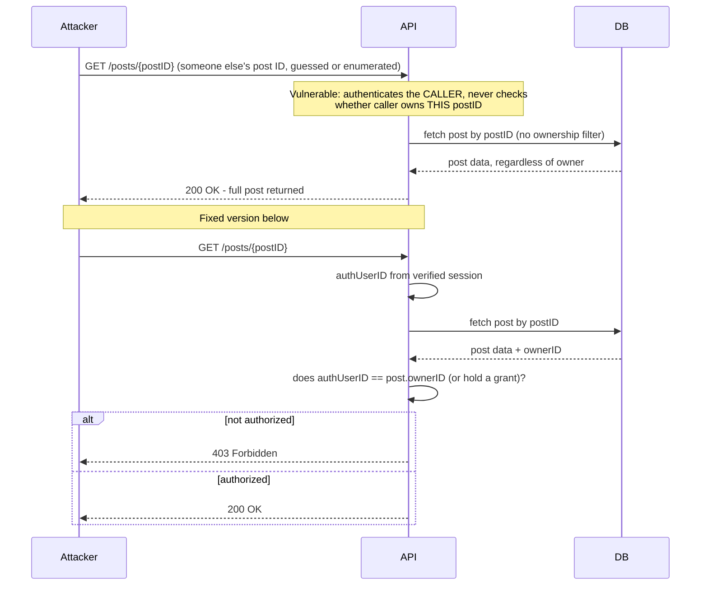

**TL;DR:** Why does the OWASP API Security Top 10 rank Broken Object Level Authorization (BOLA) above every injection or input-validation issue? Because an API's URL and request bodies are built entirely around client-supplied object IDs by design — every `GET /posts/{id}` is an implicit trust decision about whether the caller may see *that specific* object, and unlike a web app's server-rendered pages, an API has no UI layer quietly hiding IDs the caller was never shown in the first place.

**Real repo:** [`OWASP/crAPI`](https://github.com/OWASP/crAPI)

## 1. The Engineering Problem: an API's entire interface is client-supplied identifiers

A traditional server-rendered web app has a built-in, if weak, layer of obscurity: a user generally only sees links and IDs the server chose to render for them. An API has no such layer — the whole point of a REST or RPC interface is that the caller supplies structured parameters, including object IDs, directly: `GET /api/community/posts/{postID}`, `PUT /api/vehicle/{vehicleID}/location`. That's not a design flaw; it's what makes an API an API. But it means every single endpoint that accepts an ID has to answer, explicitly, "does the caller's authenticated identity actually have permission to touch *this* object" — because nothing about the request shape stops a caller from substituting any ID they can guess or enumerate.

This is why OWASP's API Security Top 10 — a separate, API-specific list from the general OWASP Top 10 — puts **Broken Object Level Authorization (API1:2023)** at the very top, ahead of broken authentication and even injection. An API can have perfect authentication (the caller definitely is who they claim to be) and still be completely broken if every authenticated caller can read or modify any other caller's objects just by changing an ID in the URL. The second, related failure this lesson covers is **unrestricted input** — accepting a request body as an unvalidated blob instead of a typed, whitelisted schema, which opens the door to fields the API never intended to accept at all.

---

## 2. The Technical Solution: authorize the object, not just the caller — and validate the shape of what's coming in

The fix for BOLA isn't exotic: every handler that loads an object by a client-supplied ID must independently check that the authenticated caller owns it (or holds an explicit grant), before returning or mutating it — the same "identity comparison is not an authorization decision" principle covered in this curriculum's Broken Access Control lesson, applied specifically to API object IDs. The fix for unrestricted input is equally direct: parse the request body into a typed, explicitly whitelisted structure, never an open map that silently accepts whatever fields the client decided to send.



Three core truths to hold:

- **Authentication tells you who's calling; object-level authorization tells you what THIS call may touch — and an API needs the second check on every single ID-accepting endpoint, not just the sensitive-looking ones.** BOLA bugs are routinely found on "minor" endpoints (comments, profile pictures, coupon codes) precisely because teams reserve authorization scrutiny for the endpoints that "feel" high-value.
- **Rate limiting and resource-consumption limits belong at the API gateway layer, but they don't substitute for object-level authorization** — API4:2023 (Unrestricted Resource Consumption) and API1:2023 (BOLA) are separate categories addressing separate failure modes; a perfectly rate-limited endpoint can still leak every user's data one request at a time.
- **Unvalidated input isn't just an injection risk — it's an authorization bypass vector too.** Accepting an open, un-whitelisted body lets a client set fields the API never meant to expose (a role, a price, an owner ID), which is functionally a second way to break object-level authorization even when the ID-based check is correct.

## 3. The clean example (concept in isolation)

```go
// VULNERABLE - fetches by client-supplied ID, no ownership check
func GetPostByID(w http.ResponseWriter, r *http.Request) {
    postID := mux.Vars(r)["postID"]
    post, _ := db.FindPostByID(postID)   // any authenticated caller, any post ID
    respondJSON(w, http.StatusOK, post)
}

// FIXED - explicit ownership/grant check before returning the object
func GetPostByID(w http.ResponseWriter, r *http.Request) {
    postID := mux.Vars(r)["postID"]
    authUserID := session.UserID(r)

    post, err := db.FindPostByID(postID)
    if err != nil {
        respondError(w, http.StatusNotFound)
        return
    }
    if !authz.CanView(authUserID, post) {   // real, positive check
        respondError(w, http.StatusForbidden)
        return
    }
    respondJSON(w, http.StatusOK, post)
}
```

## 4. Production reality (from `OWASP/crAPI`)

crAPI ("completely ridiculous API") is OWASP's own official, deliberately vulnerable API — the API-specific counterpart to WebGoat, built specifically to demonstrate the OWASP API Security Top 10 in real, running service code rather than as documentation:

```
crAPI/services/community/api/
├── controllers/
│   ├── coupon_controller.go   # ValidateCoupon - unvalidated bson.M input
│   └── post_controller.go     # GetPostByID - missing object-level auth check
```

`post_controller.go` — this is the BOLA bug, and the missing check is the absence of a line, not the presence of a bad one:

```go
// services/community/api/controllers/post_controller.go

// GetPostByID fetch the post by ID,
// @return HTTP Status
// @params ResponseWriter, Request
// Server have database connection
func (s *Server) GetPostByID(w http.ResponseWriter, r *http.Request) {

	vars := mux.Vars(r)
	//var autherID uint64
	GetPost, er := models.GetPostByID(s.Client, vars["postID"])
	if er != nil {
		responses.ERROR(w, http.StatusBadRequest, er)
	}

	responses.JSON(w, http.StatusOK, GetPost)
}
```

What this teaches that a hello-world can't:

- **The commented-out `//var autherID uint64` is the tell.** Someone at some point started to wire in an authenticated-user-ID variable for an ownership check and never finished — this is what a real BOLA gap looks like in a live codebase: not a deliberate decision to skip authorization, but an incomplete one, indistinguishable from "shipped" to anyone who doesn't specifically audit for the missing check.
- **`vars["postID"]` goes straight from the URL path into `models.GetPostByID` with nothing in between.** There's no line anywhere in this function that reads the caller's identity, let alone compares it against the fetched post's owner — the function's entire signature (`ResponseWriter, Request`) has access to the authenticated session (the middleware that calls this handler already authenticated the request), but the handler itself never uses it.
- **This is a real, current CVE-class bug pattern, not a contrived example** — BOLA/IDOR against exactly this shape of endpoint (fetch-by-path-ID with no ownership filter) is consistently the single most common finding class in API penetration tests across the industry, which is precisely why API1:2023 sits at the top of the list rather than being one entry among ten.

`coupon_controller.go` — a second, related failure: unrestricted input, not an authorization gap this time, but an equally real API3:2023-adjacent problem:

```go
// services/community/api/controllers/coupon_controller.go

// ValidateCoupon Coupon check coupon in database, if coupon code is valid it returns
// @return
// @params ResponseWriter, Request
// Server have database connection
func (s *Server) ValidateCoupon(w http.ResponseWriter, r *http.Request) {

	var bsonMap bson.M

	body, err := io.ReadAll(r.Body)
	defer func() {
		if err := r.Body.Close(); err != nil {
			log.Println("Error closing request body:", err)
		}
	}()
	if err != nil {
		responses.ERROR(w, http.StatusBadRequest, err)
		log.Println("No payload for ValidateCoupon", string(body), err)
		return
	}
	err = json.Unmarshal(body, &bsonMap)
	if err != nil {
		responses.ERROR(w, http.StatusUnprocessableEntity, err)
		log.Println("Failed to read json body", err)
		return
	}
	couponData, err := models.ValidateCode(s.Client, s.DB, bsonMap)
	// ...
	responses.JSON(w, http.StatusOK, couponData)
}
```

What this second file teaches:

- **`var bsonMap bson.M` is an open, schema-less map, not a typed request struct.** `json.Unmarshal(body, &bsonMap)` accepts literally any JSON object shape the client sends — every field the client includes becomes a key in `bsonMap`, which then flows straight into `models.ValidateCode`'s database query. There is no whitelist of which fields `ValidateCoupon` is actually supposed to accept.
- **This is the input-validation half of API hardening**: a typed struct (`type CouponRequest struct { Code string }`) would reject any field the client sends beyond what's declared, by construction. An open map does the opposite — it silently accepts and forwards whatever shape of object arrives, which is exactly how excessive/unintended fields end up influencing a downstream query or, in worse cases, get persisted back into a data store the client was never meant to write arbitrary keys into.
- **Contrast with `post_controller.go`'s `AddNewPost`, which unmarshals into a typed `models.Post{}`** (visible in the same file) rather than an open map — the repo itself contains both the safer and the riskier pattern side by side, which is exactly the kind of contrast a hello-world single-endpoint example can't show: input validation isn't consistently present or absent across a real API, it has to be enforced endpoint by endpoint.

## 5. Review checklist

- **Does every handler that loads an object by a client-supplied ID (path parameter, query parameter, or body field) independently verify the authenticated caller owns it or holds an explicit grant** — not just that the caller is authenticated at all, matching the missing check in `GetPostByID` above?
- **Are request bodies unmarshaled into typed, explicitly-fielded structs, not open maps (`bson.M`, `map[string]interface{}`, or equivalent)** — an open map accepts and forwards any field the client sends, as seen in `ValidateCoupon`.
- **Is object-level authorization tested with a *second* authenticated account, not just "does an unauthenticated request get rejected"** — BOLA specifically requires two valid, differently-scoped identities to catch, since the bug is "any authenticated user can access any other user's object," not "unauthenticated users are blocked."
- **Is rate limiting/resource consumption (API4:2023) treated as a separate control from object-level authorization (API1:2023), not a substitute for it** — a gateway-level rate limit does nothing to stop a single request from returning another user's data if the ownership check is simply missing.

## 6. FAQ

**Q: Isn't `GetPostByID` just a read — does BOLA matter as much for read endpoints as for writes?**
A: Yes, and often more in practice — a read-only BOLA bug is typically easier to exploit at scale (an attacker can enumerate sequential or guessable IDs and silently harvest every object in the system) than a write-based bug, which usually leaves an audit trail or a visible side effect. `GetPostByID` returning any post for any authenticated caller is a full data-exposure vulnerability on its own, with no write required.

**Q: Why does the OWASP API Security Top 10 exist separately from the general OWASP Top 10?**
A: The general Top 10 is written around traditional web application failure modes (much of which still applies to APIs); the API-specific list exists because APIs have a structurally different attack surface — no UI layer between the client and the object IDs, typically far more distinct endpoints per application than a web app has pages, and machine-to-machine callers that don't get discouraged by a confusing error page the way a human attacker might.

**Q: Would a typed struct alone (fixing `ValidateCoupon`'s input) also fix the BOLA bug in `GetPostByID`?**
A: No — they're independent fixes for independent problems. A typed struct constrains *what fields a request body may contain*; it says nothing about *whether the caller is allowed to touch the specific object identified by the request*. `GetPostByID` doesn't even have a request body to worry about — its vulnerability is entirely in the missing ownership check on the path parameter.

**Q: How would an API gateway-level control (mentioned in this domain's curriculum) help with either of these two bugs?**
A: A gateway can enforce authentication (reject unauthenticated calls), rate limiting (API4:2023), and coarse-grained route-level authorization (this caller's role may hit this route at all) — but it generally can't know, at the gateway layer, whether the specific `postID` in *this* request belongs to *this* caller. That check requires the object's owner, which only the application layer (with a database lookup) has visibility into — which is exactly why BOLA has to be fixed in application code, not pushed down to the gateway.

**Q: Is `bson.M` itself the problem, or is it fine when used correctly?**
A: `bson.M` (an untyped BSON map, from the MongoDB Go driver) is a legitimate type for genuinely dynamic, schema-less data. The problem in `ValidateCoupon` isn't that `bson.M` exists as a type — it's that an *external, untrusted HTTP request body* is unmarshaled directly into it with no whitelist step afterward, so the dynamic-schema tool ends up applied to a boundary that specifically needed a fixed schema.

---

## Source

- **Concept:** API security hardening — OWASP API Top 10 (Broken Object Level Authorization, unrestricted input), rate limiting at the gateway
- **Domain:** security
- **Repo:** [OWASP/crAPI](https://github.com/OWASP/crAPI) → [`services/community/api/controllers/post_controller.go`](https://github.com/OWASP/crAPI/blob/main/services/community/api/controllers/post_controller.go), [`services/community/api/controllers/coupon_controller.go`](https://github.com/OWASP/crAPI/blob/main/services/community/api/controllers/coupon_controller.go) — OWASP's own official, deliberately vulnerable API, built specifically to demonstrate the OWASP API Security Top 10 in real running service code.


