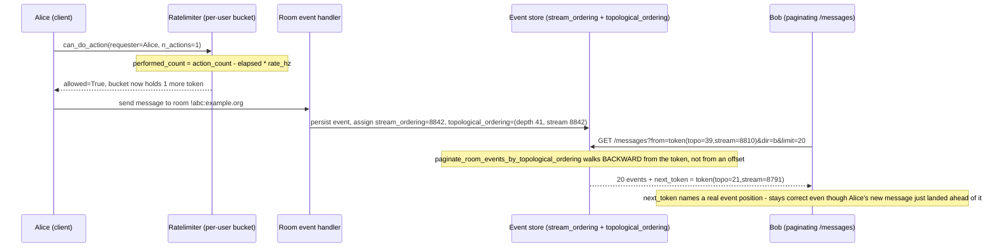

**TL;DR:** What actually changes between a "design a chat system" and "design a URL shortener" interview question, if both ultimately need caching, sharding, and rate limiting? Mostly the read/write ratio and the ordering guarantee each system's core operation needs — a URL shortener is almost pure point-lookup-by-key (a job for consistent hashing and aggressive caching), a notification system is fan-out-on-write to many recipients (a job for message queues and idempotent delivery), and a chat system is an append-only, strictly-ordered-per-room log that many readers page through concurrently (a job for cursor pagination plus per-key rate limiting). The primitives are the same across all three; the case study is in which primitive carries the weight. Matrix's production Synapse homeserver shows the chat shape concretely: a leaky-bucket `Ratelimiter` gates writes per-user, and a topological-ordering pagination cursor keeps `/messages` correct even while history is still being backfilled from other servers.

**Real repo:** [`element-hq/synapse`](https://github.com/element-hq/synapse)

## 1. The Engineering Problem: "design a chat system" is really four problems wearing one trenchcoat

Interview-style system design prompts (URL shortener, chat system, notification system) read like they need bespoke architectures, but each one decomposes into problems this domain has already covered individually:

- **A URL shortener** is dominated by one operation: given a short key, return the long URL, as fast as possible, for a read-heavy, point-lookup workload. This is squarely a caching and consistent-hashing problem (Topics 3 and 10) — the "system design" is mostly in choosing a key space and a cache-aside strategy, not in anything chat- or notification-specific.
- **A notification system** is dominated by fan-out: one event (an order shipped, a comment posted) needs to reach potentially many recipients, reliably, without the sender blocking on delivery. This is a message-queue and idempotent-delivery problem (Topics 8 and this domain's RPC failure semantics) — the "system design" is in how the queue partitions work and how retries avoid double-notifying someone.
- **A chat system** is dominated by two things at once: an append-only, strictly-ordered log *per conversation* that many participants page backward through, and a write path that a single abusive client could hammer far harder than any read-heavy system would ever see. This needs *both* correctness-under-concurrent-writes pagination *and* per-key rate limiting, composed together — and that combination, not either piece alone, is what makes chat systems a distinct case study rather than "caching with extra steps."

The naive version of a chat system's history endpoint — `SELECT * FROM messages WHERE room_id = ? ORDER BY id LIMIT 50 OFFSET ?` — breaks in production for the same reason offset pagination breaks anywhere (Topic 14): messages keep arriving in the room while a client is scrolling back through history, so an offset silently drifts. And the naive version of "let anyone post" breaks the moment one compromised or buggy client sends messages as fast as the network allows, because there's no per-key cost to sending — this is the same shape of problem Topic 9 (rate limiting) solved for API traffic generally, just applied to individual users' message-sending instead of a whole service's inbound traffic.

---

## 2. The Technical Solution: an opaque per-room cursor for reads, a leaky bucket per-user for writes

Matrix's real homeserver, Synapse, solves the read side and the write side with two independent mechanisms that only meet at the room they're both protecting.

**Reads: pagination by a token that names a real position in the room's event graph, not an offset.** Synapse tracks two orderings for every event: a **stream ordering** (a global, ever-increasing insertion sequence, good for "what's new since I last synced") and a **topological ordering** (depth in the room's actual event DAG, good for "give me a consistent slice of history even while other servers are still backfilling older events into this room via federation"). A pagination token names a position in one of these, not a row count — so paging backward through history stays correct even as new messages keep arriving at the front of the room.

**Writes: a leaky-bucket rate limiter keyed per user (or per IP for unauthenticated requests), not a global cap.** Each key gets its own bucket that fills with "cost" as the user sends messages and drains continuously at `rate_hz`; a burst up to `burst_count` is allowed, but sustained sending above `rate_hz` gets denied. Because the bucket is keyed per user, one abusive account hitting its own limit doesn't affect any other user's ability to send.



Three core truths to hold onto:

1. **Rate limiting and pagination protect different axes of the same room, and neither substitutes for the other.** The rate limiter bounds *how fast* one key can write; the pagination cursor bounds *how a reader stays correct* while many writes are landing concurrently. A chat system needs both because a room's write rate and a room's read (history-scroll) pattern are independent problems.
2. **The pagination cursor is a position in the data's own ordering, never a client-supplied count.** `paginate_room_events_by_topological_ordering` takes a `from_key`/`to_key` naming a real `(topological, stream)` pair, the same shape of guarantee Topic 14 covered generically (Stripe's `StartingAfter` naming a real object ID) — chat systems need it specifically because history is actively being written and backfilled at the same time it's being read.
3. **The rate limiter's bucket state is per-key and leaks continuously, not reset on a fixed schedule.** `performed_count = action_count - time_delta * rate_hz` computes the leak lazily, at request time, from elapsed wall-clock time — there's no separate background process ticking down every bucket, which is what lets the limiter scale to per-user granularity without a cleanup job running per key.

---

## 3. The clean example (concept in isolation)

```python
# chat_room_core.py - the two mechanisms in isolation, framework-agnostic

class LeakyBucketLimiter:
    """Per-key leaky bucket: `rate_hz` tokens drain per second, `burst_count` caps
    how many can be spent instantaneously. Keyed by user ID - one abusive key's
    bucket never affects another key's."""
    def __init__(self, rate_hz, burst_count):
        self.rate_hz = rate_hz
        self.burst_count = burst_count
        self.buckets = {}  # key -> (action_count, bucket_start_time)

    def can_send(self, key, now, n_actions=1):
        count, start = self.buckets.get(key, (0, now))
        performed = max(0, count - (now - start) * self.rate_hz)
        if performed > self.burst_count - n_actions:
            return False  # over budget - deny without mutating state
        self.buckets[key] = (performed + n_actions, now)
        return True


class RoomTimeline:
    """Append-only per-room log. Pagination walks by a (topological, stream)
    position taken from the previous page's last event - never a row offset,
    so it stays correct while new events keep arriving."""
    def __init__(self):
        self.events = []  # each: {topological, stream, body}

    def append(self, body, topological, stream):
        self.events.append({"topological": topological, "stream": stream, "body": body})

    def paginate_backward(self, from_topo, from_stream, limit):
        page = [e for e in self.events
                if (e["topological"], e["stream"]) < (from_topo, from_stream)]
        page.sort(key=lambda e: (e["topological"], e["stream"]), reverse=True)
        page = page[:limit]
        next_token = (page[-1]["topological"], page[-1]["stream"]) if page else None
        return page, next_token
```

---

## 4. Production reality (from `element-hq/synapse`)

```
element-hq/synapse/
├── synapse/api/
│   └── ratelimiting.py    # Ratelimiter - leaky-bucket, per-key write gating
└── synapse/handlers/
    └── pagination.py       # PaginationHandler.get_messages - cursor-based history reads
```

**The write gate — `Ratelimiter.can_do_action`, the leaky-bucket math itself:**

```python
# synapse/api/ratelimiting.py (Ratelimiter.can_do_action, elided)

# Check if there is an existing count entry for this key
action_count, time_start, _ = self._get_action_counts(key, time_now_s)

# Check whether performing another action is allowed
time_delta = time_now_s - time_start
performed_count = action_count - time_delta * rate_hz
if performed_count < 0:
    performed_count = 0

    # Reset the start time and forgive all actions
    action_count = 0
    time_start = time_now_s

# This check would be easier read as performed_count + n_actions > burst_count,
# but performed_count might be a very precise float (with lots of numbers
# following the point) in which case Python might round it up when adding it to
# n_actions. Writing it this way ensures it doesn't happen.
if performed_count > burst_count - n_actions:
    # Deny, we have exceeded our burst count
    allowed = False
else:
    # We haven't reached our limit yet
    allowed = True
    action_count = action_count + n_actions
```

**The read path — `PaginationHandler.get_messages`, the cursor and its backfill-on-gap check:**

```python
# synapse/handlers/pagination.py (get_messages, elided)

if pagin_config.from_token:
    from_token = pagin_config.from_token
elif pagin_config.direction == Direction.FORWARDS:
    from_token = await self.hs.get_event_sources().get_start_token_for_pagination(room_id)
else:
    from_token = await self.hs.get_event_sources().get_current_token_for_pagination(room_id)
    # We expect `/messages` to use historic pagination tokens by default but
    # `/messages` should still works with live tokens when manually provided.
    assert from_token.room_key.topological is not None

room_token = from_token.room_key

# ... membership/leave-token clamping elided ...

(events, next_key, limited) = await self.store.paginate_room_events_by_topological_ordering(
    room_id=room_id,
    from_key=from_token.room_key,
    to_key=to_room_key,
    direction=pagin_config.direction,
    limit=pagin_config.limit,
    event_filter=event_filter,
)

# ... gap detection over event depths elided ...

not_enough_events_to_fill_response = len(events) < pagin_config.limit
if found_big_gap or missing_too_many_events or not_enough_events_to_fill_response:
    did_backfill = await self.hs.get_federation_handler().maybe_backfill(
        room_id, curr_topo, limit=pagin_config.limit,
    )
    if did_backfill:
        (events, next_key, limited) = await self.store.paginate_room_events_by_topological_ordering(
            room_id=room_id, from_key=from_token.room_key, to_key=to_room_key,
            direction=pagin_config.direction, limit=pagin_config.limit, event_filter=event_filter,
        )

next_token = from_token.copy_and_replace(StreamKeyType.ROOM, next_key)
```

What this teaches that a hello-world can't:

- **The rate limiter's deny path never mutates `action_count`.** Looking at the `if performed_count > burst_count - n_actions` branch, a denied request leaves the bucket exactly where it was — only an *allowed* action advances the count. This means retrying a denied send costs nothing extra against the budget beyond the original attempt, which matters for how a client should back off: there's no penalty for checking again once the bucket has leaked enough.
- **Pagination gaps trigger federation backfill inline, in the foreground, only when the gap is structurally significant (`found_big_gap`, more than 2 missing depths in a row) or the page came back short.** A single missing event isn't treated as a crisis — Synapse tolerates small holes (a past failed pull) without blocking the reader, but a real gap or an under-filled page triggers `maybe_backfill` before responding, so the client doesn't see a page that's silently missing a chunk of real history.
- **`next_token` is built by `copy_and_replace` on the *original* `from_token`, not constructed fresh.** The returned cursor inherits every other stream key's position from the request that produced it and only swaps out the room-specific key — so a client's pagination state for one room can't accidentally leak stale positions into how it paginates a completely different stream.

Known-stale fact: "rate limiting" in a system-design answer is often described as one global bucket per service — Synapse's `Ratelimiter` is explicitly keyed (per user ID, falling back to per-IP for unauthenticated requests), because a single global bucket would let one abusive account starve every other user's ability to send, which is precisely the failure mode a chat system's write path can't tolerate.

---

## 5. Review checklist

- **Is a pagination cursor built from a real position in the data's own ordering (an object ID, a `(topological, stream)` pair) — never a client-supplied offset or page number?** An offset silently drifts the moment concurrent writes land, which for a chat room is the normal case, not an edge case.
- **Is rate limiting keyed per actor (user ID, API key, IP) rather than enforced as one global counter?** A shared global bucket means one bad actor's traffic directly reduces every other legitimate user's available budget — check that the limiter's key derivation (`_get_key` in Synapse) actually reflects the entity you intend to isolate.
- **Does a denied write leave rate-limit state unchanged, so a legitimate retry after backoff isn't further penalized for the earlier denial?** Confirm the deny branch of the limiter doesn't also increment the bucket — a limiter that charges denied attempts effectively lowers its own configured budget under load.
- **When a read reveals a gap in append-only history, does the system distinguish "small, tolerable hole" from "systematically missing data" before deciding whether to block the reader on a repair?** A pagination handler that either always blocks on any gap (unacceptable latency) or never checks for gaps (silently wrong results) has missed this distinction — Synapse's `found_big_gap`/`missing_too_many_events` thresholds are the concrete example of getting it right.

## 6. FAQ

### Why does a chat system need both a rate limiter and a pagination cursor when a URL shortener needs neither in a load-bearing way?
A URL shortener's dominant operation is a stateless point lookup — there's no ordered history to page through and no per-actor write-abuse surface comparable to message-sending. A chat room's core operation is an ordered, continuously-appended log with concurrent readers scrolling backward through it while writers keep adding to the front — that combination is what makes both mechanisms load-bearing simultaneously, not optional add-ons.

### What's the actual difference between Synapse's stream ordering and topological ordering?
Stream ordering is a single global, ever-increasing sequence number assigned at insert time — good for "what's new since I last checked" (a `/sync` since-token). Topological ordering reflects an event's depth in the room's DAG of `prev_events` — good for a *causally consistent* slice of history, which matters specifically because federation means events from other servers can be backfilled in after the fact, out of stream order but still needing to slot into the correct causal position.

### How does the leaky-bucket limiter avoid needing a background job to decrement every user's bucket over time?
It computes the leak lazily, at request time: `performed_count = action_count - time_delta * rate_hz` derives how much has drained purely from elapsed wall-clock time since the bucket's `time_start`, recalculated on each `can_do_action` call. There's no ticking timer per bucket — the math itself makes idle buckets implicitly "catch up" the moment they're checked again.

### Does `maybe_backfill` running in the foreground on a pagination gap risk making `/messages` slow?
Synapse only forces the foreground wait when the gap is judged significant (`found_big_gap`, too many `number_of_gaps`, or the page came back short of the requested `limit`) — otherwise it calls `run_as_background_process("maybe_backfill_in_the_background", ...)` and returns the page immediately, accepting eventual consistency for minor gaps rather than paying the federation round-trip cost on every read.

### How would the URL-shortener and notification-system variants of this case study map onto topics already covered in this domain?
A URL shortener's hot path is Topic 3 (cache-aside on the short key) plus Topic 10 (consistent hashing to shard the key space across cache/storage nodes) — no ordering or per-actor rate limiting is load-bearing. A notification system's hot path is Topic 8 (a message queue partitioned by recipient or notification type for fan-out) plus this domain's RPC failure semantics topic (idempotent delivery so a retried notification job doesn't double-send) — the chat system covered here is the one of the three where pagination-under-concurrent-writes and per-actor rate limiting are both first-order concerns at once.

---

## Source

- **Concept:** Real-world system design case studies — putting rate limiting, pagination, and ordered append-only logs together for a chat system
- **Domain:** system-design
- **Repo:** [element-hq/synapse](https://github.com/element-hq/synapse) → [`synapse/api/ratelimiting.py`](https://github.com/element-hq/synapse/blob/develop/synapse/api/ratelimiting.py), [`synapse/handlers/pagination.py`](https://github.com/element-hq/synapse/blob/develop/synapse/handlers/pagination.py) — the production Matrix homeserver's real per-user rate limiter and cursor-based room history pagination. (Note: the project moved from the archived `matrix-org/synapse` to `element-hq/synapse` after Element's fork of the Matrix.org Foundation's homeserver maintenance.)
