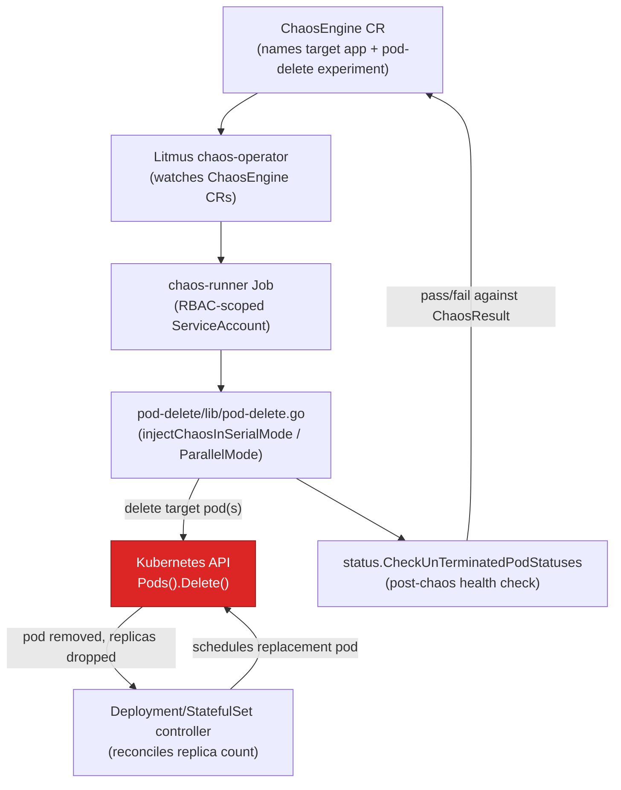
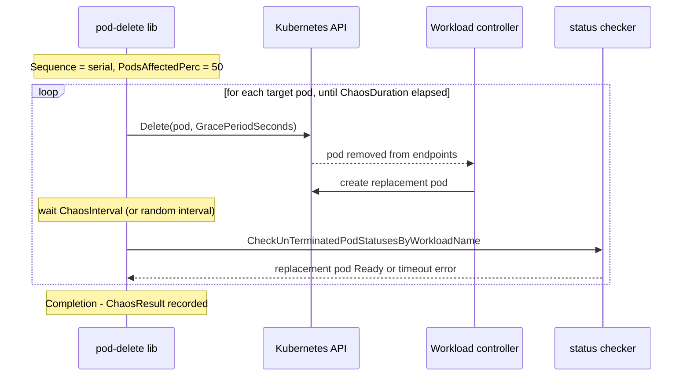

**TL;DR:** How do you know your deployment's three replicas and rolling-update strategy actually survive a pod dying at 3am, instead of just looking like they should on paper? You don't — until you deliberately kill a pod yourself, in production-like conditions, and verify the system recovers within your own SLA. Litmus's `pod-delete` experiment is that verification, run as a scoped Kubernetes Job instead of a hope.

> **In plain English (30 sec):** Think of a Pod like a small VM holding containers sharing same IP — like containers on localhost.

## 1. The Engineering Problem

Every resilience claim in a Kubernetes manifest is an assumption until it's tested. `replicas: 3` assumes the other two pods absorb load when one dies. A `PodDisruptionBudget` assumes voluntary evictions won't drop you below quorum. Liveness probes assume a hung process gets restarted before it silently serves errors. None of these are wrong on paper — but "on paper" is exactly the problem: nobody actually kills a pod and watches the clock until a real node reboots, a real OOM-killer fires, or a real `kubectl drain` runs during a datacenter maintenance window.

The naive alternative — waiting for a real failure to validate the assumption — is how teams discover that their `PodDisruptionBudget` was too permissive, or that a stateful pod's replacement takes 90 seconds to become ready while the readiness probe interval is 30 seconds, during an actual incident instead of a Tuesday afternoon. Staging environments don't help much either: they rarely run under real traffic, so a pod recovering "fine" in staging says nothing about whether the same recovery holds while the ingress is still routing live requests to a pod that no longer exists.

Chaos engineering — a practice popularized by Netflix's Chaos Monkey — answers this by injecting the failure deliberately, on a schedule you control, with a rollback plan ready, so you find the gap in your resilience assumptions before an uncontrolled failure finds it for you. On Kubernetes specifically, that means a tool that can delete pods, throttle network, or fill disk *as a first-class, auditable Kubernetes object* — not a shell script someone runs by hand and forgets to clean up after.

## 2. The Technical Solution

Litmus (a CNCF chaos engineering project) models chaos as Kubernetes custom resources. A `ChaosEngine` CR names the target application and references a `ChaosExperiment` (e.g. `pod-delete`); when applied, Litmus's chaos-operator spins up a chaos-runner Job that executes the experiment's actual Go logic inside the cluster, using an RBAC-scoped `ServiceAccount` limited to the namespace and resource types the experiment needs — nothing more.

The `pod-delete` experiment itself does one specific thing: select a percentage of pods matching a label selector, delete them (gracefully or forcefully), and verify the workload's controller (Deployment, StatefulSet, DaemonSet) replaces them and the replacements become healthy again within a configured timeout. The tunables that actually matter operationally:

- **`PodsAffectedPerc`** — what fraction of matching pods get killed, not "all of them" by default; this is the blast-radius control.
- **`Sequence`** (`serial` | `parallel`) — kill pods one at a time and wait for recovery between each, or kill the whole target set at once. Serial tests graceful degradation under partial capacity loss; parallel tests whether the system survives a correlated failure (e.g. a whole node going down).
- **`Force`** — `true` sends `DeleteOptions{GracePeriodSeconds: &0}` (immediate SIGKILL, no graceful shutdown hooks run); `false` respects the pod's normal termination grace period. This is the difference between testing "does my app handle an ungraceful kill" versus "does my rolling restart work."



The chronological picture matters as much as the structural one — serial mode deliberately serializes kill-then-verify-then-wait, one target at a time, while parallel mode fires all deletions together and verifies afterward:



Core truths to hold:

- Chaos is scoped by label selector and `PodsAffectedPerc`, not "delete everything in the namespace" — the blast radius is a config value, not an accident.
- `Force: true` with `GracePeriodSeconds: 0` specifically tests unclean termination (SIGKILL), which is a materially different test from a graceful rolling restart — most teams only ever exercise the graceful path.
- Recovery isn't assumed; it's polled — `CheckUnTerminatedPodStatusesByWorkloadName` is what turns "the pod got deleted" into "and the workload actually came back," which is the entire point of running the experiment instead of just doing `kubectl delete pod` manually.

## 3. The clean example (concept in isolation)

A minimal `ChaosEngine` manifest and the isolated Go loop it triggers — stripped to the mechanism, no probes, no events, no RBAC scaffolding:

```yaml
# chaosengine-checkout.yaml — targets the "checkout" Deployment's pods
apiVersion: litmuschaos.io/v1alpha1
kind: ChaosEngine
metadata:
  name: checkout-pod-delete
  namespace: prod
spec:
  # Deployment whose pods this experiment is allowed to touch
  appinfo:
    appns: prod
    applabel: app=checkout
    appkind: deployment
  chaosServiceAccount: litmus-pod-delete-sa   # RBAC scoped to this namespace only
  experiments:
    - name: pod-delete
      spec:
        components:
          env:
            - name: TOTAL_CHAOS_DURATION
              value: "60"      # run for 60s total
            - name: CHAOS_INTERVAL
              value: "10"      # wait 10s between kills
            - name: PODS_AFFECTED_PERC
              value: "50"      # kill at most half the matching pods
            - name: FORCE
              value: "false"   # graceful delete — test the rolling-restart path first
            - name: SEQUENCE
              value: "serial"  # one at a time, verify recovery between each
```

```go
// isolated version of the serial injection loop
for duration < chaosDurationSeconds {
    targets := selectPods(appLabel, podsAffectedPerc) // blast-radius control
    for _, pod := range targets {
        deletePod(pod, force)          // graceful or SIGKILL
        waitInterval(chaosInterval)    // pacing between kills
        verifyReplacementReady(pod)    // did the controller heal it in time?
    }
}
```

## 4. Production reality (from litmus-go)

```
litmus-go/
  chaoslib/litmus/pod-delete/lib/
    pod-delete.go            — the actual injection logic (this section)
  pkg/generic/pod-delete/types/
    types.go                 — ExperimentDetails struct (PodsAffectedPerc, Sequence, Force, ...)
  pkg/probe/
                              — RunProbes: pre/during/post-chaos health checks
  pkg/status/
                              — CheckUnTerminatedPodStatusesByWorkloadName
```

From `chaoslib/litmus/pod-delete/lib/pod-delete.go` — the serial-mode injection function, the real production version of the isolated loop above:

```go
func injectChaosInSerialMode(ctx context.Context, experimentsDetails *experimentTypes.ExperimentDetails,
    clients clients.ClientSets, chaosDetails *types.ChaosDetails, eventsDetails *types.EventDetails,
    resultDetails *types.ResultDetails) error {

    // run probes during chaos — health checks that must keep passing while pods are being killed
    if len(resultDetails.ProbeDetails) != 0 {
        if err := probe.RunProbes(ctx, chaosDetails, clients, resultDetails, "DuringChaos", eventsDetails); err != nil {
            return err
        }
    }

    GracePeriod := int64(0)
    ChaosStartTimeStamp := time.Now()
    duration := int(time.Since(ChaosStartTimeStamp).Seconds())

    for duration < experimentsDetails.ChaosDuration {
        // PodsAffectedPerc controls the blast radius — never "all matching pods" by default
        targetPodList, err := common.GetTargetPods(experimentsDetails.NodeLabel,
            experimentsDetails.TargetPods, experimentsDetails.PodsAffectedPerc, clients, chaosDetails)
        if err != nil {
            return stacktrace.Propagate(err, "could not get target pods")
        }

        for _, pod := range targetPodList.Items {
            log.InfoWithValues("[Info]: Killing the following pods", logrus.Fields{"PodName": pod.Name})

            // Force=true skips graceful shutdown entirely — GracePeriodSeconds: 0 means SIGKILL
            if experimentsDetails.Force {
                err = clients.KubeClient.CoreV1().Pods(pod.Namespace).Delete(context.Background(),
                    pod.Name, v1.DeleteOptions{GracePeriodSeconds: &GracePeriod})
            } else {
                err = clients.KubeClient.CoreV1().Pods(pod.Namespace).Delete(context.Background(),
                    pod.Name, v1.DeleteOptions{})
            }
            // ... (error handling elided)

            // waits ChaosInterval seconds (or a random interval) before the next kill
            // — this is what makes "serial" test recovery under sustained partial loss,
            // not just an instantaneous blip
            waitTime, _ := strconv.Atoi(experimentsDetails.ChaosInterval)
            common.WaitForDuration(waitTime)

            // the actual verification step — did the controller replace the pod in time?
            for _, parent := range chaosDetails.ParentsResources {
                target := types.AppDetails{Names: []string{parent.Name}, Kind: parent.Kind, Namespace: parent.Namespace}
                if err = status.CheckUnTerminatedPodStatusesByWorkloadName(target,
                    experimentsDetails.Timeout, experimentsDetails.Delay, clients); err != nil {
                    return stacktrace.Propagate(err, "could not check pod statuses by workload names")
                }
            }
            duration = int(time.Since(ChaosStartTimeStamp).Seconds())
        }
    }
    return nil
}
```

What this teaches that a hello-world "kill a pod" script can't:

- **Blast radius is a first-class parameter, not an afterthought.** `PodsAffectedPerc` and `TargetPods` are read on *every* loop iteration (`GetTargetPods` is called fresh each time), so the experiment re-evaluates which pods are eligible rather than snapshotting a target list once — this matters when the deployment is also autoscaling during the experiment.
- **Force vs. graceful delete is an explicit, named tunable**, not something buried in a script's hardcoded `kubectl delete --grace-period=0`. That distinction is the difference between testing "does my `SIGTERM` handler drain connections properly" and "does my app survive being killed mid-request with zero warning."
- **Recovery verification is polled with a timeout**, not just "assume it worked because the delete call returned 200." `CheckUnTerminatedPodStatusesByWorkloadName` is the actual pass/fail signal that gets written into the experiment's `ChaosResult` — without it, "chaos" would just be pod deletion with no evidence about whether resilience actually held.

## 5. Review checklist

- **Is `PodsAffectedPerc` scoped intentionally, or defaulted to something that could take down capacity?** A `pod-delete` experiment aimed at a 3-replica Deployment with `PodsAffectedPerc: 100` in `parallel` mode deletes every pod at once — verify the percentage and sequence match the actual blast radius you intend to test.
- **Does `chaosServiceAccount` have RBAC scoped to the target namespace only**, not a cluster-wide `ClusterRoleBinding`? A chaos experiment's service account is itself a privilege-escalation surface if it can delete pods outside its intended blast radius.
- **Is `Force` set deliberately?** `Force: true` (`GracePeriodSeconds: 0`) tests a fundamentally different failure mode (ungraceful SIGKILL) than `Force: false` (respects `terminationGracePeriodSeconds` and `preStop` hooks) — running only one of the two leaves the other path unverified.
- **Does a probe run `DuringChaos`, or only before/after?** `resultDetails.ProbeDetails` health checks that execute while pods are actively being killed catch a class of failure — degraded-but-not-fully-down — that a before/after comparison alone would miss.

## 6. FAQ

**Q: What's the actual difference between serial and parallel mode?**
A: In `injectChaosInSerialMode`, each target pod is deleted, then the loop waits `ChaosInterval` and calls `CheckUnTerminatedPodStatusesByWorkloadName` *before* moving to the next pod — recovery is verified between every kill. `injectChaosInParallelMode` deletes the entire target set first, then verifies afterward. Serial tests sustained degraded capacity; parallel tests a correlated failure hitting the whole target set at once, closer to a node loss.

**Q: Does `pod-delete` actually delete anything permanently?**
A: No — it deletes the Pod object, which the owning controller (Deployment/StatefulSet/DaemonSet, resolved via `workloads.GetPodOwnerTypeAndName`) immediately replaces to satisfy its desired replica count. The experiment is testing whether that replacement happens and becomes healthy within the configured `Timeout`/`Delay`, not destroying the workload.

**Q: Why does `Force: true` matter if the pod gets recreated either way?**
A: `GracePeriodSeconds: &0` skips the container's normal termination sequence — no `SIGTERM`, no `preStop` hook execution, no time for the app to finish in-flight requests or deregister from a service mesh gracefully. It's a direct test of "what happens if this process is killed with zero warning," which is what actually happens during an OOM-kill or a hard node failure, as opposed to a `kubectl rollout restart`.

**Q: How is this different from just running `kubectl delete pod` in a loop?**
A: `kubectl delete pod` in a shell script has no RBAC scoping beyond your own credentials, no `PodsAffectedPerc` blast-radius control, no recorded `ChaosResult` for the review process, and nobody automatically stops it if `ChaosDuration` expires or the target list changes underneath it. Litmus turns an ad hoc destructive command into an auditable, bounded, repeatable Kubernetes object.

**Q: Does this replace load testing or a real disaster-recovery drill?**
A: No — `pod-delete` verifies pod-level self-healing specifically. It doesn't validate what happens when an entire node, availability zone, or dependency (a database, a message broker) fails; those need separate Litmus experiments (`node-drain`, `pod-network-latency`, `disk-fill`, and similar) or a broader DR exercise. It's one experiment in a chaos engineering practice, not the whole practice.

---

## Source

- **Concept:** Chaos engineering / resilience testing (pod-delete experiment)
- **Domain:** Observability
- **Repo:** [litmuschaos/litmus-go](https://github.com/litmuschaos/litmus-go) → [`chaoslib/litmus/pod-delete/lib/pod-delete.go`](https://github.com/litmuschaos/litmus-go/blob/master/chaoslib/litmus/pod-delete/lib/pod-delete.go) — the real, CNCF chaos engineering toolkit's pod-delete fault injection logic


