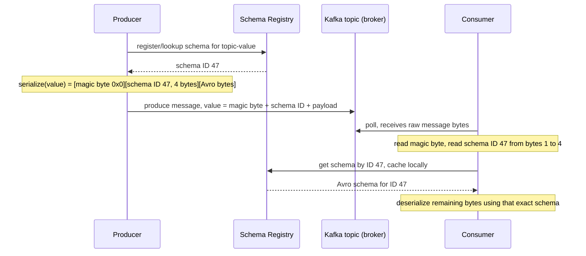

**TL;DR:** Everyone says a message broker "decouples" producers from consumers — but decouples them from what, exactly, if a producer can still break every consumer by silently changing a field's type? The broker only decouples the network path (who's listening, when). The actual coupling that breaks production systems is in the *payload's shape* — and that's fixed by treating the event schema itself as a versioned, registry-enforced contract (Confluent's Schema Registry wire format), and by choosing whether an event carries just an ID (event notification) or the full state a consumer needs (event-carried state transfer, as CloudEvents' envelope makes concrete).
> **In plain English (30 sec):** Think of this like concepts you already use, but in a production system at scale.


**Real repos:** [`confluentinc/confluent-kafka-go`](https://github.com/confluentinc/confluent-kafka-go), [`cloudevents/spec`](https://github.com/cloudevents/spec)

## 1. The Engineering Problem: the broker decouples the wire, not the contract

The pitch for event-driven architecture is usually "producers and consumers don't need to know about each other — they just publish and subscribe to a topic." That's true for the *transport*: a Kafka broker means a producer doesn't need to know a consumer's hostname, doesn't block waiting for it to be up, and doesn't care how many consumers are reading the same topic. That's real decoupling, and it's why event-driven systems tolerate partial outages and independent deployment schedules better than synchronous REST-to-REST calls.

But none of that protects a consumer from the producer silently renaming a field, changing `price` from a float to a string, or dropping a field a consumer's code still reads. The broker moves bytes; it has no opinion about what those bytes mean. A producer team ships a change, every downstream consumer that deserializes the old shape either throws or — worse — silently reads garbage, and the "decoupling" the architecture promised turns out to have been decoupling in exactly one dimension (network) while leaving the more dangerous dimension (data contract) completely unguarded. This is the gap a schema registry and a standardized event envelope close — not by adding another network hop, but by making the payload's shape a first-class, versioned thing the broker's wire format actually encodes.

---

## 2. The Technical Solution: the schema ID travels inside the message, the envelope standardizes what "an event" even contains

Two separate mechanisms solve two separate halves of this problem.

**Schema evolution: the Confluent Schema Registry wire format embeds a schema ID in every message, not just the raw payload.** A producer doesn't serialize with a schema baked into application code — it asks the registry to register (or look up) a schema, gets back a numeric ID, and prepends that ID to the serialized bytes before publishing. A consumer reads the ID first, fetches the matching schema from the registry (cached after the first lookup), and only then deserializes. Compatibility rules enforced at registration time (backward, forward, full) mean a schema change that would actually break existing consumers is rejected at publish time — before a single malformed message ever reaches a topic.

**Event shape: CloudEvents standardizes the envelope so "what is an event" isn't reinvented per producer.** Every CloudEvent carries `id`, `source`, `type`, and `specversion` as required attributes, with `data` holding the actual payload. This is what makes the event-notification-vs-event-carried-state-transfer choice explicit and inspectable: a thin notification event's `data` might be just `{"orderId": "abc"}`, forcing every consumer to call back to the source for details; a state-transfer event's `data` embeds the full `Order` object, letting consumers act without a synchronous round trip — at the cost of a larger, more duplicated payload. The envelope doesn't force either choice, but it makes the choice a visible field, not an undocumented convention.



Three core truths to hold onto:

1. **The broker decouples deployment and availability; the schema registry decouples the data contract.** These are different mechanisms solving different failure modes — a system can have one without the other, and having only the broker is why "we're event-driven" doesn't by itself prevent a producer's change from breaking every consumer.
2. **The schema ID is data, carried inside the message, not configuration living only in each service's code.** A consumer that receives a message it's never seen a schema for can still deserialize it correctly, because the ID to look it up travels with the payload itself — this is what makes independent producer/consumer deployment actually safe, not just theoretically decoupled.
3. **Event-carried state transfer is a payload-size-for-availability tradeoff, made explicit by the envelope's `data` field, not an architecture-wide default.** A fat event removes a synchronous callback a thin event would require; it also means every consumer that only needs `orderId` still receives (and must deserialize) the whole `Order`. Neither is universally correct — the CloudEvents envelope just makes the choice visible per event `type` instead of buried in per-team convention.

---

## 3. The clean example (concept in isolation)

```python
# minimal_schema_wire_format.py - the Confluent wire format, stripped to essentials

MAGIC_BYTE = 0x0

def serialize_with_schema_id(schema_id: int, avro_bytes: bytes) -> bytes:
    # [magic byte][4-byte big-endian schema ID][actual serialized payload]
    return bytes([MAGIC_BYTE]) + schema_id.to_bytes(4, "big") + avro_bytes

def deserialize_schema_id(payload: bytes) -> tuple[int, bytes]:
    magic = payload[0]
    assert magic == MAGIC_BYTE, f"unknown magic byte {magic}"
    schema_id = int.from_bytes(payload[1:5], "big")
    remaining = payload[5:]
    return schema_id, remaining

# a consumer that has NEVER seen this producer's code can still deserialize
# correctly, because schema_id is enough to fetch the exact schema used
```

```json
// minimal_cloudevent.json - event-carried state transfer made explicit via `data`
{
  "specversion": "1.0",
  "type": "com.example.order.placed.v1",
  "source": "/orders/checkout-service",
  "id": "9f4e6b12-...",
  "data": {
    "orderId": "ord_882",
    "total": 42.50,
    "items": [{"sku": "widget-1", "qty": 2}]
  }
}
// a consumer reacting to this event needs no callback to checkout-service -
// everything it needs to, say, update a shipping dashboard is already here
```

---

## 4. Production reality (from `confluentinc/confluent-kafka-go` and `cloudevents/spec`)

```
confluentinc/confluent-kafka-go/
├── schemaregistry/serde/
│   └── serde.go                          # SchemaID.FromBytes / IDToBytes - the wire format itself
└── examples/avrov3_producer_example/
    └── avrov3_producer_example.go        # a real producer using it end-to-end

cloudevents/spec/
└── cloudevents/
    └── spec.md                           # the envelope's required attributes
```

**The wire format itself — `SchemaID.FromBytes`, reading the magic byte and schema ID back out of a raw message:**

```go
// schemaregistry/serde/serde.go (SchemaID.FromBytes, elided)

// MagicByte is prepended to a schema ID
const MagicByte byte = 0x0

func (s *SchemaID) FromBytes(payload []byte) (int, error) {
	var totalBytesRead int
	magicByte := payload[0]
	if magicByte == MagicByteV0 {
		s.ID = int(binary.BigEndian.Uint32(payload[1:5]))
		totalBytesRead = 5
	} else if magicByte == MagicByteV1 {
		guid, err := uuid.FromBytes(payload[1:17])
		// ... GUID-based schema ID handling elided ...
	} else {
		return 0, fmt.Errorf("unknown magic byte %d", magicByte)
	}
	return totalBytesRead, nil
}
```

**A real producer using the registry-backed serializer — no schema is hand-encoded in this file at all:**


```go
// examples/avrov3_producer_example/avrov3_producer_example.go (elided)

client, err := schemaregistry.NewClient(schemaregistry.NewConfig(url))

ser, err := avrov3.NewSerializer(client, serde.ValueSerde, avrov3.NewSerializerConfig())

value := User{
	Name:           "First user",
	FavoriteNumber: 42,
	FavoriteColor:  "blue",
}
payload, err := ser.Serialize(topic, &value)
// payload now = magic byte + schema ID + Avro bytes, ready to hand to Produce()

err = p.Produce(&kafka.Message{
	TopicPartition: kafka.TopicPartition{Topic: &topic, Partition: kafka.PartitionAny},
	Value:          payload,
	Headers:        []kafka.Header{{Key: "myTestHeader", Value: []byte("header values are binary")}},
}, deliveryChan)
```


**The CloudEvents envelope's required attributes — the fields every producer must set, regardless of broker:**

```json
{
    "specversion" : "1.0",
    "type" : "com.github.pull_request.opened",
    "source" : "https://github.com/cloudevents/spec/pull",
    "subject" : "123",
    "id" : "A234-1234-1234",
    "time" : "2018-04-05T17:31:00Z",
    "datacontenttype" : "text/xml",
    "data" : "<much wow=\"xml\"/>"
}
```

What this teaches that a hello-world can't:

- **`ser.Serialize(topic, &value)` never touches a schema ID directly — the serializer looks the schema up (or registers it) against the registry keyed by topic, and the caller only ever sees the final byte payload.** This is the actual mechanism behind "producers and consumers can evolve independently": the schema ID embedding happens inside the client library, not as something application code has to remember to do correctly on every call.
- **`FromBytes` branches on the magic byte before reading anything else** (`MagicByteV0` for a 4-byte integer schema ID, `MagicByteV1` for a 16-byte schema GUID) — the wire format itself is versioned, meaning the *serialization format* can evolve without breaking clients built against an older version, one layer below where Avro/schema compatibility rules even apply.
- **CloudEvents' `type` field is a producer-defined string, SHOULD-prefixed with a reverse-DNS name** (`com.github.pull_request.opened`) — this is what lets a consumer route on event type without parsing `data` at all, and is the field that actually encodes "is this event notification-shaped or state-transfer-shaped" by convention (`*.changed` vs `*.updated.v2` with a full snapshot, for example), even though CloudEvents itself doesn't enforce which.

Known-stale fact: "event-driven means loosely coupled" is often stated without qualification, as if publishing to a topic automatically solves the coupling problem end to end. It solves the *transport* coupling problem. The payload-shape coupling problem is solved by a completely separate mechanism — schema registration with enforced compatibility rules — and a system that has message brokers but no schema contract enforcement is still tightly coupled, just tightly coupled asynchronously instead of synchronously, which is often a harder failure to diagnose because the break doesn't happen at call time.

---

## 5. Review checklist

- **Does every producer register or validate its schema against the registry before publishing, with a compatibility mode set (`BACKWARD`, `FORWARD`, or `FULL`) — not just "serialize and send"?** A registry with no compatibility check configured will happily accept a breaking schema change and let it reach every consumer.
- **Does the consumer's deserialization path read the schema ID from the message before assuming a schema, rather than hardcoding the schema version it was written against?** Code that bypasses the registry-aware deserializer and assumes a fixed schema reintroduces exactly the coupling the registry exists to remove.
- **For each event `type`, is it documented (or at least consistent) whether `data` is a thin notification or a full state-transfer payload?** A team mixing both shapes under similar `type` names forces every consumer to guess which fields are guaranteed present.
- **Does `source` + `id` actually stay unique per distinct occurrence, as CloudEvents requires** — reused on retries but never on genuinely different events? A consumer relying on `source`+`id` for deduplication will double-process events if a producer violates this.

## 6. FAQ

### If the broker doesn't provide the decoupling, why use one instead of direct schema-validated HTTP calls?
Because the broker's decoupling is real and valuable, just scoped to the network dimension — a producer publishing to Kafka doesn't need any consumer to be up, doesn't block on their response time, and supports many independent consumers reading the same topic at their own pace. The schema registry adds the missing dimension on top of that; it doesn't replace the broker's reason for existing.

### What actually happens if a producer publishes a message with a schema ID the consumer's registry client hasn't cached yet?
The consumer's `Deserializer` fetches the schema from the registry on a cache miss (visible in `schemaregistry_client.go`'s caching layer) and stores it locally — the fetch happens transparently on first encounter with a new schema ID, not as a manual step the consuming application code has to write.

### Is `MagicByteV1` (the GUID-based schema ID) a newer replacement for `MagicByteV0`?
They coexist deliberately — `FromBytes` branches on whichever magic byte is present, so a consumer built to handle both can read messages produced under either wire format without a coordinated migration. This is the wire-format-level version of the same schema-evolution problem the Avro schemas themselves solve one layer up.

### Does CloudEvents require using `data` for the full payload, or can an event just be a reference?
Neither is mandated — CloudEvents standardizes the envelope's metadata attributes (`id`, `source`, `type`, `specversion`) and leaves `data`'s shape entirely to the producer. The spec's only relevant constraint is `datacontenttype`, which tells a consumer how to interpret whatever `data` actually contains, whether that's a full object or just an identifier.

---

## Source

- **Concept:** Event-driven architecture patterns — event brokers, event schemas, event-carried state transfer, and the real decoupling boundaries
- **Domain:** architecture
- **Repo:** [confluentinc/confluent-kafka-go](https://github.com/confluentinc/confluent-kafka-go) → [`schemaregistry/serde/serde.go`](https://github.com/confluentinc/confluent-kafka-go/blob/master/schemaregistry/serde/serde.go), [`examples/avrov3_producer_example/avrov3_producer_example.go`](https://github.com/confluentinc/confluent-kafka-go/blob/master/examples/avrov3_producer_example/avrov3_producer_example.go) — the real Confluent Kafka Go client's Schema Registry wire format and a producer using it end to end.
- **Repo:** [cloudevents/spec](https://github.com/cloudevents/spec) → [`cloudevents/spec.md`](https://github.com/cloudevents/spec/blob/main/cloudevents/spec.md) — the CNCF CloudEvents specification defining the standardized event envelope.


