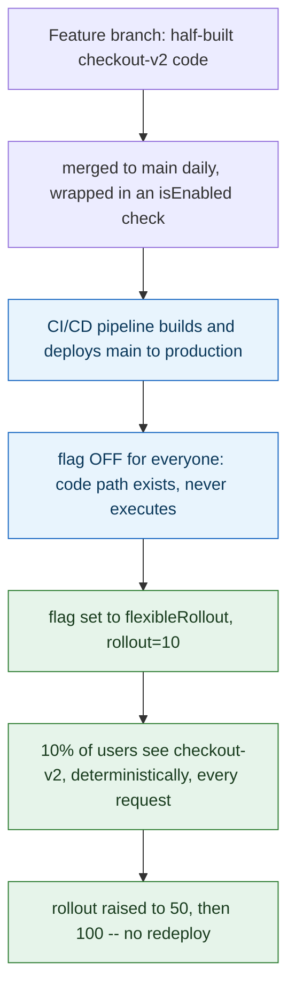



**TL;DR:** How does a feature flag SDK decide, without a database lookup on every request, that the *same* user always lands on the *same* side of a 10% gradual rollout  instead of flipping randomly each time they refresh?

## 1. The Engineering Problem: long-lived branches trade one kind of risk for a worse one

Trunk-based development asks every engineer to merge to `main` at least daily, which sounds reckless until the alternative is compared honestly: a feature branch that lives for weeks accumulates a merge conflict surface that grows daily, and the eventual merge back into `main` is a single high-risk event bundling weeks of unreviewed interaction between that branch and everyone else's changes. The problem trunk-based development actually has to solve isn't "how do we merge often"  it's "how do we merge *unfinished* work into `main` daily without unfinished work reaching users." A `git merge` and a production release are conventionally the same event; trunk-based development only works if they're split into two.

Feature flags are the mechanism that performs that split. Code for a half-built feature merges to `main`, ships in the same binary/container as everything else, deploys to production  and stays completely inert, because a runtime check gates the code path shut. Deploying and releasing become two separately-controllable operations. But that only holds if the flag's decision is *stable*: if a gradual rollout at 10% put a different random 10% of users on the new code path every single request, the "unfinished feature" wouldn't actually be isolated to a small blast radius  it would touch every user eventually, just intermittently, which is arguably worse than an all-or-nothing release because the bug reports would be unreproducible.

---

## 2. The Technical Solution: hash the user's identity, not a coin flip

A feature flag SDK needs percentage rollout to be **deterministic per identity, without any server round-trip or stored state**. The mechanism is consistent hashing: hash a stable identifier (the user ID, or a session ID, or a client-supplied stickiness value) together with the flag's own name, reduce that hash into a fixed 1100 range, and compare the result against the configured rollout percentage. Because the hash function is pure  same inputs always produce the same output  the same user always lands on the same side of the line, on every request, on every server, with zero shared state between them.



The deploy (`C`) and the release (`E` onward) are separated by an arbitrary amount of time and controlled independently  a deploy that introduces a bug is fixed by a redeploy, but a *release* that turns out to be a bad idea is undone by flipping the flag back, no redeploy involved.

Here's the actual per-request evaluation that makes step `F` deterministic  Unleash's Node SDK, `FlexibleRolloutStrategy.isEnabled()`:

```mermaid
sequenceDiagram
    participant App as Application code
    participant SDK as Unleash SDK (in-process)
    participant Hash as normalizedStrategyValue()

    App->>SDK: isEnabled("checkout-v2", context: userId=482)
    SDK->>SDK: groupId = context.featureToggle = "checkout-v2"
    SDK->>SDK: stickinessId = context.userId = "482"
    SDK->>Hash: normalizedStrategyValue("482", "checkout-v2")
    Note over Hash: hash = murmurHash3.x86.hash32("checkout-v2:482", seed=0)
    Note over Hash: normalizedUserId = (hash mod 100) plus 1 -- always 1 to 100
    Hash-->>SDK: normalizedUserId = 7
    SDK->>SDK: compare 7 <= rollout percentage 10
    SDK-->>App: true -- same user 482 gets true on every future call too

    classDef enabled fill:#e6f4ea,stroke:#2e7d32,color:#1b3e20;
    class SDK enabled;
```

Three truths this evaluation depends on:

- **The hash input is `groupId:stickinessId`, not just the user ID.** Salting with the flag's own name (`groupId`, which defaults to `context.featureToggle`) means the *same* user gets an *independent* random-looking bucket for every different flag  user 482 can be in the 10% for `checkout-v2` and the other 90% for `new-nav-bar` simultaneously, because the two hashes are computed over different strings.
- **`stickiness` is configurable, not always the user ID.** `resolveStickiness()` falls back through `context.userId` ? `context.sessionId` ? a random generator if neither exists  meaning an anonymous, logged-out visitor still gets *a* stable identity for the duration of one session, just not one that follows them across devices.
- **The modulo range is fixed at 100 with `+ 1`,** so `normalizedUserId` is always an integer from 1 to 100 inclusive  a `rollout` of `0` excludes literally everyone (since the comparison is `normalizedUserId <= percentage` and the range starts at 1, never 0), and `100` includes everyone.

---

## 3. The clean example (concept in isolation)

```typescript
// A minimal gradual-rollout gate, isolated from the SDK's caching/polling machinery
import * as murmurHash3 from 'murmurhash3js';

function normalizedValue(id: string, groupId: string): number {
  // Hash the flag name + user identity together, not the user id alone --
  // this is what makes the same user independently bucketed per flag.
  const hash = murmurHash3.x86.hash32(`${groupId}:${id}`, 0);
  // Fold into a 1-100 range: deterministic, no lookup table, no shared state.
  return (hash % 100) + 1;
}

function isEnabled(userId: string, flagName: string, rolloutPercent: number): boolean {
  if (!userId) return false;               // no stable identity, no stable bucket
  const bucket = normalizedValue(userId, flagName);
  return rolloutPercent > 0 && bucket <= rolloutPercent;
}

// Same user, same flag, same answer -- every single call:
isEnabled('482', 'checkout-v2', 10);   // -> true, always, until rolloutPercent changes
```

---

## 4. Production reality (from `Unleash/unleash-node-sdk`)

```
unleash-node-sdk/
+-- src/
    +-- strategy/
        +-- flexible-rollout-strategy.ts   # isEnabled() -- the per-request gate
        +-- util.ts                         # normalizedStrategyValue() -- the hashing math
```

```typescript
// src/strategy/util.ts
import * as murmurHash3 from 'murmurhash3js';

function normalizedValue(id: string, groupId: string, normalizer: number, seed = 0): number {
  const hash = murmurHash3.x86.hash32(`${groupId}:${id}`, seed);
  return (hash % normalizer) + 1;
}

const STRATEGY_SEED = 0;

export function normalizedStrategyValue(id: string, groupId: string): number {
  return normalizedValue(id, groupId, 100, STRATEGY_SEED);
}

const VARIANT_SEED = 86028157;

export function normalizedVariantValue(id: string, groupId: string, normalizer: number): number {
  return normalizedValue(id, groupId, normalizer, VARIANT_SEED);
}
```

```typescript
// src/strategy/flexible-rollout-strategy.ts
const STICKINESS = {
  default: 'default',
  random: 'random',
};

export default class FlexibleRolloutStrategy extends Strategy {
  private randomGenerator: () => string = () => `${Math.round(Math.random() * 10000) + 1}`;

  resolveStickiness(stickiness: string, context: Context): string | undefined {
    switch (stickiness) {
      case STICKINESS.default:
        return context.userId || context.sessionId || this.randomGenerator();
      case STICKINESS.random:
        return this.randomGenerator();
      default:
        return resolveContextValue(context, stickiness);
    }
  }

  isEnabled(
    parameters: { groupId?: string; rollout?: number | string; stickiness?: string },
    context: Context,
  ) {
    const groupId = parameters.groupId || context.featureToggle || '';
    const percentage = Number(parameters.rollout);
    const stickiness: string = parameters.stickiness || STICKINESS.default;
    const stickinessId = this.resolveStickiness(stickiness, context);

    if (!stickinessId) {
      return false;
    }
    const normalizedUserId = normalizedStrategyValue(stickinessId, groupId as string);
    return percentage > 0 && normalizedUserId <= percentage;
  }
}
```

What this teaches that a hello-world can't:

- **`normalizedVariantValue` uses a *different* seed (`86028157`) than `normalizedStrategyValue` (`0`).** This is deliberate, not an oversight: it means a user's rollout bucket (in/out of the flag) and their A/B *variant* assignment (which version they see, if the flag has multiple payloads) are independently random relative to each other  without the second seed, a user's position in the rollout percentage would leak information about which variant they'd get, correlating two things that should vary independently.
- **`isEnabled` returns `false`, not a thrown error, when `stickinessId` is falsy.** A flag evaluation is on the hot path of every gated request  the SDK is written so a missing identity fails closed (feature off) rather than throwing and taking down the request entirely, since a false negative on a feature flag is far cheaper than a 500.
- **`randomGenerator` is a constructor-injectable field, not a bare `Math.random()` call inline.** That's what makes `FlexibleRolloutStrategy` unit-testable at all  a test can construct the strategy with a fixed generator and assert on exact bucket placement, which a hardcoded `Math.random()` would make nondeterministic and untestable.

Known-stale fact: "feature flags are basically an `if` statement with a config toggle" undersells the mechanism  a naive boolean toggle *is* trivial, but a **gradual rollout** toggle specifically needs the consistent-hashing property above, or it isn't actually gradual (it's randomly flickering), which defeats the entire point of using a percentage to limit blast radius.

---

## 5. Review checklist

- **Does the `groupId` default make sense for this flag?** If `parameters.groupId` is left unset, it falls back to `context.featureToggle` (the flag's own name)  fine for most flags, but a reviewer should catch cases where two *different* flag names are meant to bucket the *same* population identically (e.g. two flags that should always agree for a given user need an explicit shared `groupId`).
- **Is the chosen `stickiness` field actually stable for the traffic this flag targets?** `context.userId` is stable for logged-in traffic; anonymous traffic falls through to `sessionId`, and with neither, a fresh random value is generated *per evaluation*  meaning a flag relying on default stickiness for anonymous users may not be sticky at all across requests unless `sessionId` is wired into the context.
- **Does a `rollout` of `0` actually mean "off" everywhere this flag is checked?** Confirm the check is `percentage > 0 && normalizedUserId <= percentage`, not a bare `<=`  a careless reimplementation of this logic elsewhere (a second SDK, a custom evaluator) that drops the `percentage > 0` guard will let `normalizedUserId` values that happen to equal `0` slip through even at 0%.
- **Is the flag still wrapping code that's actually still incomplete?** A flag left at 100% long after a feature is fully validated is dead code with a runtime branch still evaluating on every request  the review checklist item trunk-based development actually depends on is the flag's *removal*, not just its addition.

---

## 6. FAQ

**Q: Why hash `groupId:userId` together instead of hashing the user ID once and reusing the bucket for every flag?**
A: Reusing one hash-derived bucket per user across all flags would mean every 10%-rollout flag in the system always turns on for the *same* 10% of users  correlating unrelated features and making it impossible to test them independently. Salting the hash with `groupId` (the flag name) gives each flag its own, independent pseudo-random bucketing per user.

**Q: What happens to a user's bucket if their `userId` doesn't change but the flag's `rollout` percentage does?**
A: The hash and the resulting `normalizedUserId` (1100) never change for that user/flag pair  only the threshold they're compared against moves. This is why raising a rollout from 10% to 50% only *adds* users, it never reshuffles who was already in the first 10%: `normalizedUserId <= 10` is a strict subset of `normalizedUserId <= 50`.

**Q: Does `FlexibleRolloutStrategy` call out to the Unleash server on every `isEnabled()` check?**
A: No  the strategy evaluation shown above runs entirely in-process against a locally cached copy of flag definitions that the SDK polls for periodically. That's what makes gradual-rollout evaluation cheap enough to run on every request: it's a hash and a comparison, not a network call.

**Q: Why does `resolveStickiness` fall back to a random generator instead of just returning `false` when there's no `userId` or `sessionId`?**
A: Falling back to a random per-evaluation value (rather than failing closed) means a flag with no identity signal at all still resolves *some* percentage of anonymous traffic into the rollout  useful for flags gating something like a static asset variant where exact per-user stickiness doesn't matter, though it does mean that specific evaluation won't be sticky across requests, which is a real trade-off a reviewer should be aware they're accepting.

**Q: Is `stickiness: 'random'` ever a reasonable choice given it breaks determinism?**
A: Yes, for flags where the only goal is a percentage split of *traffic*, not a stable per-user experience  an A/B test on a stateless API endpoint where each request is independent doesn't need the same caller to always land on the same side, so trading stickiness for simplicity is a deliberate, named option (`STICKINESS.random`) rather than an accident.

---

## Source

- **Concept:** Feature flags & trunk-based development (gradual rollout stickiness)
- **Domain:** cicd
- **Repo:** [Unleash/unleash-node-sdk](https://github.com/Unleash/unleash-node-sdk) ? [`src/strategy/flexible-rollout-strategy.ts`](https://github.com/Unleash/unleash-node-sdk/blob/main/src/strategy/flexible-rollout-strategy.ts), [`src/strategy/util.ts`](https://github.com/Unleash/unleash-node-sdk/blob/main/src/strategy/util.ts)  the official Node.js SDK for Unleash, the real open-source feature flag platform.



