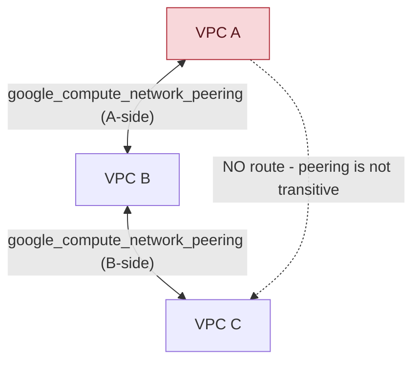

**TL;DR:** Why can't a VPC reach a third network that's peered to its peer, and how does a VM with no public IP still call Cloud Storage without going over the public internet? VPC Peering is deliberately non-transitive — each `google_compute_network_peering` resource is a point-to-point route exchange between exactly two networks, full stop — while Private Service Connect terminates Google API traffic on an internal IP address inside your own VPC via a global forwarding rule, so the request never leaves private RFC 1918 address space at all.

**Real repo:** [`terraform-google-modules/terraform-google-network`](https://github.com/terraform-google-modules/terraform-google-network)

## 1. The Engineering Problem: private connectivity without a public IP, a NAT gateway, or a single point of failure

Two GCP networks — different projects, a landing-zone VPC and a workload VPC, or a shared-services VPC everyone needs to reach — often need direct connectivity without traversing the public internet, and without provisioning a VPN tunnel or Interconnect just to move traffic that's already inside Google's network. The naive fix is a routed VPN between the two VPCs: it works, but it's a managed gateway resource, it has a throughput ceiling, and it's one more thing that can go down.

Separately, a workload with no public IP — the correct posture for almost everything that isn't a public-facing load balancer — still needs to call Google's own APIs: Cloud Storage, Pub/Sub, BigQuery. The old answer was Cloud NAT (translate outbound traffic through a shared external IP) or, worse, giving the VM a public IP and relying on firewall rules alone. Both routes send API traffic out to the public internet and back in, even though the API and the VM are both inside Google's infrastructure the whole time.

GCP has two separate, purpose-built answers to these two separate problems: **VPC Peering** for VPC-to-VPC connectivity, and **Private Service Connect (PSC)** for VPC-to-Google-API (or VPC-to-published-service) connectivity. Conflating them is the most common mistake — peering connects two VPCs you control; PSC connects a VPC to a service endpoint, Google's own APIs or a third party's published service, without either side seeing the other's internal topology.

---

## 2. The Technical Solution: point-to-point route exchange for peering, an internal endpoint for PSC

**VPC Peering** is implemented as a pair of `google_compute_network_peering` resources — one created from network A's side naming B as the peer, one from B's side naming A — each carrying its own `export_custom_routes`/`import_custom_routes` flags. There is no shared gateway device and no transit: peering state lives as route-exchange configuration on each network's own control plane, which is exactly why it doesn't chain.

**Private Service Connect** for Google APIs is a `google_compute_global_address` (an internal IP, `purpose = "PRIVATE_SERVICE_CONNECT"`) plus a `google_compute_global_forwarding_rule` whose `target` is a Google-managed service (`private.googleapis.com` or the VPC-SC-aware `restricted.googleapis.com`), backed by a private DNS zone that overrides `googleapis.com` to resolve to that internal IP inside the VPC.



Three core truths to hold:

- **Peering is non-transitive by design, not by limitation.** A peered with B, and B peered with C, gives A zero visibility into C — each `google_compute_network_peering` resource only exchanges routes with the one network named in it. If A needs C, A needs its own direct peering (or Network Connectivity Center, GCP's separate hub-and-spoke answer for many-to-many topologies).
- **PSC to Google APIs never leaves the VPC's private address space.** The client resolves `storage.googleapis.com` to an internal IP (via the private DNS override), sends the request to that internal IP, and the global forwarding rule hands it to Google's API front end — the request is internal-to-internal the entire way, which is also why it works from on-prem over Interconnect/VPN without any public routing at all.
- **`restricted.googleapis.com` vs `private.googleapis.com` is a real, meaningful choice, not a naming variant** — `restricted.googleapis.com` is the target that's aware of and enforces VPC Service Controls perimeters (covered in the next lesson in this series); `private.googleapis.com` is not perimeter-aware. Picking the wrong one silently drops the VPC-SC enforcement a security team assumed was in place.

---

## 3. The clean example (concept in isolation)

```hcl
# --- VPC Peering: two resources, one per direction ---
resource "google_compute_network_peering" "a_to_b" {
  name         = "peering-a-to-b"
  network      = google_compute_network.vpc_a.self_link
  peer_network = google_compute_network.vpc_b.self_link
  # export/import_custom_routes default to false - routes stay local unless opted in
}

resource "google_compute_network_peering" "b_to_a" {
  name         = "peering-b-to-a"
  network      = google_compute_network.vpc_b.self_link
  peer_network = google_compute_network.vpc_a.self_link
}

# --- Private Service Connect: internal IP + forwarding rule to Google APIs ---
resource "google_compute_global_address" "psc_ip" {
  name          = "psc-googleapis-ip"
  address_type  = "INTERNAL"
  purpose       = "PRIVATE_SERVICE_CONNECT"
  network       = google_compute_network.vpc_a.id
}

resource "google_compute_global_forwarding_rule" "psc_googleapis" {
  name       = "psc-googleapis-rule"
  target     = "vpc-sc"    # resolves to restricted.googleapis.com, perimeter-aware
  network    = google_compute_network.vpc_a.id
  ip_address = google_compute_global_address.psc_ip.id
}
```

---

## 4. Production reality (from `terraform-google-modules/terraform-google-network`)

```
terraform-google-network/
└── modules/
    ├── network-peering/
    │   └── main.tf          # the two-resource peering pair, with name-collision handling
    └── private-service-connect/
        ├── main.tf          # internal address + global forwarding rule
        └── dns.tf           # private zones overriding googleapis.com, gcr.io, pkg.dev
```

`modules/network-peering/main.tf` — the real peering pair, including the part a hand-written example skips: Google Cloud resource names are capped at 63 characters, and a long project/network name pair can blow past that:

```hcl
# modules/network-peering/main.tf
locals {
  local_network_peering      = "${var.prefix}-${local.local_network_name}-${local.peer_network_name}"
  local_network_peering_name = length(local.local_network_peering) < 63 ? local.local_network_peering : "${substr(local.local_network_peering, 0, min(58, length(local.local_network_peering)))}-${random_string.network_peering_suffix.result}"
  # peer_network_peering_name computed the same way, mirrored for the other direction
}

resource "google_compute_network_peering" "local_network_peering" {
  provider             = google-beta
  name                 = local.local_network_peering_name
  network              = var.local_network
  peer_network         = var.peer_network
  export_custom_routes = var.export_local_custom_routes
  import_custom_routes = var.export_peer_custom_routes

  export_subnet_routes_with_public_ip = var.export_local_subnet_routes_with_public_ip
  import_subnet_routes_with_public_ip = var.export_peer_subnet_routes_with_public_ip

  stack_type = var.stack_type
}

resource "google_compute_network_peering" "peer_network_peering" {
  provider     = google-beta
  name         = local.peer_network_peering_name
  network      = var.peer_network
  peer_network = var.local_network
  # ...mirrors local_network_peering's other fields, swapped local/peer
  depends_on = [google_compute_network_peering.local_network_peering]
}
```

`modules/private-service-connect/main.tf` — the internal address and forwarding rule:

```hcl
# modules/private-service-connect/main.tf
locals {
  googleapis_url = var.forwarding_rule_target == "vpc-sc" ? "restricted.googleapis.com." : "private.googleapis.com."
}

resource "google_compute_global_address" "private_service_connect" {
  provider     = google-beta
  name         = var.private_service_connect_name
  address_type = "INTERNAL"
  purpose      = "PRIVATE_SERVICE_CONNECT"
  network      = var.network_self_link
  address      = var.private_service_connect_ip
}

resource "google_compute_global_forwarding_rule" "forwarding_rule_private_service_connect" {
  provider   = google-beta
  name       = var.forwarding_rule_name
  target     = var.forwarding_rule_target      # "all-apis" or "vpc-sc" only - validated
  network    = var.network_self_link
  ip_address = google_compute_global_address.private_service_connect.id
}
```

`modules/private-service-connect/dns.tf` — the private DNS override that makes `storage.googleapis.com` actually resolve to the PSC internal IP instead of a public one:

```hcl
# modules/private-service-connect/dns.tf
module "googleapis" {
  source = "terraform-google-modules/cloud-dns/google"
  type   = "private"
  name   = "${local.dns_code}apis"
  domain = "googleapis.com."

  private_visibility_config_networks = [var.network_self_link]

  recordsets = [
    { name = "*", type = "CNAME", ttl = 300, records = [local.googleapis_url] },
    { name = local.recordsets_name, type = "A", ttl = 300, records = [var.private_service_connect_ip] },
  ]
}
```

What this teaches that a hello-world can't:

- **The peering pair is asymmetric on purpose, not by accident of the module's structure.** `export_custom_routes`/`import_custom_routes` on the A-side resource controls what A sends to B; the mirrored fields on the B-side resource control what B sends to A. A common misconfiguration is setting route export on only one side and being surprised that routes only flow one way — that's not a bug, it's literally what the two independent resources model.
- **The 63-character name truncation with a random suffix is a real production concern a toy example never surfaces.** GCP resource names have hard length limits; a module generating peering names from `${prefix}-${network_a}-${network_b}` will silently exceed that limit with sufficiently descriptive network names, so the module falls back to truncation plus a random 4-character suffix specifically to keep names both valid and non-colliding.
- **The DNS override targets three separate domains (`googleapis.com`, `gcr.io`, `pkg.dev`), not just one.** A workload calling Cloud Storage, pulling a container image from Container Registry, and pulling a package from Artifact Registry all need the same PSC redirection — this module wires up all three private zones from the same internal IP, which is why a real PSC-for-Google-APIs rollout touches more than just "one API."

Known-stale fact: PSC's private DNS override is frequently confused with Private Google Access (the older, subnet-level `--enable-private-ip-google-access` flag). Private Google Access lets a VM with no public IP reach Google APIs' *public* IP ranges over Google's backbone — it's still routing to a shared public IP space. PSC goes further: the API endpoint itself gets a dedicated internal IP inside *your* VPC, which is also what makes it the only one of the two that's VPC Service Controls-aware via `restricted.googleapis.com`.

## 5. Review checklist

- **Does every `google_compute_network_peering` pair set matching route-export intent on both sides**, or is one side silently relying on the other's `export_custom_routes` default (`false`) when the design assumes bidirectional route flow?
- **If a design assumes transitive reachability across three or more peered VPCs, has it been replaced with Network Connectivity Center or explicit direct peering** — peering alone will not deliver it, regardless of how the peering pairs are wired.
- **Does the PSC forwarding rule's `target` match the security posture the team assumes** — `vpc-sc` (→ `restricted.googleapis.com`) when a VPC Service Controls perimeter is supposed to be enforced, `all-apis` (→ `private.googleapis.com`) only when it deliberately isn't?
- **Are the private DNS zone overrides scoped to only the networks that should use PSC** (`private_visibility_config_networks`) — an over-broad private zone can silently redirect `googleapis.com` traffic for networks that were never meant to route through the PSC endpoint.

## 6. FAQ

**Q: Why does `google_compute_network_peering` need `provider = google-beta` for something as standard as VPC peering?**
A: Some of the fields this module sets — `export_subnet_routes_with_public_ip`/`import_subnet_routes_with_public_ip` and `stack_type` (for dual-stack IPv4/IPv6 peering) — are on the beta API surface, the same resource-by-resource beta/stable split covered in this domain's Terraform-on-GCP lesson. The peering resource type itself is standard; specific fields on it are what require `google-beta`.

**Q: Can I use VPC Peering to reach a Google-managed service like Cloud SQL's private IP, instead of PSC?**
A: For Cloud SQL specifically, Google uses a related-but-distinct mechanism called Private Services Access, which under the hood *is* implemented as a managed VPC peering connection Google creates on your behalf into its own service-producer network — conceptually adjacent to PSC but a separate Terraform resource (`google_service_networking_connection`), not the `private-service-connect` module covered here.

**Q: What actually breaks if I forget the private DNS zone in `dns.tf` and only create the PSC forwarding rule?**
A: Nothing routes through PSC at all — without the DNS override, `storage.googleapis.com` still resolves to its normal public IP via public DNS, and the client sends its request there instead of to the internal PSC address. The forwarding rule and internal address alone don't change what address a client resolves; the private DNS zone is what actually redirects traffic onto the PSC path.

**Q: Does non-transitive peering mean a hub-and-spoke topology is impossible with VPC Peering alone?**
A: Not impossible, but limited — a hub VPC can peer individually with every spoke, and each spoke can reach the hub, but two spokes still can't reach each other through the hub because peering doesn't transit. True hub-and-spoke spoke-to-spoke connectivity needs either direct spoke-to-spoke peering (which doesn't scale past a handful of spokes) or Network Connectivity Center, which is a genuinely different, transit-capable mechanism.

---

## Source

- **Concept:** GCP networking deep dive — VPC Peering (non-transitive route exchange) and Private Service Connect (internal endpoint for Google APIs)
- **Domain:** gcp
- **Repo:** [terraform-google-modules/terraform-google-network](https://github.com/terraform-google-modules/terraform-google-network) → [`modules/network-peering/main.tf`](https://github.com/terraform-google-modules/terraform-google-network/blob/master/modules/network-peering/main.tf), [`modules/private-service-connect/main.tf`](https://github.com/terraform-google-modules/terraform-google-network/blob/master/modules/private-service-connect/main.tf), [`modules/private-service-connect/dns.tf`](https://github.com/terraform-google-modules/terraform-google-network/blob/master/modules/private-service-connect/dns.tf) — Google's own real, versioned Terraform VPC module.

---

**Next in the Google Cloud series:** [GCP Security & Compliance: How VPC Service Controls Stop Data Exfiltration That IAM Can't]({{ '/gcp/gcp-security-compliance-vpc-service-controls-org-policy/' | relative_url }})


