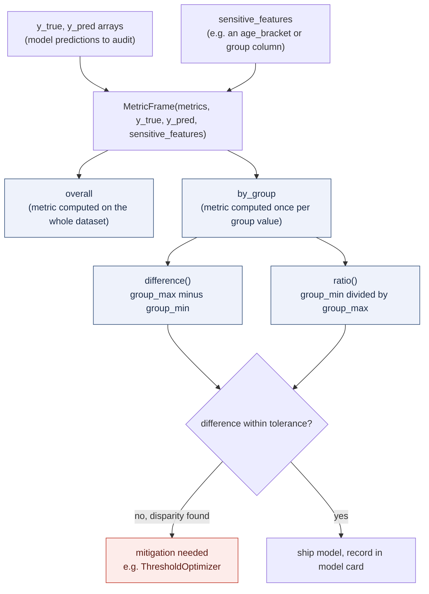
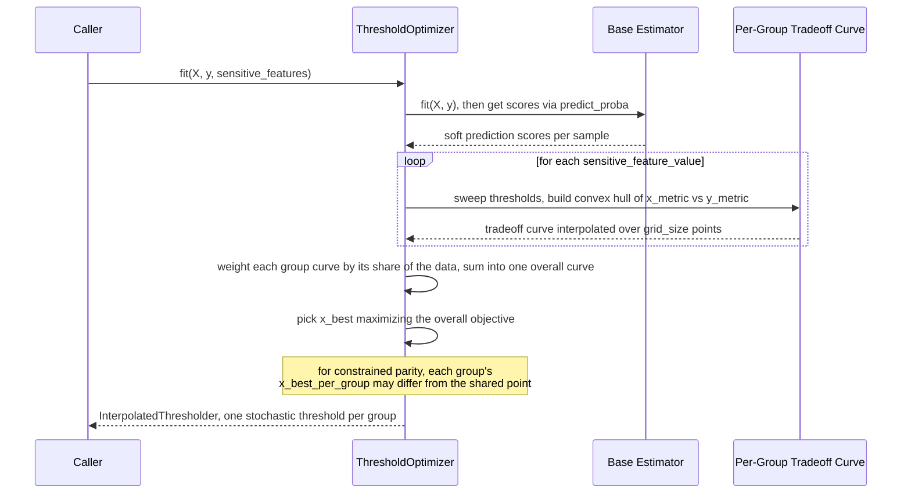

**TL;DR:** Why can't a single accuracy score catch discriminatory model behavior, and what does it actually take to detect and mitigate bias in a production model? Because accuracy is an average across the entire dataset, and averages hide subgroup harm by construction -- a model can be 96% accurate overall while being wrong twice as often for one group as another; catching that requires computing every metric *per sensitive-feature group* first, then explicitly comparing those groups, which is exactly what a fairness-metrics library like Fairlearn's `MetricFrame` is built to do, and what a bias-mitigation technique like `ThresholdOptimizer` uses those per-group numbers to fix.

**Real repo:** [`fairlearn/fairlearn`](https://github.com/fairlearn/fairlearn)

## 1. The Engineering Problem: an aggregate metric can't see what it never disaggregates

A model evaluation pipeline that reports one accuracy number, one AUC, one F1 score has already thrown away the information needed to catch bias. Consider a loan-approval or hiring model: if it's 95% accurate for one demographic group and 80% accurate for another, the blended accuracy across the whole dataset might still land at a respectable 92% -- a number that looks fine on a dashboard and passes every "accuracy above threshold" CI gate, while quietly failing one group of applicants at four times the rate of another.

This isn't a hypothetical edge case; it's the default failure mode of aggregate metrics. Standard `sklearn.metrics.accuracy_score(y_true, y_pred)` takes flat arrays and returns a scalar -- there is no group axis in the computation at all. To catch subgroup harm, you need to split the evaluation set by a sensitive feature (race, gender, age bracket, disability status, or any other legally or ethically protected attribute) *before* computing the metric, then compare the per-group results against each other. And once you've found a disparity, "we'll just retrain" isn't automatically a fix -- you need a way to constrain a model (or post-process its outputs) so that a fairness criterion is actually enforced, not just measured. Regulatory pressure (the EU AI Act's high-risk-system obligations, NYC Local Law 144's bias-audit requirement for hiring tools) has made this a production requirement, not a research nicety: teams now need to *compute and document* disaggregated metrics and mitigation results before a model can ship, which is the accountability layer a "model card" is meant to standardize.

---

## 2. The Technical Solution: compute every metric per group first, then compare groups explicitly

Fairlearn splits this into two separate, composable jobs. First, **`MetricFrame`** takes any metric function (accuracy, precision, false-positive rate, or a custom callable) plus `y_true`, `y_pred`, and a `sensitive_features` array, and computes that metric *once per distinct value of the sensitive feature* -- never a single blended number. From the resulting per-group table (`by_group`), it derives two comparison scalars: `difference()` (the largest gap between any two groups) and `ratio()` (the smallest group-to-group ratio, always ≤ 1). Those two numbers are the actual bias signal: a `difference()` near 0 or a `ratio()` near 1 means the groups are being treated similarly by whatever metric you chose; a large gap means they aren't.



Second, when a disparity is found, **`ThresholdOptimizer`** (a *postprocessing* mitigation technique) fixes it without retraining the underlying model. It takes the base estimator's existing prediction scores and searches for a *separate decision threshold per sensitive-feature group* that satisfies a fairness constraint (`demographic_parity`, `equalized_odds`, or several others) while maximizing an objective (accuracy, selection rate). Crucially, the per-group threshold it produces is usually **stochastic, not a fixed cutoff** -- because the achievable fairness/accuracy tradeoff points for different groups rarely land on exactly the same score threshold, so Fairlearn interpolates between two adjacent points on each group's ROC-style convex hull and randomizes between them at prediction time to hit the exact target rate.



Three core truths to hold: (1) the sensitive feature is never a model input -- it's only used to *slice the evaluation and, for mitigation, to select which per-group threshold applies at inference time*; (2) `difference()`/`ratio()` are computed two ways (`between_groups`, the max gap among all groups; `to_overall`, each group's gap from the blended baseline) because "how far apart are the worst two groups" and "how far is each group from the population average" answer different audit questions; (3) mitigation via postprocessing changes *decisions*, not the model's learned representation -- it's fast and model-agnostic, but it only works when the sensitive feature is available at prediction time, which isn't always true in production.

---

## 3. The clean example (concept in isolation)

```python
# What MetricFrame formalizes, written out by hand first.
import pandas as pd
from sklearn.metrics import accuracy_score

y_true = [1, 0, 1, 1, 0, 1, 0, 0, 1, 0]
y_pred = [1, 0, 1, 0, 0, 1, 1, 0, 1, 0]
# The sensitive feature: never fed to the model, only used to slice results.
group  = ["A", "A", "A", "A", "A", "B", "B", "B", "B", "B"]

df = pd.DataFrame({"y_true": y_true, "y_pred": y_pred, "group": group})

# The mistake: one blended number hides everything.
overall_accuracy = accuracy_score(df.y_true, df.y_pred)

# The fix: compute the SAME metric once per group before comparing.
by_group = df.groupby("group").apply(
    lambda g: accuracy_score(g.y_true, g.y_pred)
)
# by_group -> {"A": 0.8, "B": 1.0}

difference = by_group.max() - by_group.min()   # 0.2 -- the bias signal
ratio = by_group.min() / by_group.max()          # 0.8 -- same signal, scaled 0-1

# overall_accuracy (0.9) looks fine in isolation;
# difference (0.2) is what would actually fail a fairness gate.
```

---

## 4. Production reality (from `fairlearn/fairlearn`)

```
fairlearn/
├── metrics/
│   └── _metric_frame.py         # MetricFrame: disaggregated metric computation
└── postprocessing/
    └── _threshold_optimizer.py  # ThresholdOptimizer: per-group threshold mitigation
```

### `MetricFrame.__init__` -- every metric gets computed against the full data, split by sensitive feature

```python
# fairlearn/metrics/_metric_frame.py

class MetricFrame:
    def __init__(
        self,
        *,
        metrics: Callable | dict[str, Callable],
        y_true,
        y_pred,
        sensitive_features,
        control_features=None,
        sample_params: dict[str, Any] | dict[str, dict[str, Any]] | None = None,
        n_boot: int | None = None,
        ci_quantiles: list[float] | None = None,
        random_state: int | np.random.RandomState | None = None,
    ):
        check_consistent_length(y_true, y_pred)

        y_t = _convert_to_ndarray_and_squeeze(y_true)
        y_p = _convert_to_ndarray_and_squeeze(y_pred)

        all_data = pd.DataFrame.from_dict({"y_true": list(y_t), "y_pred": list(y_p)})

        annotated_funcs = self._get_annotated_metric_functions(metrics, sample_params, all_data)

        # Prepare the sensitive features -- these become extra columns
        # joined onto y_true/y_pred, never inputs to any metric function.
        sf_list = self._process_features("sensitive_feature_", sensitive_features, y_t)
        self._sf_names = [x.name_ for x in sf_list]

        for sf in sf_list:
            all_data[sf.name_] = sf.raw_feature_

        self._result_cache = dict()

        # DisaggregatedResult groups all_data by sensitive_feature columns
        # and evaluates every annotated metric function once per group.
        result = DisaggregatedResult.create(
            data=all_data,
            annotated_functions=annotated_funcs,
            sensitive_feature_names=self._sf_names,
            control_feature_names=self._cf_names,
        )
        self._populate_results(result)
```

What this teaches that a hello-world can't:

- **The sensitive feature is joined into `all_data` as a plain column, then grouped on** -- there's no special-cased fairness math here; `MetricFrame` reduces to a `groupby` under the hood, the same operation the clean example did by hand. The value it adds is doing that groupby consistently across *any* metric function, including multi-argument ones needing `sample_params` (e.g. `fbeta_score` needing a `beta` kwarg), and caching every derived view (`overall`, `by_group`, `group_max`, `group_min`) off one pass.
- **`control_features` exist for a reason `y_true`/`y_pred` alone can't express** -- they let you condition metrics on a non-sensitive variable (e.g. loan amount bracket) *before* slicing by the sensitive feature, so `overall` itself becomes per-control-value rather than a single number. This matters when fairness needs to be assessed within a stratum, not across the whole population where a confound could mask the real disparity.
- **`n_boot`/`ci_quantiles` bootstrap confidence intervals around every one of those derived numbers** -- a `difference()` of 0.03 computed on 40 samples per group is not the same evidence as the same 0.03 computed on 40,000; without a CI, both would look identical to a downstream gate.

### `difference()` and `ratio()` -- the two ways to turn a per-group table into a single bias signal

```python
# fairlearn/metrics/_metric_frame.py

    def difference(
        self,
        method: Literal["between_groups", "to_overall"] = "between_groups",
        errors: Literal["raise", "coerce"] = "coerce",
    ) -> Any | pd.Series | pd.DataFrame:
        """Return the maximum absolute difference between groups for each metric.

        The value ``between_groups`` computes the maximum difference between
        any two pairs of groups in the by_group property (i.e.
        group_max() - group_min()). Alternatively, ``to_overall``
        computes the difference between each subgroup and the
        corresponding value from overall... The result is the
        absolute maximum of these values.
        """
        if method not in _COMPARE_METHODS:
            raise ValueError(_INVALID_COMPARE_METHOD.format(method))
        value = self._result_cache["difference"][method][errors]
        if isinstance(value, Exception):
            raise value
        return value

    def ratio(
        self,
        method: Literal["between_groups", "to_overall"] = "between_groups",
        errors: Literal["raise", "coerce"] = "coerce",
    ) -> Any | pd.Series | pd.DataFrame:
        """Return the minimum ratio between groups for each metric.

        The value ``between_groups`` computes the minimum ratio between
        any two pairs of groups (i.e. group_min() / group_max()).
        """
        if method not in _COMPARE_METHODS:
            raise ValueError(_INVALID_COMPARE_METHOD.format(method))
        value = self._result_cache["ratio"][method][errors]
        if isinstance(value, Exception):
            raise value
        return value
```

What this teaches that a hello-world can't:

- **`errors="coerce"` is the default, not `"raise"`** -- unlike most of the library, `difference()`/`ratio()` default to silently producing `NaN` for a group where the metric couldn't be computed (e.g. a group with zero positive labels, making a recall undefined) rather than crashing the whole audit. A fairness report that halts on the first empty subgroup is worse than one that flags that subgroup as unmeasurable and keeps going.
- **`between_groups` and `to_overall` answer different audit questions** -- `between_groups` (`group_max - group_min`) finds the worst pairwise gap, the number a regulator asking "how differently are your worst two groups treated" wants. `to_overall` finds the largest gap from the blended baseline, which is what you'd want if the question is "how far does any one group deviate from the model's average behavior." Reporting only one of these can pass a fairness review that the other would fail.
- **Both are cached, not recomputed on each call** -- `self._result_cache["difference"][method][errors]` is populated once in `_populate_results`, so calling `difference()` in both a CI report and a model-card generator doesn't silently diverge if the underlying data changed between calls.

### `ThresholdOptimizer._threshold_optimization_for_simple_constraints` -- a separate threshold per group, chosen from a shared tradeoff curve

```python
# fairlearn/postprocessing/_threshold_optimizer.py

    def _threshold_optimization_for_simple_constraints(
        self, sensitive_features, labels, scores
    ) -> InterpolatedThresholder:
        n = len(labels)
        self._tradeoff_curve = {}
        self._x_grid = np.linspace(0, 1, self.grid_size + 1)

        data_grouped_by_sensitive_feature = _reformat_and_group_data(
            sensitive_features, labels, scores
        )
        sensitive_feature_proportions = {}

        for sensitive_feature_value, group in data_grouped_by_sensitive_feature:
            p_sensitive_feature_value = len(group) / n
            sensitive_feature_proportions[sensitive_feature_value] = p_sensitive_feature_value

            metrics_curve_convex_hull = _tradeoff_curve(
                group, sensitive_feature_value, flip=self.flip,
                x_metric=self.x_metric_, y_metric=self.y_metric_,
            )
            self._tradeoff_curve[sensitive_feature_value] = _interpolate_curve(
                metrics_curve_convex_hull, "x", "y", "operation", self._x_grid
            )

        if not self.tol:
            # Weight each group's curve by its share of the data, then find
            # the single x value that maximizes the WEIGHTED SUM -- this is
            # what forces every group to land on the same constraint value.
            overall_tradeoff_curve = pd.concat(
                [p * self._tradeoff_curve[value]["y"]
                 for value, p in sensitive_feature_proportions.items()],
                axis=1,
            ).sum(axis=1)

            i_best = overall_tradeoff_curve.idxmax()
            self._x_best = self._x_grid[i_best]
            self._x_best_per_group = {
                group: self._x_best for group in sensitive_feature_proportions.keys()
            }
```

What this teaches that a hello-world can't:

- **The x-axis (`x_metric_`) *is* the fairness constraint, not a separate check bolted on afterward** -- for `demographic_parity`, `x_metric_` is `selection_rate`; every group's tradeoff curve is interpolated onto the *same* `x_grid` of selection-rate values, so picking one shared `i_best` index automatically forces every group to the same selection rate. The constraint is enforced by construction (shared x-axis), not by a post-hoc filter that discards non-compliant thresholds.
- **`_x_best_per_group` can differ per group even though `_x_best` is shared** -- because each group's own tradeoff curve was independently built from its own ROC-style convex hull, the *y-value* (objective, e.g. accuracy) achieved at the shared `x_best` differs by group, and the *threshold* achieving that y-value on the original score scale differs by group too. This is the mechanism: same target constraint value, different per-group decision boundary to reach it.
- **The `tol` branch (elided above) exists because exact parity is sometimes too costly** -- `maximize_objective_with_tolerance` relaxes the "must land on exactly the same x value" requirement to "within `tol` of each other," trading a small amount of measured unfairness for a meaningfully higher accuracy; this is a deliberate, auditable tradeoff parameter, not a bug in the constraint.

---

## Review checklist

- [ ] **Every fairness metric is disaggregated by the sensitive feature before it's reported** -- a PR that reports only `overall` accuracy (or any single aggregate) without `by_group`, `difference()`, and `ratio()` alongside it hasn't actually measured for bias, only for average performance.
- [ ] **Both `between_groups` and `to_overall` are checked, not just one** -- they catch different failure shapes (worst pairwise gap vs. deviation from the population baseline); a review that only sees one number should ask which was omitted and why.
- [ ] **`errors="coerce"` results are inspected for `NaN`, not silently ignored** -- a `NaN` in `by_group` means a subgroup had too little data (or the wrong label distribution) to compute the metric at all, which is itself a finding worth flagging, not a row to drop.
- [ ] **If a mitigation like `ThresholdOptimizer` is used, confirm the sensitive feature is actually available at prediction time in production** -- postprocessing mitigation requires the same sensitive feature at inference that was used to fit it; if that attribute isn't collected/permitted downstream, the mitigation silently can't apply and the unmitigated model ships instead.

---

## FAQ

**Q: Why does `difference()` default to `errors="coerce"` while most of Fairlearn defaults to raising?**
A: Because a fairness audit that crashes on the first subgroup with an undefined metric (e.g. zero positive labels for a small demographic slice) is less useful than one that reports `NaN` for that subgroup and continues -- the missing value is itself informative (the subgroup was too small to measure), and `_result_cache["difference"][method]["coerce"]` preserves that signal instead of hiding it behind an exception.

**Q: Is `ThresholdOptimizer` fixing the model, or just changing which predictions get returned?**
A: The latter. It's a *postprocessing* technique: the underlying estimator (`self.estimator_`) is untouched; `_threshold_optimization_for_simple_constraints` only decides, per sensitive-feature group, where to cut the estimator's existing score output. This is why it's fast (no retraining) but also why it requires the sensitive feature at prediction time -- there's no learned representation change to fall back on.

**Q: Why is the chosen threshold often randomized instead of a fixed cutoff?**
A: Because each group's achievable (x_metric, y_metric) points form a discrete convex hull, and the exact target x-value (`x_best`) usually falls *between* two of those achievable points, not on one. `InterpolatedThresholder` handles this by randomizing between the two adjacent deterministic thresholds with a probability chosen so the *expected* outcome lands exactly on the target -- a single fixed threshold could only approximate it.

**Q: How does this connect to a "model card"?**
A: A model card is the documentation layer that reports exactly the numbers `MetricFrame` computes -- `by_group`, `difference()`, `ratio()`, and (if mitigation was applied) which constraint and objective `ThresholdOptimizer` was configured with -- in a standardized, human-readable format alongside intended use and known limitations. The metrics library and the model card aren't separate concerns: the card is only as trustworthy as the disaggregation that fed it.

**Q: Does a low `difference()` on the training/validation split guarantee fairness in production?**
A: No -- the same training-serving skew problem that applies to any metric applies here. `MetricFrame` measures whatever `sensitive_features` and `y_true`/`y_pred` it's given; if the production population's group distribution shifts (data drift) or the sensitive feature itself becomes unavailable at serving time, the measured parity can silently stop reflecting reality, which is why fairness metrics need the same ongoing monitoring discipline as any drift-sensitive metric, not a one-time pre-launch check.

---

## Source

- **Concept:** Disaggregated fairness metrics and postprocessing bias mitigation
- **Domain:** mlops
- **Repo:** [fairlearn/fairlearn](https://github.com/fairlearn/fairlearn) → [`fairlearn/metrics/_metric_frame.py`](https://github.com/fairlearn/fairlearn/blob/main/fairlearn/metrics/_metric_frame.py) — the `MetricFrame` class that computes any metric once per sensitive-feature group and derives `difference()`/`ratio()` bias signals; [`fairlearn/postprocessing/_threshold_optimizer.py`](https://github.com/fairlearn/fairlearn/blob/main/fairlearn/postprocessing/_threshold_optimizer.py) — the `ThresholdOptimizer` class that mitigates a measured disparity by choosing a separate, often stochastic, decision threshold per group.

---

**Next in the MLOps series:** [ML Infrastructure at Scale: How Ray Serve's Deployment Scheduler Bin-Packs GPU Replicas Across a Cluster]({{ '/mlops/ray-serve-gpu-scheduling-gang-placement-groups/' | relative_url }})


