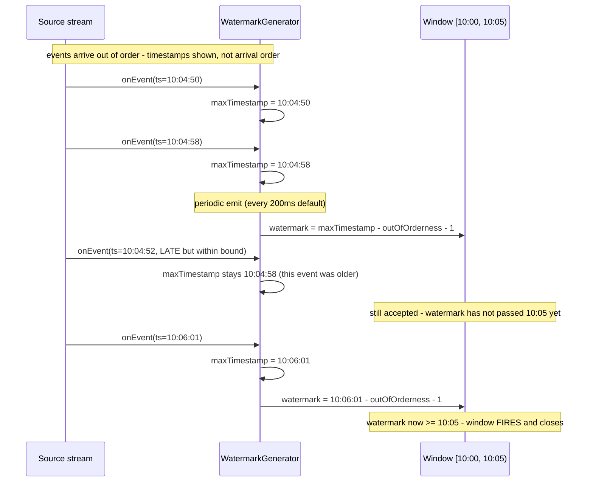

**TL;DR:** In a stream, "now" isn't when a record arrives — it's the timestamp stamped on the event itself, and a late network hop or a straggling partition can deliver an "old" event well after "newer" ones. Flink solves the resulting "how do I know a 10:00-10:05 window is safe to close" problem with **watermarks**: a periodically emitted signal, computed from the maximum event timestamp seen minus a bounded out-of-orderness allowance, that tells every downstream window "no event older than this will arrive from here on" — window firing is watermark-triggered, not clock-triggered.

**Real repo:** [`apache/flink`](https://github.com/apache/flink)

## 1. The Engineering Problem: a table has one clock, a stream has as many clocks as it has sources

A relational table's rows don't have a race condition about *when* they became true — a query sees whatever committed state exists at query time. A stream is different: events carry their own **event time** (when the event actually happened — a sensor reading, a click), which is not the same as **processing time** (when your system receives it). Network delays, retries, partition rebalances, and out-of-order delivery within a single Kafka partition all mean event #47 can physically arrive after event #52, even though its timestamp is earlier.

If a system just used wall-clock arrival time to decide "the 10:00-10:05 window is done, sum it and emit," it would silently drop every late-arriving event and produce answers that are wrong in a way nobody notices until an audit. Batch tooling sidesteps this by waiting for a whole file to land before processing it; a stream has no "whole file" — it's unbounded, so *something* has to decide, continuously, when a window has enough data to close, without waiting forever.

---

## 2. The Technical Solution: watermarks are a lower-bound promise, not the newest timestamp

A **watermark** is a special record injected into the stream that says "event time has now progressed to W — no future event with a timestamp less than W will arrive after this point." It is not the current maximum timestamp seen; it is that maximum **minus** a bounded slack for how out-of-order the source is allowed to be. A window assigned to `[10:00, 10:05)` only fires once a watermark of `10:05` or later passes through — not when the wall clock hits 10:05, and not the instant the first `10:05`-stamped event arrives.



Two core truths this diagram encodes: **the watermark generator only ever tracks a maximum**, never a full sorted buffer of every timestamp seen — it's a single running `long`, not a priority queue, which is why watermark generation is cheap even under high throughput. And **the out-of-orderness bound is a deliberate lossy tradeoff, not a guarantee**: any event older than `watermark - outOfOrdernessMillis` when it arrives is, by definition, "too late" for its window and is either dropped or routed to a side output — widening the bound catches more late events at the cost of delaying every window's result by that same amount.

---

## 3. The clean example (concept in isolation)

```java
// A minimal bounded-out-of-orderness watermark generator, stripped to the mechanism
class SimpleWatermarkGenerator {
    private long maxTimestamp = Long.MIN_VALUE;
    private final long outOfOrdernessMillis;

    SimpleWatermarkGenerator(long boundMillis) {
        this.outOfOrdernessMillis = boundMillis;
    }

    // Called once per event - only ever tracks the maximum seen so far
    void onEvent(long eventTimestamp) {
        maxTimestamp = Math.max(maxTimestamp, eventTimestamp);
    }

    // Called periodically (e.g. every 200ms), not per event
    long emitWatermark() {
        return maxTimestamp - outOfOrdernessMillis - 1;
    }
}
```

---

## 4. Production reality (from `apache/flink`)

```
flink-core/.../org/apache/flink/api/common/eventtime/
  BoundedOutOfOrdernessWatermarks.java   <- watermark generation mechanism

flink-streaming-java/.../windowing/assigners/
  TumblingEventTimeWindows.java          <- window boundary assignment
```

```java
// flink-core/src/main/java/org/apache/flink/api/common/eventtime/BoundedOutOfOrdernessWatermarks.java
public class BoundedOutOfOrdernessWatermarks<T> implements WatermarkGenerator<T> {

    /** The maximum timestamp encountered so far. */
    private long maxTimestamp;

    /** The maximum out-of-orderness that this watermark generator assumes. */
    private final long outOfOrdernessMillis;

    public BoundedOutOfOrdernessWatermarks(Duration maxOutOfOrderness) {
        this.outOfOrdernessMillis = maxOutOfOrderness.toMillis();
        // start so that our lowest watermark would be Long.MIN_VALUE.
        this.maxTimestamp = Long.MIN_VALUE + outOfOrdernessMillis + 1;
    }

    @Override
    public void onEvent(T event, long eventTimestamp, WatermarkOutput output) {
        maxTimestamp = Math.max(maxTimestamp, eventTimestamp);
    }

    @Override
    public void onPeriodicEmit(WatermarkOutput output) {
        output.emitWatermark(new Watermark(maxTimestamp - outOfOrdernessMillis - 1));
    }
}
```

```java
// flink-streaming-java/.../windowing/assigners/TumblingEventTimeWindows.java
public class TumblingEventTimeWindows extends WindowAssigner<Object, TimeWindow> {
    private final long size;

    @Override
    public Collection<TimeWindow> assignWindows(
            Object element, long timestamp, WindowAssignerContext context) {
        if (timestamp > Long.MIN_VALUE) {
            long start =
                    TimeWindow.getWindowStartWithOffset(
                            timestamp, (globalOffset + staggerOffset) % size, size);
            return Collections.singletonList(new TimeWindow(start, start + size));
        } else {
            throw new RuntimeException(
                    "Record has Long.MIN_VALUE timestamp (= no timestamp marker). "
                            + "Is the time characteristic set to 'ProcessingTime', or did you forget to call "
                            + "'DataStream.assignTimestampsAndWatermarks(...)'?");
        }
    }

    @Override
    public Trigger<Object, TimeWindow> getDefaultTrigger() {
        return EventTimeTrigger.create();
    }
}
```

What this teaches that a hello-world can't:

- **`onEvent` and `onPeriodicEmit` are two separate callbacks on two separate cadences.** `onEvent` runs once per record and only ever does a `Math.max` — O(1), no allocation, safe at millions of events/sec. `onPeriodicEmit` runs on a timer (default every 200ms), independent of event volume. Splitting "track the max" from "decide what to emit" is what keeps watermark generation cheap regardless of throughput.
- **`getDefaultTrigger()` returns `EventTimeTrigger`, not a size- or count-based trigger.** The window assigner only computes *which* window `[start, start+size)` an element belongs to; a separate `Trigger` object decides *when* that window actually fires its result. `EventTimeTrigger` fires precisely when a watermark passes the window's end — the assigner and the firing decision are deliberately decoupled components, not one monolithic "window" class.
- **The `RuntimeException` in `assignWindows` for `Long.MIN_VALUE` timestamps is a deliberate fail-fast, not defensive boilerplate.** It exists because a stream running in `ProcessingTime` mode — or one where a user forgot to attach a `WatermarkStrategy` — has no real event-time timestamps at all; letting that silently fall through to `TumblingEventTimeWindows` would produce windows that never correctly close, which is worse than crashing immediately with a message that names the actual missing step.

Known-stale fact: "windowing" is sometimes described as if the window itself decides when it's full, like a bucket with a capacity. In Flink's real event-time model, the window only ever defines a `[start, end)` boundary — it holds no opinion about closing itself. Closing is entirely the watermark's decision, propagated through the separately pluggable `Trigger`; a window with an `end` of `10:05` can sit open indefinitely if watermarks stop advancing (e.g. one idle source partition), which is exactly why Flink also ships idle-source detection as a separate mechanism.

---

## 5. Review checklist

- **Is the out-of-orderness bound (`maxOutOfOrderness`) sized to the source's real worst-case lag, not a guess?** Too small silently drops legitimately late data as "too late"; too large delays every window's result by that same amount — check it against the actual source's delivery characteristics (Kafka partition skew, retry windows), not a round number.
- **Does every source in the job actually advance its watermark, including low-traffic ones?** A single idle partition that never emits a watermark can stall every downstream window keyed across all partitions, since Flink's watermark for a keyed stream is the *minimum* across its input partitions.
- **Is late data explicitly routed (side output) rather than silently dropped?** `assignWindows` and the trigger don't warn you when data misses its window — if the pipeline has no side-output handling for late events, verify that's an accepted tradeoff, not an oversight.
- **Is the window assigner's time characteristic (event time vs. processing time) actually wired via `assignTimestampsAndWatermarks(...)`?** The `RuntimeException` above only fires at runtime, not at compile time — a PR review should confirm the watermark strategy is attached to the same stream the event-time window assigner is applied to.

## 6. FAQ

**Q: Why subtract 1 in `maxTimestamp - outOfOrdernessMillis - 1`?**
A: Flink's window boundaries are treated as `[start, end)` — end-exclusive. Watermarks representing "time has progressed to W" need to guarantee no future event at exactly the window's end timestamp still belongs to that window; subtracting 1 millisecond keeps the semantics of "strictly less than" consistent at the boundary rather than off-by-one including an event that should belong to the next window.

**Q: Could you just make the out-of-orderness bound infinite and never lose late data?**
A: Then no window would ever fire, because the watermark would never pass any window's end — an infinite bound is equivalent to processing-time semantics with unbounded latency. The bound is the deliberate latency-vs-completeness knob; `BoundedOutOfOrdernessWatermarks` exists specifically to make that tradeoff a configurable `Duration` rather than an unstated assumption.

**Q: Is `TumblingEventTimeWindows` the only window type, or are there overlapping windows?**
A: The same package also ships `SlidingEventTimeWindows` (overlapping fixed-size windows, one element can belong to several) and session windows (gap-based, no fixed size). All of them separate "which window(s) does this element belong to" (the assigner) from "when does a window fire" (the trigger) the same way tumbling windows do — the mechanism shown here generalizes.

**Q: What actually happens to a watermark once `onPeriodicEmit` produces it?**
A: It's injected into the stream as a special record and flows through operators alongside regular data. A downstream operator with multiple input streams (a keyed window across partitions) takes the *minimum* watermark across all its inputs before advancing its own — one slow or idle partition holds back every window relying on that operator's combined watermark, which is why source parallelism and partition skew directly affect result latency, not just throughput.

**Q: Does a bigger out-of-orderness bound cost more memory, not just latency?**
A: Yes — Flink has to keep window state (the accumulated aggregation, or buffered elements for non-aggregating windows) open in state backend storage for as long as the window can still receive in-bound data, which is directly tied to the bound. A larger bound means more concurrently-open window state at any moment, which is a real capacity-planning input, not just a tuning knob for correctness.

---

## Source

- **Concept:** Stream processing architectures (event-time processing, watermarks, windowing)
- **Domain:** databases
- **Repo:** [apache/flink](https://github.com/apache/flink) → [`flink-core/.../eventtime/BoundedOutOfOrdernessWatermarks.java`](https://github.com/apache/flink/blob/release-1.20/flink-core/src/main/java/org/apache/flink/api/common/eventtime/BoundedOutOfOrdernessWatermarks.java), [`flink-streaming-java/.../assigners/TumblingEventTimeWindows.java`](https://github.com/apache/flink/blob/release-1.20/flink-streaming-java/src/main/java/org/apache/flink/streaming/api/windowing/assigners/TumblingEventTimeWindows.java) — the reference open-source stream processing engine, whose event-time and watermark model most other stream processors (Kafka Streams, Spark Structured Streaming) converged toward.

---

**Next in the Databases series:** [Time-Series Databases: Why a Time-Ordered Table Needs Its Own Chunking, Not Just an Index]({{ '/databases/time-series-databases-hypertable-chunking/' | relative_url }})


