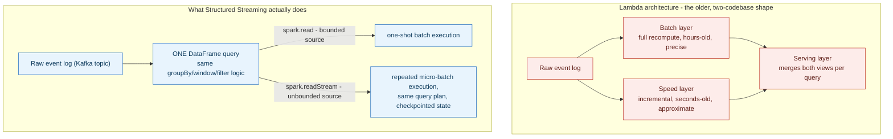
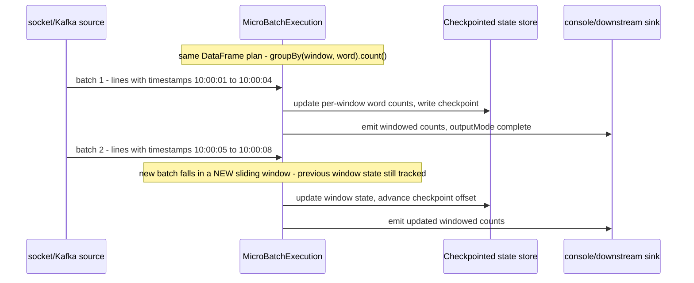

**TL;DR:** If a system's whole job IS moving and transforming data at scale, does correctness (a precise, complete batch recompute) really require a different codebase than speed (a fast, incremental streaming view)? The Lambda architecture assumed yes and paid for it with two pipelines to build, test, and keep logically in sync. Apache Spark's Structured Streaming engine shows the mechanism that undoes that assumption: the same DataFrame transformation compiles to either a one-shot batch job or a continuously re-triggered micro-batch job, depending only on whether the source was opened with `spark.read` or `spark.readStream` — collapsing Lambda's two layers into the Kappa architecture's one.

**Real repo:** [`apache/spark`](https://github.com/apache/spark)

## 1. The Engineering Problem: batch is precise but slow, streaming is fast but was historically a different system entirely

A data-intensive system — one where transforming and serving data at scale *is* the product, not an add-on to a CRUD app — usually needs two things that used to be in tension: a fresh, low-latency view of what just happened, and a correct, complete view that accounts for late-arriving or corrected data. Pre-2015-era architectures solved this with what's now called the **Lambda architecture**: a batch layer (e.g. a nightly Hadoop/Spark job that recomputes precise aggregates over all historical data) and a separate speed layer (e.g. a Storm topology maintaining fast, approximate incremental aggregates), reconciled at a serving layer that merges both views for queries.

The practical cost of that split was never the theory — it was that batch and speed layers were usually written in different frameworks, by different teams, using different logic that had to independently reimplement the *same business transformation twice* and stay behaviorally consistent. A bug fix to how "revenue" is computed had to be ported to both the batch job and the streaming job, or the two views would silently disagree, and disagreement between the fast and correct views is exactly the failure mode a data-intensive system can least afford — it looks like the system is lying to different callers depending on which layer answered.

---

## 2. The Technical Solution: one query, two source modes — the engine treats streaming as batch with a trigger

Spark's Structured Streaming API answers this by not distinguishing batch and streaming at the transformation level at all. A `DataFrame` built from `spark.read.format("kafka")...` (batch, bounded) and one built from `spark.readStream.format("kafka")...` (streaming, unbounded) support the *same* `.groupBy()`, `.select()`, `.filter()` operations — the streaming engine internally represents an unbounded stream as an ever-growing table and re-runs (or incrementally updates) the same query plan against it on each micro-batch trigger. This is the real mechanism behind the **Kappa architecture** — a single stream-processing pipeline, where a "batch" reprocessing job is just the same pipeline replayed over the retained log from the beginning, instead of a structurally separate system.



Structured Streaming's windowed-aggregation execution, made concrete over time:



Three core truths to hold onto:

1. **The unification is at the query-definition level, not a coincidence of shared library imports.** `spark.read` and `spark.readStream` return the same `DataFrame`/`Dataset` type and accept the same transformation methods — a team genuinely writes the transformation logic once, and chooses bounded vs unbounded only at the source/sink configuration boundary.
2. **"Batch" in this model is a special case of streaming, not a separate paradigm** — a Kappa-style reprocess of historical data is the identical query run with `spark.read` against the retained log instead of `spark.readStream` against its live tail. This is why fixing a bug in the transformation logic here means fixing it in exactly one place.
3. **Checkpointing (`checkpointLocation`) is what makes the streaming side fault-tolerant without a separate speed-layer system to operate** — offsets and aggregation state are persisted so a restarted streaming query resumes from where it left off, rather than needing an entirely different recovery story than the batch job.

---

## 3. The clean example (concept in isolation)

```scala
// unified_query.scala - the SAME transformation, run two ways

val spark = SparkSession.builder().appName("clean-example").getOrCreate()
import spark.implicits._

def wordCounts(lines: DataFrame): DataFrame =
  lines.as[String].flatMap(_.split(" ")).toDF("word").groupBy("word").count()

// batch mode - bounded, one-shot, reads what's there right now
val batchLines = spark.read.format("text").load("s3://bucket/historical/")
wordCounts(batchLines).write.format("parquet").save("s3://bucket/output/")

// streaming mode - unbounded, re-triggered, reads what arrives continuously
val streamLines = spark.readStream.format("kafka")
  .option("subscribe", "lines-topic").load().selectExpr("CAST(value AS STRING)")
wordCounts(streamLines.toDF("value")).writeStream
  .outputMode("complete").format("console")
  .option("checkpointLocation", "/tmp/checkpoints/wordcount")
  .start()

// wordCounts() is defined exactly once - the ONLY difference between the two
// call sites is .read vs .readStream and a checkpointLocation for the second
```

---

## 4. Production reality (from `apache/spark`)

```
apache/spark/
└── examples/src/main/scala/org/apache/spark/examples/sql/streaming/
    ├── StructuredKafkaWordCount.scala          # unbounded source, checkpointed sink
    └── StructuredNetworkWordCountWindowed.scala # event-time windowed aggregation
```

**The Kafka-sourced streaming query — note this is genuinely just a `DataFrame` pipeline with a streaming source and sink:**

```scala
// examples/.../StructuredKafkaWordCount.scala (elided)

val lines = spark
  .readStream
  .format("kafka")
  .option("kafka.bootstrap.servers", bootstrapServers)
  .option(subscribeType, topics)
  .load()
  .selectExpr("CAST(value AS STRING)")
  .as[String]

// Generate running word count
val wordCounts = lines.flatMap(_.split(" ")).groupBy("value").count()

val query = wordCounts.writeStream
  .outputMode("complete")
  .format("console")
  .option("checkpointLocation", checkpointLocation)
  .start()

query.awaitTermination()
```

**Windowed aggregation by event time — this is the mechanism that lets a streaming query answer "counts per 10-second window," not just a running total:**

```scala
// examples/.../StructuredNetworkWordCountWindowed.scala (elided)

val lines = spark.readStream
  .format("socket")
  .option("host", host)
  .option("port", port)
  .option("includeTimestamp", true)
  .load()

// Split the lines into words, retaining timestamps
val words = lines.as[(String, Timestamp)].flatMap(line =>
  line._1.split(" ").map(word => (word, line._2))
).toDF("word", "timestamp")

// Group the data by window and word and compute the count of each group
val windowedCounts = words.groupBy(
  window($"timestamp", windowDuration, slideDuration), $"word"
).count().orderBy("window")

val query = windowedCounts.writeStream
  .outputMode("complete")
  .format("console")
  .option("truncate", "false")
  .start()
```

What this teaches that a hello-world can't:

- **`StructuredKafkaWordCount`'s core transformation (`lines.flatMap(_.split(" ")).groupBy("value").count()`) is the exact same shape of code a batch word-count job would write against a static text file.** The only streaming-specific lines in the whole file are `.readStream`, `.format("kafka")`, and `.option("checkpointLocation", ...)` — everything else is ordinary `Dataset` API, which is the concrete evidence that this isn't "streaming with a batch-like API bolted on," it's genuinely one API.
- **`checkpointLocation` is not optional decoration — it's what the query uses to persist Kafka offsets and aggregation state between restarts**, and its absence is exactly why the file's usage docstring calls it out as defaulting to a randomized `/tmp` directory rather than silently doing nothing; without it, a restarted query has no record of what it already processed.
- **`window($"timestamp", windowDuration, slideDuration)` groups by a *computed* column, not a wall-clock trigger** — the window boundaries are derived from the event's own `timestamp` field (extracted via `includeTimestamp` on the socket source), not from when Spark happened to process the row. This is the seed of proper event-time semantics (as opposed to processing-time, which would silently misattribute late-arriving events to the wrong window).

Known-stale fact: the Lambda architecture is still frequently taught as the default answer to "how do you get both a fast and a correct view of streaming data," with the two-codebase split presented as inherent to the problem. It was inherent to the *processing engines available in 2011* (Storm's speed layer genuinely couldn't do exact, replayable, windowed aggregation the way a batch engine could). A unified engine that treats bounded and unbounded sources as the same query — Structured Streaming here, Flink's Table API is another real example — removes the need for a second codebase for most workloads; Lambda's two-layer split is now a fallback for cases where the speed layer's approximation genuinely can't be made exact economically, not the default starting design.

---

## 5. Review checklist

- **Is the core transformation logic (aggregations, joins, filters) written once and reused across batch and streaming entry points, or duplicated between a "batch job" and a "streaming job" that are supposed to compute the same thing?** Duplication here is exactly the Lambda-architecture failure mode a unified engine exists to remove — check for two independently-maintained implementations of the same business logic before accepting that a system genuinely needs them.
- **Does every streaming query set `checkpointLocation` (or the engine's equivalent durable-state mechanism) pointed at storage that survives a restart, not a throwaway or default temp path?** A streaming query without durable checkpointing loses its resume position on every crash or redeploy.
- **Is windowing keyed off an event-time column extracted from the data itself, or off processing time (when Spark happened to see the row)?** Processing-time windowing silently misattributes events during any backpressure, retry, or replay — check which column `window()` (or equivalent) is actually grouping by.
- **When a "batch reprocessing" need comes up, is the plan to replay the same streaming query against retained history, or to stand up a structurally separate batch pipeline?** The former is the Kappa-style answer this lesson demonstrates; the latter reintroduces Lambda's two-codebase cost and should have an explicit reason (e.g. the streaming engine genuinely can't express the needed batch-only computation).

## 6. FAQ

### Does using Structured Streaming mean a system never needs a Lambda-style two-layer design?
No — it removes the need for the *common* case, where the speed layer's incremental computation could in principle be made exact given enough engine sophistication. Some computations are still genuinely cheaper or only feasible as an approximate incremental structure (certain streaming sketches, for example); Lambda's split remains a legitimate answer there. The change is that it's no longer the default starting design for "I need fast and correct."

### What does `outputMode("complete")` in these examples actually mean, and is it required for streaming?
`complete` mode re-emits the entire updated result table on every trigger (all windows, not just changed ones) — appropriate for a small, bounded number of groups like a word count's distinct words. Larger streaming aggregations more commonly use `append` (only finalized rows, once a watermark closes them out) or `update` (only changed rows) to avoid re-emitting an ever-growing full result on every micro-batch.

### Why does `StructuredKafkaWordCount` call `.load()` before `.selectExpr("CAST(value AS STRING)")` instead of reading strings directly?
Kafka's Structured Streaming source always delivers `key`/`value` as raw bytes (`byte[]`, surfaced as Spark's `BinaryType`) regardless of what a producer originally serialized — this reflects that Kafka itself is schema-agnostic at the broker level; the `CAST` is the DataFrame-level deserialization step, exactly where a schema-registry-aware deserializer would also plug in for a production Avro/Protobuf topic.

### Is `window($"timestamp", windowDuration, slideDuration)` the same mechanism as a watermark?
No, and the example lesson's file doesn't use `withWatermark` at all — windowing groups rows into time buckets by event timestamp; a watermark is a separate declaration of how long the engine should wait for late data before finalizing a window and dropping state for it. A production windowed aggregation over an unbounded, potentially-late-arriving stream typically needs both: windowing to bucket events, and a watermark to bound how much state the engine has to retain per window before it can safely be forgotten.

---

## Source

- **Concept:** Data-intensive application architecture — stream processing, batch processing, and the Lambda/Kappa architecture tradeoff
- **Domain:** architecture
- **Repo:** [apache/spark](https://github.com/apache/spark) → [`examples/.../StructuredKafkaWordCount.scala`](https://github.com/apache/spark/blob/master/examples/src/main/scala/org/apache/spark/examples/sql/streaming/StructuredKafkaWordCount.scala), [`examples/.../StructuredNetworkWordCountWindowed.scala`](https://github.com/apache/spark/blob/master/examples/src/main/scala/org/apache/spark/examples/sql/streaming/StructuredNetworkWordCountWindowed.scala) — the real distributed processing engine's Structured Streaming API, unifying batch and streaming under one DataFrame query model.
