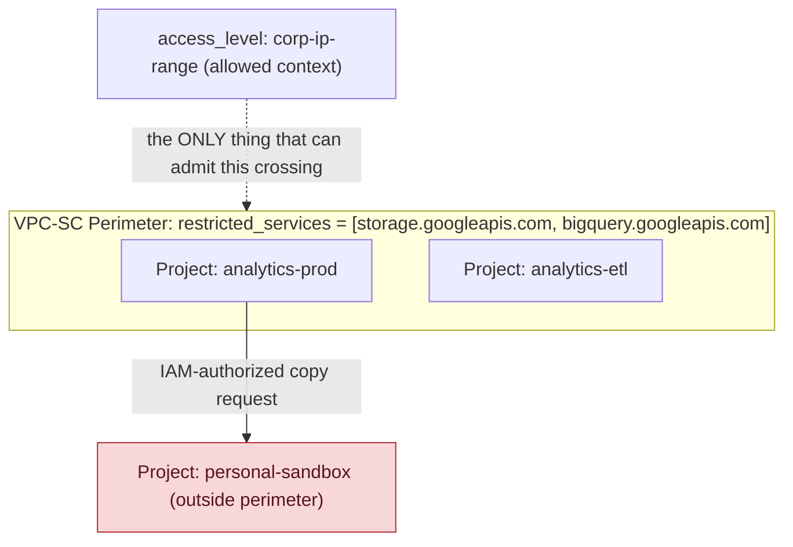

**TL;DR:** Why isn't correct IAM enough to stop a compromised, fully-authorized credential from copying a BigQuery dataset out to a personal Google account? Because IAM only ever answers "is this identity allowed to do this" — never "is this network context allowed to touch this resource at all." VPC Service Controls wraps a security perimeter around a set of projects (`google_access_context_manager_service_perimeter`) so that even a correctly-scoped, fully-authenticated principal is blocked from moving data across the boundary unless an explicit access level admits the request, while Organization Policy constraints (`google_organization_policy`) separately restrict which product-level behaviors are allowed at all, inherited down the org → folder → project hierarchy.

**Real repo:** [`terraform-google-modules/terraform-google-vpc-service-controls`](https://github.com/terraform-google-modules/terraform-google-vpc-service-controls) + [`terraform-google-modules/terraform-google-org-policy`](https://github.com/terraform-google-modules/terraform-google-org-policy)

## 1. The Engineering Problem: IAM answers "who," never "from where" or "what's allowed at all"

IAM's entire model is identity-and-permission: does this principal hold a role that grants this specific action on this specific resource. That model has a real gap — it says nothing about *context*. A service account with legitimate `roles/storage.objectViewer` on a bucket can be used to read that bucket from anywhere: a corporate workstation, a compromised laptop off the corp network, or a script running in a completely different, attacker-controlled GCP project that just happens to hold valid credentials. IAM authorized the *identity*; it never asked whether *this particular request*, from *this particular context*, should be allowed to move data across that boundary. This is exactly the failure mode behind most real cloud data-exfiltration incidents — not a missing IAM grant, but a correctly-granted identity used from the wrong place.

A second, unrelated gap: IAM also says nothing about which *product-level capabilities* are allowed to exist in a project at all. Nothing in IAM stops someone with `roles/editor` from creating a VM with a public IP, disabling a required encryption setting, or provisioning a resource type a compliance policy explicitly forbids for the org — as long as their role grants the action, IAM approves it, regardless of organizational policy.

GCP has two purpose-built, distinct answers: **VPC Service Controls (VPC-SC)**, a network-context perimeter around a set of resources, and **Organization Policy**, a hierarchical constraint system on which capabilities are allowed to be used at all. Both sit conceptually "above" IAM — a request has to clear IAM *and* whichever of these applies before it succeeds.

---

## 2. The Technical Solution: a perimeter that gates context, and constraints that gate capability, inherited down the hierarchy

A **VPC Service Controls perimeter** is a `google_access_context_manager_service_perimeter` naming a set of member `resources` (projects, or a VPC network), a list of `restricted_services` (which GCP APIs are perimeter-enforced), and one or more `access_levels` that define what's allowed to cross the boundary — an IP range, a device policy, or specific VPC networks. A request to a restricted service from inside the perimeter to a destination outside it (or vice versa) is blocked *even with valid IAM permissions*, unless it matches an access level or an explicit ingress/egress policy.

An **Organization Policy constraint** — `google_organization_policy` (the version this module uses; the newer `google_org_policy_policy` resource covers the same ground on the v2 API) — is a boolean or list-typed rule (`compute.vmExternalIpAccess`, `iam.disableServiceAccountKeyCreation`, and hundreds more) attached at the organization, folder, or project level. Constraints inherit down the hierarchy by default; a folder or project can only narrow, never widen, what an ancestor already forbids, unless the constraint explicitly allows override.



Three core truths to hold:

- **VPC-SC evaluates AFTER IAM already said yes.** A perimeter never grants access on its own — it only ever narrows what IAM-authorized requests are still allowed to do, specifically around crossing the perimeter boundary. A request denied by IAM never even reaches VPC-SC's evaluation.
- **`restricted_services` is an explicit allowlist-of-what's-enforced, not "everything in the project is now locked down."** Only the GCP APIs named in `restricted_services` (e.g. `storage.googleapis.com`) are perimeter-enforced; an API not listed is unaffected by the perimeter entirely, which is why a real rollout starts in dry-run mode to find every service that actually needs enforcing before flipping it on.
- **Org Policy constraints are additive-restrictive down the hierarchy, mirroring IAM's own inheritance model conceptually but enforcing the opposite direction of intent** — IAM inheritance grants access downward; Org Policy inheritance restricts capability downward, and a child can only ever be equally or more restrictive than its parent, never less, unless the specific constraint is marked to allow that.

---

## 3. The clean example (concept in isolation)

```hcl
# --- VPC-SC: perimeter around one restricted service, gated by one access level ---
resource "google_access_context_manager_access_level" "corp_ips" {
  parent = "accessPolicies/${var.policy_id}"
  name   = "accessPolicies/${var.policy_id}/accessLevels/corp_ips"
  title  = "corp_ips"
  basic {
    conditions { ip_subnetworks = ["203.0.113.0/24"] }
  }
}

resource "google_access_context_manager_service_perimeter" "analytics" {
  parent = "accessPolicies/${var.policy_id}"
  name   = "accessPolicies/${var.policy_id}/servicePerimeters/analytics"
  title  = "analytics"
  status {
    restricted_services = ["bigquery.googleapis.com"]
    resources            = ["projects/${var.analytics_project_number}"]
    access_levels         = [google_access_context_manager_access_level.corp_ips.name]
  }
}

# --- Org Policy: forbid VM external IPs, org-wide, with one project exempted ---
resource "google_organization_policy" "no_external_ips" {
  org_id     = var.organization_id
  constraint = "compute.vmExternalIpAccess"
  list_policy {
    allow { all = false }   # deny everything by default
  }
}

resource "google_project_organization_policy" "allow_bastion_project" {
  project    = var.bastion_project_id
  constraint = "compute.vmExternalIpAccess"
  list_policy {
    allow { all = true }    # explicit, narrow, project-level override
  }
}
```

---

## 4. Production reality (from `terraform-google-vpc-service-controls` and `terraform-google-org-policy`)

```
terraform-google-vpc-service-controls/
└── modules/
    ├── access_level/
    │   └── main.tf              # basic access level: IP ranges, device policy, VPC sources
    └── regular_service_perimeter/
        └── main.tf              # the perimeter itself, enforced + dry-run specs

terraform-google-org-policy/
├── boolean_constraints.tf       # org/folder/project boolean policy, with exclude lists
└── list_constraints.tf          # allow/deny list-typed constraints
```

`modules/regular_service_perimeter/main.tf` — the perimeter resource, including the dry-run mechanism real rollouts depend on:

```hcl
# modules/regular_service_perimeter/main.tf
resource "google_access_context_manager_service_perimeter" "regular_service_perimeter" {
  parent         = "accessPolicies/${var.policy}"
  perimeter_type = "PERIMETER_TYPE_REGULAR"
  name           = "accessPolicies/${var.policy}/servicePerimeters/${var.perimeter_name}"
  title          = var.perimeter_name

  status {
    restricted_services = var.restricted_services
    access_levels = formatlist(
      "accessPolicies/${var.policy}/accessLevels/%s",
      var.access_levels
    )
  }

  # a SEPARATE spec block, evaluated but NOT enforced - lets a team
  # see what a stricter perimeter WOULD have blocked before flipping it on
  dynamic "spec" {
    for_each = local.dry_run ? ["dry-run"] : []
    content {
      restricted_services = var.restricted_services_dry_run
      access_levels = formatlist(
        "accessPolicies/${var.policy}/accessLevels/%s",
        var.access_levels_dry_run
      )
    }
  }
  use_explicit_dry_run_spec = local.dry_run

  lifecycle {
    ignore_changes = [
      status[0].resources,          # managed by a separate _resource resource, not inline
      status[0].ingress_policies,
      status[0].egress_policies,
    ]
  }
}
```

`modules/access_level/main.tf` — an access level can gate on IP range, device posture, *or* the originating VPC network, not just one dimension:

```hcl
# modules/access_level/main.tf
resource "google_access_context_manager_access_level" "access_level" {
  parent = "accessPolicies/${var.policy}"
  name   = "accessPolicies/${var.policy}/accessLevels/${var.name}"
  title  = var.name

  basic {
    conditions {
      ip_subnetworks         = var.ip_subnetworks
      required_access_levels = var.required_access_levels
      members                = var.members
      regions                = var.regions

      dynamic "device_policy" {
        for_each = var.require_corp_owned || var.require_screen_lock ? [{}] : []
        content {
          require_screen_lock = var.require_screen_lock
          require_corp_owned  = var.require_corp_owned
        }
      }
    }
    combining_function = var.combining_function   # AND vs OR across conditions
  }
}
```

`boolean_constraints.tf` — the same constraint resource type at three different hierarchy levels, with explicit per-scope exceptions:

```hcl
# boolean_constraints.tf
resource "google_organization_policy" "org_policy_boolean" {
  count      = local.organization && local.boolean_policy ? 1 : 0
  org_id     = var.organization_id
  constraint = var.constraint
  boolean_policy { enforced = var.enforce != false }
}

resource "google_folder_organization_policy" "folder_policy_boolean" {
  count      = local.folder && local.boolean_policy ? 1 : 0
  folder     = var.folder_id
  constraint = var.constraint
  boolean_policy { enforced = var.enforce != false }
}

# an org-wide policy, but THIS folder gets the opposite enforcement value -
# an explicit, visible exception, not a silent gap in coverage
resource "google_folder_organization_policy" "policy_boolean_exclude_folders" {
  for_each   = (local.boolean_policy && !local.project) ? var.exclude_folders : []
  folder     = each.value
  constraint = var.constraint
  boolean_policy { enforced = var.enforce == false }
}
```

What this teaches that a hello-world can't:

- **`lifecycle { ignore_changes = [status[0].resources, ...] }` on the perimeter resource is load-bearing, not boilerplate.** The module deliberately hands `resources`, `ingress_policies`, and `egress_policies` off to separate, dedicated resource types (`google_access_context_manager_service_perimeter_resource`, `..._ingress_policy`, `..._egress_policy`) so that adding one project to a perimeter is a single targeted resource change, not a full-perimeter re-apply that could race with someone else's concurrent change to the same perimeter.
- **The dry-run `spec` block is a genuinely separate evaluation path, not a comment or a flag on the same block.** `use_explicit_dry_run_spec` tells VPC-SC to evaluate the `spec` block's (potentially stricter) rules and log what *would* have been blocked, while the `status` block's rules are what's actually enforced — this is how real VPC-SC rollouts avoid breaking production on day one: watch the dry-run logs for weeks, then promote the dry-run spec into `status`.
- **`exclude_folders`/`exclude_projects` in `boolean_constraints.tf` model an override as its own resource, at its own scope, with the *opposite* `enforced` value from the parent policy** — not a parameter on the org-level resource. That's what makes the exception visible and independently auditable in a `terraform plan`, versus a hidden conditional buried in one resource's logic.
- **`combining_function` on an access level (`AND` vs `OR` across `ip_subnetworks`, `device_policy`, `regions`, etc.) changes the entire security posture of that access level** — `AND` means a request must satisfy every condition (much stricter); `OR` means satisfying any one condition is enough. This single field is easy to get backwards and land on a far weaker access level than intended.

Known-stale fact: Organization Policy's `google_organization_policy`/`google_folder_organization_policy`/`google_project_organization_policy` (used by this module, the classic API) is being superseded by a single unified `google_org_policy_policy` resource on the newer v2 API, which supports rules with conditions instead of a fixed boolean/list shape. Both exist in current Terraform provider docs; new work should default to `google_org_policy_policy` even though the classic resources (shown here) remain fully supported and are still what most existing production modules use today.

## 5. Review checklist

- **Does every `restricted_services` entry in a perimeter actually cover the APIs the data lives behind** — a perimeter naming `storage.googleapis.com` does nothing to stop exfiltration via `bigquery.googleapis.com` if that service isn't also listed?
- **Was a new or widened perimeter rolled out through the `spec` dry-run block first**, with real traffic logs reviewed, before being promoted into the enforced `status` block — flipping straight to enforced risks blocking legitimate cross-project workflows nobody inventoried first?
- **Does an access level's `combining_function` match the intended strictness** (`AND` for "must satisfy every condition," `OR` for "any one is enough") — verify this explicitly rather than assuming the default matches intent?
- **Is every Org Policy exception (`exclude_folders`, `exclude_projects`, or a project-level override) a deliberate, named, reviewed resource** — not a project that simply never inherited the constraint because of a hierarchy gap nobody noticed?

## 6. FAQ

**Q: If a service account has valid IAM permissions on a bucket inside the perimeter, why would VPC-SC still block it?**
A: Because VPC-SC evaluates a second, independent question after IAM already approved the identity and action: does *this request's context* — the network it originated from, whether it matches a configured access level — satisfy the perimeter's admission rules for a restricted-service call crossing the boundary. A copy from a bucket inside the perimeter to a bucket in a project outside it is exactly the "authorized identity, wrong context" case VPC-SC exists to catch.

**Q: Does an Organization Policy constraint set at the org level always apply to every project underneath it?**
A: Yes by default, through hierarchy inheritance, but with an explicit, visible escape hatch — as shown in `boolean_constraints.tf`'s `policy_boolean_exclude_folders`/`policy_boolean_exclude_projects` resources — a specific folder or project can carry its own policy resource with the opposite `enforced` value, which Terraform tracks as its own independently reviewable resource rather than a hidden inheritance gap.

**Q: Can a project be inside a VPC-SC perimeter and still make normal calls to a non-restricted GCP API?**
A: Yes — `restricted_services` is an explicit allowlist of which APIs the perimeter actually enforces. A project inside a perimeter that only lists `bigquery.googleapis.com` can still call Pub/Sub, Cloud Functions, or any other unlisted API with no perimeter-related restriction at all; VPC-SC only ever governs the specific services named.

**Q: Why does the access level module support IP ranges, device policy, AND VPC network sources instead of just picking one?**
A: Different real access patterns need different admission signals — a corporate office network is naturally expressed as an IP range, a managed laptop fleet needs device-posture conditions (`require_corp_owned`, `require_screen_lock`), and a trusted internal service calling from another VPC needs `vpc_network_sources` rather than an IP range at all. `combining_function` then lets an access level require several of these together (`AND`) or accept any one of them (`OR`), matching whatever the real trust boundary actually is.

**Q: Is `google_organization_policy` (used by this module) still the correct resource to use for new work?**
A: It still works and remains what most production modules use today, but Google's newer `google_org_policy_policy` resource (the v2 API) supports richer, condition-based rules and is the direction new policies should generally move toward — the classic boolean/list-typed resources shown here aren't deprecated, but they're the older of two currently-supported paths to the same outcome.

---

## Source

- **Concept:** GCP security & compliance — VPC Service Controls perimeters (context-based access, dry-run rollout) and Organization Policy constraints (hierarchical capability restriction)
- **Domain:** gcp
- **Repo:** [terraform-google-modules/terraform-google-vpc-service-controls](https://github.com/terraform-google-modules/terraform-google-vpc-service-controls) → [`modules/regular_service_perimeter/main.tf`](https://github.com/terraform-google-modules/terraform-google-vpc-service-controls/blob/main/modules/regular_service_perimeter/main.tf), [`modules/access_level/main.tf`](https://github.com/terraform-google-modules/terraform-google-vpc-service-controls/blob/main/modules/access_level/main.tf) — Google's own real Terraform VPC-SC module; and [terraform-google-modules/terraform-google-org-policy](https://github.com/terraform-google-modules/terraform-google-org-policy) → [`boolean_constraints.tf`](https://github.com/terraform-google-modules/terraform-google-org-policy/blob/main/boolean_constraints.tf) — Google's own real Terraform Organization Policy module.


