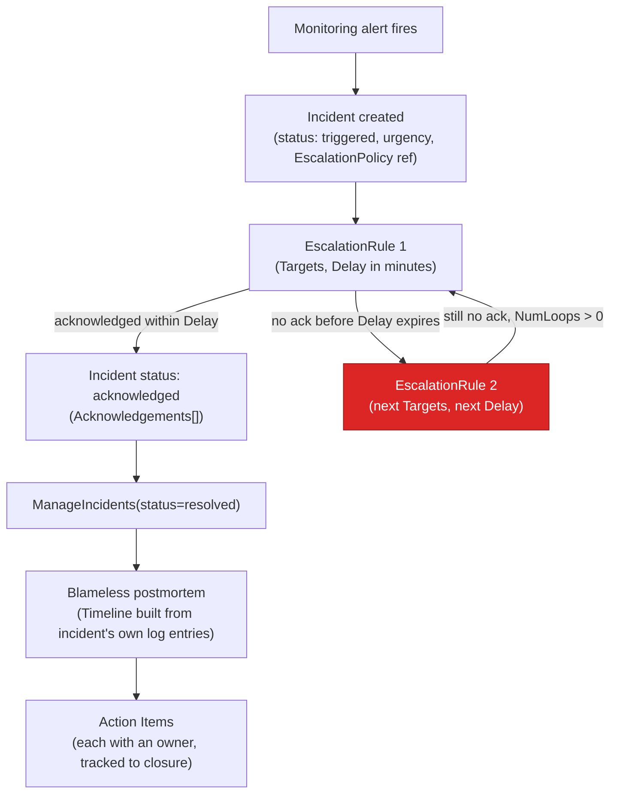
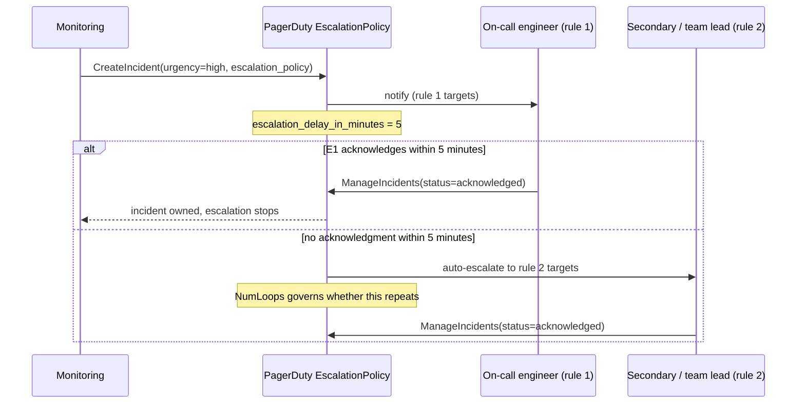

**TL;DR:** Does "blameless postmortem" just mean being polite about outages, and does "incident management" just mean having a pager? No — both are concrete mechanisms: an escalation policy is a data structure that defines *who gets notified, in what order, with what delay, and what happens if nobody acknowledges*, and a blameless postmortem is a specific document structure (Timeline, Root Causes, Action Items, "where we got lucky") that forces the same rigor a code review does, minus assigning individual blame.

## 1. The Engineering Problem

An alert fires. Someone needs to see it, acknowledge it, and start responding — within minutes, not whenever someone happens to check Slack. "Page the on-call engineer" sounds simple until you ask the follow-up questions: what if they don't respond in five minutes? What if they're already handling a different incident? What if the service has three teams that could plausibly own the failure? A flat "send an SMS to one person" model has no answer to any of these, and during a real outage, "no answer" means the incident sits un-acknowledged while the clock runs.

The second half of the problem starts *after* the fire is out. Someone has to write up what happened — and this is where most teams's process actually breaks down, not during the page. If the writeup's implicit goal is "figure out who made the mistake," engineers start writing defensively: vague timelines, passive voice, action items that don't name an owner because naming an owner feels like naming a culprit. The postmortem gets written, gets read once, and the same failure mode recurs eighteen months later because nobody wrote down the actual, specific, embarrassing detail that would have prevented it.

Both problems have the same root cause: treating incident response and postmortems as something a team does informally, by convention, rather than as something with an explicit mechanism — a data structure for escalation, a document structure for the retro — that makes the right behavior the path of least resistance.

## 2. The Technical Solution

**Escalation as a mechanism.** PagerDuty models on-call response as an `EscalationPolicy`: an ordered list of `EscalationRule`s, each with a `Delay` (`escalation_delay_in_minutes`) and a list of `Targets` (users or schedules). When an incident triggers, rule 1 notifies its targets; if nobody acknowledges within `Delay` minutes, the policy automatically advances to rule 2, and so on. `NumLoops` controls whether the whole policy repeats if it's exhausted without acknowledgment. This turns "make sure someone responds" from a hope into a state machine with a timeout at every step.

**Incident lifecycle as a mechanism.** An `Incident` isn't just "open" or "closed" — it carries `Status` (`triggered` → `acknowledged` → `resolved`), `Urgency`, an `EscalationPolicy` reference, `Assignments` (who it's currently assigned to, with a timestamp), and `Acknowledgements` (who acknowledged, when). `ManageIncidents` is the single API surface for acknowledging, resolving, escalating, or reassigning — every state transition is one auditable call, which is what makes post-incident timeline reconstruction possible at all: the incident object's own history *is* the timeline.

**Blameless postmortem as a document mechanism.** The Google SRE book's postmortem template (used verbatim or near-verbatim across the industry) has a specific shape that isn't arbitrary: `Summary` and `Impact` come before `Root Causes`, forcing writers to establish what happened before assigning why. `Trigger` is separated from `Root Causes` — the trigger is what set the incident off *today* (a deploy, a traffic spike); the root cause is the underlying condition that made the system vulnerable to that trigger at all, and conflating the two produces action items that fix today's symptom without fixing the underlying fragility. `Lessons Learned` explicitly includes "What went well" and "Where we got lucky" alongside "What went wrong" — naming luck is what keeps a team honest that the outcome could have been worse, instead of quietly congratulating itself on a good recovery.



The chronology of a single incident's escalation is the part that's easy to describe wrong in prose — it's a sequence with real timeouts at each step:



Core truths to hold:

- Escalation is time-boxed at every rule, not open-ended — `Delay` per rule is what prevents "the page went out" from silently meaning "and nobody ever saw it."
- The incident object accumulates its own audit trail (`Acknowledgements`, `Assignments`, log entries) as state transitions happen — the postmortem's `Timeline` section should be reconstructed from this record, not from memory days later.
- A blameless postmortem's structure (`Trigger` separate from `Root Causes`, `Action Items` as its own section, "where we got lucky" as an explicit prompt) exists specifically to produce owned, specific commitments — not to produce a narrative that reads well and changes nothing.

## 3. The clean example (concept in isolation)

A minimal escalation state machine and a minimal postmortem skeleton, stripped to the mechanism:

```go
// isolated escalation state machine — same shape as PagerDuty's EscalationPolicy
type Rule struct {
    Targets []string
    Delay   time.Duration
}

func Escalate(rules []Rule, ackCh <-chan struct{}) (acknowledgedBy int, ok bool) {
    for i, rule := range rules {
        notify(rule.Targets)
        select {
        case <-ackCh:
            return i, true // acknowledged during this rule's window
        case <-time.After(rule.Delay):
            continue // no ack in time — advance to the next rule
        }
    }
    return -1, false // exhausted all rules with no acknowledgment
}
```

```markdown
# <Incident title> (#<incident number>)

### Date          <!-- when it happened, not when this doc was written -->
### Authors        <!-- who wrote this — not who caused it -->
### Status         <!-- draft / reviewed / action items tracked -->
### Summary        <!-- 2-3 sentences: what broke, for how long, who was affected -->
### Impact         <!-- quantified: requests failed, revenue, SLA burn -->
### Root Causes    <!-- the underlying condition, separate from... -->
### Trigger        <!-- ...what set it off today -->
### Resolution     <!-- what actually stopped the bleeding -->
### Detection      <!-- how it was found: alert, customer report, dashboard -->

## Action Items    <!-- each with an owner and a due date, not a wish list -->

## Lessons Learned
### What went well
### What went wrong
### Where we got lucky   <!-- the honesty check -->

## Timeline          <!-- reconstructed from the incident's own log, not memory -->
```

## 4. Production reality

```
go-pagerduty/
  escalation_policy.go   — EscalationPolicy, EscalationRule structs + CRUD API calls
  incident.go             — Incident lifecycle, ManageIncidents, notes, status updates

postmortem-templates/templates/
  postmortem-template-srebook.md   — the Google SRE book's real postmortem template
```

From `escalation_policy.go` — the real data structure behind "page the right person, then escalate if they don't respond":

```go
// EscalationRule is a rule for an escalation policy to trigger.
type EscalationRule struct {
    ID      string      `json:"id,omitempty"`
    Delay   uint        `json:"escalation_delay_in_minutes,omitempty"`
    Targets []APIObject `json:"targets"`
}

// EscalationPolicy is a collection of escalation rules.
type EscalationPolicy struct {
    APIObject
    Name                       string           `json:"name,omitempty"`
    EscalationRules            []EscalationRule `json:"escalation_rules,omitempty"`
    Services                   []APIObject      `json:"services,omitempty"`
    NumLoops                   uint             `json:"num_loops,omitempty"`
    Teams                      []APIReference   `json:"teams"`
    Description                string           `json:"description,omitempty"`
    OnCallHandoffNotifications string           `json:"on_call_handoff_notifications,omitempty"`
}
```

From `incident.go` — the lifecycle operations every state transition goes through, which is what makes an accurate post-incident timeline possible:

```go
// ManageIncidentsOptions is the structure used when PUTing updates to incidents
type ManageIncidentsOptions struct {
    ID     string `json:"id"`
    Status string `json:"status,omitempty"`   // triggered -> acknowledged -> resolved
    Title  string `json:"title,omitempty"`

    Priority         *APIReference `json:"priority,omitempty"`
    Urgency          string        `json:"urgency,omitempty"`
    Assignments      []Assignee    `json:"assignments,omitempty"`
    EscalationLevel  uint          `json:"escalation_level,omitempty"`
    EscalationPolicy *APIReference `json:"escalation_policy,omitempty"`
    Resolution       string        `json:"resolution,omitempty"`
}

// ManageIncidentsWithContext acknowledges, resolves, escalates, or reassigns
// one or more incidents — the single mutation surface for the whole lifecycle
func (c *Client) ManageIncidentsWithContext(ctx context.Context, from string,
    incidents []ManageIncidentsOptions) (*ListIncidentsResponse, error) {
    for i := range incidents {
        incidents[i].Type = "incident"
    }
    d := map[string][]ManageIncidentsOptions{"incidents": incidents}
    h := map[string]string{"From": from}

    resp, err := c.put(ctx, "/incidents", d, h)
    // ... (response decoding elided)
    return &result, nil
}
```

From `postmortem-templates/templates/postmortem-template-srebook.md` — the actual, verbatim Google SRE book template structure, the reference most industry postmortem templates trace back to:

```markdown
> Template from: Betsy Beyer, Chris Jones, Jennifer Petoff, and Niall Richard Murphy.
> "Site Reliability Engineering."

# Title (incident #)

### Date
### Authors
### Status
### Summary
### Impact
### Root Causes
### Trigger
### Resolution
### Detection

## Action Items

## Lessons Learned
### What went well
### What went wrong
### Where we got lucky

## Timeline

## Supporting information
```

What this teaches that "just be blameless" and "just have a pager" can't:

- **Escalation delay is per-rule, configured in minutes, not a vague "if they don't respond soon."** `EscalationRule.Delay` (`escalation_delay_in_minutes`) is the concrete timeout that determines how long an incident can sit un-acknowledged before a second set of humans gets pulled in — tune it too high and incidents sit silently; too low and you page a secondary before the primary had a real chance to respond.
- **The incident record itself is the source of truth for the postmortem's `Timeline`**, not someone's memory three days later. Every `ManageIncidents` call, every `CreateIncidentNote`, every `Acknowledgement` is timestamped and queryable — `ListIncidentLogEntries` exists specifically so the timeline section can be reconstructed from what actually happened, in order, instead of reconstructed from Slack scrollback.
- **`Trigger` and `Root Causes` are separate fields, not one "why did this happen" blob.** A deploy (`Trigger`) that exposed a race condition that had existed for months (`Root Cause`) needs two different action items — "improve deploy canary checks" and "fix the race condition" — and a template that doesn't separate them tends to produce only the first, shallower one.

## 5. Review checklist

- **Does every `EscalationRule` have a bounded `Delay`, and does the policy have enough rules that `NumLoops` exhausting isn't a dead end?** A policy with one rule and `NumLoops: 0` means an unacknowledged page simply stops — verify there's a secondary tier before that happens.
- **Is `Urgency` set correctly on `CreateIncidentOptions`?** PagerDuty's urgency field is what determines whether an incident pages immediately or waits for a lower-urgency notification channel — a miscategorized low-urgency incident for something actually customer-facing delays the page itself, independent of the escalation policy being correct.
- **Does the postmortem separate `Trigger` from `Root Causes`, or does it collapse them into one narrative?** If the only action item is "add a check for the specific thing that triggered this incident," ask whether the underlying root cause — the condition that made the trigger dangerous at all — has its own tracked action item.
- **Does every `Action Items` entry have an owner and a due date, not just a description?** An action item with no owner is a wish, not a commitment, and it's the single most common reason the same incident's lessons don't stick.

## 6. FAQ

**Q: What actually happens if the primary on-call never acknowledges?**
A: The `EscalationRule`'s `Delay` (minutes) expires without an `Acknowledgement`, and PagerDuty automatically notifies the next rule's `Targets`. If every rule in the policy is exhausted, `NumLoops` determines whether the whole sequence repeats from rule 1 or the incident stays unacknowledged — this is why a policy with too few rules or `NumLoops: 0` is a real operational gap, not just a config nitpick.

**Q: Why does the SRE book template separate "Trigger" from "Root Causes" at all — isn't that the same thing?**
A: No — the trigger is the specific event that set the incident off today (a deploy, a config change, a traffic spike); the root cause is the pre-existing condition that made the system vulnerable to that trigger in the first place. A postmortem that only names the trigger produces an action item like "add a canary check to this one deploy pipeline," while naming the root cause produces "fix the underlying race condition that any sufficiently large deploy could have exposed."

**Q: What does "blameless" actually change about the document, mechanically?**
A: It changes what the `Root Causes` and `Timeline` sections are allowed to say. A blame-oriented postmortem's timeline reads "Alice pushed a bad config"; a blameless one reads "a config change removed a required field, and no automated validation caught it before rollout" — same facts, but the second version's Action Items point at the missing validation (fixable), not at Alice (not a fix). The `Status` and `Authors` fields exist so responsibility for the *document* is clear, separate from responsibility for the *incident*.

**Q: Does `ManageIncidents` handle reassignment too, or just status changes?**
A: Both, in one call — `ManageIncidentsOptions` carries `Status`, `Assignments`, `EscalationLevel`, and `EscalationPolicy` simultaneously, so acknowledging, reassigning to a different responder, and bumping the escalation level can all happen as a single atomic API update rather than three separate race-prone calls.

**Q: Is a `ChaosResult` from a Litmus experiment (previous lesson) ever useful input to a postmortem?**
A: Yes, in the sense that they're the same discipline pointed in opposite directions — chaos engineering deliberately triggers a failure to see if the system's assumptions hold *before* an incident, and a postmortem's `Root Causes` section documents which assumption failed *after* one did. A team running `pod-delete` regularly and reading its `ChaosResult` failures is, in effect, writing small postmortems for failures that never became real incidents.

---

## Source

- **Concept:** Incident management (escalation policies, incident lifecycle) and blameless postmortems
- **Domain:** Observability
- **Repo:** [PagerDuty/go-pagerduty](https://github.com/PagerDuty/go-pagerduty) → [`escalation_policy.go`](https://github.com/PagerDuty/go-pagerduty/blob/master/escalation_policy.go), [`incident.go`](https://github.com/PagerDuty/go-pagerduty/blob/master/incident.go) — the real PagerDuty API client; and [dastergon/postmortem-templates](https://github.com/dastergon/postmortem-templates) → [`templates/postmortem-template-srebook.md`](https://github.com/dastergon/postmortem-templates/blob/master/templates/postmortem-template-srebook.md) — the real Google SRE book postmortem template


