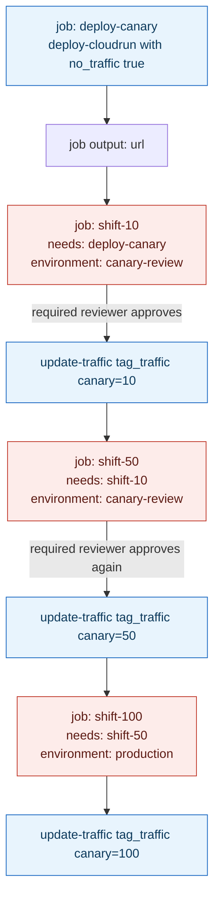



**TL;DR:** A canary rollout is described as "10%, then 50%, then 100%"  but mechanically, that's three or four separate pipeline jobs, possibly separated by hours, possibly run by different people clicking approve. What actually carries "which revision are we even talking about" from the first job to the last one?

## 1. The Engineering Problem: a single deploy step can shift traffic, but it can't pause for a human

An earlier lesson in this series covered `google-github-actions/deploy-cloudrun`'s traffic-splitting primitive: `no_traffic: true` deploys a revision without exposing it, and a separate `update-traffic` call moves a percentage onto it. That solves the *platform* mechanics  Cloud Run genuinely supports splitting traffic between revisions. But a real progressive rollout isn't one job calling that action twice back to back; it's "deploy the canary, wait, check error rates, get a human's go-ahead, shift more traffic, wait again, ship the rest"  stretched over minutes or hours, not one workflow run. That means the *pipeline itself* has a state-tracking problem the platform doesn't solve for it: the job that shifts traffic to 50% has to be run separately from  possibly by a different trigger than  the job that deployed the canary in the first place, and it needs to know exactly which revision that was, because a second deploy in between (a hotfix, a different PR) would create a second, different revision entirely. Get that identity wrong and "shift 50% of traffic" silently targets the wrong version.

---

## 2. The Technical Solution: job outputs carry revision identity forward, environment protection rules carry the human approval

GitHub Actions gives a pipeline two purpose-built primitives for exactly this: **job outputs** (a value one job produces that a later job declares as a dependency and reads via `needs.<job_id>.outputs.<name>`), and **`environment:` protection rules** (a job targeting a named environment with required reviewers configured simply *does not run* until someone approves it in the Actions UI  no polling, no custom wait step). Chaining these turns a single canary-deploy action into a real multi-stage pipeline.



Every gated job (`C`, `E`, `G`) is a job GitHub literally will not start running until the environment's required reviewers approve it  the pipeline is paused mid-graph, not polling in a loop. Here's the mechanics of the *other* half  how the revision identity from job `A` actually reaches job `C`, using `deploy-cloudrun`'s own real output-setting code:

```mermaid
sequenceDiagram
    participant DeployJob as job deploy-canary
    participant Action as deploy-cloudrun action (main.ts)
    participant GH as GitHub Actions runtime
    participant ShiftJob as job shift-10

    DeployJob->>Action: run with no_traffic true, tag canary
    Action->>Action: exec gcloud run deploy --no-traffic --tag=canary
    Action->>Action: setActionOutputs(parseDeployResponse(stdout))
    Action->>GH: setOutput url = canary revision url
    Note over GH: job output url is now visible as needs.deploy-canary.outputs.url
    GH-->>ShiftJob: environment protection rule blocks start
    Note over ShiftJob: required reviewer approves in the Actions UI
    ShiftJob->>ShiftJob: reads needs.deploy-canary.outputs.url for logging and verification
    ShiftJob->>Action: run with tag_traffic canary=10
    Action->>GH: setOutput url = same service url, now traffic-shifted

    classDef paused fill:#fdecea,stroke:#c0392b,color:#5c1a13;
    class ShiftJob paused;
```

Two mechanics worth holding onto:

- **The job output only carries what the action's `action.yml` explicitly declares as an output**  `deploy-cloudrun` declares exactly one, `url`. A pipeline stage that needs the revision *name* specifically (not just its URL) has to parse it out of the URL or capture it another way  the action's internal `DeployCloudRunOutputs` type tracks more internally, but only `url` crosses the boundary into `needs.<job>.outputs`.
- **`setOutput` is last-write-wins within a single step.** The action calls it once after the deploy command and again after the traffic-update command, in the *same* step invocation  so by the time job `A` finishes, its `url` output already reflects the post-traffic-shift state, not the pre-shift one, even though both calls happened inside what the workflow file shows as one `uses:` step.

---

## 3. The clean example (concept in isolation)

```yaml
jobs:
  deploy-canary:
    runs-on: ubuntu-latest
    outputs:
      service_url: ${{ steps.deploy.outputs.url }}   # re-export the action's output at job level
    steps:
      - id: deploy
        uses: google-github-actions/deploy-cloudrun@v2
        with:
          service: checkout
          image: ${{ inputs.image }}
          no_traffic: true
          tag: canary

  shift-10:
    needs: deploy-canary                # pipeline dependency: waits for deploy-canary to finish
    environment: canary-review           # protection rule: pauses here for a required reviewer
    runs-on: ubuntu-latest
    steps:
      - run: echo "Shifting traffic for ${{ needs.deploy-canary.outputs.service_url }}"
      - uses: google-github-actions/deploy-cloudrun@v2
        with:
          service: checkout
          tag_traffic: 'canary=10'

  shift-100:
    needs: shift-10
    environment: production              # a SECOND, separate protection rule for full rollout
    runs-on: ubuntu-latest
    steps:
      - uses: google-github-actions/deploy-cloudrun@v2
        with:
          service: checkout
          tag_traffic: 'canary=100'
```

---

## 4. Production reality (from `google-github-actions/deploy-cloudrun`)

```
deploy-cloudrun/
+-- action.yml         # declares the single "url" output exposed to a workflow
+-- src/
    +-- main.ts        # setActionOutputs() -- what actually crosses the job boundary
```

```yaml
# action.yml
outputs:
  url:
    description: |-
      The URL of the Cloud Run service.
```

```typescript
// src/main.ts
export interface DeployCloudRunOutputs {
  url?: string | null | undefined; // Type required to match run_v1.Schema$Service.status.url
}

// ...deploy command executes first...
setActionOutputs(parseDeployResponse(deployCmdExec.stdout, { tag: tag }));

// Run revision/tag command
if (revTraffic || tagTraffic) {
  const updateTrafficExec = await getExecOutput(toolCommand, updateTrafficCmd, options);
  if (updateTrafficExec.exitCode !== 0) {
    const errMsg =
      updateTrafficExec.stderr ||
      `command exited ${updateTrafficExec.exitCode}, but stderr had no output`;
    throw new Error(`failed to update traffic: ${errMsg}, full command:\n\t${commandString}`);
  }
  setActionOutputs(parseUpdateTrafficResponse(updateTrafficExec.stdout));
}

// Map output response to GitHub Action outputs
export function setActionOutputs(outputs: DeployCloudRunOutputs): void {
  Object.keys(outputs).forEach((key: string) => {
    setOutput(key, outputs[key as keyof DeployCloudRunOutputs]);
  });
}
```

What this teaches that a hello-world can't:

- **`DeployCloudRunOutputs` is typed with exactly one optional field, `url`.** A workflow designer who assumes the action surfaces a revision name or a traffic-percentage confirmation as a job output will find out  by reading this interface, not by guessing  that it doesn't; anything else the next pipeline stage needs has to come from a separate `gcloud` call or from parsing the URL.
- **`setActionOutputs` is a thin `Object.keys().forEach(setOutput)` loop, called twice.** There's no accumulation logic, no merge  the second call's `url` key simply overwrites the first's in the runner's output store, which is *why* `shift-10`'s eventual `needs.deploy-canary.outputs.url` reflects whatever the deploy job's `url` was set to *last*, not first.
- **The traffic-update command only runs `if (revTraffic || tagTraffic)`.** A `deploy-canary` job that never sets a traffic input (the common case for the "deploy dark" first stage) skips that second `setActionOutputs` call entirely  meaning its `url` output is exactly the deploy-time value, with no traffic-shift side effect to worry about, which is exactly the property a strictly separate `shift-10` stage depends on.

---

## 5. Review checklist

- **Does every gated stage re-declare `needs:` on the immediately preceding job, not an earlier one?** Skipping a stage in the `needs:` chain (e.g. `shift-100` depending on `deploy-canary` directly instead of `shift-10`) would let the final rollout start before the intermediate approval actually ran, defeating the whole point of the staged `environment:` gates.
- **Is the value read from `needs.<job>.outputs.*` actually re-exported at the job level with an `outputs:` block**, or is the reviewer assuming a step output (`steps.<id>.outputs.*`) is automatically visible to a *different* job? It isn't  a job's `outputs:` block has to explicitly forward a step output before another job can see it via `needs`.
- **Does the `environment:` name used for each gate have required reviewers actually configured in repo settings**, not just referenced in the workflow YAML? An `environment:` name with no protection rules configured behaves like no gate at all  the workflow file alone can't prove the human-approval step is real.
- **If a hotfix redeploys mid-rollout, does the pipeline's revision identity still line up?** Because `url`/tag identity is passed job-to-job via outputs rather than re-derived from "whatever's currently deployed," a stale `needs.deploy-canary.outputs.url` value from before a hotfix deploy could point a later `shift-` stage at a revision that's no longer the one under test  worth an explicit re-run of `deploy-canary` rather than resuming a stale chain.

---

## 6. FAQ

**Q: Why use `environment:` protection rules instead of a manual `workflow_dispatch` trigger for each stage?**
A: A separate `workflow_dispatch` per stage would require someone to manually locate and re-trigger the right workflow run with the right inputs, re-supplying context like the revision tag by hand. An `environment:` gate keeps the whole rollout as *one* workflow run with a paused job in the middle  `needs.deploy-canary.outputs.url` is still there, automatically, when the gated job resumes, with no re-entry of context required.

**Q: If `deploy-cloudrun`'s job output only exposes `url`, how would a pipeline pass the revision *name* to a later stage?**
A: It isn't in `DeployCloudRunOutputs`, so a pipeline that needs it has to get it another way  either parse it out of the URL, or add a separate step (a `gcloud run revisions list` call) whose output is what actually gets forwarded via the job's `outputs:` block. The action's real output surface is smaller than a workflow designer might assume.

**Q: Does the second `setActionOutputs` call in `main.ts` run even when `no_traffic: true` is set?**
A: No  it's gated by `if (revTraffic || tagTraffic)`, and `no_traffic` is a separate input entirely. A "deploy dark" stage that only sets `no_traffic: true` never triggers the traffic-update command or its output-setting call, so its `url` output is purely the deploy-time value.

**Q: What actually stops the `shift-10` job from starting before a reviewer approves it?**
A: The `environment:` key on the job, combined with required-reviewer protection rules configured on that environment in the repository's settings (not in the workflow YAML itself)  GitHub's own scheduler holds the job in a pending state until an approval is recorded; nothing in the workflow file has to implement the wait.

**Q: Is `needs:` alone (without `environment:`) enough to build a staged rollout?**
A: `needs:` alone only sequences jobs  it guarantees order and lets outputs flow forward, but a job with satisfied `needs:` and no `environment:` protection starts running immediately. The pause for human judgment specifically comes from the `environment:` protection rule, not from `needs:`.

---

## Source

- **Concept:** Progressive delivery pipelines (canary/blue-green pipeline mechanics  job outputs and environment gates)
- **Domain:** cicd
- **Repo:** [google-github-actions/deploy-cloudrun](https://github.com/google-github-actions/deploy-cloudrun) ? [`action.yml`](https://github.com/google-github-actions/deploy-cloudrun/blob/main/action.yml), [`src/main.ts`](https://github.com/google-github-actions/deploy-cloudrun/blob/main/src/main.ts)  Google's official Cloud Run GitHub Action, used here for its real job-output-setting mechanics.

---

**Next in the CI/CD series:** [Infrastructure as Code Testing: How a Terratest Go Test and a Rego Policy Gate a Terraform Change Before Apply]({{ '/cicd/infrastructure-as-code-testing-terratest-rego-policy-as-code/' | relative_url }})



