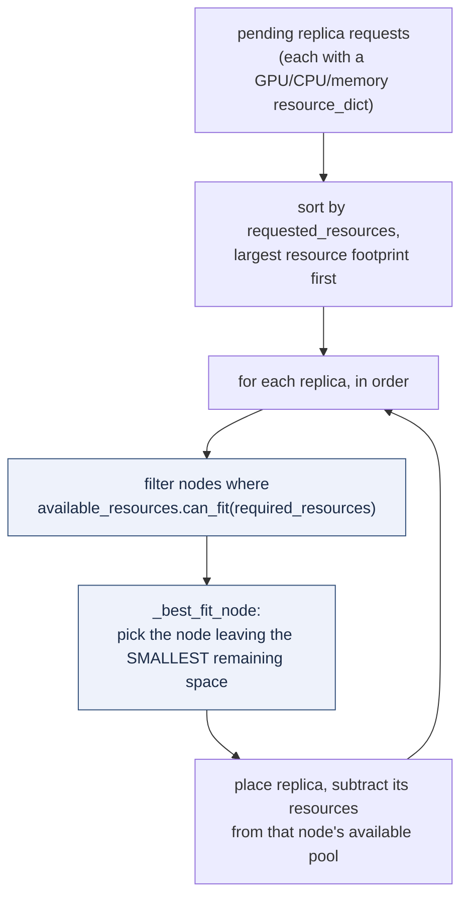
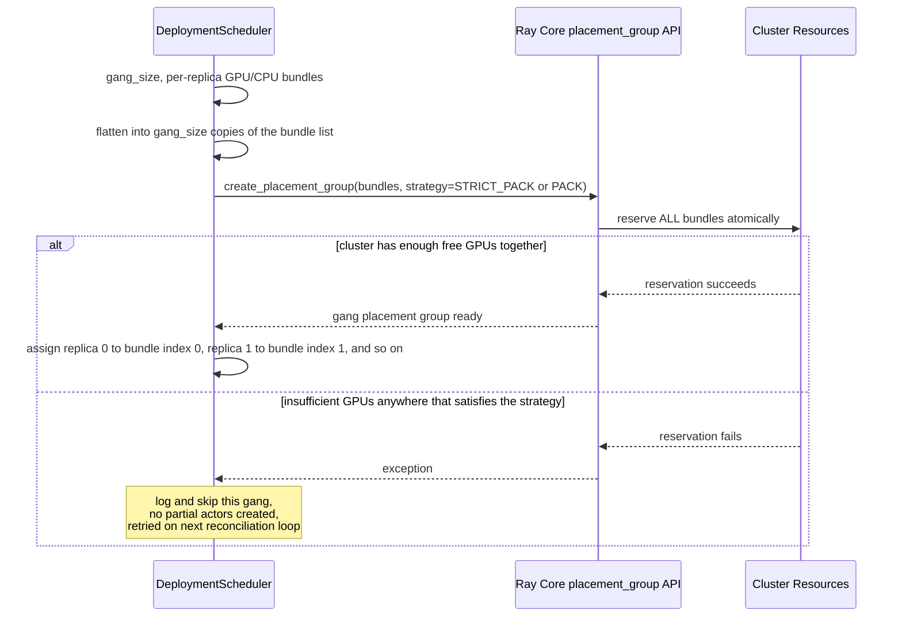

**TL;DR:** When you're serving dozens of GPU-hungry model replicas across a heterogeneous cluster, how does the scheduler decide which physical node each replica lands on, and how does a multi-GPU model replica get all the GPUs it needs atomically instead of half-starting and deadlocking? By treating GPU (and CPU and memory) allocation as a bin-packing problem solved with a best-fit-node search that prioritizes GPU above every other resource type, and by reserving multi-bundle "gang" placement groups atomically before any replica actor is created -- so a replica that needs 4 GPUs either gets all 4 in one uninterruptible reservation, or the scheduler cleanly fails and retries later, never leaving it holding 2.

> **In plain English (30 sec):** Declare 'I want 3 copies' — K8s keeps 3 running.

**Real repo:** [`ray-project/ray`](https://github.com/ray-project/ray)

## 1. The Engineering Problem: GPUs fragment, and partial allocations deadlock

A GPU cluster is the most expensive, most contended resource an ML platform manages, and it behaves nothing like CPU or memory: GPUs are typically requested and consumed in whole units (a replica wants 1, 2, or 4 full GPUs, not 0.3 of one, though fractional requests exist for small models), nodes have a fixed, small GPU count each (commonly 4 or 8), and idle GPU capacity scattered in slivers across many nodes is often *unusable* even though it looks "free" in aggregate. A naive scheduler that spreads replicas evenly across nodes to balance load will happily leave every node with 1 free GPU out of 8 -- useless for the next replica that needs 4, and useless for autoscale-down, since no single node is ever fully idle.

The problem gets sharper for models that need multiple GPUs *simultaneously and atomically*: a tensor-parallel replica sharded across 4 GPUs isn't functional with 2. If a scheduler allocates GPU resources to such a replica one bundle at a time using the same code path as any other resource request, two replicas racing for the last 4 GPUs on a cluster can each grab 2 and then block forever waiting for the other 2 -- a classic partial-allocation deadlock. Naive per-task or per-actor resource requests, evaluated independently and greedily, have no way to express "reserve all of this together, or reserve none of it."

---

## 2. The Technical Solution: atomic multi-bundle placement groups, and a best-fit scheduler that prioritizes GPU first

Ray solves the atomicity half of this with **placement groups**: a placement group is a single reservation request for a *list* of resource bundles (e.g. four `{"GPU": 1}` bundles), created with a topology strategy -- `PACK` (few nodes as possible), `SPREAD` (as many distinct nodes as possible), `STRICT_PACK` (must fit on exactly one node), or `STRICT_SPREAD` (must land on distinct nodes, one bundle per node). The entire group of bundles is reserved as one atomic operation against the cluster's resource accounting; nothing runs until the whole group is placed, and callers only start scheduling actors onto a placement group's bundles once `pg.ready()` resolves.

Ray Serve builds on top of this for GPU-heavy model serving with two complementary mechanisms. First, `DefaultDeploymentScheduler` does **best-fit bin packing**: for every pending replica it searches all nodes, keeps only nodes with enough free resources (`can_fit`), and among those picks the node that would be left with the *smallest* remaining space -- deliberately packing tightly rather than spreading, so whole nodes stay empty and reclaimable. Second, for replicas that must co-locate and co-start together (a tensor-parallel gang), it uses **gang placement groups**: one placement-group reservation covering every replica in the gang's combined bundles, created before any replica actor exists, so the reservation either succeeds for the whole gang or fails cleanly with no partial actors left behind.





Three core truths to hold: (1) `can_fit` and best-fit node selection run on **projected** resources (cluster totals minus every replica already scheduled or running), not on a live poll of the cluster at request time -- the scheduler maintains its own accounting to avoid races between two scheduling decisions made in the same cycle; (2) the resource comparison is explicitly ordered GPU, then CPU, then memory, then other custom resources -- so when two replicas are otherwise tied, the one demanding more GPU is scheduled first, reflecting that GPU is the scarcest, most fragmentable resource in the cluster; (3) gang placement groups and best-fit packing are separate mechanisms solving separate problems -- packing minimizes fragmentation for independent replicas, gang groups guarantee atomicity for replicas that must start together, and a deployment can need either, both, or neither.

---

## 3. The clean example (concept in isolation)

```python
# What DefaultDeploymentScheduler.can_fit / _best_fit_node reduce to.

def can_fit(available: dict, required: dict) -> bool:
    keys = set(available) | set(required)
    return all(available.get(k, 0) >= required.get(k, 0) for k in keys)

def best_fit_node(nodes: dict[str, dict], required: dict) -> str | None:
    """Pick the node that would be left with the SMALLEST leftover space.

    This is deliberately the opposite of load balancing: packing tightly
    keeps some nodes fully idle so they can be scaled down, instead of
    every node carrying a little bit of everything.
    """
    best_node, best_leftover = None, None
    for node_id, available in nodes.items():
        if not can_fit(available, required):
            continue
        leftover = sum(available.get(k, 0) - required.get(k, 0) for k in required)
        if best_leftover is None or leftover < best_leftover:
            best_node, best_leftover = node_id, leftover
    return best_node

# A 4-GPU node and a 2-GPU node, both free.
nodes = {"node-a": {"GPU": 4, "CPU": 16}, "node-b": {"GPU": 2, "CPU": 8}}
required = {"GPU": 2, "CPU": 4}

# best_fit_node picks node-b: it leaves 0 GPU / 4 CPU spare there,
# versus 2 GPU / 12 CPU spare on node-a -- tighter fit, less fragmentation.
print(best_fit_node(nodes, required))  # "node-b"
```

---

## 4. Production reality (from `ray-project/ray`)

```
python/ray/
├── util/
│   └── placement_group.py          # placement_group(): atomic multi-bundle reservation API
└── serve/_private/
    └── deployment_scheduler.py     # Resources, DefaultDeploymentScheduler: best-fit + gang scheduling
```

### `placement_group()` -- the atomic reservation primitive, and its packing strategies

```python
# python/ray/util/placement_group.py

def placement_group(
    bundles: List[Dict[str, float]],
    strategy: Optional[str] = None,
    name: str = "",
    lifetime: Optional[str] = None,
    ...
) -> PlacementGroup:
    """Asynchronously creates a PlacementGroup.

    Args:
        bundles: A list of bundles which represent the resources requirements.
        strategy: The strategy to create the placement group.

         - "PACK": Packs Bundles into as few nodes as possible.
         - "SPREAD": Places Bundles across distinct nodes as even as possible.
         - "STRICT_PACK": Packs Bundles into one node. The group is
           not allowed to span multiple nodes.
         - "STRICT_SPREAD": Packs Bundles across distinct nodes.
    """
    worker = ray._private.worker.global_worker
    worker.check_connected()

    validate_placement_group(bundles=bundles, strategy=strategy, lifetime=lifetime, ...)

    placement_group_id = worker.core_worker.create_placement_group(
        name, bundles, node_level_strategy, detached, ...
    )
    return PlacementGroup(
        placement_group_id,
        bundle_cache=[{k: float(v) for k, v in bundle.items()} for bundle in bundles],
    )
```

What this teaches that a hello-world can't:

- **The call is asynchronous by design** -- `placement_group()` returns immediately with a `PlacementGroup` handle; the actual reservation against cluster resources happens in `worker.core_worker.create_placement_group`, and callers must explicitly call `.ready()` or `.wait()` before scheduling anything onto it. This separation lets a caller kick off several placement group requests and wait on all of them together, instead of blocking on each one serially.
- **`STRICT_PACK` is the only strategy compatible with a soft target node** -- the `_soft_target_node_id` parameter (a hint to prefer a specific physical node) only works with `STRICT_PACK`, because that's the only strategy where "the whole group lands on one node" is even a meaningful constraint to hint at; `PACK` and `SPREAD` can legitimately span multiple nodes, so a single target node hint wouldn't fully describe the request.
- **`bundle_cache` is captured client-side from the bundles as-requested, not fetched from the cluster afterward** -- `bundle_specs` reads are served from this local cache rather than a round trip to the cluster, which matters because a scheduler like Ray Serve's calls this repeatedly per scheduling cycle and can't afford a network hop per lookup.

### `Resources.can_fit` and `__lt__` -- GPU is compared before anything else

```python
# python/ray/serve/_private/deployment_scheduler.py

@total_ordering
class Resources(dict):
    """Base for per-node availability vs replica demand resource maps."""

    CUSTOM_PRIORITY: List[str] = RAY_SERVE_HIGH_PRIORITY_CUSTOM_RESOURCES
    EPSILON = 1e-9

    def can_fit(self, other):
        keys = set(self.keys()) | set(other.keys())
        # A small epsilon avoids floating point precision issues.
        return all(self.get(k) + self.EPSILON >= other.get(k) for k in keys)

    def __lt__(self, other):
        """Sort priority: custom high-priority resources, then GPU,
        then CPU, then memory, then other custom resources."""
        for key in self.CUSTOM_PRIORITY:
            if self.get(key) < other.get(key):
                return True
            elif self.get(key) > other.get(key):
                return False

        if self.get("GPU") < other.get("GPU"):
            return True
        elif self.get("GPU") > other.get("GPU"):
            return False

        if self.get("CPU") < other.get("CPU"):
            return True
        elif self.get("CPU") > other.get("CPU"):
            return False
        # memory and remaining custom keys follow the same pattern
        return False
```

What this teaches that a hello-world can't:

- **`can_fit` folds in a floating-point epsilon deliberately** -- GPU fractions (`{"GPU": 0.5}` for two replicas sharing one physical GPU) are common enough in real deployments that a strict `>=` comparison without epsilon would intermittently reject a request that should fit, purely from float rounding. This is the kind of bug that only shows up under fractional-GPU workloads, not in a hello-world with whole-number resources.
- **`__lt__` is used to *sort scheduling requests*, not just to compare resource pools** -- `_schedule_with_pack_strategy` sorts all pending replicas by `requested_resources` in reverse before placing any of them, so the replica demanding the most GPU is scheduled first, while capacity is least fragmented. Scheduling GPU-heavy replicas last (after smaller CPU-only replicas have already claimed odd bits of every node) is exactly how fragmentation happens in practice.
- **`RAY_SERVE_HIGH_PRIORITY_CUSTOM_RESOURCES` lets an operator override the GPU-first assumption** -- for a cluster with an even scarcer custom resource (e.g. a specific accelerator type tagged as a Ray custom resource), the priority order is configurable rather than hardcoded, because "GPU is the scarcest resource" isn't universally true across every hardware fleet.

### `_prepare_gangs_for_deployment` -- atomic multi-bundle reservation for co-located replicas

```python
# python/ray/serve/_private/deployment_scheduler.py

    def _prepare_gangs_for_deployment(
        self, deployment_id: DeploymentID, request: GangPlacementGroupRequest,
    ) -> GangReservationResult:
        gang_size = request.gang_size
        num_gangs = request.num_replicas_to_add // gang_size
        per_replica_bundles = request.replica_placement_group_bundles

        gang_pgs: List[PlacementGroup] = []
        for gang_index in range(num_gangs):
            bundles = [
                bundle.copy()
                for _ in range(gang_size)
                for bundle in per_replica_bundles
            ]
            pg_name = f"{GANG_PG_NAME_PREFIX}{deployment_id.app_name}_{deployment_id.name}_{gang_index}_{uuid.uuid4().hex[:8]}"

            try:
                pg = self._create_placement_group_fn(
                    CreatePlacementGroupRequest(
                        bundles=bundles,
                        strategy=request.gang_placement_strategy,
                        name=pg_name,
                    )
                )
                gang_pgs.append(pg)
            except Exception:
                # Log and skip this gang -- the controller retries on the
                # next reconciliation loop instead of leaving a half-formed gang.
                logger.exception(f"Failed to create gang placement group {gang_index}.")
                continue

        if not gang_pgs:
            return GangReservationResult(success=False, error_message="...")
        return GangReservationResult(success=True, gang_pgs=gang_pgs, ...)
```

What this teaches that a hello-world can't:

- **All of a gang's bundles are requested in one `create_placement_group_fn` call, not one per replica** -- `bundles` flattens every replica's resource requirement into a single list handed to one placement group. Ray Core either reserves the entire list atomically or none of it; there is no code path where 2 of 4 needed GPUs get reserved and the caller has to detect and unwind a partial state itself.
- **A failed gang is skipped, not retried inline** -- the `except Exception: continue` deliberately does not retry within this call. Retrying immediately against a cluster that's already out of GPUs would just fail again; leaving it to "the next reconciliation loop" means the retry happens after cluster state has had a chance to change (another job finished, autoscaler added a node), which is a cheaper and more likely-to-succeed retry than a tight loop.
- **Replica-to-bundle-index assignment is a simple modular mapping, not a separate scheduling decision** -- per the method's own docstring example, with `gang_size=2` and two per-replica bundles, replica 0 always maps to bundle index 0 and replica 1 to bundle index 2 (`gang_size` apart). Once the atomic reservation succeeds, placing each replica actor is a lookup, not a second round of bin-packing.

---

## Review checklist

- [ ] **Every resource dict names GPU explicitly, not just CPU/memory** -- a deployment or actor resource request that omits `"GPU"` for a model that needs one won't get bin-packed correctly by `Resources.__lt__`'s GPU-first priority, and can end up scheduled onto a GPU-less node if the framework doesn't separately enforce it.
- [ ] **Multi-GPU replicas that must co-start use a gang placement group, not independent per-replica requests** -- independent requests for the same logical group of GPUs reintroduce the partial-allocation deadlock this whole mechanism exists to prevent; check that `gang_placement_group`/`GangPlacementGroupRequest` (or the equivalent atomic reservation in whatever scheduler is in use) is actually wired up, not just individual actor `num_gpus=` kwargs.
- [ ] **The chosen placement strategy matches the actual co-location requirement** -- `STRICT_PACK` for "must be on one physical node" (e.g. NVLink-connected GPUs), `PACK` for "prefer few nodes but don't require it," `SPREAD`/`STRICT_SPREAD` for deliberate anti-affinity (e.g. replica redundancy across failure domains); using `PACK` where `STRICT_PACK` was actually required can silently split a tensor-parallel replica across nodes without a fast interconnect.
- [ ] **A failed gang reservation is retried through the normal reconciliation loop, not with a tight inline retry** -- confirm any custom scheduling code follows the same "log, skip, let the next cycle retry" pattern instead of busy-looping against a cluster that's still out of capacity.

---

## FAQ

**Q: Why does the scheduler use "projected" resources instead of just asking the cluster what's free right now?**
A: Because a live poll would race against the scheduler's own in-progress decisions within the same cycle -- if two replicas are being scheduled in the same batch, the second one's `can_fit` check needs to already account for the first one's allocation, even though that allocation hasn't been confirmed by the cluster yet. `_get_available_resources_per_node` subtracts every already-scheduled-or-running replica's resources from cluster totals before any `can_fit` check runs, keeping the whole batch internally consistent.

**Q: What's the actual difference between best-fit packing and a gang placement group -- don't they both "group things together"?**
A: No -- they solve different problems. Best-fit packing (`_best_fit_node`) is a *heuristic* applied to independent replicas one at a time, to minimize fragmentation; a replica scheduled this way could in principle still fail to place if the heuristic picks badly, and there's no atomicity guarantee across multiple replicas. A gang placement group is a *hard atomicity guarantee* for bundles that belong to replicas which must start together — the reservation is all-or-nothing by construction, regardless of any packing heuristic.

**Q: Why is GPU prioritized over CPU in `Resources.__lt__` instead of, say, sorting by total resource count?**
A: Because GPU is disproportionately scarce and comes in small, fixed per-node counts (4 or 8 typically, versus dozens of CPU cores), so it fragments fastest under naive scheduling. Sorting scheduling requests by total resource count would let a CPU-heavy-but-GPU-light replica jump ahead of a smaller GPU-heavy one, claiming general capacity first and leaving the GPU-heavy replica to discover fragmented GPU availability later.

**Q: Can `RAY_SERVE_USE_PACK_SCHEDULING_STRATEGY` ever be unsafe to enable?**
A: The code explicitly guards it: pack scheduling is only used when `not non_strict_pack_pgs_exist` — if any deployment uses a non-`STRICT_PACK` placement-group strategy, the scheduler falls back to `_schedule_with_spread_strategy` instead, because `_soft_target_node_id` (which best-fit packing relies on to steer Ray Core's own placement) is documented to only work with `STRICT_PACK`. Enabling pack scheduling in a mixed deployment doesn't silently misbehave; the scheduler detects the incompatibility and picks the safe strategy itself.

**Q: Does bin-packing GPUs tightly conflict with high availability?**
A: It can, which is why `SPREAD`/`STRICT_SPREAD` exist as the opposite strategy for cases where anti-affinity matters more than density — e.g. spreading replicas of the same deployment across failure domains so one node failure doesn't take out every replica. The scheduler doesn't force one answer; it exposes both strategies and the choice is a per-deployment cost-vs-availability tradeoff the operator makes explicitly.

---

## Source

- **Concept:** GPU-aware bin-packing and atomic gang scheduling for distributed model serving
- **Domain:** mlops
- **Repo:** [ray-project/ray](https://github.com/ray-project/ray) → [`python/ray/util/placement_group.py`](https://github.com/ray-project/ray/blob/master/python/ray/util/placement_group.py) — the `placement_group()` API for atomic multi-bundle resource reservation with `PACK`/`SPREAD`/`STRICT_PACK`/`STRICT_SPREAD` strategies; [`python/ray/serve/_private/deployment_scheduler.py`](https://github.com/ray-project/ray/blob/master/python/ray/serve/_private/deployment_scheduler.py) — `Resources`/`DefaultDeploymentScheduler`, the best-fit bin-packing scheduler and gang placement group reservation logic behind Ray Serve's GPU-aware replica placement.


