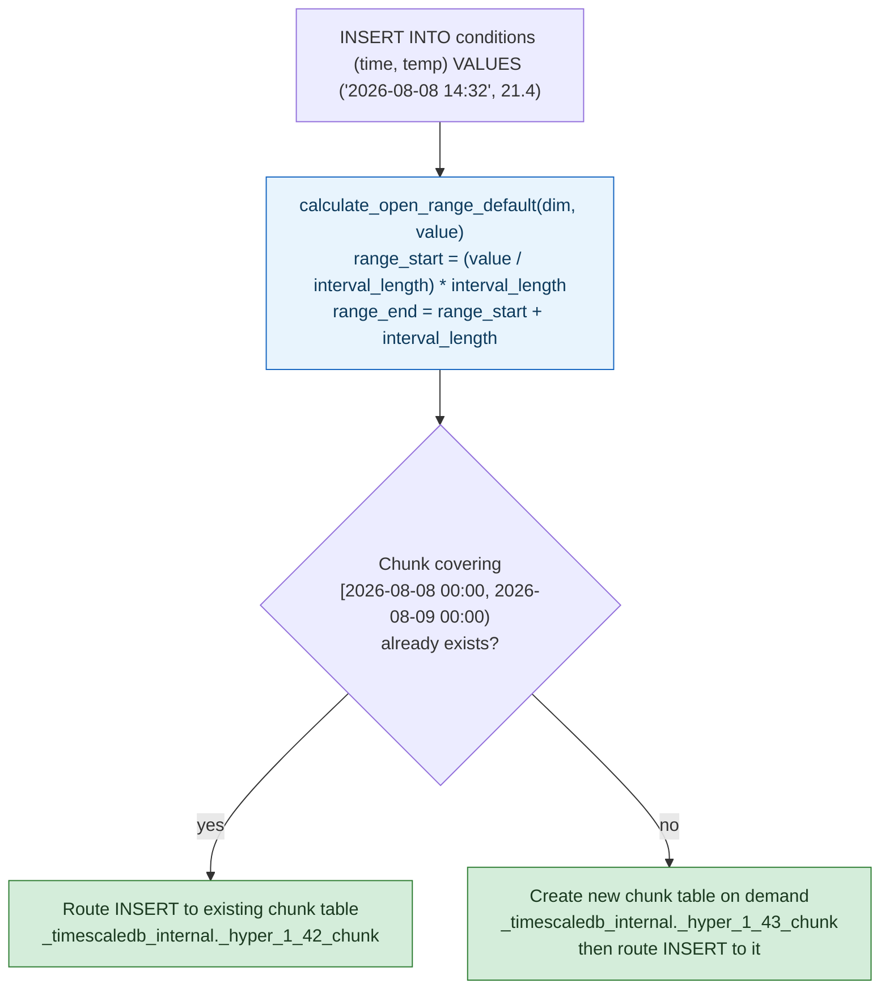

**TL;DR:** A single giant table with a B-tree index on `time` looks fine until the index itself gets too large to keep hot in cache and every insert starts paying random-I/O costs against months of history — TimescaleDB's answer is to physically partition a "hypertable" into per-interval **chunks**, computed by integer-dividing a timestamp by a fixed interval length, so recent writes only ever touch the newest, smallest, cache-resident chunk instead of the whole table's index.
> **In plain English (30 sec):** Think of this like concepts you already use, but in a production system at scale.


**Real repo:** [`timescale/timescaledb`](https://github.com/timescale/timescaledb)

## 1. The Engineering Problem: time-series data is append-heavy, recency-biased, and index growth is unbounded

A time-series workload — sensor readings, metrics, event logs — has a specific access pattern a general relational table isn't optimized for: writes are almost always inserts of the *newest* rows, and reads overwhelmingly query a recent time range (last hour, last day) far more often than ancient history. A plain table with a B-tree index on a `timestamp` column technically supports this, but the index grows without bound as more history accumulates — insert performance degrades over time because every insert still has to walk and rebalance a B-tree that now spans years of rows, most of which are cold and irrelevant to the write actually happening. Deleting old data (a near-universal time-series requirement — "keep 90 days") means an expensive `DELETE` scanning and vacuuming rows out of that same monolithic index, rather than an instant drop of a self-contained unit.

Sharding by time by hand — manually creating `sensor_data_2026_08`, `sensor_data_2026_09` tables and a routing view — solves the physical problem but pushes all of the bookkeeping (which table does this row go in, do I need to create tomorrow's table today, how do I query across the boundary) onto the application.

---

## 2. The Technical Solution: a hypertable is a virtual table backed by many small, time-bounded physical chunks

TimescaleDB automates exactly that manual sharding-by-time pattern underneath a normal-looking Postgres table (a "hypertable"). Internally, hypertable rows are physically stored in per-interval **chunks** — real Postgres tables, each covering a `[range_start, range_end)` slice of the time dimension — and TimescaleDB computes which chunk a given timestamp belongs to with a single integer-division formula, not a lookup table or a scan.



Three core truths this diagram encodes: **chunk boundaries are computed, not discovered** — `(value / interval_length) * interval_length` is pure integer arithmetic aligned to epoch time, not wall-clock-of-day, so every chunk boundary is deterministic and reproducible without consulting any catalog. **Chunk creation is lazy and on-demand** — TimescaleDB doesn't pre-create tomorrow's chunk; the first `INSERT` landing in a new interval triggers chunk creation inline. And **each chunk is a genuinely separate Postgres table** with its own indexes — a query scoped to "last 24 hours" only ever touches that one small, cache-resident chunk's index, never the full history's.

---

## 3. The clean example (concept in isolation)

```c
/* Chunk boundary calculation, stripped to the core arithmetic */
struct Range { int64_t start, end; };

struct Range calculate_chunk_range(int64_t timestamp, int64_t interval_length) {
    struct Range r;
    // Integer division floors toward the interval boundary at or before `timestamp`
    r.start = (timestamp / interval_length) * interval_length;
    r.end   = r.start + interval_length;
    return r;
    // e.g. timestamp = 14:32:07, interval_length = 1 day
    //   -> start = 2026-08-08 00:00:00, end = 2026-08-09 00:00:00
}
```

---

## 4. Production reality (from `timescale/timescaledb`)

```
src/
  dimension.c        <- calculate_open_range_default: chunk boundary math for the TIME dimension
  partitioning.c      <- ts_get_partition_for_key: hash function for an optional SPACE dimension
```

```c
// src/dimension.c
static DimensionSlice *
calculate_open_range_default(const Dimension *dim, int64 value)
{
    int64 range_start, range_end;
    Oid dimtype = ts_dimension_get_partition_type(dim);

    if (value < 0)
    {
        const int64 dim_min = ts_time_get_min(dimtype);
        range_end = ((value + 1) / dim->fd.interval_length) * dim->fd.interval_length;
        // prevent integer underflow
        if (dim_min - range_end > -dim->fd.interval_length)
            range_start = DIMENSION_SLICE_MINVALUE;
        else
            range_start = range_end - dim->fd.interval_length;
    }
    else
    {
        const int64 dim_end = ts_time_get_max(dimtype);
        range_start = (value / dim->fd.interval_length) * dim->fd.interval_length;
        // prevent integer overflow
        if (dim_end - range_start < dim->fd.interval_length)
            range_end = DIMENSION_SLICE_MAXVALUE;
        else
            range_end = range_start + dim->fd.interval_length;
    }

    return ts_dimension_slice_create(dim->fd.id, range_start, range_end);
}
```

```c
// src/partitioning.c - hash used for an OPTIONAL secondary "space" dimension
// (e.g. partitioning further by device_id within each time chunk)
Datum
ts_get_partition_for_key(PG_FUNCTION_ARGS)
{
    // ...
    hash_u = DatumGetUInt32(hash_any((unsigned char *) VARDATA_ANY(data),
                                      VARSIZE_ANY_EXHDR(data)));
    // ...
}
```

What this teaches that a hello-world can't:

- **The time dimension is `DIMENSION_TYPE_OPEN` and the (optional) space dimension is `DIMENSION_TYPE_CLOSED` — these are two structurally different partitioning strategies living in the same hypertable.** Time uses this open-ended range calculation because time is unbounded and monotonically increasing (there's always a "next" interval to create); a space dimension like `device_id` uses the closed hash-based partitioning shown in `partitioning.c` because the set of possible values isn't ordered the same way and a fixed number of hash buckets makes more sense than an ever-growing range.
- **`calculate_open_range_default` never queries the catalog to find "the right chunk" — it derives the boundary from the interval length alone.** This is why chunk creation can happen inline on the write path without a coordination round-trip: given any timestamp and the hypertable's configured `interval_length`, any backend process can independently compute the exact same `[range_start, range_end)` a different process would compute for the same timestamp.
- **The overflow/underflow guards (`DIMENSION_SLICE_MAXVALUE`/`MINVALUE`) aren't defensive boilerplate — they're what makes the first and last chunk in a hypertable's lifetime open-ended,** the same "unbounded first/last shard" pattern seen in range-based sharding generally: rather than needing a sentinel epoch or a synthetic upper bound, the boundary calculation degrades gracefully to "everything before/after" at the extremes.

Known-stale fact: it's a common assumption that "time-series database" means a fundamentally different storage engine or query language than a relational database. TimescaleDB's own approach — and it's representative of a broader trend, not a one-off — proves the opposite is viable: it's a genuine Postgres extension, hypertables are queried with ordinary SQL, joined with ordinary relational tables, and the chunking shown above happens transparently underneath standard `INSERT`/`SELECT` statements. The "purpose-built" case (InfluxDB's TSM engine, Prometheus's TSDB) still exists and wins on raw ingest throughput at extreme scale, but "relational is the wrong tool for time-series" is no longer a safe blanket statement — the right answer now depends on whether you need to join time-series data against relational data in the same query, not just on data shape alone.

---

## 5. Review checklist

- **Is `interval_length` (the chunk time interval) sized so each chunk's *indexes* comfortably fit in memory?** Too small creates chunk-management overhead (many tiny tables, more planning-time chunk exclusion work); too large recreates the original problem of a cold, oversized index — this is the single most consequential hypertable setting and should be reviewed against actual write/read volume, not left at the default.
- **Does a retention policy actually `DROP` old chunks rather than `DELETE` old rows?** Dropping a whole chunk table is near-instant and reclaims disk immediately; row-level `DELETE` against chunked data still works but pays vacuum overhead that chunk-dropping was specifically designed to avoid — a PR adding data-retention logic should use the chunk-aware drop path, not a naive `DELETE WHERE time < ...`.
- **If a space dimension (`ts_get_partition_for_key`) is added alongside time, is the hash-bucket count fixed at hypertable creation and reviewed deliberately?** Unlike the open time dimension, the closed/hashed dimension's partition count doesn't grow automatically — verify it was sized for the actual cardinality of the partitioning key (e.g. device count), not left at a default that under- or over-partitions.
- **Do queries include a time-range predicate that lets chunk exclusion actually apply?** The performance case for hypertables depends on the planner being able to skip chunks outside the query's time range entirely — a query without any `WHERE time > ...` bound forces a scan across every chunk, forfeiting the entire benefit shown in this lesson.

## 6. FAQ

**Q: Why integer-divide by `interval_length` instead of storing explicit chunk boundaries in a catalog table?**
A: Determinism without coordination. Any process that knows a timestamp and the hypertable's interval length can independently compute the exact chunk boundary that timestamp belongs to — no catalog lookup, no lock, no risk of two concurrent inserts computing different boundaries for what should be the same chunk.

**Q: What happens to a `SELECT` that spans multiple chunks, say a 7-day query against 1-day chunks?**
A: The planner performs chunk exclusion first — it evaluates the query's time predicate against each chunk's known `[range_start, range_end)` and only plans scans against the chunks that can possibly contain matching rows, then unions the per-chunk results. A 7-day query against 1-day chunks touches roughly 7 chunk-local index scans, not one always touching all history.

**Q: Is the space (hash) dimension used by default, or opt-in?**
A: Opt-in — a hypertable partitioned purely by time uses only the open-dimension logic in `dimension.c`; the closed/hash dimension in `partitioning.c` only comes into play when a hypertable is explicitly created with a second partitioning column (e.g. spreading a very high-ingest table further across chunks by `device_id`), which is a deliberate scaling decision, not automatic.

**Q: Does chunking replace the need for indexes within a chunk?**
A: No — each chunk is a real Postgres table and still carries its own B-tree (or other) indexes exactly like any table would. Chunking reduces how much index *any single query or insert* has to touch; it doesn't replace indexing, it bounds the working set indexing has to operate over.

---

## Source

- **Concept:** Time-series & specialized databases (InfluxDB, TimescaleDB, TSDB)
- **Domain:** databases
- **Repo:** [timescale/timescaledb](https://github.com/timescale/timescaledb) → [`src/dimension.c`](https://github.com/timescale/timescaledb/blob/main/src/dimension.c), [`src/partitioning.c`](https://github.com/timescale/timescaledb/blob/main/src/partitioning.c) — the real time-series extension for PostgreSQL, powering production hypertables.

---

**Next in the Databases series:** [Advanced Partitioning & Sharding Strategies: Range vs Hash vs List, at the Engine Level]({{ '/databases/advanced-partitioning-sharding-range-hash-list/' | relative_url }})


