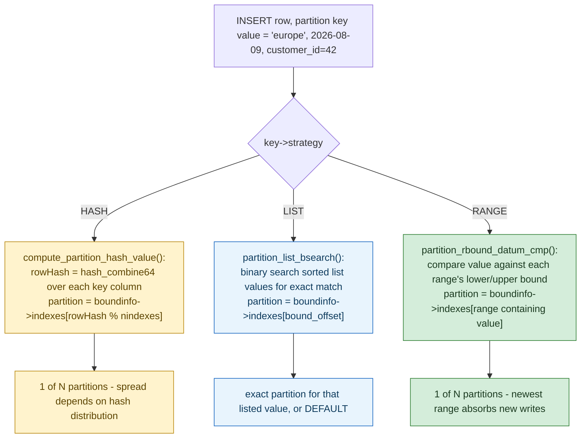

**TL;DR:** "Partition the table" hides a real per-row decision that runs on every single `INSERT` — which partition does *this* row belong to — and Postgres answers it with three genuinely different algorithms depending on the declared strategy: a range comparison walk for `RANGE`, a binary search over sorted list values for `LIST`, and a modulo over a computed hash for `HASH` — the same engine, three distinct routing mechanisms, each with a different failure mode under skewed data.

> **In plain English (30 sec):** Code you already write — Map, function, API call, just bigger.

**Real repo:** [`postgres/postgres`](https://github.com/postgres/postgres)

## 1. The Engineering Problem: picking a partitioning strategy is really picking which skew you're willing to accept

Partitioning a table trades one large index for several smaller ones, so a query or insert only has to touch a fraction of the total data — but *how* rows are assigned to partitions changes what breaks under real-world data. Partition purely by a natural range (order date, sensor timestamp) and you get excellent query pruning for time-bounded queries, but a hot-spot problem: the newest partition, covering "right now," absorbs nearly all write traffic while older partitions sit idle. Partition by a hash of a key and writes spread evenly across all partitions, but a query for "everything with `customer_id = 42`" can no longer be pruned to a single partition the way a range query can, because hashing deliberately destroys ordering. Partition by an explicit list of values (region codes, tenant IDs) and you get precise control and easy pruning per named category, but the list has to be maintained by hand as new categories appear, and one persistently oversized category (a single huge tenant) still creates its own hot spot.

None of these is universally correct — the decision is a genuine tradeoff between write-spread, query-prunability, and operational maintenance, decided by which one matters more for a specific table's real access pattern. This is a different question from *routing across shards in a distributed system* (already covered in System Design's Vitess post) — this is what a single database engine does *within* one instance, choosing which physical child table backs a logical parent, before any network hop is involved at all.

---

## 2. The Technical Solution: one routing function, three algorithms, dispatched by declared strategy

Postgres resolves "which partition does this row belong to" in a single function, `get_partition_for_tuple`, called once per inserted row. The function switches on the table's declared `PARTITION_STRATEGY_*` and runs a genuinely different algorithm per case.



Three core truths: **the hash strategy modulos by `nindexes` (the number of partitions), not by an arbitrary bucket count** — `rowHash % boundinfo->nindexes` means adding or removing a hash partition remaps a large fraction of existing rows, the same resharding problem consistent-hashing schemes exist to avoid at the distributed-systems layer, except here it's accepted because repartitioning a single Postgres instance is a controlled, offline-ish maintenance operation, not a live traffic-serving rebalance. **List partitioning is the only strategy with true O(log n) exact-match lookup** — `partition_list_bsearch` runs a binary search because list values are kept sorted, which is why list partitioning is cheap even with hundreds of distinct partition values. **Range is the only strategy where routing and the actual data's natural order stay aligned** — which is exactly why range partitioning is what almost every time-series/date-partitioned table in practice uses, accepting the "newest partition is hottest" tradeoff deliberately.

---

## 3. The clean example (concept in isolation)

```c
/* Simplified per-strategy row routing, same shape as Postgres's real dispatch */
int route_row(PartitionStrategy strategy, Datum key_value, PartitionBounds *bounds) {
    switch (strategy) {
        case HASH:
            // spreads writes evenly; kills range-pruning on this key
            return bounds->index_by_hash[hash(key_value) % bounds->nparts];

        case LIST:
            // O(log n) exact match against explicit, maintained values
            return binary_search_list(bounds->sorted_values, key_value);

        case RANGE:
            // preserves natural order; newest range gets hottest writes
            return binary_search_range(bounds->sorted_ranges, key_value);
    }
}
```

---

## 4. Production reality (from `postgres/postgres`)

```
src/backend/executor/execPartition.c   <- get_partition_for_tuple: per-row routing at INSERT time
src/backend/partitioning/partbounds.c  <- compute_partition_hash_value: the hash mechanism
```

```c
// src/backend/executor/execPartition.c
static int
get_partition_for_tuple(PartitionDispatch pd, const Datum *values, const bool *isnull)
{
    int         bound_offset = -1;
    int         part_index = -1;
    PartitionKey key = pd->key;
    PartitionBoundInfo boundinfo = pd->partdesc->boundinfo;

    switch (key->strategy)
    {
        case PARTITION_STRATEGY_HASH:
        {
            uint64      rowHash;
            // hash partitioning is too cheap to bother caching
            rowHash = compute_partition_hash_value(key->partnatts,
                                                    key->partsupfunc,
                                                    key->partcollation,
                                                    values, isnull);
            // HASH partitions can't have a DEFAULT partition
            return boundinfo->indexes[rowHash % boundinfo->nindexes];
        }

        case PARTITION_STRATEGY_LIST:
            if (isnull[0])
            {
                if (partition_bound_accepts_nulls(boundinfo))
                    return boundinfo->null_index;
            }
            else
            {
                bool equal;
                bound_offset = partition_list_bsearch(key->partsupfunc,
                                                       key->partcollation,
                                                       boundinfo,
                                                       values[0], &equal);
                if (bound_offset >= 0 && equal)
                    part_index = boundinfo->indexes[bound_offset];
            }
            break;

        case PARTITION_STRATEGY_RANGE:
            // NULLs belong in the DEFAULT partition - no range includes NULL
            // ... range comparison against sorted bounds, see partition_rbound_datum_cmp
            break;
    }
    // ...
}
```

```c
// src/backend/partitioning/partbounds.c
uint64
compute_partition_hash_value(int partnatts, FmgrInfo *partsupfunc, const Oid *partcollation,
                             const Datum *values, const bool *isnull)
{
    int      i;
    uint64   rowHash = 0;
    Datum    seed = UInt64GetDatum(HASH_PARTITION_SEED);

    for (i = 0; i < partnatts; i++)
    {
        if (!isnull[i])
        {
            Datum hash = FunctionCall2Coll(&partsupfunc[i], partcollation[i],
                                           values[i], seed);
            // Form a single 64-bit hash value across ALL partition key columns
            rowHash = hash_combine64(rowHash, DatumGetUInt64(hash));
        }
    }
    return rowHash;
}
```

What this teaches that a hello-world can't:

- **`PARTITION_STRATEGY_HASH` is the only branch with no `DEFAULT` partition path.** The comment "HASH partitions can't have a DEFAULT partition" reflects a real constraint: because every possible hash value maps to *some* modulo bucket, there's no such thing as a value that doesn't fit any hash partition, unlike range or list partitioning where a value can legitimately fall outside every declared bound and needs somewhere to land.
- **`compute_partition_hash_value` combines *all* partition key columns into one `rowHash` via `hash_combine64`, not one hash per column.** A composite partition key (`HASH(tenant_id, region)`) doesn't route independently on each column — the two values are combined into a single 64-bit hash before the modulo, meaning you cannot reason about routing by looking at either column alone; the combination is inseparable.
- **List partitioning's `isnull[0]` branch and range partitioning's `range_partkey_has_null` comment both single out `NULL` as a special case that hash partitioning doesn't need.** `NULL` has no natural position in a sorted list or an ordered range, so both strategies route it to an explicit `null_index` or `DEFAULT` partition; hash partitioning sidesteps the question entirely because `compute_partition_hash_value`'s loop just skips `NULL` columns (`if (!isnull[i])`) and still produces a deterministic hash from whatever columns aren't null.

Known-stale fact: a common assumption is that `key % num_partitions` is inherently fragile under resharding — true for hand-rolled application-level sharding logic, and it's exactly the problem Vitess's reversible-hash-plus-range-ownership design (see this blog's System Design coverage) exists to solve at the distributed-routing layer. Postgres's native `HASH` partitioning accepts that same `rowHash % nindexes` fragility deliberately, because repartitioning a single-instance table (`ALTER TABLE ... DETACH/ATTACH PARTITION`, or adding a partition) is a controlled DDL operation performed during a maintenance window, not a live rebalance across independent physical shards under continuous traffic — the same mathematical tradeoff is acceptable or not depending entirely on which layer is making the decision.

---

## 5. Review checklist

- **Does the chosen strategy match the table's actual dominant query pattern, not just its write pattern?** `HASH` spreads writes evenly but forfeits range pruning entirely — a table partitioned by `HASH(customer_id)` that's mostly queried by date range gets zero pruning benefit from partitioning at all; verify the strategy was picked for the read pattern that matters, not defaulted to "spread the writes" without checking.
- **For `RANGE` partitioning, is there a plan for the newest partition's write hot-spot, not just an assumption it'll be fine?** Every range-partitioned time-series table concentrates nearly all inserts on its most recent partition by construction (see the diagram above) — confirm this was a deliberate accepted tradeoff (matching TimescaleDB's chunking model from this domain's previous post) rather than an unexamined default.
- **For `HASH` partitioning, is `nindexes` (the partition count) fixed for the table's expected lifetime?** Changing the partition count remaps `rowHash % nindexes` for a large fraction of existing rows — a PR that adds or removes a hash partition on a live table should be treated as a data-migration change, not a routine DDL statement.
- **For `LIST` partitioning, is there a `DEFAULT` partition to catch unlisted values, and is someone monitoring it?** Rows landing in `DEFAULT` because a new category value showed up unlisted silently lose the pruning benefit that was the entire point of list partitioning for that value — confirm the default partition isn't quietly accumulating a large, unpruned fraction of the table.

## 6. FAQ

**Q: Why does hash partitioning combine all key columns into one hash instead of hashing each column independently and combining the bucket indices?**
A: A single combined hash (`hash_combine64` folded across every non-null column) ensures the resulting distribution reflects the *joint* cardinality of the composite key, not each column independently — two rows differing in only one of several partition-key columns still land in genuinely different, pseudo-random buckets, which is what "evenly spread" actually requires for a composite key.

**Q: Can a table mix strategies — say, range partitions that are each further hash-partitioned?**
A: Yes, and this is a real, common pattern (sub-partitioning) — a table is first range-partitioned by date, and each date range is itself hash-partitioned by a high-cardinality key to spread writes within that time window. `get_partition_for_tuple` is called recursively per partitioning level in exactly that case, applying the appropriate strategy's algorithm at each level independently.

**Q: What happens to `partition_list_bsearch`'s binary search if the same value is listed in two different partitions?**
A: Postgres's DDL layer rejects that at partition-creation time — `CREATE TABLE ... PARTITION OF ... FOR VALUES IN (...)` validates that a listed value doesn't already belong to another sibling partition, specifically because the binary search shown here assumes each value maps to exactly one `bound_offset`; overlapping list values would make routing ambiguous, so the constraint is enforced upstream of the routing function ever running.

**Q: Is `DEFAULT` partition routing free, performance-wise, compared to a normally-matched partition?**
A: For list and range, a row must first fail to match any explicit bound (a full binary search that comes back empty) before falling through to `DEFAULT` — so `DEFAULT` routing costs strictly more per-row work than a direct match, on top of the query-pruning loss described in the review checklist above. This is a second, less obvious reason a persistently large `DEFAULT` partition is a maintenance smell worth catching in review.

---

## Source

- **Concept:** Advanced partitioning & sharding strategies (range vs hash vs list, composite keys, hot-spot avoidance)
- **Domain:** databases
- **Repo:** [postgres/postgres](https://github.com/postgres/postgres) → [`src/backend/executor/execPartition.c`](https://github.com/postgres/postgres/blob/master/src/backend/executor/execPartition.c), [`src/backend/partitioning/partbounds.c`](https://github.com/postgres/postgres/blob/master/src/backend/partitioning/partbounds.c) — the actual PostgreSQL server source, showing per-row partition routing at the database-engine level, distinct from Vitess's distributed shard-routing layer covered separately in System Design.


