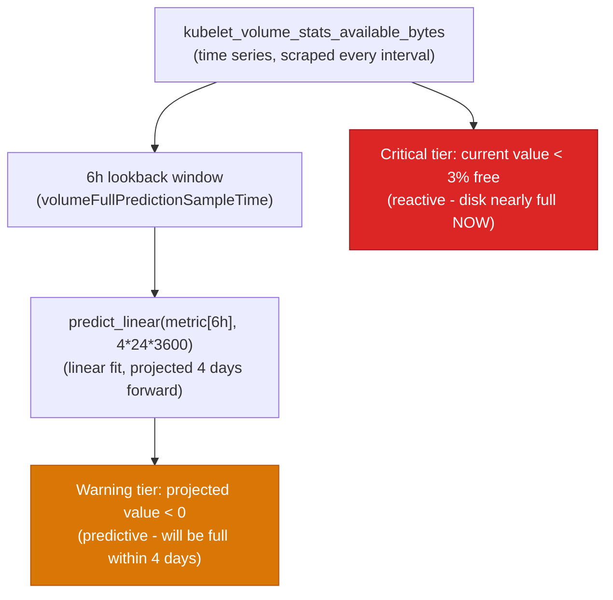
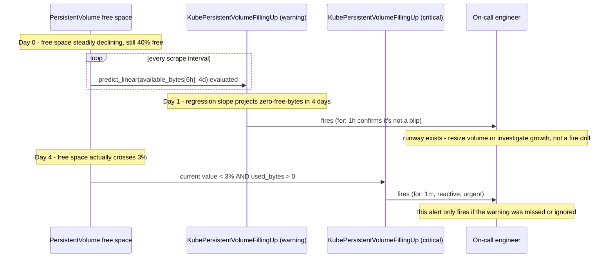

**TL;DR:** Can a metrics dashboard actually predict "this disk fills up in three days" instead of just showing that it's 85% full right now? Yes — Prometheus's `predict_linear()` function fits a linear regression over a recent window of a time series and projects it forward by a chosen duration, which is exactly the mechanism behind kubernetes-mixin's real `KubePersistentVolumeFillingUp` warning alert: it doesn't just threshold on "how full is it now," it thresholds on "will this be empty in four days at the current rate."

## 1. The Engineering Problem

A dashboard panel showing "disk usage: 78%" is a snapshot, not a forecast. By the time a threshold-based alert fires at "disk usage > 90%," the team has however many minutes or hours it takes to fill the remaining 10% to actually respond — which might be plenty of time, or might be almost none, depending entirely on the *rate* of growth, a fact the snapshot doesn't carry. A slowly growing log volume crossing 90% at 2am is a very different page than a runaway process filling the same disk in the next ninety seconds — but a naive percentage threshold treats them identically.

The same problem shows up at every layer capacity planning touches: CPU/memory requests versus actual cluster allocatable capacity, namespace quota consumption trending toward its hard limit, connection pool usage climbing toward a configured max. In every case, "we crossed a threshold" is a reactive signal — it tells you the problem has already arrived. What capacity planning actually needs is a leading signal: given the *trend* in this metric over the recent past, when does it cross the threshold, and is that soon enough to be worth waking someone up for right now versus filing a ticket for next sprint.

Naive fixes don't get you there. Setting the threshold lower ("alert at 70% instead of 90%") just moves the reactive alert earlier without accounting for rate — a disk that's been sitting at 72% for six months and a disk that hit 72% ten minutes ago both fire the same alert, even though only one of them is actually urgent. What's needed is a mechanism that reads the *slope* of the metric, not just its current value.

## 2. The Technical Solution

Prometheus's `predict_linear(v range-vector, t scalar)` function is exactly this mechanism. It takes a range vector — a metric's samples over a lookback window — fits a simple linear regression through those points, and returns the predicted value of that metric `t` seconds from *now*, extrapolating the fitted line forward. It's not a general forecasting model (no seasonality, no changepoints — it's a straight line through recent history), which is precisely why it's cheap enough to evaluate on every scrape interval as part of a real alerting rule, not an offline batch job.

kubernetes-mixin's real `KubePersistentVolumeFillingUp` alert uses this directly on `kubelet_volume_stats_available_bytes` — the free bytes remaining on a PersistentVolume, as reported by the kubelet. The alert has two tiers with fundamentally different mechanisms: a **critical** tier that fires on the metric's *current* value (`< 3%` free, reactive — the disk is nearly full right now), and a **warning** tier that fires on `predict_linear()`'s *forecast* (`predict_linear(...[6h], 4*24*3600) < 0` — the regression over the last 6 hours projects the disk hitting zero free bytes within the next 4 days). The warning tier is the capacity-planning signal: it pages while there's still runway to act, using the same underlying time series the critical alert reads, just interpreted as a trend instead of a snapshot.



The difference between the two tiers is really a difference in *when* each one would have fired against the same underlying data — this is the part a static flowchart can't show, because it's about behavior over time:



Core truths to hold:

- `predict_linear()` is a linear regression over a lookback window, extrapolated forward by a fixed duration — it has no concept of seasonality or acceleration, so a metric with a genuinely non-linear growth curve (e.g. exponential) will have its time-to-threshold *underestimated* the further out you project, which is a real limitation to know about, not a bug.
- The lookback window (`volumeFullPredictionSampleTime: 6h` in kubernetes-mixin) and the projection horizon (`4 * 24 * 3600` seconds = 4 days) are independent, tunable knobs — a shorter lookback reacts faster to recent rate changes but is noisier; a longer lookback smooths noise but reacts slower to a rate that just changed.
- The warning tier is explicitly gated with `and kubelet_volume_stats_used_bytes{...} > 0` — `predict_linear` on a volume with zero usage would trivially predict "never fills up" or produce a degenerate regression, so the alert only evaluates the forecast when there's real usage to extrapolate from.

## 3. The clean example (concept in isolation)

A minimal PromQL alert pair — reactive threshold plus predictive forecast — stripped to the mechanism kubernetes-mixin implements at production scale:

```yaml
# clean-capacity-alert.yaml — same two-tier shape as KubePersistentVolumeFillingUp,
# reduced to one metric and no multi-cluster label plumbing

groups:
  - name: capacity-forecast-example
    rules:
      # Reactive: fires when the disk is ALREADY nearly full
      - alert: DiskAlmostFull
        expr: disk_free_bytes / disk_total_bytes < 0.03
        for: 1m
        labels: { severity: critical }
        annotations:
          summary: "Disk is almost completely full right now."

      # Predictive: fires when the TREND says it WILL be full soon,
      # even though it isn't yet
      - alert: DiskWillFillWithinFourDays
        expr: |
          predict_linear(disk_free_bytes[6h], 4 * 24 * 3600) < 0
        for: 1h
        labels: { severity: warning }
        annotations:
          summary: "At the current rate of growth, this disk will be full within 4 days."
```

## 4. Production reality (from kubernetes-mixin)

```
kubernetes-mixin/
  alerts/
    storage_alerts.libsonnet    — PersistentVolume capacity alerts (this section)
    resource_alerts.libsonnet   — CPU/memory overcommit + quota alerts (related, not predictive)
```

From `alerts/storage_alerts.libsonnet` — the config block defining the lookback window and thresholds, and the two real alert rules built on top of it:

```jsonnet
_config+:: {
  // We alert when a disk is expected to fill up in four days. Depending on
  // the data-set it might be useful to change the sampling-time for the
  // prediction
  volumeFullPredictionSampleTime: '6h',

  // thresholds for KubePersistentVolumeFillingUp alerts
  volumeFreeSpacePercentageCritical: '0.03',
  volumeFreeSpacePercentageWarning: '0.15',
},
```


```jsonnet
{
  // reactive tier: fires on the CURRENT value, no forecasting
  alert: 'KubePersistentVolumeFillingUp',
  expr: |||
    (
      kubelet_volume_stats_available_bytes{%(prefixedNamespaceSelector)s%(kubeletSelector)s}
        /
      kubelet_volume_stats_capacity_bytes{%(prefixedNamespaceSelector)s%(kubeletSelector)s}
    ) < %(volumeFreeSpacePercentageCritical)s
    and
    kubelet_volume_stats_used_bytes{%(prefixedNamespaceSelector)s%(kubeletSelector)s} > 0
  ||| % $._config,
  'for': '1m',
  labels: { severity: 'critical' },
},
{
  // predictive tier: same underlying metric, but gated on predict_linear()
  alert: 'KubePersistentVolumeFillingUp',
  expr: |||
    (
      kubelet_volume_stats_available_bytes{%(prefixedNamespaceSelector)s%(kubeletSelector)s}
        /
      kubelet_volume_stats_capacity_bytes{%(prefixedNamespaceSelector)s%(kubeletSelector)s}
    ) < %(volumeFreeSpacePercentageWarning)s
    and
    kubelet_volume_stats_used_bytes{%(prefixedNamespaceSelector)s%(kubeletSelector)s} > 0
    and
    predict_linear(kubelet_volume_stats_available_bytes{%(prefixedNamespaceSelector)s%(kubeletSelector)s}[%(volumeFullPredictionSampleTime)s], 4 * 24 * 3600) < 0
  ||| % $._config,
  'for': '1h',
  labels: { severity: 'warning' },
  annotations: {
    description: 'Based on recent sampling, the PersistentVolume claimed by {{ $labels.persistentvolumeclaim }} in Namespace {{ $labels.namespace }} is expected to fill up within four days. Currently {{ $value | humanizePercentage }} is available.',
  },
},
```


What this teaches that a static "disk usage > 90%" dashboard tile can't:

- **The warning tier is a compound condition, not a single forecast.** It requires the current percentage to already be under the *warning* threshold (15%, looser than the critical 3%) **and** `predict_linear` to project a zero crossing within 4 days — the forecast alone isn't trusted to fire in isolation, because a noisy metric that briefly dips could produce a false-positive regression. Requiring both a real current trend *and* a forecast crossing is what keeps the predictive alert from being all noise.
- **`for: 1h` on the warning tier versus `for: 1m` on the critical tier is itself a design decision about forecast confidence.** A predictive alert needs to stay true for longer before paging, precisely because a single noisy sample could produce a spurious linear-regression crossing — the reactive alert, evaluating a directly-observed current value, needs far less confirmation time.
- **The lookback window is a named, tunable config value (`volumeFullPredictionSampleTime`), with an explicit comment acknowledging it should change per dataset.** This is the real acknowledgment that `predict_linear`'s accuracy depends entirely on how representative the lookback window is of the *current* rate of change — a workload with bursty, non-uniform growth needs a different window than one with steady linear growth, and the mixin's authors left that as an explicit override point instead of a hardcoded constant.

## 5. Review checklist

- **Does a capacity alert use a bare percentage threshold, or does it also account for rate of change?** If the only alert is "used > 90%," ask whether a `predict_linear()`-based companion alert would give the team enough runway to act instead of reacting to an already-critical state.
- **Is the lookback window (`[6h]` in this example) representative of the actual growth pattern being measured?** A workload with a daily traffic cycle sampled over a 6-hour window can have its regression skewed by whatever part of the cycle that window happened to catch — verify the window is long enough to smooth out normal cyclic variation.
- **Is the projection horizon (`4 * 24 * 3600` seconds here) matched to actual response time, not picked arbitrarily?** If provisioning more disk or scaling a resource genuinely takes 2 days end-to-end, a 4-day horizon gives real margin; a horizon shorter than your actual response time defeats the purpose of forecasting at all.
- **Is the predictive alert gated on a real-usage guard (`kubelet_volume_stats_used_bytes > 0` here)**, preventing `predict_linear` from firing spurious forecasts against a metric with degenerate or near-zero recent activity?

## 6. FAQ

**Q: Is `predict_linear()` a machine learning model?**
A: No — it's ordinary least-squares linear regression over the samples in the given range vector, evaluated fresh on every rule evaluation. There's no training, no persisted model, no memory between evaluations beyond the lookback window itself. That simplicity is the point: it's cheap enough to run as a live alerting rule on every scrape interval across a whole fleet of PersistentVolumes, not something that needs an offline training pipeline.

**Q: Why does kubernetes-mixin's warning alert use `for: 1h` instead of firing immediately once the forecast crosses zero?**
A: Because a linear regression over a noisy time series can produce a spurious crossing from a single anomalous sample. Requiring the condition to hold continuously for `1h` (re-evaluated at every scrape interval during that window) filters out one-off noise, so the alert only pages when the trend is a persistent, real signal — the same reason most Prometheus alerts use a `for` clause at all, applied specifically to a forecast that's inherently less certain than a directly observed value.

**Q: What happens if usage genuinely grows non-linearly, like exponentially?**
A: `predict_linear` will underestimate how soon the threshold is crossed, because it's fitting a straight line to what's actually a curve — by the time the linear fit "catches up" to the true accelerating rate, the actual time-to-full is shorter than what was forecast several evaluations ago. This is a real, named limitation of the function, not a mixin-specific bug — it's why the critical, current-value tier still exists as a backstop even with the predictive tier in place.

**Q: Does this relate to the RED/USE-method dashboards from an earlier lesson in this series?**
A: They're built from the same underlying node/pod resource metrics, but they answer different questions. The USE-method dashboards (`kubernetes-mixin`'s node/pod resource panels) answer "what is current utilization versus capacity, right now" — a snapshot for a human looking at a screen. This alert answers "given the recent trend, when will that utilization cross a threshold" — a forecast a machine evaluates continuously and pages on, without a human needing to be staring at the dashboard when the trend starts.

**Q: How is this different from the Fermi-estimation capacity planning covered in the System Design series?**
A: That's a pre-launch estimation technique — back-of-envelope math (requests/sec × payload size × replication factor) used *before* a system exists or before production data is available, to size infrastructure from first principles. This lesson is the opposite direction: it assumes the system is already running and already emitting real metrics, and uses the *actual observed trend* in those metrics to forecast forward. One estimates capacity needs from assumptions; the other forecasts capacity exhaustion from evidence.

---

## Source

- **Concept:** Capacity planning & performance modeling (trend-based forecasting from production metrics)
- **Domain:** Observability
- **Repo:** [kubernetes-monitoring/kubernetes-mixin](https://github.com/kubernetes-monitoring/kubernetes-mixin) → [`alerts/storage_alerts.libsonnet`](https://github.com/kubernetes-monitoring/kubernetes-mixin/blob/master/alerts/storage_alerts.libsonnet) — real, widely-deployed dashboard-as-code whose `KubePersistentVolumeFillingUp` alert is the reference implementation of `predict_linear()`-based capacity forecasting
