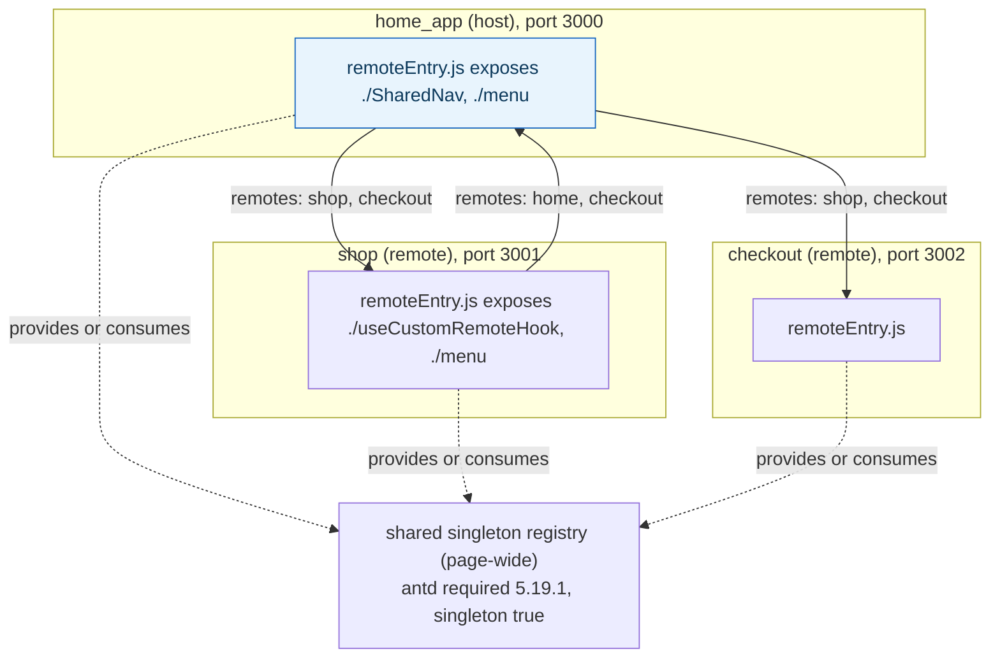
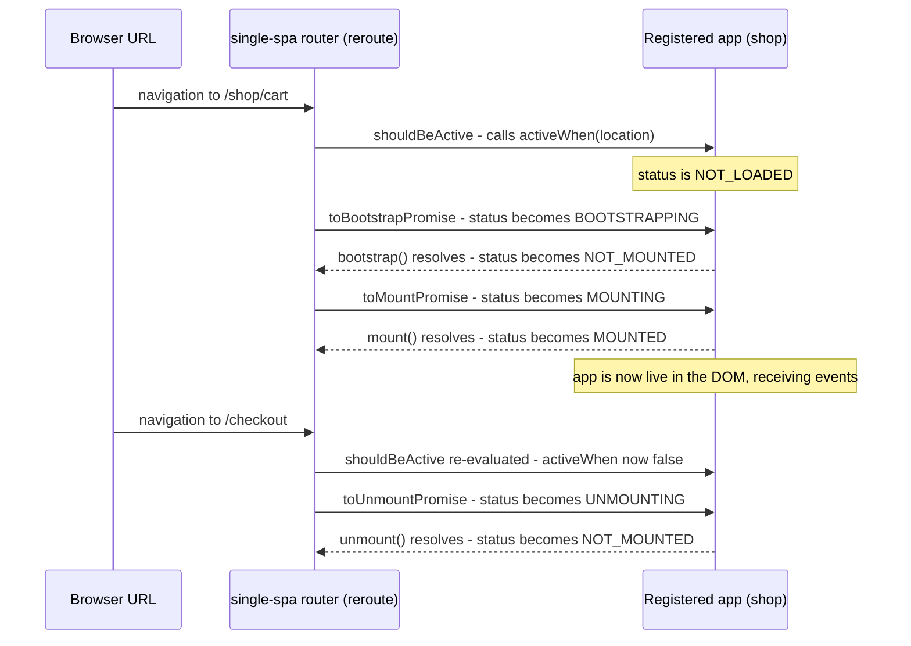

**TL;DR:** Splitting a backend into microservices means each service gets its own process, its own memory, its own dependency versions — isolation is free. Splitting a frontend the same way runs into a wall backends never hit: every "micro-frontend" still has to share one browser tab, one DOM, and usually one React/Vue instance, or a user pays for five copies of the same framework in their bundle. Webpack Module Federation solves this by making dependency sharing and version negotiation a runtime concern instead of a build-time one; single-spa solves the adjacent problem — which of several independently-built apps is even supposed to be active right now — with an explicit lifecycle state machine driven by the URL.
> **In plain English (30 sec):** Think of this like concepts you already use, but in a production system at scale.


**Real repos:** [`module-federation/core`](https://github.com/module-federation/core), [`single-spa/single-spa`](https://github.com/single-spa/single-spa)

## 1. The Engineering Problem: independently deployed frontends still share one runtime

The case for micro-frontends mirrors the case for microservices: different teams own different parts of a large product (a "shop" section, a "checkout" flow, a "home" dashboard), and forcing them into one monolithic frontend build means one team's deploy blocks on everyone else's build passing, and a bug in one team's code can only be fixed by redeploying the entire application.

But a backend microservice split gets isolation almost for free — each service is its own OS process with its own memory space, and two services can run completely different versions of a shared library without either knowing. A frontend split into separately-built apps doesn't get that for free, because the runtime is one browser tab: if `shop` was built against React 18.2 and `checkout` was built against React 18.3, naively concatenating both bundles either ships two full copies of React (worse load time, and two competing reconcilers touching the same DOM) or silently breaks if they're forced to share one copy neither was tested against. And even with dependency sharing solved, a second problem remains: at any given URL, exactly one (or a well-defined few) of these independently-built apps should actually be mounted and receiving DOM events — something has to own deciding when to bootstrap, mount, and unmount each one as the user navigates, without every app's code needing to know about every other app.

---

## 2. The Technical Solution: share dependencies at runtime, manage app lifecycle with an explicit state machine

**Module Federation solves the dependency-duplication half.** Each app builds a `remoteEntry.js` manifest describing what it `exposes` (specific modules other apps can import) and what it needs from `shared` (dependencies it's willing to receive from whichever app loaded first, instead of bundling its own copy) — including a `singleton` flag forcing exactly one instance to exist page-wide, and a `requiredVersion` the runtime checks before agreeing to share. A host app declares `remotes`: other apps' `remoteEntry.js` URLs it can dynamically `import()` at runtime, resolved by the browser at page-load, not baked in at the host's own build time.

**single-spa solves the "which app is active" half.** Every registered application declares an `activeWhen(location)` function — typically a URL-prefix check — and single-spa's router listens for navigation, calls `activeWhen` for every registered app on every route change, and drives each app through an explicit state machine (`NOT_LOADED` → `LOADING_SOURCE_CODE` → `NOT_BOOTSTRAPPED` → `BOOTSTRAPPING` → `NOT_MOUNTED` → `MOUNTING` → `MOUNTED`, and back down through `UNMOUNTING` on navigation away) by calling that app's exported `bootstrap`/`mount`/`unmount` lifecycle functions. No app needs to poll for whether it should be visible — single-spa calls it exactly when its status needs to change.



single-spa's lifecycle state machine, driven by a route change:



Three core truths to hold onto:

1. **Module Federation's `shared` config is a negotiation, not a guarantee** — `singleton: true` plus a `requiredVersion` means the runtime picks one shared instance and warns (or, depending on config, errors) if a loaded remote's actual version can't satisfy what another app declared it requires. Sharing is opt-in per dependency, not automatic for everything in `node_modules`.
2. **single-spa never imports an app's internals** — it only ever calls the exported `bootstrap`, `mount`, and `unmount` functions, which is what lets apps be built with completely different frameworks (a React app, a Vue app, and a vanilla-JS app can all be registered the same way) as long as each exposes that same three-function contract.
3. **The state machine exists specifically so an app is never asked to mount twice, or unmounted while still mounting** — `toMountPromise` checks `appOrParcel.status !== NOT_MOUNTED` and no-ops if it's already past that state, which is what makes rapid back-to-back navigation safe instead of racing two overlapping mount calls against the same DOM node.

---

## 3. The clean example (concept in isolation)

```js
// webpack.config.js (host) - Module Federation config, stripped to essentials
new ModuleFederationPlugin({
  name: "host",
  remotes: {
    // "shop" is resolved at RUNTIME from this URL, not bundled at build time
    shop: "shop@http://localhost:3001/remoteEntry.js",
  },
  shared: {
    react: { singleton: true, requiredVersion: "^18.2.0" },
  },
});

// somewhere in host code:
const ShopWidget = await import("shop/Widget"); // dynamically resolved
```

```js
// shop-app.js - a single-spa-registrable application, the minimal contract
export async function bootstrap() {
  // one-time setup, runs once before the app is ever mounted
}
export async function mount(props) {
  // render into props.domElement - called every time this app becomes active
}
export async function unmount(props) {
  // tear down, remove DOM nodes, unsubscribe - called when navigating away
}

// registered once, activeWhen decides when single-spa calls the above:
registerApplication({
  name: "shop",
  app: () => import("./shop-app.js"),
  activeWhen: (location) => location.pathname.startsWith("/shop"),
});
```

---

## 4. Production reality (from `module-federation/core` and `single-spa/single-spa`)

```
module-federation/core/
└── apps/
    ├── 3000-home/next.config.js   # host - exposes SharedNav, consumes shop + checkout
    └── 3001-shop/next.config.js   # remote to home, also a host to checkout

single-spa/single-spa/
└── src/
    ├── applications/
    │   └── app.helpers.js          # the status constants + activeWhen check
    └── lifecycles/
        └── mount.js                 # toMountPromise - the state transition itself
```

**Two real apps federating bidirectionally — `home_app` exposes to `shop` and `checkout`, and consumes `shop` back:**

```js
// apps/3000-home/next.config.js (elided)
config.plugins.push(
  new NextFederationPlugin({
    name: 'home_app',
    filename: 'static/chunks/remoteEntry.js',
    remotes: {
      shop: remotes.shop,
      checkout: remotes.checkout,
    },
    exposes: {
      './SharedNav': './components/SharedNav',
      './menu': './components/menu',
    },
    shared: {
      'lodash/': {},
      antd: {
        requiredVersion: '5.19.1',
        version: '5.19.1',
      },
      '@ant-design/': {
        singleton: true,
      },
    },
  }),
);
```

```js
// apps/3001-shop/next.config.js (elided)
config.plugins.push(
  new NextFederationPlugin({
    name: 'shop',
    filename: 'static/chunks/remoteEntry.js',
    remotes: {
      home: remotes.home,           // shop imports FROM home too - bidirectional
      checkout: remotes.checkout,
    },
    exposes: {
      './useCustomRemoteHook': './components/useCustomRemoteHook',
      './menu': './components/menu',
    },
    shared: {
      antd: {
        requiredVersion: '5.19.1',
        version: '5.19.1',
      },
      '@ant-design/': {
        singleton: true,
      },
    },
  }),
);
```

**single-spa's actual status constants and the check that decides whether an app should be active:**

```js
// src/applications/app.helpers.js (elided)

// App statuses
export const NOT_LOADED = "NOT_LOADED";
export const LOADING_SOURCE_CODE = "LOADING_SOURCE_CODE";
export const NOT_BOOTSTRAPPED = "NOT_BOOTSTRAPPED";
export const BOOTSTRAPPING = "BOOTSTRAPPING";
export const NOT_MOUNTED = "NOT_MOUNTED";
export const MOUNTING = "MOUNTING";
export const MOUNTED = "MOUNTED";
export const UPDATING = "UPDATING";
export const UNMOUNTING = "UNMOUNTING";
export const UNLOADING = "UNLOADING";
export const SKIP_BECAUSE_BROKEN = "SKIP_BECAUSE_BROKEN";

export function isActive(app) {
  return app.status === MOUNTED;
}

export function shouldBeActive(app) {
  try {
    return app.activeWhen(window.location);
  } catch (err) {
    handleAppError(err, app, SKIP_BECAUSE_BROKEN);
    return false;
  }
}
```

**`toMountPromise` — the actual state transition, including what happens if `mount()` throws:**

```js
// src/lifecycles/mount.js (elided)

export function toMountPromise(appOrParcel, hardFail) {
  return Promise.resolve().then(() => {
    if (appOrParcel.status !== NOT_MOUNTED) {
      return appOrParcel;  // already mounting/mounted - no duplicate mount
    }

    appOrParcel.status = MOUNTING;

    return reasonableTime(appOrParcel, "mount")
      .then(() => {
        appOrParcel.status = MOUNTED;
        return appOrParcel;
      })
      .catch((err) => {
        // fail to mount -> attempt unmount first, then mark broken,
        // rather than leaving the app stuck mid-transition
        appOrParcel.status = MOUNTED;
        return toUnmountPromise(appOrParcel, true).then(
          setSkipBecauseBroken,
          setSkipBecauseBroken
        );
      });
  });
}
```

What this teaches that a hello-world can't:

- **`home_app`'s and `shop`'s configs both list each other in `remotes`** — Module Federation doesn't have a strict host/remote hierarchy in practice; a real deployment federates bidirectionally, and `home_app` importing from `shop` while `shop` imports from `home_app` is exactly why the wiring lives in each app's own build config rather than a central manifest one team owns.
- **`antd`'s `singleton: true` sits on `@ant-design/` (the icon/theming sub-packages) while the base `antd` package instead pins `requiredVersion`/`version` exactly** — this is a real, deliberate distinction: some shared dependencies need exactly-one-instance enforcement (a UI library with global theme context), while others just need compatible-version negotiation, and conflating the two in every `shared` entry would either over-constrain or under-protect the app.
- **`toMountPromise`'s catch block promotes a mount failure into an unmount attempt before marking the app `SKIP_BECAUSE_BROKEN`**, rather than just leaving `status` stuck at `MOUNTING` forever — a hello-world lifecycle example almost never handles the failure path, but it's exactly what keeps one broken micro-frontend from leaving single-spa's internal bookkeeping in a state that blocks every subsequent navigation to that app.

Known-stale fact: micro-frontends are sometimes pitched as "just split the frontend into iframes" or "just build separate SPAs and link between them," both of which sidestep runtime sharing entirely — iframes avoid the shared-DOM problem by making every micro-frontend its own document (at the cost of no shared state, no shared routing, and real UX seams), and separate-SPAs-with-full-page-links sidesteps client-side lifecycle management entirely (at the cost of a full page reload on every cross-app navigation). Module Federation and single-spa both exist specifically to keep the single-page-app experience (shared DOM, no reload, shared framework instance) while still allowing independent builds and deploys — that's the harder problem the iframe/full-reload shortcuts don't actually solve.

---

## 5. Review checklist

- **Is every dependency in a Module Federation `shared` block deliberately marked `singleton` (or not), rather than left at the plugin's default?** A UI library with global context (theming, portals) that isn't marked `singleton` can silently end up with two competing instances if version resolution doesn't collapse them.
- **Does `requiredVersion` reflect what the app was actually built and tested against, not a loose range copied from `package.json`?** A `shared` entry with no `requiredVersion` accepts whatever version whichever app loaded first happened to provide — including a version this app never ran its tests against.
- **Does every single-spa-registered app implement `unmount` to fully tear down (remove DOM nodes, cancel subscriptions, clear timers), not just stop rendering?** A `MOUNTED` → `NOT_MOUNTED` transition that leaves listeners attached leaks state into whichever app mounts next at the same URL slot.
- **Is `activeWhen` specific enough that two registered apps can't both evaluate true for the same URL** unless that overlap is intentional (e.g. a shared nav app meant to coexist with a route-specific app)? An accidental overlap means single-spa will mount both, competing for the same screen real estate.

## 6. FAQ

### Does Module Federation require using webpack specifically?
The mechanism (a `remoteEntry.js` manifest describing exposed modules and shared dependency requirements, resolved at runtime via dynamic `import()`) originated in webpack 5 and is what `module-federation/core`'s `ModuleFederationPlugin`/`NextFederationPlugin` implement, but the same repo's `apps/esbuild` and `apps/rslib-module` examples show the concept has been ported to other bundlers — the runtime-resolution idea isn't inherently webpack-specific, even though webpack is where it was first production-proven.

### How does single-spa decide which app to mount if two apps' `activeWhen` both return true for the same URL?
It mounts both — `activeWhen` isn't exclusive routing, it's an independent per-app check evaluated on every app at every navigation. This is deliberate: it's what lets a persistent nav/shell app (`activeWhen: () => true`) coexist with a route-specific app underneath it, rather than forcing single-spa to pick exactly one winner per URL.

### What happens to Module Federation's shared-dependency negotiation if two remotes require genuinely incompatible major versions?
The runtime can't collapse them into one shared instance if the `requiredVersion` ranges don't overlap — depending on configuration, it either loads a second copy for the incompatible remote (defeating deduplication for that dependency, but keeping the app working) or errors, depending on `strictVersion`/`singleton` settings on that `shared` entry. This is the version-skew tradeoff that's inherent to sharing at runtime instead of at a single build's dependency resolution.

### Why does `toMountPromise` set `appOrParcel.status = MOUNTED` before calling `toUnmountPromise` in the failure branch, instead of leaving it at `MOUNTING`?
Because `toUnmountPromise` itself checks the app's current status and no-ops unless it's `MOUNTED` (the same guard pattern `toMountPromise` uses against `NOT_MOUNTED`) — temporarily setting `MOUNTED` is what makes the existing unmount code path actually run for an app that never successfully finished mounting, reusing the same teardown logic rather than duplicating it for the failure case.

---

## Source

- **Concept:** Micro-frontends architecture — Module Federation's runtime dependency sharing and single-spa's application lifecycle management
- **Domain:** architecture
- **Repo:** [module-federation/core](https://github.com/module-federation/core) → [`apps/3000-home/next.config.js`](https://github.com/module-federation/core/blob/main/apps/3000-home/next.config.js), [`apps/3001-shop/next.config.js`](https://github.com/module-federation/core/blob/main/apps/3001-shop/next.config.js) — the real Webpack Module Federation project's own reference host/remote apps. (Note: the project moved from `module-federation/module-federation` to `module-federation/core`; the old org/repo name now 404s.)
- **Repo:** [single-spa/single-spa](https://github.com/single-spa/single-spa) → [`src/applications/app.helpers.js`](https://github.com/single-spa/single-spa/blob/main/src/applications/app.helpers.js), [`src/lifecycles/mount.js`](https://github.com/single-spa/single-spa/blob/main/src/lifecycles/mount.js) — the real micro-frontend framework's application lifecycle state machine.


