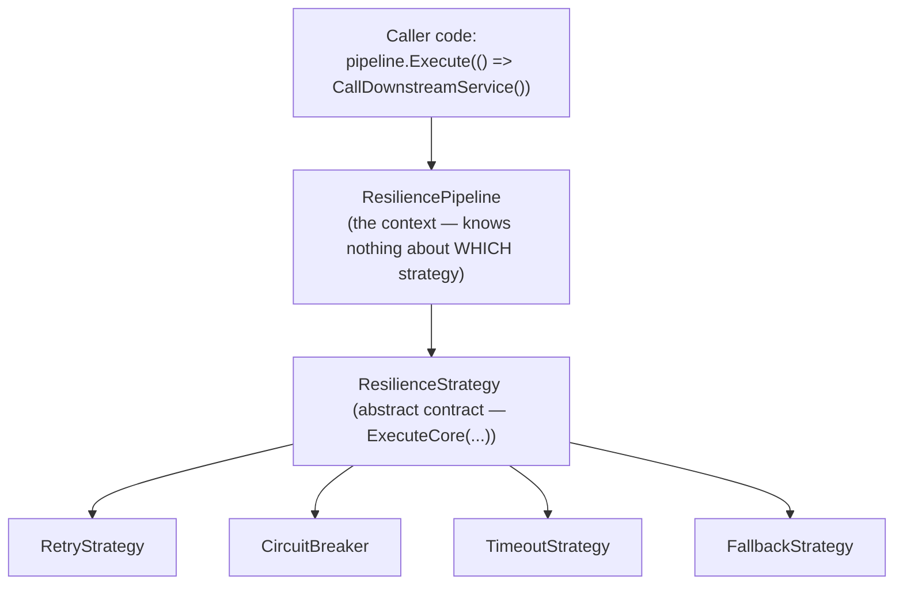

## 1. The Engineering Problem: swapping behavior without touching the caller

Say you're calling a flaky downstream service, and you want retries. Then next sprint
you also want a circuit breaker. Then a timeout. The naive path is a `ResilienceMode`
enum and a big `switch` at the call site — and now every caller that wants resilience
behavior has to know about every kind of resilience behavior that exists, and adding a
new one means editing code you don't own.

What you actually want: the calling code says "run this callback resiliently" and has
*no idea* whether that means retrying, breaking the circuit, timing out, or some
combination — and adding a brand-new resilience behavior later should mean writing one
new class, not editing the caller at all.

## 2. The Technical Solution: one interface, many interchangeable algorithms

This is the Strategy pattern: define a minimal common contract, put each algorithm
behind its own class that implements it, and have the calling ("context") code hold
only a reference to the *abstraction* — never to a concrete type.



Three truths to hold:

1. The abstraction has to be genuinely minimal — one method, in Polly's case — or
   concrete strategies end up needing to know things about each other to implement it,
   which defeats the point.
2. The context (the pipeline) never contains an `if (strategy is RetryStrategy)` check.
   The moment it does, you've reintroduced the switch statement you were trying to
   eliminate, just moved one layer deeper.
3. Because every strategy honors the same contract, they compose: a pipeline can chain
   several strategies (retry wrapping a circuit breaker wrapping a timeout), and the
   caller's `Execute()` call doesn't change no matter how many are stacked.

## 3. The clean example (concept in isolation)

```csharp
// Minimal illustration — the actual shape Polly uses, stripped to the essentials.

abstract class ResilienceStrategy
{
    // The ENTIRE contract every strategy must implement. Small on purpose.
    public abstract Task<T> ExecuteAsync<T>(Func<Task<T>> callback);
}

sealed class RetryStrategy(int maxAttempts) : ResilienceStrategy
{
    public override async Task<T> ExecuteAsync<T>(Func<Task<T>> callback)
    {
        for (int attempt = 0; ; attempt++)
        {
            try { return await callback(); }
            catch when (attempt < maxAttempts) { /* swallow and retry */ }
        }
    }
}

sealed class TimeoutStrategy(TimeSpan timeout) : ResilienceStrategy
{
    public override async Task<T> ExecuteAsync<T>(Func<Task<T>> callback)
    {
        using var cts = new CancellationTokenSource(timeout);
        return await callback().WaitAsync(cts.Token);
    }
}

// The "context" — holds only the abstraction, never a concrete strategy type.
sealed class Pipeline(ResilienceStrategy strategy)
{
    public Task<T> Execute<T>(Func<Task<T>> callback) => strategy.ExecuteAsync(callback);
}

// Caller code doesn't change whether `strategy` is Retry, Timeout, or something new:
var pipeline = new Pipeline(new RetryStrategy(maxAttempts: 3));
await pipeline.Execute(() => CallDownstreamServiceAsync());
```

## 4. Production reality (from Polly)

This is the real abstract contract from `App-vNext/Polly` — every resilience strategy
in the library implements this exact class, unchanged since it's the seam the whole
library is built around:

```csharp
namespace Polly;

/// <summary>
/// Base class for all proactive resilience strategies.
/// </summary>
public abstract class ResilienceStrategy
{
    protected internal abstract ValueTask<Outcome<TResult>> ExecuteCore<TResult, TState>(
        Func<ResilienceContext, TState, ValueTask<Outcome<TResult>>> callback,
        ResilienceContext context,
        TState state);
}
```

And here's one real concrete strategy — the retry implementation — implementing that
same contract. License header/imports trimmed, logic unchanged:

```csharp
namespace Polly.Retry;

internal sealed class RetryResilienceStrategy<T> : ResilienceStrategy<T>
{
    public TimeSpan BaseDelay { get; }
    public int RetryCount { get; }
    public Func<RetryPredicateArguments<T>, ValueTask<bool>> ShouldHandle { get; }

    protected internal override async ValueTask<Outcome<T>> ExecuteCore<TState>(
        Func<ResilienceContext, TState, ValueTask<Outcome<T>>> callback,
        ResilienceContext context,
        TState state)
    {
        int attempt = 0;
        while (true)
        {
            Outcome<T> outcome;
            try { outcome = await callback(context, state).ConfigureAwait(false); }
            catch (Exception ex) { outcome = new(ex); }

            var handle = await ShouldHandle(new(context, outcome, attempt)).ConfigureAwait(false);
            var isLastAttempt = IsLastAttempt(attempt, out bool incrementAttempts);

            if (isLastAttempt || !handle)
            {
                return outcome;
            }

            var delay = RetryHelper.GetRetryDelay(BackoffType, UseJitter, attempt, BaseDelay, MaxDelay, ref retryState, _randomizer);
            // ... telemetry, OnRetry callback, and the actual delay await happen here ...

            if (incrementAttempts) { attempt++; }
        }
    }
}
```

What this teaches that a UML box-and-arrow diagram can't:

- **The contract really is one method** (`ExecuteCore`) — and every other Polly
  strategy (`CircuitBreakerResilienceStrategy`, `TimeoutResilienceStrategy`,
  `FallbackResilienceStrategy`, `HedgingResilienceStrategy`) implements that *exact
  same signature*. That's what makes `ResiliencePipeline` — the context — able to hold
  any of them, or a composed chain of several, without ever branching on which one it
  has.
- **`ShouldHandle` is itself a delegate, not a hardcoded exception type check.** The
  strategy's *policy* (which outcomes count as failures worth retrying) is injected
  separately from its *mechanism* (the retry loop itself) — a second, smaller instance
  of the same "swap the behavior without touching the caller" idea, one level down.
- **The retry loop has no idea what it's retrying.** `callback` is an opaque
  `Func<...>` — the strategy doesn't know or care if it's an HTTP call, a database
  query, or a gRPC request. That's what makes one `RetryResilienceStrategy` reusable
  across every kind of call in the codebase.

---

## Source

- **Concept:** Strategy pattern
- **Domain:** design-patterns
- **Repo:** [App-vNext/Polly](https://github.com/App-vNext/Polly) → [`src/Polly.Core/ResilienceStrategy.cs`](https://github.com/App-vNext/Polly/blob/main/src/Polly.Core/ResilienceStrategy.cs) and [`src/Polly.Core/Retry/RetryResilienceStrategy.cs`](https://github.com/App-vNext/Polly/blob/main/src/Polly.Core/Retry/RetryResilienceStrategy.cs) — .NET's most widely used resilience library
