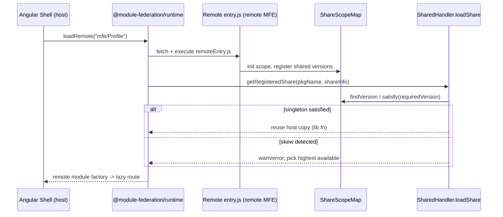

## TL;DR

How can an Angular shell ship independently of the feature teams that build its pages, and still load those pages at runtime without bundling or redeploying the shell? Module Federation turns each remote Angular app into a self-describing "remote entry" that the shell fetches on demand, while a shared-scope version resolver dedupes libraries and flags version skew instead of silently breaking.

**Real repo:** [module-federation/core](https://github.com/module-federation/core) and [angular/angular](https://github.com/angular/angular).

## 1. The Engineering Problem

In a single Angular SPA, every route, library, and component is compiled into one bundle owned by one team. That is fine until you have several teams:

- Team A owns the "checkout" pages, Team B owns "profile", Team C owns the shell.
- Each team ships on its own cadence. The shell should not need a rebuild because Team B bumped `@angular/core` from 17.1 to 17.3.
- Both the shell and the remotes import the same libraries (`rxjs`, `@angular/common`). Bundling them twice wastes bytes and, worse, creates two copies of singleton services.
- If the shell loads a remote built against a slightly different Angular version, you need a deterministic rule: which copy wins, and what happens when the versions genuinely conflict?

Classic solutions — iframes, web components, runtime `<script>` injection — punt on shared-dependency deduplication and version negotiation. Module Federation bakes both into the runtime.

## 2. The Technical Solution

Module Federation splits an app into a **host** (the Angular shell) and **remotes** (the micro-frontends). At build time, the federation plugin writes a `remoteEntry.js` for each remote that exposes a `__webpack_require__.S` **share scope** — a map of `scope -> package -> version -> { get, loaded, lib }`. At runtime the host calls `loadRemote(id)` which fetches the remote entry, merges the remote's share scope into the host's, and resolves shared deps through `getRegisteredShare`.



**Core truths:**

1. **The remote entry is the contract.** It exposes a `get(expose)` factory and a `init(shareScope)` that folds the remote's declared shared packages into the host's `ShareScopeMap`. The shell never imports remote source at build time.
2. **Version resolution is a real algorithm, not equality.** `getRegisteredShare` walks every declared version of a package under a scope and uses `satisfy(requiredVersion)` (semver) plus the `singleton`/`strictVersion` flags to decide the winner. When `singleton` is set and the chosen version fails `satisfy`, it `error`s under `strictVersion` or `warn`s otherwise — so skew is surfaced, not hidden.
3. **Dedup happens through the share scope, not the bundler.** Once a shared lib's `lib` factory is set on the scope, every subsequent consumer (host or remote) calls the same instance; `addUseIn` tracks who depends on it.

## 3. The clean example

A minimal host + remote wiring in Angular using the modern `@module-federation/angular` (built on `@module-federation/core`).

**Remote (`angular.json` / `webpack` federation config):**

```ts
// remote/mfe.config.ts
import { withModuleFederation } from '@angular-architects/module-federation';

export default withModuleFederation({
  name: 'profile',
  exposes: {
    './ProfileModule': './src/app/profile/profile.module.ts',
  },
  shared: {
    '@angular/core': { singleton: true, strictVersion: true },
    '@angular/common': { singleton: true, strictVersion: true },
    '@angular/router': { singleton: true, strictVersion: true },
    rxjs: { singleton: true },
  },
});
```

**Shell (`app.routes.ts`) — lazy-load the remote at runtime:**

```ts
// shell/src/app/app.routes.ts
import { loadRemoteModule } from '@angular-architects/module-federation';

export const APP_ROUTES = [
  { path: '', loadChildren: () => import('./home/home.module').then(m => m.HomeModule) },
  {
    path: 'profile',
    loadChildren: () =>
      loadRemoteModule({
        remoteEntry: 'http://localhost:4201/remoteEntry.js',
        remoteName: 'profile',
        exposedModule: './ProfileModule',
      }).then(m => m.ProfileModule),
  },
];
```

When the user navigates to `/profile`, the shell fetches `remoteEntry.js`, runs `init` to merge `profile`'s shared `@angular/core` (17.3) into the shell's share scope, then resolves `./ProfileModule`. Because both declared `@angular/core` as a `singleton`, the runtime reuses whichever version satisfies `^17.1` rather than instantiating a second copy.

## 4. Production reality

The real resolver lives in `packages/runtime-core/src/utils/share.ts`. The annotated highlights below show the exact negotiation logic the host runs for every shared dependency.

```ts
// packages/runtime-core/src/utils/share.ts  (getRegisteredShare, trimmed)
export function getRegisteredShare(
  localShareScopeMap: ShareScopeMap,
  pkgName: string,
  shareInfo: Shared,
  resolveShare: SyncWaterfallHook<{ /* ... */ }>,
): { shared: Shared; useTreesShaking: boolean } | void {
  // ...
  const { requiredVersion } = shareConfig;
  const findShareFunction = getFindShareFunction(strategy); // 'version-first' (default) | 'loaded-first'
  // pick highest (or already-loaded) version available in scope
  const { version: maxOrSingletonVersion, useTreesShaking } =
    findShareFunction(localShareScopeMap, sc, pkgName, treeShaking);

  const defaultResolver = () => {
    const shared = localShareScopeMap[sc][pkgName][maxOrSingletonVersion];
    if (shareConfig.singleton) {
      if (
        typeof requiredVersion === 'string' &&
        !satisfy(maxOrSingletonVersion, requiredVersion)   // <-- semver check
      ) {
        const msg = `Version ${maxOrSingletonVersion} ... of shared singleton module ${pkgName} does not satisfy the requirement of ${shareInfo.from} which needs ${requiredVersion}`;
        if (shareConfig.strictVersion) {
          error(msg);   // hard failure on skew
        } else {
          warn(msg);    // tolerate skew, still load
        }
      }
      return { shared, useTreesShaking };
    } else {
      if (satisfy(maxOrSingletonVersion, requiredVersion)) {
        return { shared, useTreesShaking };  // non-singleton: best-fit match
      }
      // fall back: scan all versions for one that satisfies
      for (const [versionKey, versionValue] of Object.entries(
        localShareScopeMap[sc][pkgName],
      )) {
        if (satisfy(versionKey, requiredVersion)) {
          return { shared: versionValue, useTreesShaking: false };
        }
      }
    }
    return;
  };
  // ...
  return resolveShared.resolver();
}
```

The actual load path that consumes this lives in `packages/runtime-core/src/shared/index.ts` (`SharedHandler.loadShare`): it first checks `targetShared.lib` (already-loaded copy), then `targetShared.loading` (in-flight promise, dedupes concurrent requests), and only then calls `targetShared.get!()` to fetch the factory — storing the result back on the scope so the next consumer reuses it.

```
Tree callout — where the logic lives:
packages/runtime-core/src/
├─ utils/share.ts        -> getRegisteredShare, findVersion, satisfy, formatShare
├─ shared/index.ts       -> SharedHandler.loadShare / loadShareSync / initializeSharing
└─ core.ts               -> ModuleFederation.loadRemote -> RemoteHandler
```

**What this teaches:** version negotiation is centralized and explicit. The `singleton` + `strictVersion` flags are the policy knobs — `singleton` makes one instance authoritative across the whole graph, and `strictVersion` converts a silent skew into a thrown error you can catch in CI or at runtime.

## 5. Review checklist

- Is every framework-level package (`@angular/*`, `rxjs`) declared `singleton: true` in both shell and remotes, or do you risk dual instances of zone.js/services?
- Does the shell call `loadRemote` only inside lazy route guards, so remotes are truly fetched on demand?
- Are `strictVersion` choices deliberate — hard `error` for runtime-breaking skews, `warn` (tolerant) for compatible ranges?
- Is the remote's `remoteEntry.js` served with a stable URL and cache headers, since the shell trusts it at runtime?

## 6. FAQ

**Q: Does Module Federation require Webpack, or can Angular's esbuild builder use it?**
A: The classic integration is Webpack-based (`@angular-architects/module-federation`). The runtime itself is bundler-agnostic (`@module-federation/core`), and an esbuild/Rspack path exists via the same runtime package.

**Q: What happens if the remote is offline when the user hits the lazy route?**
A: `loadRemote` returns a rejected promise; handle it in the route's `loadChildren` with a fallback component or redirect.

**Q: How is shared-dependency dedup different from just putting libraries in a CDN `<script>`?**
A: A CDN script gives you one global copy but no version negotiation. The share scope lets multiple remotes declare required ranges and the runtime picks a satisfying version, falling back across versions instead of failing.

**Q: Can two remotes use incompatible Angular majors?**
A: With `singleton: true` and `strictVersion: true`, the resolver `error`s because `satisfy` fails. With `strictVersion: false` it `warn`s and loads anyway — likely breaking, so treat a major skew as a build-time contract violation.

**Q: Is the remote entry loaded once or per navigation?**
A: Once. `ModuleFederation.moduleCache` and the share scope cache the remote entry and its factory; subsequent `loadRemote` calls reuse them.

## Source

- **Concept:** Runtime module resolution and shared-dependency version negotiation for Angular micro-frontends via Module Federation.
- **Domain:** angular
- **Repo:** [module-federation/core](https://github.com/module-federation/core) → [packages/runtime-core/src/utils/share.ts](https://github.com/module-federation/core/blob/main/packages/runtime-core/src/utils/share.ts) — the `getRegisteredShare` / `findVersion` / `satisfy` version-resolution core.
- **Repo:** [module-federation/core](https://github.com/module-federation/core) → [packages/runtime-core/src/shared/index.ts](https://github.com/module-federation/core/blob/main/packages/runtime-core/src/shared/index.ts) — `SharedHandler.loadShare` dedup and factory caching.
- **Repo:** [module-federation/core](https://github.com/module-federation/core) → [packages/runtime-core/src/core.ts](https://github.com/module-federation/core/blob/main/packages/runtime-core/src/core.ts) — `ModuleFederation` class, `loadRemote` entry point.
- **Repo:** [angular/angular](https://github.com/angular/angular) — Angular framework packages consumed as `singleton` shared deps by the federation plugin.
