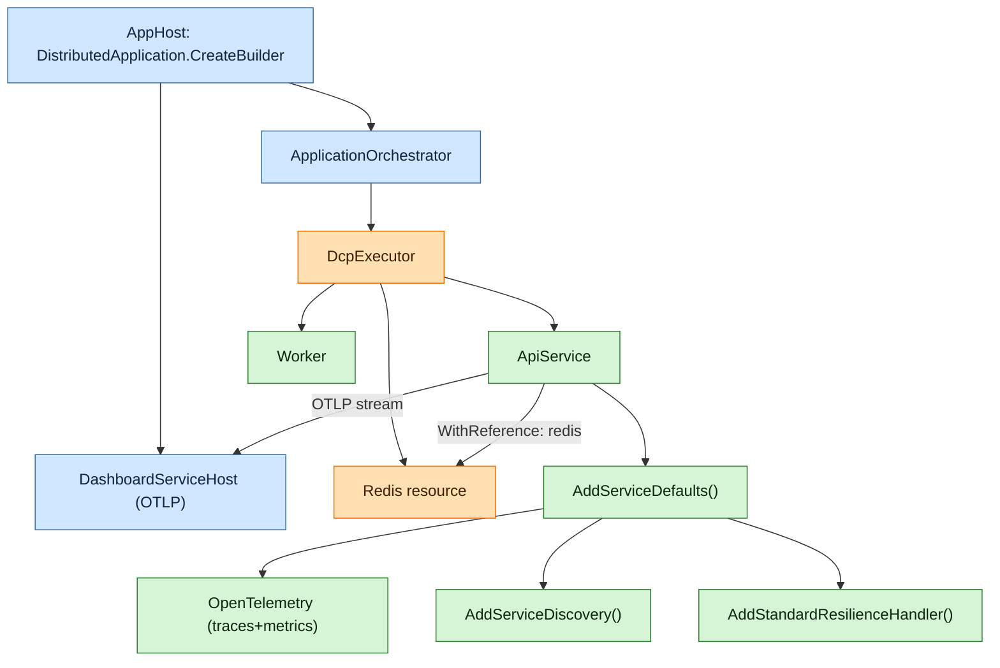

**TL;DR:** How do you stand up a multi-service cloud-native app in .NET without hand-wiring service discovery, resilience, and telemetry? Declare resources in an *AppHost* and share a *ServiceDefaults* project so every service gets identical OpenTelemetry, health checks, and HTTP resilience for free.
> **In plain English (30 sec):** Think of this like concepts you already use, but in a production system at scale.


**Real repo:** [microsoft/aspire](https://github.com/microsoft/aspire)

## 1. The Engineering Problem

A typical cloud-native solution is a pile of loosely-related processes: an API, a worker, a cache, a database, a frontend. Each one needs:
- A way to *find* its dependencies by logical name (not hard-coded `localhost:5432`).
- Resilience (retry, timeouts) on outbound HTTP calls.
- Health endpoints for orchestrators.
- OpenTelemetry traces/metrics exported to a single dashboard.

Doing that by hand in every project is repetitive and diverges fast. .NET Aspire solves this with two primitives: the **AppHost** (a C# program that models the *distributed application*) and **ServiceDefaults** (a shared project that configures every service identically).

## 2. The Technical Solution

The AppHost calls `DistributedApplication.CreateBuilder(args)` and declares resources (`AddProject`, `AddRedis`, `WithReference`). The builder — verified in `DistributedApplicationBuilder.cs` — is itself a `HostApplicationBuilder` wrapper that registers the `ApplicationOrchestrator`, the DCP (Developer Control Plane) executor, and, in run mode, the `DashboardServiceHost` that streams OTLP telemetry. Each service project references a `ServiceDefaults` project and calls `builder.AddServiceDefaults()` to get OTel + resilience + service discovery in one line.



Core truths:
- The AppHost is **not** deployed — it only *orchestrates* local run and generates a publish manifest. `DistributedApplicationBuilder.Build()` wires `HostApplicationBuilder` internals (verified in `DistributedApplicationBuilder.cs:188`).
- ServiceDefaults centralizes OTel/health/resilience; services call `AddServiceDefaults()` and `MapDefaultEndpoints()` (verified in the template `Extensions.cs`).
- Telemetry flows over OTLP to the Aspire Dashboard, which the AppHost launches and secures with auto-generated API keys (`DistributedApplicationBuilder.cs` `ConfigureProfilingTelemetry`).

## 3. The clean example

The shared ServiceDefaults project (verbatim from `src/Aspire.ProjectTemplates/templates/aspire-servicedefaults/Extensions.cs`):

```csharp
public static TBuilder AddServiceDefaults<TBuilder>(this TBuilder builder)
    where TBuilder : IHostApplicationBuilder
{
    builder.ConfigureOpenTelemetry();
    builder.AddDefaultHealthChecks();
    builder.Services.AddServiceDiscovery();
    builder.Services.ConfigureHttpClientDefaults(http =>
    {
        http.AddStandardResilienceHandler();
        http.AddServiceDiscovery();
    });
    return builder;
}

public static TBuilder ConfigureOpenTelemetry<TBuilder>(this TBuilder builder)
    where TBuilder : IHostApplicationBuilder
{
    builder.Logging.AddOpenTelemetry(logging =>
    {
        logging.IncludeFormattedMessage = true;
        logging.IncludeScopes = true;
    });
    builder.Services.AddOpenTelemetry()
        .WithMetrics(metrics => metrics
            .AddAspNetCoreInstrumentation()
            .AddHttpClientInstrumentation()
            .AddRuntimeInstrumentation())
        .WithTracing(tracing => tracing
            .AddSource(builder.Environment.ApplicationName)
            .AddAspNetCoreInstrumentation(tracing =>
                tracing.Filter = context =>
                    !context.Request.Path.StartsWithSegments("/health")
                    && !context.Request.Path.StartsWithSegments("/alive"))
            .AddHttpClientInstrumentation());
    builder.AddOpenTelemetryExporters();
    return builder;
}
```

A service consumes it (`Program.cs`):

```csharp
var builder = WebApplication.CreateBuilder(args);
builder.AddServiceDefaults();                       // OTel + discovery + resilience
builder.AddRedisClient("cache");                    // from Aspire.Hosting.Redis
builder.Services.AddHttpClient("catalog", c =>
    c.BaseAddress = new Uri("http://catalogapi"));  // resolved by service discovery

var app = builder.Build();
app.MapDefaultEndpoints();
app.MapGet("/", () => "ok");
app.Run();
```

The AppHost declares the topology:

```csharp
var builder = DistributedApplication.CreateBuilder(args);
var cache = builder.AddRedis("cache");
var api = builder.AddProject<Projects.CatalogApi>("catalogapi")
                  .WithReference(cache);
builder.Build().Run();
```

## 4. Production reality

From `src/Aspire.Hosting/DistributedApplicationBuilder.cs` — how the AppHost builder bootstraps run-mode services and the dashboard (annotated):

```csharp
// The AppHost builder IS a HostApplicationBuilder under the hood.
private readonly HostApplicationBuilder _innerBuilder;
// ...
public DistributedApplicationBuilder(DistributedApplicationOptions options)
{
    // Pre-seed configuration with ASPIRE_-prefixed env vars so the
    // priority order is: --environment > DOTNET_ENVIRONMENT > ASPIRE_ENVIRONMENT.
    var configuration = new ConfigurationManager();
    configuration.AddEnvironmentVariables(prefix: "ASPIRE_");
    innerBuilderOptions.Configuration = configuration;
    _innerBuilder = new HostApplicationBuilder(innerBuilderOptions);

    // In run mode the dashboard is wired with auto-generated OTLP + API keys.
    if (ExecutionContext.IsRunMode && !options.DisableDashboard)
    {
        if (!IsDashboardUnsecured(_innerBuilder.Configuration))
        {
            // Generated once, persisted to user secrets so it is stable across runs.
            _userSecretsManager.GetOrSetSecret(_innerBuilder.Configuration,
                "AppHost:OtlpApiKey", TokenGenerator.GenerateToken);
            _innerBuilder.Configuration.AddInMemoryCollection(new Dictionary<string, string?>
            {
                ["AppHost:ResourceService:AuthMode"] = nameof(ResourceServiceAuthMode.ApiKey),
                ["AppHost:ResourceService:ApiKey"] = apiKey
            });
        }
        _innerBuilder.Services.AddSingleton<DashboardServiceHost>();
        _innerBuilder.Services.AddHostedService(sp => sp.GetRequiredService<DashboardServiceHost>());
    }

    // OpenTelemetry profiling spans for the AppHost itself (high-cardinality,
    // only enabled when ASPIRE_PROFILING_ENABLED is set).
    if (ShouldConfigureProfilingTelemetry())
    {
        var resourceBuilder = OpenTelemetry.Resources.ResourceBuilder.CreateDefault()
            .AddService(serviceName: "aspire-apphost", /* ... */);
        _innerBuilder.Services.AddOpenTelemetry()
            .WithTracing(builder => builder.AddSource(ProfilingTelemetry.ActivitySourceName)
                                        .SetResourceBuilder(resourceBuilder)
                                        .AddOtlpExporter(/* resolves dashboard OTLP endpoint */));
    }
}
```

What this teaches:
- The AppHost only *runs locally* (or emits a manifest). It is **not** your production process — your services are.
- Dashboard auth keys are generated and stored in user secrets so container specs don't churn between runs.
- `AddServiceDefaults()` is convention, not magic: it is a one-line call into a project *you own* and can edit.

**Stale facts:** `Startup.cs` is no longer the default entry point — the minimal hosting model (`WebApplication.CreateBuilder`/`app.Run()`) is. A third-party DI container is not needed for basic DI — `Microsoft.Extensions.DependencyInjection` is built in. ASP.NET Core defaults to **Server GC**, not Workstation GC. `async void` is a footgun: exceptions escape the async state machine and crash the process.

## 5. Review checklist
- Is every service project calling `AddServiceDefaults()` (and `MapDefaultEndpoints()` for web apps)?
- Are dependency connections passed via `WithReference`, not hard-coded connection strings?
- Is the Aspire Dashboard enabled in local/dev but gated by `IsDevelopment()` for health endpoints in prod?
- Are resilience + service discovery turned on for *all* `HttpClient` defaults, not just selected ones?

## 6. FAQ
- **Does the AppHost run in production?** No. It orchestrates local run and generates a publish manifest; your individual services run in production.
- **What is `AddServiceDefaults()`?** A shared extension method (in a ServiceDefaults project) that configures OTel, health checks, service discovery, and HTTP resilience for every service.
- **How do services find each other?** Via `AddServiceDiscovery()` + logical names resolved from `WithReference` wiring; no hard-coded hosts.
- **Is the dashboard telemetry secure?** Yes — the AppHost generates OTLP/API keys stored in user secrets unless explicitly run unsecured.
- **Can I customize what ServiceDefaults does?** Yes, it is your own code; uncomment the OTel/Grpc/AppInsights hooks as needed.

## Source
- **Concept:** .NET Aspire AppHost + ServiceDefaults cloud-native orchestration
- **Domain:** dotnet
- **Repo:** microsoft/aspire → [src/Aspire.ProjectTemplates/templates/aspire-servicedefaults/Extensions.cs](https://github.com/microsoft/aspire/blob/main/src/Aspire.ProjectTemplates/templates/aspire-servicedefaults/Extensions.cs) — the `AddServiceDefaults`/`ConfigureOpenTelemetry` template
- **Repo:** microsoft/aspire → [src/Aspire.Hosting/DistributedApplicationBuilder.cs](https://github.com/microsoft/aspire/blob/main/src/Aspire.Hosting/DistributedApplicationBuilder.cs) — AppHost builder, dashboard/OTLP wiring


