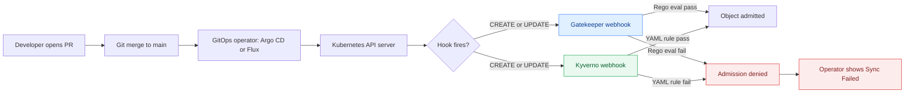

**TL;DR:** How do you prevent a non-compliant manifest from ever being applied in a GitOps flow? Put a policy engine in the admission path so the cluster itself rejects bad objects — GitOps sync only ever pushes manifests that pass.

**Real repo:** [open-policy-agent/gatekeeper](https://github.com/open-policy-agent/gatekeeper) and [kyverno/kyverno](https://github.com/kyverno/kyverno)

## 1. The Engineering Problem

GitOps makes git the source of truth, and the GitOps operator (Argo CD / Flux) continuously reconciles cluster state toward what's in git. That is powerful — and dangerous. If a manifest that violates your org's guardrails lands in a merged PR, the operator will *happily* apply it. The PR review is a human gate; humans miss `latest` tags, missing resource limits, or a writable root filesystem.

The gap: GitOps guarantees *what is in git becomes cluster state* — it does not guarantee *what is in git is correct*. You need a machine-enforced gate that runs the same policy every time, in the cluster, at admission. That is policy-as-code.

Two dominant engines solve this:

- **OPA Gatekeeper** — Kubernetes-native admission controller built on Open Policy Agent. Policies are written in **Rego** and packaged as `ConstraintTemplate` + `Constraint` CRDs.
- **Kyverno** — a Kubernetes-native policy engine whose policies are **plain Kubernetes YAML** (`validate`/`mutate`/`generate` rules), no new query language to learn.

## 2. The Technical Solution

Both engines register a `ValidatingWebhookConfiguration` that the API server calls on `CREATE`/`UPDATE`. The controller evaluates the incoming object against installed policies and returns allow/deny. The GitOps operator never sees the rejection — it just reports the apply failed.

The key architectural difference is *where the logic lives*:

- Gatekeeper: logic in **Rego** inside a `ConstraintTemplate` (a separate `targets[].rego` block), parameters validated by an OpenAPI schema.
- Kyverno: logic expressed as **YAML patterns/JMESPath** inline in the `ClusterPolicy` rule, with optional `mutate` (patch) and `generate` (create other objects) capabilities Gatekeeper models separately.



**Core truths:**

1. Policy-as-code is an *admission* gate, not a CI lint — it runs at the API server, so it catches both GitOps-pushed and `kubectl`-pushed objects uniformly.
2. Gatekeeper's `ConstraintTemplate` decouples *policy logic* (Rego) from *policy instances* (Constraints with parameters); Kyverno folds both into one `ClusterPolicy`.
3. `enforcementAction: dryrun`/`warn` lets you shift-left: observe violations in audit before flipping to `deny`.

## 3. The clean example

**Gatekeeper — require a label (Rego in a ConstraintTemplate).** From [open-policy-agent/gatekeeper `howto.md`](https://github.com/open-policy-agent/gatekeeper/blob/master/website/docs/howto.md):

```yaml
apiVersion: templates.gatekeeper.sh/v1
kind: ConstraintTemplate
metadata:
  name: k8srequiredlabels
spec:
  crd:
    spec:
      names:
        kind: K8sRequiredLabels
      validation:
        openAPIV3Schema:
          type: object
          properties:
            labels:
              type: array
              items:
                type: string
  targets:
    - target: admission.k8s.gatekeeper.sh
      rego: |
        package k8srequiredlabels

        violation[{"msg": msg, "details": {"missing_labels": missing}}] {
          provided := {label | input.review.object.metadata.labels[label]}
          required := {label | label := input.parameters.labels[_]}
          missing := required - provided
          count(missing) > 0
          msg := sprintf("you must provide labels: %v", [missing])
        }
```

Then instantiate it as a `Constraint`:

```yaml
apiVersion: constraints.gatekeeper.sh/v1beta1
kind: K8sRequiredLabels
metadata:
  name: ns-must-have-gk
spec:
  match:
    kinds:
      - apiGroups: [""]
        kinds: ["Namespace"]
  parameters:
    labels: ["gatekeeper"]
```

**Kyverno — same intent, pure YAML (no Rego).** From [kyverno/policies `require-labels`](https://github.com/kyverno/policies/blob/main/best-practices/require-labels/require-labels.yaml):

```yaml
apiVersion: kyverno.io/v1
kind: ClusterPolicy
metadata:
  name: require-labels
spec:
  validationFailureAction: Audit
  background: true
  rules:
  - name: check-for-labels
    match:
      any:
      - resources:
          kinds:
          - Pod
    validate:
      message: "The label `app.kubernetes.io/name` is required."
      pattern:
        metadata:
          labels:
            app.kubernetes.io/name: "?*"
```

The Kyverno CRD (`clusterpolicies.kyverno.io`) is itself a `ClusterPolicy` — `kind: ClusterPolicy`, with `spec.rules[]` carrying `validate`/`mutate`/`generate` blocks, and a `validationFailureAction` field instead of Gatekeeper's `enforcementAction`.

## 4. Production reality

Gatekeeper ships its `ConstraintTemplate` as a real CRD (`constrainttemplates.templates.gatekeeper.sh`). Verbatim from [open-policy-agent/gatekeeper `config/crd/bases/constrainttemplate-customresourcedefinition.yaml`](https://github.com/open-policy-agent/gatekeeper/blob/master/config/crd/bases/constrainttemplate-customresourcedefinition.yaml):

```yaml
apiVersion: apiextensions.k8s.io/v1
kind: CustomResourceDefinition
metadata:
  annotations:
    controller-gen.kubebuilder.io/version: v0.19.0
  name: constrainttemplates.templates.gatekeeper.sh
spec:
  group: templates.gatekeeper.sh
  names:
    kind: ConstraintTemplate
    // ...
  scope: Cluster
  versions:
  - name: v1
    schema:
      openAPIV3Schema:
        // ...
          spec:
            properties:
              crd:
                description: CRD defines the custom resource definition specification
                  for the constraint.
                properties:
                  spec:
                    properties:
                      names:
                        properties:
                          kind:
                            type: string
                      validation:
                        default:
                          legacySchema: false
                        // ...
              targets:
                items:
                  properties:
                    code:
                      // ...
                      properties:
                        engine:
                          description: 'The engine used to evaluate the code. Example:
                              "Rego". Required.'
                          type: string
                        source:
                          description: The source code for the template. Required.
                          x-kubernetes-preserve-unknown-fields: true
                      required:
                      - engine
                      - source
                    // ...
                    rego:
                      type: string
                    target:
                      type: string
                // ...
```

Kyverno's `ClusterPolicy` CRD (`clusterpolicies.kyverno.io`) shows the three rule kinds gatekept separately. Verbatim from [kyverno/kyverno `config/crds/kyverno/kyverno.io_clusterpolicies.yaml`](https://github.com/kyverno/kyverno/blob/main/config/crds/kyverno/kyverno.io_clusterpolicies.yaml):

```yaml
name: clusterpolicies.kyverno.io
spec:
  group: kyverno.io
  names:
    kind: ClusterPolicy
    shortNames:
    - cpol
  // ...
        properties:
          spec:
            properties:
              admission:
                default: true
                description: |-
                  Admission controls if rules are applied during admission.
              background:
                default: true
                description: |-
                  Background controls if rules are applied to existing resources during a background scan.
              rules:
                description: |-
                  Rules is a list of Rule instances. A Policy contains multiple rules and
                  each rule can validate, mutate, or generate resources.
                items:
                  properties:
                    // ...
                    exclude:
                      description: |-
                        ExcludeResources defines when this policy rule should not be applied.
```

**what this teaches:** The CRDs reveal the design split. Gatekeeper's `ConstraintTemplate` has a `targets[].rego` field — policy is *code*. Kyverno's `ClusterPolicy` has `rules[]` with `validate`/`mutate`/`generate` — policy is *declarative YAML*, and it natively does mutation and generation (create related objects) that Gatekeeper historically handled with separate `Assign`/`Expand` CRDs.

**Stale facts:** "GitOps is just CI/CD with extra steps" oversimplifies — it's pull vs push, structural credential change; ApplicationSet bundled in Argo CD core since v2.3 (Mar 2022); auto-sync doesn't skip review gate — the PR is the gate; Kustomize+Helm aren't exclusive — both can layer; helm/charts monorepo is archived.

## 5. Review checklist

- Does every restricted resource kind have a matching `Constraint`/`ClusterPolicy` with a `match` (and `exclude` for system namespaces)?
- Are new policies shipped in `Audit`/`dryrun` first, then promoted to `deny` after a baseline scan?
- For Gatekeeper: is the `ConstraintTemplate` Rego unit-tested with `gator test`? For Kyverno: is the policy tested with `kyverno test`?
- Are policy failures visible to developers (policy reports / PR annotations), not just in controller logs?

## 6. FAQ

- **Do I need policy-as-code if I already lint in CI?** CI lint catches what you remember to check; admission policy catches every object, including manual `kubectl` changes and chart-rendered output. They are complementary.
- **Rego or YAML — which should I pick?** Choose Gatekeeper/Rego when you need complex, parametric logic and reuse across teams. Choose Kyverno when you want YAML-only policies, plus native mutate/generate, and lower onboarding cost.
- **Can Kyverno mutate and generate, or only validate?** All three. `mutate` patches incoming objects; `generate` creates other resources (e.g. a default NetworkPolicy per namespace) — see `rulecount` printer columns in its CRD.
- **Does the GitOps operator bypass admission policies?** No. The operator calls the API server like any client, so webhook policies apply to GitOps-applied manifests too. A denied manifest shows as `Sync Failed`.
- **What is `validationFailureAction` vs `enforcementAction`?** They are the equivalent knob: Kyverno's `validationFailureAction: Audit|Enforce` vs Gatekeeper's `enforcementAction: deny|dryrun|warn`.

## Source

- **Concept:** Policy-as-code as an admission-time guardrail enforcing GitOps manifests.
- **Domain:** gitops
- **Repo:** open-policy-agent/gatekeeper → [website/docs/howto.md](https://github.com/open-policy-agent/gatekeeper/blob/master/website/docs/howto.md) — ConstraintTemplate + Constraint Rego example.
- **Repo:** open-policy-agent/gatekeeper → [config/crd/bases/constrainttemplate-customresourcedefinition.yaml](https://github.com/open-policy-agent/gatekeeper/blob/master/config/crd/bases/constrainttemplate-customresourcedefinition.yaml) — ConstraintTemplate CRD with targets[].rego.
- **Repo:** kyverno/kyverno → [config/crds/kyverno/kyverno.io_clusterpolicies.yaml](https://github.com/kyverno/kyverno/blob/main/config/crds/kyverno/kyverno.io_clusterpolicies.yaml) — ClusterPolicy CRD with validate/mutate/generate rules.
- **Repo:** kyverno/policies → [best-practices/require-labels/require-labels.yaml](https://github.com/kyverno/policies/blob/main/best-practices/require-labels/require-labels.yaml) — YAML require-labels example.


