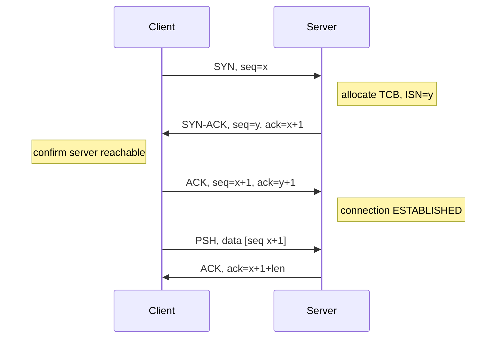

**TL;DR:** How does TCP give you a reliable, ordered byte stream over an unreliable IP network? A 3-way handshake establishes the connection, sliding-window flow control stops a fast sender drowning a slow receiver, and congestion control (slow start + AIMD) stops the network itself from melting.

**Real repo:** [nginx/nginx](https://github.com/nginx/nginx) — its event-driven connection handling shows how a server accepts and tracks those established TCP connections at scale.

## 1. The Engineering Problem

IP is a dumb, best-effort packet delivery service: packets arrive out of order, duplicated, or dropped. A useful transport needs three properties on top of it:

1. **Mutual agreement before sending data** — both ends must know the other is reachable and synchronized on initial sequence numbers, otherwise you waste bandwidth on a black hole.
2. **Receiver protection** — a 10 Gbps sender must not overrun a 100 Mbps receiver's buffer.
3. **Network protection** — uncoordinated senders must not congest a shared link into collapse (the 1986 "congestion collapse" that dropped Internet throughput by 1000x).

## 2. The Technical Solution



Flow control uses a **sliding window**: the receiver advertises a `rwnd` (receive window) in every ACK; the sender may have at most `rwnd` unacknowledged bytes in flight. Congestion control adds a separate `cwnd` (congestion window); the effective window is `min(cwnd, rwnd)`.

```mermaid
flowchart LR
    A[App write] --> B[Sender: bytes sent - unacked <= min(cwnd, rwnd)]
    B --> C{ACK received}
    C -->|slow start: cwnd += 1 MSS per ACK| D[cwnd doubles per RTT]
    C -->|loss detected| E[ssthresh = cwnd/2; cwnd reset]
    E --> F[congestion avoidance: cwnd += 1 MSS per RTT AIMD]
    D --> G[Network]
    G --> H[Receiver buffer]
    classDef ctrl fill:#f96,stroke:#333;
    classDef data fill:#6cf,stroke:#333;
    classDef loss fill:#f66,stroke:#333;
    class B,A data;
    class C,F ctrl;
    class E loss;
```

**Core truths:**
- Sequence numbers are **per-byte**, not per-packet; ACKs are cumulative ("everything up to N received").
- Flow control protects the *receiver*; congestion control protects the *network* — they are orthogonal and multiplied together.
- Loss is treated as congestion signal (Reno/CUBIC) or precise feedback (BBR measures bandwidth/delay).

## 3. The clean example

A minimal mental model of the window loop a sender runs:

```c
/* conceptual — mirrors nginx's per-connection send buffering */
while (unsent_bytes > 0) {
    long window = MIN(cwnd, rwnd);          /* effective window */
    long can_send = window - (sent - acked); /* in-flight bytes */
    if (can_send <= 0) { wait_for_ack(); continue; }

    send(min(can_send, unsent_bytes));
    sent += n;
    if (ack_arrived()) {
        acked = ack_no;
        if (loss_detected) { ssthresh = cwnd/2; cwnd = MSS; } /* fast recovery */
        else if (cwnd < ssthresh) cwnd += MSS;  /* slow start */
        else cwnd += MSS * (MSS / cwnd);        /* AIMD */
    }
}
```

## 4. Production reality

Nginx accepts the connection that the 3-way handshake produced and then tracks it through an event loop — the `connection` object *is* the live TCP session, with its own read/write buffers that embody the sliding window from the kernel's perspective. From `src/http/ngx_http_upstream_round_robin.c` we also see the LB peer state nginx keeps per upstream connection:

```c
// src/http/ngx_http_upstream_round_robin.c (nginx/nginx)
peer->current_weight += peer->effective_weight;
total += peer->effective_weight;
if (peer->effective_weight < peer->weight) {
    peer->effective_weight++;
}
// ... weight-based selection across the upstream pool
if (peer->max_conns && peer->conns >= peer->max_conns) {
    continue;   // respect per-peer connection cap == flow control at LB layer
}
```

The `max_conns` cap is effectively **flow control above TCP**: a load balancer refuses to open more than N simultaneous connections to a backend, the same "don't overrun the consumer" idea as `rwnd`, just at the application tier.

**What this teaches:** the 3-way handshake, `rwnd`, and `cwnd` are the same abstraction repeated at three layers — agree before you stream (handshake), don't overrun the consumer (flow control), don't overrun the shared medium (congestion control).

**Stale facts:** HTTP/2 fixed HTTP HOL but TCP HOL persists — HTTP/3/QUIC fixes both; TLS 1.3 removed static RSA key exchange — only ECDHE/DHE, forward secrecy by default; DNS round-robin dead at scale — clients cache A records; "firewalls inspect packets" oversimplified — modern stateful/NGFW do DPI.

## 5. Review checklist

- Does every connection establishment go through a synchronized handshake (or its UDP/QUIC equivalent)?
- Is the receiver's advertised window actually honored by the sender's in-flight cap?
- Are flow control (rwnd) and congestion control (cwnd) treated as separate limits?
- On loss, does the stack halve congestion window rather than blindly retrying?

## 6. FAQ

- **Why 3 packets and not 2?** Two alone can't prove both directions are reachable and synchronized; the final ACK confirms the client received the server's SYN.
- **What's the difference between rwnd and cwnd?** `rwnd` is receiver-buffer space (flow control); `cwnd` is the sender's estimate of safe network capacity (congestion control).
- **Is congestion control still needed with flow control?** Yes — flow control stops receiver overrun but says nothing about the routers in between.
- **What is TCP HOL blocking?** A lost packet stalls all later bytes on that connection even if they're independent; HTTP/2 suffers it, HTTP/3/QUIC does not.
- **Does nginx implement TCP itself?** No — the OS stack does; nginx consumes the established connection and applies its own `max_conns` caps at the proxy layer.

## Source

- **Concept:** TCP 3-way handshake, sliding-window flow control, slow-start/AIMD congestion control
- **Domain:** networking
- **Repo:** nginx/nginx → [src/http/ngx_http_upstream_round_robin.c](https://github.com/nginx/nginx/blob/master/src/http/ngx_http_upstream_round_robin.c) — per-peer `max_conns`/`weight` state mirroring flow/congestion caps
