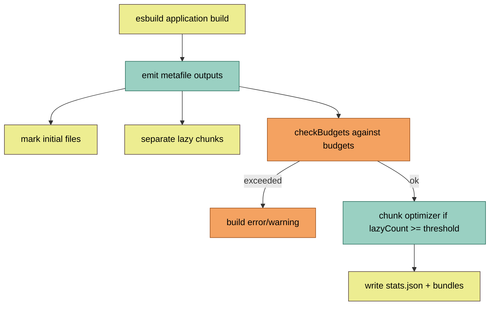

**TL;DR:** How do you keep a large Angular app's initial load fast as it grows? Use the esbuild application builder's `stats.json` metafile for bundle analysis, configure `budgets` to fail the build on bloat, and lean on route-level lazy loading plus `@defer` to keep the initial chunk small.
> **In plain English (30 sec):** Think of this like concepts you already use, but in a production system at scale.


**Real repo:** [angular/angular-cli](https://github.com/angular/angular-cli)

## 1. The Engineering Problem

As an Angular app crosses hundreds of components, the initial JavaScript payload balloons. The symptoms: slow first paint, regressions that slip into a release unnoticed, and "why is `main.js` 3 MB?" post-mortems. Operating at scale needs:

1. **Visibility** — which module contributes what to the initial bundle.
2. **Guardrails** — the build must fail when a budget is breached.
3. **Architecture** — code that is not on the critical path must not be in the initial chunk.

## 2. The Technical Solution

The Angular CLI `application` builder (esbuild-based) produces an esbuild **metafile** that records every input, output, and byte size. Enabling `stats: true` writes `stats.json`; `budgets` in `angular.json` run `checkBudgets` against the metafile. Lazy chunks are automatically separated, and an optional Rollup/Rolldown optimization pass merges small lazy chunks when their count crosses a threshold.



Core truths:
- The metafile drives both the console stats table (`logBuildStats`) and budget enforcement — one source of truth for sizing.
- Lazy chunks are detected as outputs **not** in `initialFiles`; the optimizer only runs when `lazyChunksCount >= optimizeChunksThreshold` (no overhead for tiny apps).
- `budgets` support types `initial`, `any`, `bundle`, `anyComponentStyle`, etc., with `maximumError`/`maximumWarning` limits.

## 3. The clean example

Enable analysis and guardrails in `angular.json`:

```json
{
  "build": {
    "builder": "@angular/build:application",
    "options": {
      "stats": true,
      "budgets": [
        { "type": "initial", "maximumWarning": "500kb", "maximumError": "1mb" },
        { "type": "anyComponentStyle", "maximumWarning": "4kb", "maximumError": "8kb" }
      ]
    }
  }
}
```

Route-level lazy loading keeps the initial chunk thin:

```ts
// app.routes.ts
export const routes: Routes = [
  { path: '', loadComponent: () => import('./home/home').then(m => m.Home) },
  { path: 'reports', loadChildren: () => import('./reports/reports.routes').then(m => m.routes) },
];
```

And `@defer` defers below-the-fold UI out of the initial chunk:

```html
@defer (on viewport) {
  <heavy-chart [data]="series()" />
} @placeholder {
  <div class="skeleton"></div>
}
```

## 4. Production reality

The build pipeline that emits the metafile and runs budget checks, verbatim from `packages/angular/build/src/builders/application/execute-build.ts`:

```ts
// packages/angular/build/src/builders/application/execute-build.ts
// Analyze files for bundle budget failures if present
let budgetFailures: BudgetCalculatorResult[] | undefined;
if (options.budgets) {
  const compatStats = generateBudgetStats(metafile, outputFiles, initialFiles);
  budgetFailures = [...checkBudgets(options.budgets, compatStats, true)];
  for (const { message, severity } of budgetFailures) {
    if (severity === 'error') {
      executionResult.addError(message);
    } else {
      executionResult.addWarning(message);
    }
  }
}
// ...
// Write metafile if stats option is enabled
if (options.stats) {
  executionResult.addOutputFile(
    'stats.json',
    JSON.stringify(metafile, null, 2),
    BuildOutputFileType.Root,
  );
}
```

The lazy-chunk optimization gate (only when enough lazy chunks exist):

```ts
// packages/angular/build/src/builders/application/execute-build.ts
if (options.optimizationOptions.scripts) {
  const { metafile, initialFiles } = bundlingResult;
  const lazyChunksCount = Object.keys(metafile.outputs).filter(
    (path) => path.endsWith('.js') && !initialFiles.has(path),
  ).length;

  if (!options.serverEntryPoint && lazyChunksCount >= optimizeChunksThreshold) {
    const { optimizeChunks } = await import('./chunk-optimizer');
    const optimizationResult = await profileAsync('OPTIMIZE_CHUNKS', () =>
      optimizeChunks(bundlingResult, options.sourcemapOptions.scripts ? !options.sourcemapOptions.hidden || 'hidden' : false),
    );
    // ...
  }
}
```

The budget math itself, from `bundle-calculator.ts`, treats `initial` as the sum of chunks flagged `initial`:

```ts
// packages/angular/build/src/utils/bundle-calculator.ts
class InitialCalculator extends Calculator {
  calculate() {
    return [{
      label: `bundle initial`,
      size: this.chunks
        .filter((chunk) => chunk.initial)
        .map((chunk) => this.calculateChunkSize(chunk))
        .reduce((l, r) => l + r, 0),
    }];
  }
}
```

What this teaches: budgets and the metafile are not separate features — the same esbuild metafile feeds both the human-readable stats table and the hard `maximumError` gate, so a size regression is caught in CI, not in production.

## 5. Review checklist

- `stats: true` is on in CI so `stats.json` is available for bundle analyzers (source-map-explorer, bundlephobia-style tooling).
- `budgets` cover at least `initial` and `anyComponentStyle` so style regressions are caught early.
- Routes and heavy components use `loadComponent`/`@defer` so they land in lazy chunks, not the initial bundle.
- The chunk optimizer threshold is understood — small apps skip it intentionally to avoid build overhead.

## 6. FAQ

- **Where does `stats.json` come from?** The esbuild metafile, serialized when `options.stats` is true in `execute-build.ts`.
- **Do budgets work without `stats`?** Budgets consume the metafile directly during the build; `stats.json` is just the on-disk copy for analysis.
- **What triggers the extra chunk-optimization pass?** When `optimizationOptions.scripts` is on and lazy chunk count reaches `optimizeChunksThreshold` (skipped for server builds).
- **Is `@defer` required for lazy loading?** No — route-level `loadComponent`/`loadChildren` already create lazy chunks; `@defer` extends deferral to template-level blocks.
- **Can budgets error the build?** Yes — `maximumError` adds a build error via `executionResult.addError`, failing CI.

## Source

- **Concept:** Bundle analysis, budget enforcement, and lazy-chunk optimization in the Angular CLI esbuild builder
- **Domain:** angular
- **Repo:** angular/angular-cli → [packages/angular/build/src/builders/application/execute-build.ts](https://github.com/angular/angular-cli/blob/main/packages/angular/build/src/builders/application/execute-build.ts) — metafile emission, budget checks, lazy-chunk optimizer gate
- **Repo:** angular/angular-cli → [packages/angular/build/src/utils/bundle-calculator.ts](https://github.com/angular/angular-cli/blob/main/packages/angular/build/src/utils/bundle-calculator.ts) — `checkBudgets`, `InitialCalculator`, threshold math
- **Repo:** angular/angular-cli → [packages/angular/build/src/tools/esbuild/utils.ts](https://github.com/angular/angular-cli/blob/main/packages/angular/build/src/tools/esbuild/utils.ts) — `logBuildStats` / `calculateEstimatedTransferSizes` (brotli transfer sizing)


