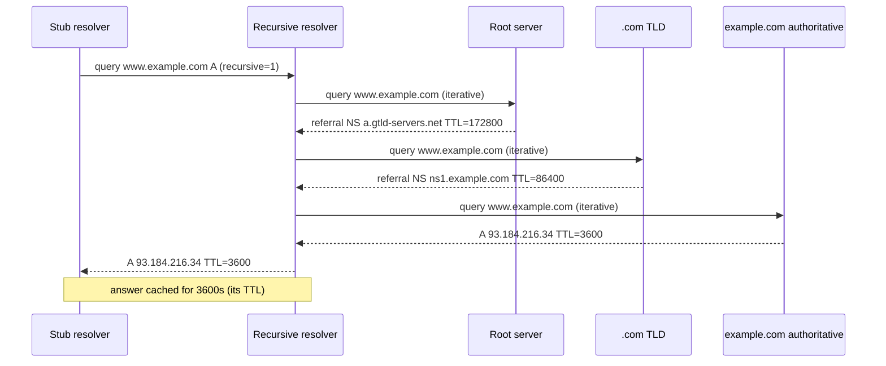
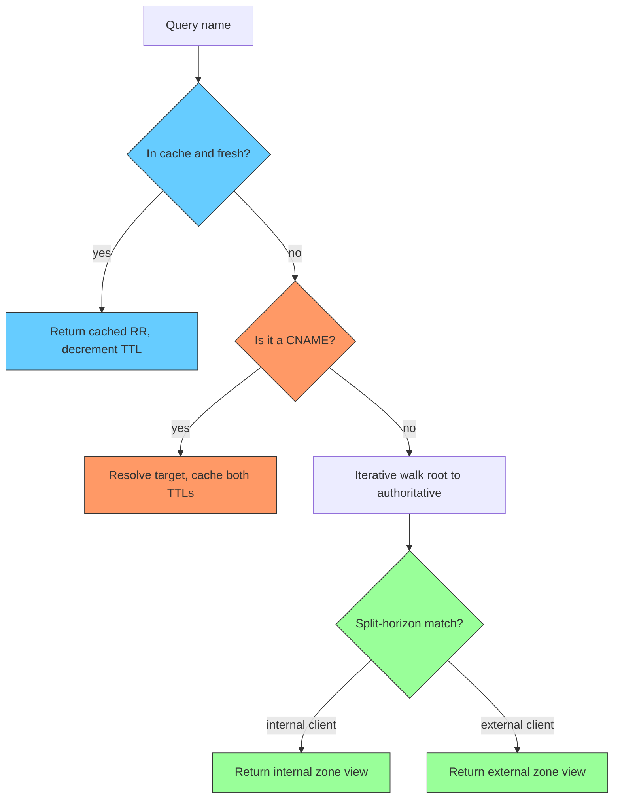

**TL;DR:** How does `www.example.com` become `93.184.216.34`? A stub resolver asks a recursive resolver, which walks the hierarchy iteratively (root → TLD → authoritative), honoring TTLs, following CNAME chains, while split-horizon serves different answers to different clients.

> **In plain English (30 sec):** Code you already write — Map, function, API call, just bigger.

**Real repo:** [miekg/dns](https://github.com/miekg/dns) — a Go DNS library whose `Client`, wire `Msg` format, and `RR_Header.Ttl` field model exactly what travels on the wire.

## 1. The Engineering Problem

The DNS is a distributed database: no single server knows everything. Resolving a name requires:
- Deciding who does the *work* — the **recursive** resolver (does the walking) vs the **iterative** authoritative server (returns best-known next hop).
- Not re-querying constantly — **TTL** bounds caching.
- Supporting aliases — a **CNAME** points one name at another, possibly across zones.
- Serving different answers by source — **split-horizon** (internal vs external views).

## 2. The Technical Solution





**Core truths:**
- Recursive = "please do all the work"; iterative = "here's the next server to ask." Stub clients send recursive; resolvers talk iterative to authorities.
- **TTL is per-record**, in seconds, set by the owner zone. Caches must not serve past expiry.
- A **CNAME** is a single-valued alias; the resolver must chase the target, and each link caches under its own TTL.

## 3. The clean example

Building and sending a query with miekg/dns (Go), exactly as the wire format demands:

```go
// miekg/dns — minimal recursive lookup against a resolver
c := new(dns.Client)
m := new(dns.Msg)
m.SetQuestion(dns.Fqdn("www.example.com"), dns.TypeA)
r, _, err := c.Exchange(m, "1.1.1.1:53")
if err != nil { panic(err) }
for _, a := range r.Answer {
    if rec, ok := a.(*dns.A); ok {
        fmt.Println("IP:", rec.A, "TTL:", rec.Hdr.Ttl) // per-RR TTL honored
    }
}
```

The `RR_Header.Ttl` field is the on-wire TTL; `defaultTtl = 3600` is the library's fallback when a zone omits it.

## 4. Production reality

miekg/dns models the literal DNS wire contract. From `dns.go` the header carries the TTL per record:

```go
// dns/dns.go (miekg/dns)
const defaultTtl = 3600 // Default internal TTL.

type RR_Header struct {
    Name     string // owner name
    Rrtype   uint16 // record type
    Class    uint16 // class (IN)
    Ttl      uint32 // seconds; caches must honor this
    Rdlength uint16
}
```

And the client enforces the UDP/TCP framing and ID matching that makes iterative resolution safe — mismatched IDs are dropped because they could be stale replies to a timed-out query:

```go
// dns/client.go (miekg/dns)
func (c *Client) ExchangeWithConnContext(ctx context.Context, m *Msg, co *Conn) (r *Msg, rtt time.Duration, err error) {
    // ...
    if isPacketConn(co.Conn) {
        for {
            r, err = co.ReadMsg()
            // Ignore replies with mismatched IDs because they might be
            // responses to earlier queries that timed out.
            if err != nil || r.Id == m.Id { break }
        }
    }
    // ...
}
```

**What this teaches:** resolution is a recursive/iterative split of labor, every answer is bounded by its own TTL, CNAMEs add chase steps that each cache independently, and split-horizon is just "pick the zone view by who asked."

**Stale facts:** HTTP/2 fixed HTTP HOL but TCP HOL persists — HTTP/3/QUIC fixes both; TLS 1.3 removed static RSA key exchange — only ECDHE/DHE, forward secrecy by default; DNS round-robin dead at scale — clients cache A records; "firewalls inspect packets" oversimplified — modern stateful/NGFW do DPI.

## 5. Review checklist

- Are recursive queries only sent to a resolver that will do the walking, not to authorities?
- Is every cached record expired by its own TTL, not a global timer?
- Are CNAME chains followed to the terminal A/AAAA, caching each hop?
- Does split-horizon select the view by client identity (source IP / TSIG), not by name alone?

## 6. FAQ

- **Recursive vs iterative — who walks the tree?** The recursive resolver walks it (root→TLD→auth); authoritative servers only ever answer with a referral or the final record.
- **What does TTL actually bound?** How long a resolver/cache may serve a record without re-querying its source.
- **Can a CNAME and other records coexist at the same name?** At the alias name, only the CNAME may exist; the target is a separate node.
- **How does split-horizon stay secret?** The server picks the zone view by the querier; external clients never see internal records.
- **Why drop mismatched DNS IDs?** A late reply from a prior timed-out query could poison the current resolution.

## Source

- **Concept:** recursive/iterative resolution, TTL caching, CNAME chains, split-horizon views
- **Domain:** networking
- **Repo:** miekg/dns → [dns.go](https://github.com/miekg/dns/blob/master/dns.go) — `RR_Header.Ttl`; [client.go](https://github.com/miekg/dns/blob/master/client.go) — `ExchangeWithConnContext` ID-matching


