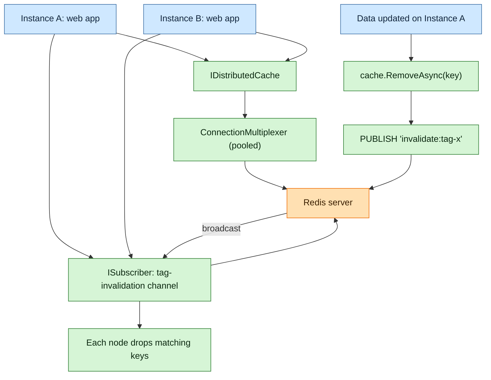

**TL;DR:** How do you share cache across multiple app instances without stale data? Put an `IDistributedCache` abstraction in front of a single pooled `ConnectionMultiplexer`, and invalidate with explicit key removal plus a pub/sub broadcast for cross-node tag invalidation.

> **In plain English (30 sec):** Memoization you already do: check Map first, only call DB on miss.

**Real repo:** [dotnet/runtime](https://github.com/dotnet/runtime) (IDistributedCache) and [StackExchange/StackExchange.Redis](https://github.com/StackExchange/StackExchange.Redis) (connection pooling)

## 1. The Engineering Problem

A single in-memory `IMemoryCache` is useless the moment you run more than one instance: instance A caches a value, instance B updates the source, and A now serves stale data forever. You need a **shared** cache (Redis) plus a strategy to **invalidate** entries when the underlying data changes — across *all* nodes, not just the one that wrote.

## 2. The Technical Solution

`Microsoft.Extensions.Caching.Distributed.IDistributedCache` is the framework abstraction (Get/Set/Refresh/Remove, sync + async). Redis is the usual backing store. StackExchange.Redis gives you `ConnectionMultiplexer` — a **multiplexer** that you create once and reuse for the process lifetime (it is thread-safe and pools physical connections). For invalidation you combine: (1) `RemoveAsync(key)` for point invalidation, and (2) a pub/sub channel that broadcasts a "tag invalidated" message so every node drops its local copy.



Core truths:
- `IDistributedCache` is byte[]-based and store-agnostic — swap Redis for SQL/Redis without touching call sites.
- `ConnectionMultiplexer` is the unit of pooling. "A reference to this should be held and re-used" (verified in `ConnectionMultiplexer.cs` class doc). Never open one per request.
- Invalidation correctness beats invalidation speed: prefer explicit `Remove` + pub/sub over relying on TTLs alone (TTLs only bound staleness, they don't prevent it).

## 3. The clean example

The abstraction you program against (verbatim `IDistributedCache` surface from `dotnet/runtime`):

```csharp
public interface IDistributedCache
{
    byte[]? Get(string key);
    Task<byte[]?> GetAsync(string key, CancellationToken token = default);
    void Set(string key, byte[] value, DistributedCacheEntryOptions options);
    Task SetAsync(string key, byte[] value, DistributedCacheEntryOptions options,
                  CancellationToken token = default);
    void Refresh(string key);
    Task RefreshAsync(string key, CancellationToken token = default);
    void Remove(string key);
    Task RemoveAsync(string key, CancellationToken token = default);
}
```

Register Redis (the framework's `AddStackExchangeRedis` does the pooled multiplexer for you):

```csharp
builder.Services.AddStackExchangeRedisCache(options =>
{
    options.Configuration = builder.Configuration["Redis:ConnectionString"];
    options.InstanceName = "catalog:";
});

// Hand-rolled multiplexer (advanced) — one static, reused for the process:
// ConnectionMultiplexer muxer = await ConnectionMultiplexer.ConnectAsync(connStr);
```

Read-through with explicit invalidation:

```csharp
async Task<Product?> GetProductAsync(int id, IDistributedCache cache)
{
    var key = $"product:{id}";
    var bytes = await cache.GetAsync(key);
    if (bytes is not null) return Deserialize(bytes);

    var product = await db.Products.FindAsync(id);
    await cache.SetAsync(key, Serialize(product),
        new DistributedCacheEntryOptions { AbsoluteExpirationRelativeToNow = TimeSpan.FromMinutes(5) });
    return product;
}

async Task UpdateProductAsync(int id, Product p, IDistributedCache cache, ISubscriber sub)
{
    await db.SaveChangesAsync();
    await cache.RemoveAsync($"product:{id}");                       // point invalidation
    await sub.PublishAsync(RedisChannel.Literal("invalidate:product"), $"{id}"); // cross-node
}
```

## 4. Production reality

From `StackExchange/StackExchange.Redis`, the multiplexer is the pooling primitive — a single instance manages many physical sockets and is safe to share:

```csharp
// From src/StackExchange.Redis/ConnectionMultiplexer.cs
/// <summary>
/// Represents an inter-related group of connections to redis servers.
/// A reference to this should be held and re-used.
/// </summary>
public sealed partial class ConnectionMultiplexer : IInternalConnectionMultiplexer
{
    // Get summary statistics associated with all servers in this multiplexer.
    public ServerCounters GetCounters() { /* ... */ }

    // Creates a new ConnectionMultiplexer instance (async, preferred).
    public static Task<ConnectionMultiplexer> ConnectAsync(
        ConfigurationOptions configuration, TextWriter? log = null) { /* ... */ }

    // Obtain a pub/sub subscriber connection to the specified server.
    public ISubscriber GetSubscriber(object? asyncState = null) { /* ... */ }

    // Obtain an interactive connection to a database inside redis.
    public IDatabase GetDatabase(int db = -1, object? asyncState = null) { /* ... */ }
}
```

What this teaches:
- **One multiplexer per process.** It internally pools connections and round-robins servers; constructing one per call is the #1 Redis perf anti-pattern.
- **`GetSubscriber()` is the pub/sub path** you use for cross-node invalidation — cheap, shared over the same multiplexer.
- `ServerCounters`/`GetCounters()` gives you live Redis-side metrics (ops, failures) when you need to confirm the pool is healthy.

**Stale facts:** `Startup.cs` is no longer the default entry point — the minimal hosting model is. A third-party DI container is not needed for basic DI — `Microsoft.Extensions.DependencyInjection` is built in. ASP.NET Core defaults to **Server GC**, not Workstation GC. `async void` is a footgun: exceptions escape the async state machine and crash the process.

## 5. Review checklist
- Is `IDistributedCache` the only type your app code references (store swappable)?
- Is the `ConnectionMultiplexer` created once and reused (not per-request)?
- Does every write path call `RemoveAsync` (or publish an invalidation) — not just set a TTL?
- Are cache keys namespaced (`InstanceName`/prefix) to avoid collisions across apps?

## 6. FAQ
- **Why not just use TTL for invalidation?** TTL bounds staleness but does not prevent it; explicit `Remove` makes updates visible immediately.
- **How do I invalidate a "tag" across many keys?** Maintain a tag→key set in Redis, or broadcast the tag over a pub/sub channel and let each node drop its local keys.
- **Is `IDistributedCache` async-friendly?** Yes — every method has a `*Async` overload; prefer it in request paths.
- **Do I manage the Redis connection pool myself?** Only if you go raw; `AddStackExchangeRedisCache` already uses a singleton multiplexer.
- **Why reuse one `ConnectionMultiplexer`?** It is thread-safe and pools physical sockets — the documented, intended usage pattern.

## Source
- **Concept:** Distributed caching with IDistributedCache, Redis backing, and invalidation
- **Domain:** dotnet
- **Repo:** dotnet/runtime → [src/libraries/Microsoft.Extensions.Caching.Abstractions/src/IDistributedCache.cs](https://github.com/dotnet/runtime/blob/main/src/libraries/Microsoft.Extensions.Caching.Abstractions/src/IDistributedCache.cs) — the distributed cache abstraction
- **Repo:** StackExchange/StackExchange.Redis → [src/StackExchange.Redis/ConnectionMultiplexer.cs](https://github.com/StackExchange/StackExchange.Redis/blob/main/src/StackExchange.Redis/ConnectionMultiplexer.cs) — pooled multiplexer + pub/sub subscriber


