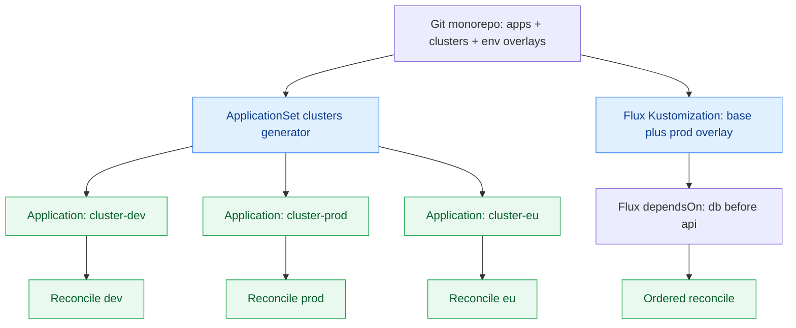

**TL;DR:** How do you run GitOps across dozens of clusters and environments? Generate per-cluster `Application` objects with an ApplicationSet cluster generator (Argo CD) or per-tenant Kustomize/Helm overlays (Flux) — and accept that promotion and cross-cluster coordination are organizational problems, not tooling ones.

**Real repo:** [argoproj/argo-cd](https://github.com/argoproj/argo-cd) (ApplicationSet cluster generator) and [fluxcd/flux2](https://github.com/fluxcd/flux2).

## 1. The Engineering Problem

One cluster, one repo, one `Application` — trivial. Scale to:

- **Many clusters** (dev/staging/prod, per-region, per-customer) — you can't hand-write an `Application` per cluster.
- **Environment promotion** — code moves git→dev→staging→prod, but each environment needs different config, secrets, and guardrails.
- **Cross-cluster coordination** — a service in cluster A depends on a database in cluster B; they must roll out in an order GitOps's independent reconcilers don't know about.

The failure modes at scale: copy-pasted `Application` YAML that drifts, promotion done by copy-paste instead of structure, and reconcilers that each optimize locally and deadlock globally.

## 2. The Technical Solution

**Argo CD — ApplicationSet cluster generator.** One `ApplicationSet` with `generators: [{ clusters: {} }]` produces one `Application` per cluster registered in Argo CD, templated by cluster name/server. Verbatim from [argoproj/argo-cd `applicationset/examples/cluster/cluster-example.yaml`](https://github.com/argoproj/argo-cd/blob/master/applicationset/examples/cluster/cluster-example.yaml):


```yaml
apiVersion: argoproj.io/v1alpha1
kind: ApplicationSet
metadata:
  name: guestbook
spec:
  goTemplate: true
  goTemplateOptions: ["missingkey=error"]
  generators:
  - clusters: {}
  template:
    metadata:
      name: '{{.name}}-guestbook'
    spec:
      project: "default"
      source:
        repoURL: https://github.com/argoproj/argocd-example-apps/
        targetRevision: HEAD
        path: guestbook
      destination:
        server: '{{.server}}'
        namespace: guestbook
```


**Flux — layered Kustomize/Helm per environment.** Flux uses `Kustomization` CRs pointing at overlay directories; promotion is a separate overlay (a `staging/` and `prod/` kustomization) rather than a generator. The coordination primitive is the `dependsOn` field between `Kustomization`s.

The structural choice: Argo CD fans out via a *generator*; Flux fans out via *declared overlays*. Both need a single source of truth and explicit boundaries.



**Core truths:**

1. At scale you generate, not duplicate — one `ApplicationSet` or one base+overlay set, never N hand-edited `Application`s.
2. Promotion is *structure*: branches/overlays representing envs, gated by PR approval — not a script that `kubectl apply`s to prod.
3. Cross-cluster ordering isn't solved by the reconciler; it's solved by `dependsOn` (Flux) or by accepting eventual consistency and designing services to tolerate partial rollout.

## 3. The clean example

**Argo CD multi-cluster fan-out** (from the verbatim example above): register clusters as `Secret`s in the Argo CD namespace; the `clusters: {}` generator discovers them and renders one `Application` per cluster, substituting `{{.name}}` and `{{.server}}`. Add a `list` or `matrix` generator to also vary by app or environment.

**Flux env promotion** — a base plus overlays, with ordering:

```yaml
# flux-system/prod/db-kustomization.yaml
apiVersion: kustomize.toolkit.fluxcd.io/v1
kind: Kustomization
metadata:
  name: prod-db
  namespace: flux-system
spec:
  path: ./apps/prod/db
  sourceRef:
    kind: GitRepository
    name: cluster-config
  prune: true
---
# flux-system/prod/api-kustomization.yaml
apiVersion: kustomize.toolkit.fluxcd.io/v1
kind: Kustomization
metadata:
  name: prod-api
  namespace: flux-system
spec:
  path: ./apps/prod/api
  sourceRef:
    kind: GitRepository
    name: cluster-config
  prune: true
  dependsOn:
    - name: prod-db   # api waits for db to reconcile first
```

## 4. Production reality

The ApplicationSet `clusters` generator is the canonical Argo CD multi-cluster primitive. Verbatim, from [argoproj/argo-cd `applicationset/examples/cluster/cluster-example.yaml`](https://github.com/argoproj/argo-cd/blob/master/applicationset/examples/cluster/cluster-example.yaml):


```yaml
apiVersion: argoproj.io/v1alpha1
kind: ApplicationSet
metadata:
  name: guestbook
spec:
  goTemplate: true
  goTemplateOptions: ["missingkey=error"]
  generators:
  - clusters: {}
  template:
    metadata:
      name: '{{.name}}-guestbook'
    spec:
      project: "default"
      source:
        repoURL: https://github.com/argoproj/argocd-example-apps/
        targetRevision: HEAD
        path: guestbook
      destination:
        server: '{{.server}}'
        namespace: guestbook
```


Flux's reconciliation model is declared in its CRDs — `Kustomization` with `dependsOn` and `spec.path` pointing at overlay dirs. The `tests/image-automation` fixtures in [fluxcd/flux2](https://github.com/fluxcd/flux2) show `Kustomization` resources layering base + environment config.

**what this teaches:** Argo CD scales by *generating* Applications from cluster inventory; Flux scales by *declaring* overlays and dependencies. Both avoid N duplicated manifests. The part neither tool fixes: who owns each environment's values, and what the global rollout order *should* be. That is a repo-layout and team-ownership decision, made explicit in git.

**Stale facts:** "GitOps is just CI/CD with extra steps" oversimplifies — it's pull vs push, structural credential change; ApplicationSet bundled in Argo CD core since v2.3 (Mar 2022); auto-sync doesn't skip review gate — the PR is the gate; Kustomize+Helm aren't exclusive — both can layer; helm/charts monorepo is archived.

## 5. Review checklist

- Is there exactly one generator/overlay source per app, not per-cluster hand-written `Application`s?
- Are environments represented as git structure (branches/overlays) with PR-gated promotion, not ad-hoc apply scripts?
- For cross-cluster dependencies, is ordering declared (`dependsOn` / app-of-apps) rather than assumed?
- Is cluster inventory (Argo `Secret`s / Flux `GitRepository` per cluster) itself version-controlled and reviewed?

## 6. FAQ

- **ApplicationSet vs app-of-apps?** ApplicationSet is the modern primitive (bundled in Argo CD core since v2.3); it generates Applications from cluster/list/git generators instead of you maintaining a tree of parent Apps.
- **Does Flux have an ApplicationSet equivalent?** Not directly — Flux uses `Kustomization` overlays + `dependsOn` and (for multi-cluster) a `GitRepository`/`HelmRepository` per cluster, often driven by a separate "cluster config" repo.
- **How do I promote dev→prod without copy-paste?** Put env-specific values in overlays/branches; promote by opening a PR that points the prod `Kustomization`/`Application` at the new revision. The PR *is* the promotion gate.
- **Can GitOps coordinate across clusters automatically?** Not truly — each cluster reconciles independently. Design services to tolerate partial availability, or use explicit dependencies within a cluster.
- **What breaks first at scale?** Not the tooling — it's ownership: who can merge to prod, and how drift between environments is detected. Solve that in repo layout before adding clusters.

## Source

- **Concept:** Scaling GitOps to many clusters and environments with generators/overlays and explicit promotion.
- **Domain:** gitops
- **Repo:** argoproj/argo-cd → [applicationset/examples/cluster/cluster-example.yaml](https://github.com/argoproj/argo-cd/blob/master/applicationset/examples/cluster/cluster-example.yaml) — ApplicationSet clusters generator fan-out.
- **Repo:** fluxcd/flux2 → [tests/image-automation/kustomization.yaml](https://github.com/fluxcd/flux2/blob/main/tests/image-automation/kustomization.yaml) — Flux Kustomization layering model.
- **Repo:** argoproj/argo-cd → [applicationset/examples/](https://github.com/argoproj/argo-cd/tree/master/applicationset/examples) — list/matrix/git generators for multi-dimensional fan-out.
