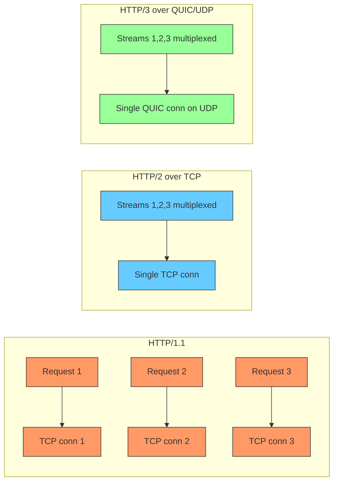
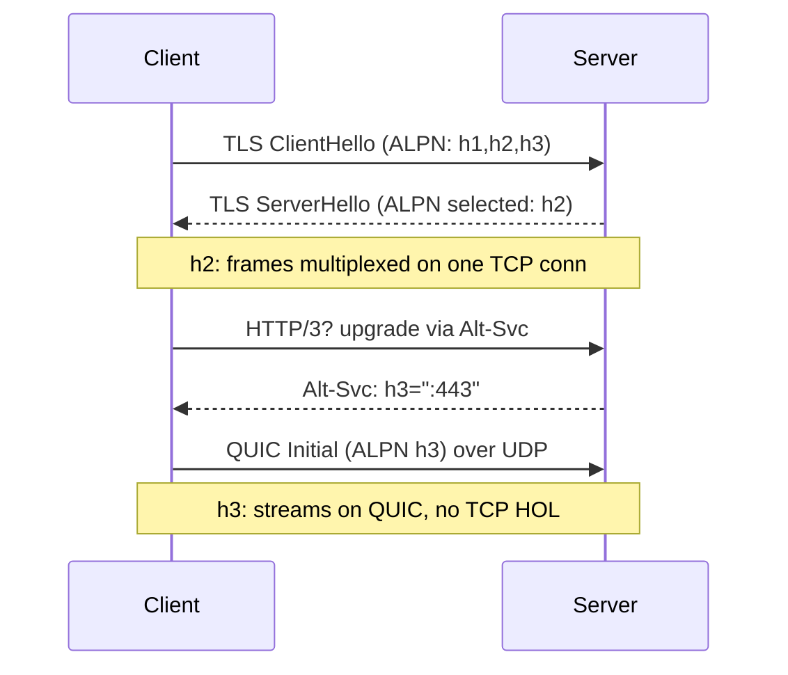

**TL;DR:** Why are there three HTTP wire versions? HTTP/1.1 serializes poorly (one request per TCP stream → head-of-line blocking), HTTP/2 multiplexes streams over one TCP connection with HPACK, and HTTP/3 runs those same streams over QUIC (UDP) to kill TCP-level HOL blocking and enable 0-RTT.

**Real repo:** [curl/curl](https://github.com/curl/curl) — its connection-matching logic shows exactly how a client negotiates and reuses h1/h2/h3 connections via ALPN and `http_neg.allowed`.

## 1. The Engineering Problem

HTTP/1.1 opened 6+ parallel TCP connections per host to fake parallelism, but that wastes sockets and still blocks on a single slow response (HOL blocking) within a connection. We needed true multiplexing without head-of-line stalls, and smaller headers (HTTP headers are repetitive and uncompressed in 1.1).

## 2. The Technical Solution





**Core truths:**
- HTTP/2 multiplexing solves *application* HOL on one connection, but a single lost TCP packet still stalls every stream (TCP HOL).
- HTTP/3 runs the same stream model over **QUIC (UDP)**, so one stream's packet loss doesn't block others.
- Header compression: HTTP/2 uses **HPACK** (static+dynamic table, no lookback needed); HTTP/3 uses **QPACK** (because QUIC streams are independent, requiring a small ack mechanism).

## 3. The clean example

How curl decides whether an existing connection can serve a new transfer — note it checks the *negotiated* HTTP version and the ALPN-allowed set:

```c
/* curl/lib/url.c — reuse decision keyed on negotiated version */
static bool url_match_http_version(struct connectdata *conn,
                                   struct url_conn_match *m) {
    if ((m->needle->scheme->protocol & PROTO_FAMILY_HTTP)) {
        switch (Curl_conn_http_version(m->data, conn)) {
        case 30: /* HTTP/3 */
            if (!(m->data->state.http_neg.allowed & CURL_HTTP_V3x)) return FALSE;
            break;
        case 20: /* HTTP/2 */
            if (!(m->data->state.http_neg.allowed & CURL_HTTP_V2x)) return FALSE;
            break;
        default: /* HTTP/1.1 */
            if (!(m->data->state.http_neg.allowed & CURL_HTTP_V1x)) return FALSE;
        }
    }
    return TRUE;
}
```

A transfer may reuse a multiplexed connection only if its negotiated version is in the `allowed` set chosen by ALPN.

## 4. Production reality

curl's `xfer_may_multiplex` gates HTTP/2+ reuse, and `url_match_http_multiplex` refuses to reuse a connection whose version the caller didn't negotiate:

```c
/* curl/lib/url.c */
static bool xfer_may_multiplex(const struct Curl_easy *data,
                               const struct connectdata *conn) {
    if ((conn->scheme->protocol & PROTO_FAMILY_HTTP) &&
        (!conn->bits.protoconnstart || !conn->bits.close)) {
        if (Curl_multiplex_wanted(data->multi) &&
            (data->state.http_neg.allowed & (CURL_HTTP_V2x | CURL_HTTP_V3x)))
            return TRUE;
    }
    return FALSE;
}
```

`CURL_HTTP_V2x | CURL_HTTP_V3x` is the bitmask representing "multiplexing capable" — the exact line that separates h1 (no multiplexing) from h2/h3 (streams).

**What this teaches:** version is negotiated once (ALPN), cached on the connection, and every reuse re-checks it. Multiplexing is a property of h2/h3 only; QUIC merely moves that multiplexing off TCP so a single loss doesn't stall all streams.

**Stale facts:** HTTP/2 fixed HTTP HOL but TCP HOL persists — HTTP/3/QUIC fixes both; TLS 1.3 removed static RSA key exchange — only ECDHE/DHE, forward secrecy by default; DNS round-robin dead at scale — clients cache A records; "firewalls inspect packets" oversimplified — modern stateful/NGFW do DPI.

## 5. Review checklist

- Is multiplexing allowed only on negotiated h2/h3 connections, never h1?
- Does the client track the *negotiated* version per connection, not just the requested one?
- Is HTTP/3 understood as "h2 streams over QUIC/UDP," not a different app model?
- Are headers compressed with a version-appropriate scheme (HPACK/QPACK), not raw text?

## 6. FAQ

- **Does HTTP/2 remove the need for multiple connections?** Yes for parallelism (multiplexed streams); connections still split for different origins or due to server concurrency limits.
- **Why does HTTP/3 still have streams?** The stream abstraction is unchanged; only the transport (TCP→QUIC) differs.
- **What is ALPN's role?** It lets the client advertise h1/h2/h3 in the TLS handshake and the server pick one before any HTTP data is sent.
- **HPACK vs QPACK?** HPACK assumes in-order delivery (TCP); QPACK adds acknowledgments because QUIC streams are independent.
- **Is HTTP/3 faster universally?** Mostly on lossy/mobile networks; on clean LANs the difference is small, but connection-migration and 0-RTT help roamers.

## Source

- **Concept:** HTTP version multiplexing, QUIC transport, HPACK/QPACK header compression, ALPN negotiation
- **Domain:** networking
- **Repo:** curl/curl → [lib/url.c](https://github.com/curl/curl/blob/master/lib/url.c) — `xfer_may_multiplex`, `url_match_http_version`, `http_neg.allowed`


