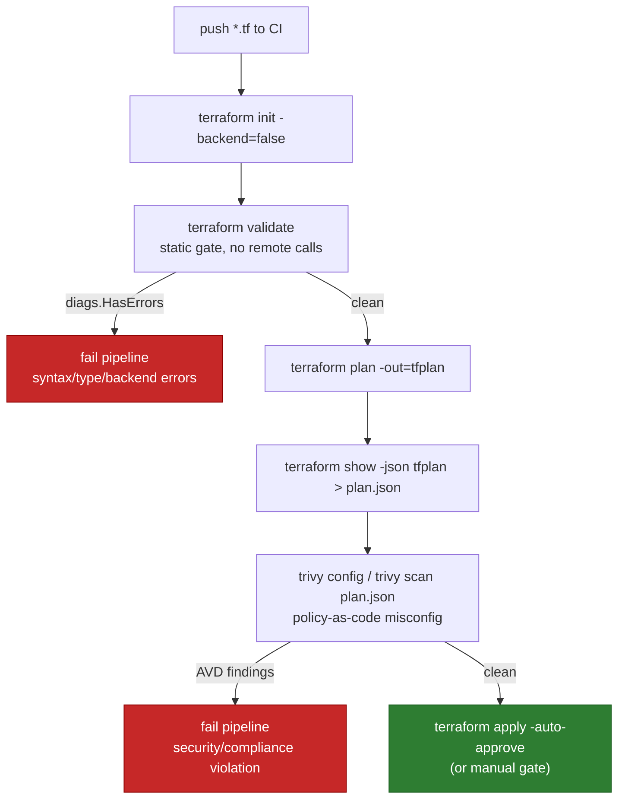

**TL;DR:** How do you catch broken or insecure infrastructure before it reaches a cloud account? Run `terraform validate` as a static gate, capture `terraform plan -out`, then scan the plan JSON with Trivy so misconfigurations fail the pipeline pre-apply.
> **In plain English (30 sec):** Think of this like concepts you already use, but in a production system at scale.


**Real repo:** [hashicorp/terraform](https://github.com/hashicorp/terraform) and [aquasecurity/trivy](https://github.com/aquasecurity/trivy)

## 1. The Engineering Problem

Infrastructure as Code promises repeatability, but it also means a typo or an open security group is now *code* that provisioning engines apply at scale. The naive pipeline is `terraform apply` directly — by the time it fails, resources are partially created, or worse, an insecure resource is live.

Testing IaC is different from testing application code: you usually cannot (and should not) stand up the real cloud in CI. So the test surface is two-fold — **static** (is the config well-formed and internally consistent?) and **policy** (does the planned change violate security/compliance rules?). Both must run *before* `apply`.

## 2. The Technical Solution

Two gates, both pre-apply:

1. **`terraform validate`** — purely static. It parses HCL, checks attribute names and value types, validates backend blocks and test files, and never touches remote state or provider APIs. It is safe to run automatically.
2. **Plan scanning** — `terraform plan -out=tfplan` then `terraform show -json tfplan > plan.json`, fed to Trivy. Trivy registers a `PostAnalyzer` for `.json` files of type `FileTypeTerraformPlanJSON`, so it evaluates the *resolved* plan (modules expanded, variables applied) rather than raw `.tf`.

This catches both "this won't even parse" and "this will create a public bucket" before anything is provisioned.



Core truths:
1. `validate` explicitly *does not* access remote services — it is the cheapest, safest first gate and is designed to run in editors and CI.
2. Trivy scans the **plan JSON**, not the `.tf` source, so it sees the fully-resolved resource graph (modules, `for_each`, remote modules already fetched).
3. A plan file is a snapshot — scanning it means the thing you tested is exactly the thing you apply (`-out` is consumed by `apply`).

## 3. The clean example

A minimal CI gate in bash, isolating the two-test contract:

```bash
# Gate 1: static validation — no cloud access, fails fast on bad HCL
terraform init -backend=false
terraform validate        # exits non-zero if config is syntactically invalid / inconsistent

# Gate 2: policy scan of the resolved plan, not the raw source
terraform plan -out=tfplan
terraform show -json tfplan > plan.json
trivy config plan.json    # AVD misconfiguration findings (public buckets, missing encryption, ...)

# Only now is apply safe to run
terraform apply -auto-approve tfplan
```

## 4. Production reality (from the real repos)

`internal/command/validate.go` (hashicorp/terraform) — the static gate, verbatim essentials:

```go
// ValidateCommand validates terraform files; it does NOT access remote state or provider APIs.
func (c *ValidateCommand) Run(rawArgs []string) int {
    // ...
    validateDiags := c.validate(dir)
    diags = diags.Append(validateDiags)
    // Validating with dev overrides in effect means the result might not be valid for a stable release
    diags = diags.Append(c.providerDevOverrideRuntimeWarnings())
    return view.Results(diags)
}

func (c *ValidateCommand) validate(dir string) tfdiags.Diagnostics {
    var diags tfdiags.Diagnostics
    // Resolve const variables first; bail early if broken
    diags = diags.Append(c.resolveConstVariables(dir, c.ParsedArgs.ViewType))
    if diags.HasErrors() { return diags }
    // Load config (with or without embedded test files)
    if c.ParsedArgs.NoTests { c.cfg, diags = c.loadConfig(dir) } else { c.cfg, diags = c.loadConfigWithTests(dir, c.ParsedArgs.TestDirectory) }
    if diags.HasErrors() { return diags }
    diags = diags.Append(c.validateConfig(cfg))
    // Backend blocks live outside the graph, validated separately
    if cfg.Module.Backend != nil {
        diags = diags.Append(c.validateBackendTypeSupported(cfg.Module.Backend))
    }
    if !c.ParsedArgs.NoTests { diags = diags.Append(c.validateTestFiles(cfg)) }
    return diags
}

// Help text confirms the design intent:
// "Validate runs checks that verify whether a configuration is syntactically
//  valid and internally consistent, regardless of any provided variables or
//  existing state. It is safe to run this command automatically ... as a test step."
```

`pkg/fanal/analyzer/config/terraformplan/json/json.go` (aquasecurity/trivy) — the plan scanner registration:

```go
// terraformPlanConfigAnalyzer detects misconfigurations in Terraform Plan files in JSON format.
const analyzerType = analyzer.TypeTerraformPlanJSON

var requiredExts = []string{ ".json" }

func init() {
    analyzer.RegisterPostAnalyzer(analyzerType, newTerraformPlanJSONConfigAnalyzer)
}

func newTerraformPlanJSONConfigAnalyzer(opts analyzer.AnalyzerOptions) (analyzer.PostAnalyzer, error) {
    a, err := config.NewAnalyzer(analyzerType, version, detection.FileTypeTerraformPlanJSON, opts)
    if err != nil { return nil, err }
    return &terraformPlanConfigAnalyzer{Analyzer: a}, nil
}

// Required checks if the given file is a Terraform Plan file in JSON format.
func (*terraformPlanConfigAnalyzer) Required(filePath string, _ os.FileInfo) bool {
    return slices.Contains(requiredExts, filepath.Ext(filePath))
}
```

**What this teaches that a hello-world can't:**
- `validate` separates `resolveConstVariables` → `loadConfig` → `validateConfig` → `validateBackendTypeSupported` → `validateTestFiles`; each appends to a single `diags` accumulator, so a single run reports *all* problems, not just the first.
- Backend blocks are validated out-of-band (`cfg.Module.Backend != nil`) because they sit outside the Terraform dependency graph — a classic "why didn't validate catch my backend?" gap.
- Trivy's plan analyzer hooks the `.json` extension and `FileTypeTerraformPlanJSON`, meaning it only fires on *plan* output, not arbitrary JSON — so you must convert the plan with `terraform show -json`, you cannot point Trivy at a `.tf` and get the same resolved view.

**Known-stale / CI-CD facts to flag:**
- Pin Terraform/GitHub Actions to a **full commit SHA**, not `@v4`/`@main` — moving tags are a supply-chain risk in CI.
- `GITHUB_TOKEN` is **read-only by default**; IaC plans that read from other GitHub resources need a permissions bump, and applying to cloud needs provider auth (OIDC preferred over static keys).
- `terraform validate` requires an initialized working directory; use `terraform init -backend=false` in CI to avoid touching the real backend during the static gate.
- Runner images change over time — the Terraform and Trivy versions bundled or cached on the runner drift; pin both explicitly.

## 5. Review checklist

- Does the pipeline run `terraform validate` (via `c.validate(dir)`) as a non-remote, fail-fast gate before any plan/apply?
- Is the backend validated separately (`validateBackendTypeSupported`) or are you surprised by an unsupported backend type at apply time?
- Is the *plan JSON* (`FileTypeTerraformPlanJSON`, ext `.json`) what Trivy scans, not the raw `.tf` source?
- Are `init -backend=false` and provider auth (OIDC) configured so the static gate does not touch real state?

## 6. FAQ

**Q: Does `terraform validate` call the cloud?**
No — its own help text states it verifies config "regardless of any provided variables or existing state" and "does not access any remote services". It is safe to run automatically.

**Q: Why scan the plan JSON instead of the `.tf` files?**
Trivy's `terraformPlanConfigAnalyzer` registers for `FileTypeTerraformPlanJSON` with `requiredExts = [".json"]` — it evaluates the *resolved* graph (modules expanded, variables applied), which raw `.tf` does not show.

**Q: What does validate check that isn't in the graph?**
Backend blocks (`cfg.Module.Backend`) and test files are validated separately because they live outside the dependency graph.

**Q: Is `validate` enough on its own for security?**
No — it catches syntax/type/backend errors only. Misconfigurations like public buckets need a policy scanner (Trivy/Checkov) on the plan.

## Source

- **Concept:** Testing Infrastructure as Code before apply — static `terraform validate` gate plus Trivy scanning of the resolved Terraform plan JSON (policy-as-code).
- **Domain:** cicd
- **Repo:** [hashicorp/terraform](https://github.com/hashicorp/terraform) → [internal/command/validate.go](https://github.com/hashicorp/terraform/blob/main/internal/command/validate.go) — `ValidateCommand.Run` / `validate` multi-stage static check.
- **Repo:** [aquasecurity/trivy](https://github.com/aquasecurity/trivy) → [pkg/fanal/analyzer/config/terraformplan/json/json.go](https://github.com/aquasecurity/trivy/blob/main/pkg/fanal/analyzer/config/terraformplan/json/json.go) — `terraformPlanConfigAnalyzer` registration for plan JSON scanning.


