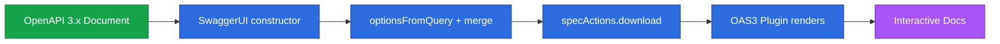

**TL;DR:** How do you stop server and client from drifting apart? Write the OpenAPI contract first, then generate both the server stubs and the client SDK from it — Swagger UI renders the same contract for humans.

**Real repo:** [swagger-api/swagger-ui](https://github.com/swagger-api/swagger-ui) — its `SwaggerUI` constructor fetches/merges a spec from `url` or `spec` and drives a plugin-based system that renders OpenAPI 3.0/3.1 documents.

## 1. The Engineering Problem

In code-first APIs, the implementation is the source of truth and the documentation lags — or never exists. Clients integrate against guesswork, then break silently. Two failure modes dominate:

- **Drift:** the running API and its docs disagree.
- **Duplication:** every team hand-writes the same client boilerplate.

Contract-first flips this: the OpenAPI document is the single artifact, and code is generated from it.

## 2. The Technical Solution

Swagger UI is a pure *consumer* of the contract. Its entry point resolves options, loads the spec, and renders it through a plugin system:



Core truths:

- The OpenAPI document is the contract; Swagger UI is one of many *renderers* of it.
- Codegen (server stubs + client SDKs) turns the same contract into code, eliminating drift.
- Contract-first forces you to design the API before writing handlers — better shapes, fewer breaking changes.

## 3. The clean example

Bootstrapping Swagger UI from a contract URL (from `src/core/index.js`):

```js
function SwaggerUI(userOptions) {
  const queryOptions = optionsFromQuery()(userOptions)
  const mergedOptions = SwaggerUI.config.merge(
    {}, SwaggerUI.config.defaults, runtimeOptions, userOptions, queryOptions
  )
  // ...
  if (options.url && !options.urls) {
    system.specActions.updateUrl(options.url)
    system.specActions.download(options.url)   // fetches OpenAPI JSON/YAML
  }
  // OAS3 plugin renders paths, schemas, and "Try it out"
}
```

A minimal contract-first document:

```yaml
openapi: 3.1.0
info: { title: Articles API, version: 1.0.0 }
paths:
  /articles:
    get:
      responses:
        '200':
          description: list
          content:
            application/json:
              schema: { type: array, items: { $ref: '#/components/schemas/Article' } }
components:
  schemas:
    Article: { type: object, properties: { id: { type: string }, title: { type: string } } }
```

## 4. Production reality

Swagger UI's plugin set reveals what a full OpenAPI 3.x renderer covers — note the explicit OpenAPI 3.0 and 3.1 plugins and schema-dialect plugins:

```js
// src/core/index.js
import OpenAPI30Plugin from "./plugins/oas3"
import OpenAPI31Plugin from "./plugins/oas3"   // 3.1 reuses the oas3 plugin
import JSONSchema202012Plugin from "./plugins/json-schema-2020-12"
import VersionsPlugin from "./plugins/versions" // multi-spec version switching
// ...
SwaggerUI.plugins = { OpenAPI30, OpenAPI31, Versions, /* ... */ }
```

What this teaches: a renderer must speak the full OpenAPI + JSON Schema dialect surface. Generated code (via OpenAPI Generator) consumes the *same* document, so what renders is what ships.

**Stale fact (API Design):** most "REST" APIs are Richardson Level 2 not Level 3/HATEOAS — and OpenAPI documents the Level 2 contract extremely well, which is why it has won over hypermedia in practice.

## 5. Review checklist

- Is the OpenAPI document generated from or validated against code (no drift)?
- Do you generate client SDKs rather than hand-writing them?
- Are schemas referenced via `$ref` to avoid duplication?
- Does CI fail when the contract changes in a breaking way?

## 6. FAQ

**Q: Contract-first vs code-first — which first?** Contract-first prevents drift and forces design; code-first is faster to prototype.

**Q: Does Swagger UI validate my API?** No — it renders and lets you "Try it out"; validation is separate (e.g. conformance suites).

**Q: OpenAPI 3.0 or 3.1?** 3.1 aligns with JSON Schema 2020-12 and is preferred for new APIs.

**Q: Can I generate server stubs?** Yes — OpenAPI Generator produces server skeletons in many languages.

**Q: How do I version a contract?** Bump `info.version` and use path versioning; publish each version's document.

## Source

- **Concept:** OpenAPI / Swagger contract-first + codegen
- **Domain:** api-design
- **Repo:** swagger-api/swagger-ui → [src/core/index.js](https://github.com/swagger-api/swagger-ui/blob/master/src/core/index.js) — SwaggerUI constructor loading/merging an OpenAPI spec and dispatching to OAS3 plugins.


