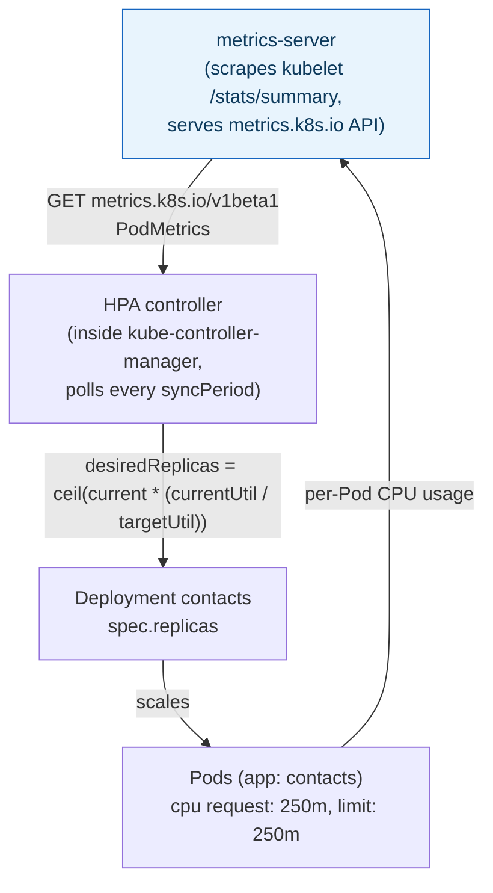
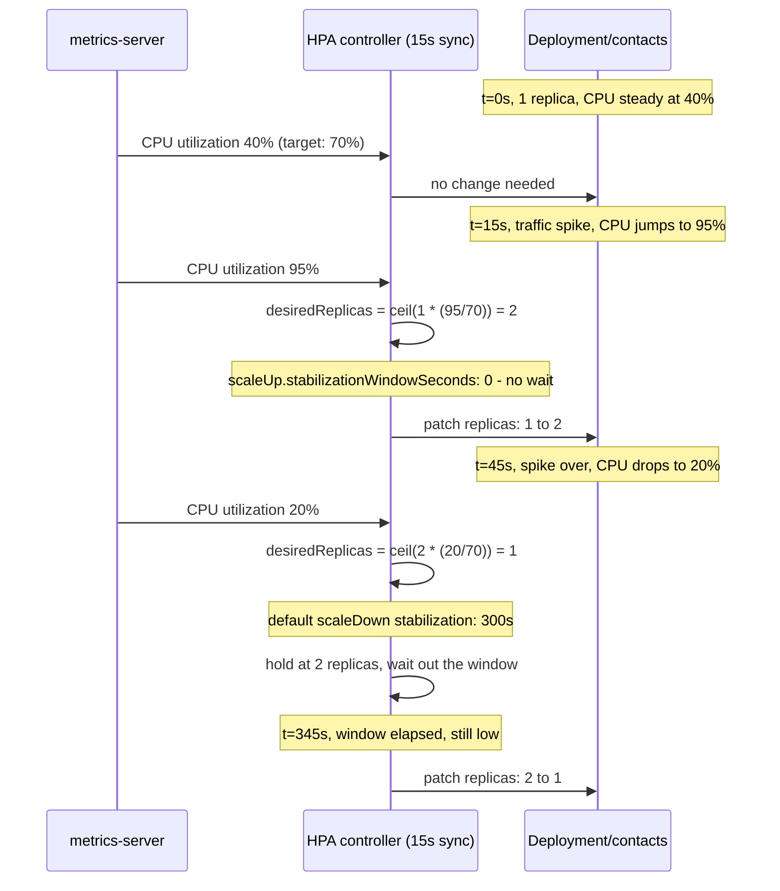

## 1. The Engineering Problem: a fixed `replicas` count is always wrong somewhere

`replicas: 3` is a guess frozen at deploy time. Set it for peak traffic and you pay for idle capacity all night. Set it for average load and a traffic spike degrades into 5xx errors and queued requests until a human notices a dashboard and runs `kubectl scale` by hand — minutes after the damage started.

What you actually want is a controller that watches a live signal (CPU load, request rate, queue depth) and continuously nudges `replicas` toward "enough to keep that signal at a target, no more."

---

## 2. The Technical Solution: HorizontalPodAutoscaler

An **HPA** is a control loop, not a config value. Every sync period (default 15s, `--horizontal-pod-autoscaler-sync-period` on `kube-controller-manager`), it reads a metric for the Pods under `scaleTargetRef`, computes a desired replica count, and patches the target's `spec.replicas` — the same field `kubectl scale` would touch.



For **resource metrics** (CPU/memory), the source is `metrics-server`, which the `kubernetes-sigs/metrics-server` project ships as a cluster add-on scraping every kubelet's `/stats/summary` and exposing it through the `metrics.k8s.io` API — the same API the HPA controller reads. For anything else (queue depth, requests-per-second), the HPA reads `custom.metrics.k8s.io` or `external.metrics.k8s.io` instead, served by a separate adapter — the HPA object itself doesn't care which; it only cares that *some* adapter answers the metrics API.

The formula the controller actually uses:

```
desiredReplicas = ceil(currentReplicas * (currentMetricValue / desiredMetricValue))
```

Three core truths:

- **The HPA can only scale what `scaleTargetRef` names** (a Deployment, ReplicaSet, or StatefulSet) — it never creates Pods itself, it patches someone else's `replicas` field.
- **CPU-utilization scaling is meaningless without a `resources.requests.cpu`** on the target Pods — "70% utilization" is 70% *of the request*, so an unset request makes the percentage undefined.
- **Scale-up and scale-down are deliberately asymmetric.** The default `scaleDown` behavior has a 300-second stabilization window (avoid flapping down right before the next spike); `scaleUp` defaults to near-immediate. A manifest that overrides `scaleUp.stabilizationWindowSeconds: 0` is explicitly choosing "react to spikes instantly" over the default caution.



---

## 3. The clean example (concept in isolation)

```yaml
apiVersion: apps/v1
kind: Deployment
metadata:
  name: api
spec:
  replicas: 1
  template:
    spec:
      containers:
        - name: api
          image: myapp/api:1.0
          resources:
            requests:
              cpu: 200m      # required: HPA's "utilization %" is relative to this
            limits:
              cpu: 200m
---
apiVersion: autoscaling/v2
kind: HorizontalPodAutoscaler
metadata:
  name: api
spec:
  scaleTargetRef:
    apiVersion: apps/v1
    kind: Deployment
    name: api
  minReplicas: 1
  maxReplicas: 10
  metrics:
    - type: Resource
      resource:
        name: cpu
        target:
          type: Utilization
          averageUtilization: 70   # scale to keep avg CPU near 70% of the request
```

---

## 4. Production reality (from `GoogleCloudPlatform/bank-of-anthos`)

Bank of Anthos, Google's reference microservices banking app, ships an HPA for its `contacts` service under `extras/postgres-hpa/kubernetes-manifests/contacts.yaml` — one file with the Deployment, Service, and HPA together:

```yaml
# extras/postgres-hpa/kubernetes-manifests/contacts.yaml (Deployment, excerpt)
spec:
  containers:
  - name: contacts
    resources:
      requests:
        cpu: 250m
        memory: 512Mi
      limits:
        cpu: 250m           # equal to request - CPU utilization % has a stable baseline
        memory: 512Mi
---
apiVersion: autoscaling/v2
kind: HorizontalPodAutoscaler
metadata:
  name: contacts
spec:
  behavior:
    scaleUp:
      stabilizationWindowSeconds: 0   # react to a spike immediately, no debounce
      policies:
        - type: Percent
          value: 100                   # allowed to DOUBLE replica count per step
          periodSeconds: 5
      selectPolicy: Max
  scaleTargetRef:
    apiVersion: apps/v1
    kind: Deployment
    name: contacts
  minReplicas: 1
  maxReplicas: 5
  metrics:
    - type: Resource
      resource:
        name: cpu
        target:
          type: Utilization
          averageUtilization: 70
```

What this teaches that a hello-world can't:

- **`requests.cpu` and `limits.cpu` are set to the identical value (`250m`).** That's Guaranteed QoS for the CPU dimension specifically — it makes "70% utilization" mean the same, stable thing on every replica instead of drifting with however much headroom `limits` happened to leave above `requests`.
- **`policies: [{type: Percent, value: 100, periodSeconds: 5}]` caps growth at doubling every 5 seconds, not "add unlimited Pods instantly.**" Even with `stabilizationWindowSeconds: 0`, the *rate* of scale-up is still bounded — a real production author's guard against a metrics blip causing `maxReplicas` to be hit in one step.
- **`scaleDown` behavior is left unset**, meaning it inherits the platform default (300s stabilization). The manifest only overrides the direction that needed urgency (traffic spikes) and deliberately leaves the conservative default alone for the direction where flapping is the real risk.
- **`maxReplicas: 5`** is a low, deliberate ceiling for a demo-scale app — it's the same field a production system would set much higher, but it's the field that actually caps blast radius if a metrics adapter misbehaves and reports a runaway value.

Known-stale fact: `autoscaling/v2beta1` and `v2beta2` are gone, not just deprecated — both were removed in Kubernetes 1.26. `autoscaling/v2` (which carries `behavior`, unavailable in `v1`) has been the only API version since 1.23 went GA; a manifest still targeting `v2beta2` will fail outright on any current cluster, not just print a deprecation warning.

---

## Source

- **Concept:** HorizontalPodAutoscaler
- **Domain:** kubernetes
- **Repo:** [GoogleCloudPlatform/bank-of-anthos](https://github.com/GoogleCloudPlatform/bank-of-anthos) → [`extras/postgres-hpa/kubernetes-manifests/contacts.yaml`](https://github.com/GoogleCloudPlatform/bank-of-anthos/blob/main/extras/postgres-hpa/kubernetes-manifests/contacts.yaml) — Google's reference microservices banking demo.
