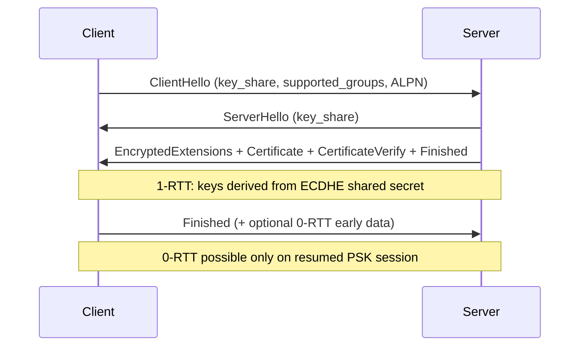
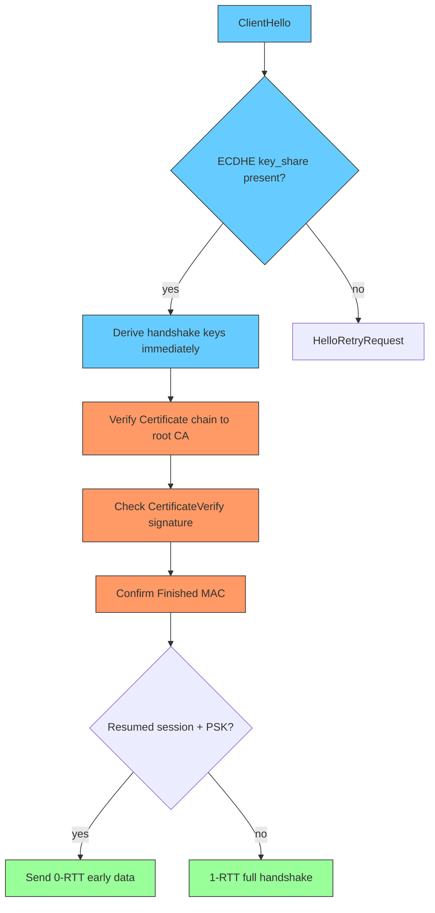

**TL;DR:** How does a client and server agree on keys and prove identity without a man-in-the-middle? TLS 1.3 does an ECDHE key exchange in **1 round trip** (vs 2 in 1.2), verifies the server cert chain, and can send early data in **0-RTT** on a resumed session.

> **In plain English (30 sec):** Code you already write — Map, function, API call, just bigger.

**Real repo:** [curl/curl](https://github.com/curl/curl) — its TLS layer enforces `CURL_SSLVERSION` defaults and ALPN, and its connection-reuse logic requires matching SSL parameters, the same checks a TLS 1.3 handshake outcome must satisfy.

## 1. The Engineering Problem

Two parties on a public network must (a) agree on symmetric keys without an eavesdropper learning them, (b) prove the server is who it claims (cert chain → trust store), and (c) do it fast. TLS 1.2 needed 2 round trips and allowed static-RSA key exchange (no forward secrecy). TLS 1.3 fixes both.

## 2. The Technical Solution





**Core truths:**
- TLS 1.3 **only** allows forward-secret key exchange (ECDHE/DHE); the static-RSA mode of 1.2 is gone.
- The full handshake is **1-RTT**; the server's first flight is already encrypted except ClientHello.
- **0-RTT** reuses a PSK from a prior session to send data immediately — but it is *replayable* and must carry no non-idempotent side effects.

## 3. The clean example

A client requesting TLS 1.3 and a specific ALPN, modeled on curl's option plumbing:

```c
/* conceptual — curl sets these on the easy handle */
CURL *h = curl_easy_init();
curl_easy_setopt(h, CURLOPT_URL, "https://example.com");
curl_easy_setopt(h, CURLOPT_SSLVERSION, (long)CURL_SSLVERSION_TLSv1_3);
// ALPN (h1/h2/h3) is negotiated inside the TLS ClientHello
```

curl's `Curl_init_userdefined` pins the default floor so an accidental downgrade to SSLv3 is impossible:

```c
/* curl/lib/url.c */
#ifdef USE_SSL
  Curl_setopt_SSLVERSION(data, CURLOPT_SSLVERSION, CURL_SSLVERSION_DEFAULT);
#endif
  set->ssl_enable_alpn = TRUE;   /* always offer ALPN */
```

## 4. Production reality

When reusing a connection, curl requires the cached session's TLS parameters to match the new request — the same properties a completed TLS 1.3 handshake established:

```c
/* curl/lib/url.c */
static bool url_match_ssl_config(struct connectdata *conn,
                                 struct url_conn_match *m) {
    if (((m->needle->scheme->flags & PROTOPT_SSL) || m->may_tls) &&
        !Curl_ssl_conn_config_match(m->data, conn, FALSE)) {
        DEBUGF(infof(m->data, "Connection #%" FMT_OFF_T
                     " has different SSL parameters, cannot reuse",
                     conn->connection_id));
        return FALSE;
    }
    return TRUE;
}
```

`Curl_ssl_conn_config_match` compares the negotiated protocol version, ALPN, and cert/CA settings — the concrete fingerprint of "this TLS 1.3 session is the one you think it is." A mismatch means a fresh handshake, never silent reuse.

**What this teaches:** TLS 1.3 collapses setup to 1-RTT with mandatory forward secrecy, binds identity through cert-chain + signature verification, and gates 0-RTT behind a resumed PSK with replay caveats. Reuse logic must re-validate every negotiated parameter.

**Stale facts:** HTTP/2 fixed HTTP HOL but TCP HOL persists — HTTP/3/QUIC fixes both; TLS 1.3 removed static RSA key exchange — only ECDHE/DHE, forward secrecy by default; DNS round-robin dead at scale — clients cache A records; "firewalls inspect packets" oversimplified — modern stateful/NGFW do DPI.

## 5. Review checklist

- Is the key exchange ECDHE/DHE (forward secret), never static RSA?
- Are server certificates verified against a trusted root and expired/revoked status?
- Is 0-RTT data idempotent and replay-safe, or disabled for mutations?
- Does connection reuse re-check the negotiated TLS version + ALPN + CA set?

## 6. FAQ

- **Why is TLS 1.3 faster than 1.2?** One round trip instead of two, and encrypted early data on resumption (0-RTT).
- **Why was static RSA removed?** It had no forward secrecy — a leaked server key decrypted all past traffic.
- **Is 0-RTT secure?** It provides confidentiality but not replay protection; only send safe, repeatable requests.
- **What does CertificateVerify prove?** That the server holds the private key matching its certificate, by signing the handshake.
- **Does ALPN affect TLS?** It selects the app protocol (h1/h2/h3) inside the handshake so the right stack parses the bytes after.

## Source

- **Concept:** TLS 1.3 ECDHE handshake, certificate chain verification, 0-RTT resumption
- **Domain:** networking
- **Repo:** curl/curl → [lib/url.c](https://github.com/curl/curl/blob/master/lib/url.c) — `CURL_SSLVERSION_DEFAULT`, `url_match_ssl_config`, `ssl_enable_alpn`


