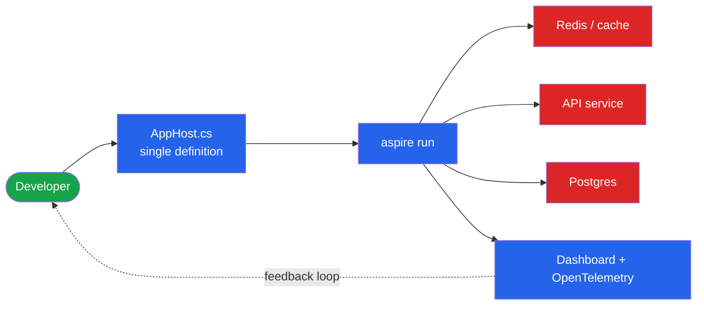

**TL;DR:** *How do you know if your platform is actually making developers faster, or just adding another layer?* Measure DX: time-to-first-deploy, inner-loop latency, and cognitive load — not just DORA's four keys.

> **In plain English (30 sec):** Code you already write — Map, function, API call, just bigger.

**Real repo:** [microsoft/aspire](https://github.com/microsoft/aspire)

## 1. The Engineering Problem

Platform teams love DORA metrics (deployment frequency, lead time, change failure rate, MTTR) because they're standardized and outcome-oriented. But DORA measures the *outbound* delivery pipeline. It says nothing about the daily grind of a developer trying to run a five-service app on their laptop.

If a new hire needs three days and a wiki archaeology expedition to get the app running locally, DORA won't catch it — but that friction is bleeding productivity. The missing dimension is **cognitive load**: how much a developer must hold in their head to make progress, and how long the **inner loop** (edit → run → observe) takes.

Good DX measurement combines:

- **Time-to-first-deploy / time-to-onboard** — how long until a new engineer ships something.
- **Inner-loop latency** — edit-to-feedback time on the local machine.
- **Cognitive load** — number of tools, configs, and mental steps to do routine work.

## 2. The Technical Solution

The biggest DX lever is collapsing the inner loop. .NET Aspire is a code-first toolchain where the *entire* distributed app — services, caches, databases, containers, and their wiring — is described in code (`AppHost`), and one command runs it all locally with observability built in. That directly attacks cognitive load: you don't memorize docker-compose plus connection strings plus env vars; you read one file.



Three core truths:

1. **Cognitive load is the metric DORA misses.** One `AppHost` file replacing scattered compose/env config is a measurable reduction.
2. **Inner-loop latency dominates daily productivity.** `aspire run` starting the whole graph with wired dependencies shrinks edit-to-observe time.
3. **Observability in the loop shortens feedback.** The built-in dashboard + OpenTelemetry means developers see behavior immediately, not after deploying.

## 3. The clean example

The entire multi-service app, wired, in a handful of lines — this *is* the cognitive-load reduction:

```csharp
var builder = DistributedApplication.CreateBuilder(args);

var cache = builder.AddRedis("cache");

var api = builder.AddNodeApp("api", "./api", "src/index.ts")
    .WithReference(cache)        // dependency wiring, not manual env vars
    .WaitFor(cache)
    .WithHttpEndpoint(env: "PORT")
    .WithExternalHttpEndpoints();

builder.AddViteApp("frontend", "./frontend")
    .WithReference(api)
    .WaitFor(api);

builder.Build().Run();
```

No connection strings copy-pasted, no startup-order shell scripts. `WithReference` and `WaitFor` encode the dependency graph the developer would otherwise hold in their head.

## 4. Production reality

A verbatim AppHost from the Aspire repo's playground shows the same DX properties on a heavier stack — a Postgres server, a DB-setup job that must complete first, a replicated API with a health check, and a frontend:

> **Where things live (aspire repo):**
> ```
> playground/waitfor/
> ├── WaitForSandbox.AppHost/AppHost.cs   # the single app definition
> ├── WaitForSandbox.ApiService/          # the API project
> └── WaitForSandbox.DbSetup/             # migration job
> ```

```csharp
var builder = DistributedApplication.CreateBuilder(args);

// AddAzurePostgresFlexibleServer + RunAsContainer: prod resource, local container
var db = builder.AddAzurePostgresFlexibleServer("pg")
                .WithPasswordAuthentication()
                .RunAsContainer(c =>
                {
                    c.WithPgAdmin(c => { c.WithHostPort(15551); });
                })
                .AddDatabase("db");

// dbsetup: a one-shot job the app must WaitForCompletion on
var dbsetup = builder.AddProject<Projects.WaitForSandbox_DbSetup>("dbsetup")
                     .WithReference(db).WaitFor(db);

// api: health check + replicas + ordered startup, all declared inline
var backend = builder.AddProject<Projects.WaitForSandbox_ApiService>("api")
                     .WithExternalHttpEndpoints()
                     .WithHttpHealthCheck("/health")
                     .WithReference(db).WaitFor(db)
                     .WaitForCompletion(dbsetup)   // ordering as code, not tribal knowledge
                     .WithReplicas(2);

builder.AddProject<Projects.WaitFor_Frontend>("frontend")
       .WithReference(backend).WaitFor(backend);

builder.Build().Run();
```

**What this teaches:** the DX win is that startup ordering (`WaitForCompletion(dbsetup)`), health checks (`WithHttpHealthCheck`), and dependency wiring (`WithReference`) are *readable in one file* instead of being folklore a new hire must reconstruct. That's cognitive load made concrete — and it's exactly what DORA metrics won't show you.

**Stale facts worth correcting:**
- *"DORA metrics alone tell you if DX is good."* Incomplete. DORA measures delivery outcomes; it misses **cognitive load** and inner-loop friction. Pair DORA with DX surveys and time-to-onboard.
- *"Platform engineering is just DevOps renamed."* No — DX is a **product** metric about your internal users' experience; DevOps is the culture.
- *"More tools = better platform."* Often the opposite: each tool adds cognitive load. Aspire's value is *collapsing* the tool count into one definition.

## 5. Review checklist

- Do you measure time-to-first-deploy for a *new* engineer, not just steady-state throughput?
- Are you tracking inner-loop latency (edit → run → observe), not only deploy frequency?
- Is cognitive load assessed (tool count, config sprawl, mental steps) alongside DORA?
- Does local dev include observability so feedback happens before deploy?

## 6. FAQ

**Should we drop DORA metrics?** No — keep them. They're necessary but not sufficient. Add DX-specific measures (SPACE framework, DevEx surveys, cognitive load).

**How do you measure cognitive load?** Proxies: number of tools/configs to run the app locally, onboarding time, and developer-reported friction from surveys.

**What does Aspire have to do with metrics?** It's a lever, not a metric — it demonstrates *reducing* cognitive load and inner-loop time, which is what the metrics should reward.

**Is `WaitFor` just docker-compose `depends_on`?** Similar intent, but it's code-first, typed, and carries into deployment — one definition for local and prod, less to hold in your head.

**Does more observability slow the inner loop?** Aspire builds OpenTelemetry into the local run, so observability *shortens* the feedback loop rather than being a post-deploy add-on.

## Source

- **Concept:** Developer experience metrics — time-to-deploy and cognitive load beyond DORA
- **Domain:** platform-engineering
- **Repo:** [microsoft/aspire](https://github.com/microsoft/aspire) → [playground/waitfor/WaitForSandbox.AppHost/AppHost.cs](https://github.com/microsoft/aspire/blob/main/playground/waitfor/WaitForSandbox.AppHost/AppHost.cs) — single-file distributed app definition with ordering, health checks, replicas
- **Repo:** [microsoft/aspire](https://github.com/microsoft/aspire) → [README.md](https://github.com/microsoft/aspire/blob/main/README.md) — code-first local dev + built-in OpenTelemetry dashboard


