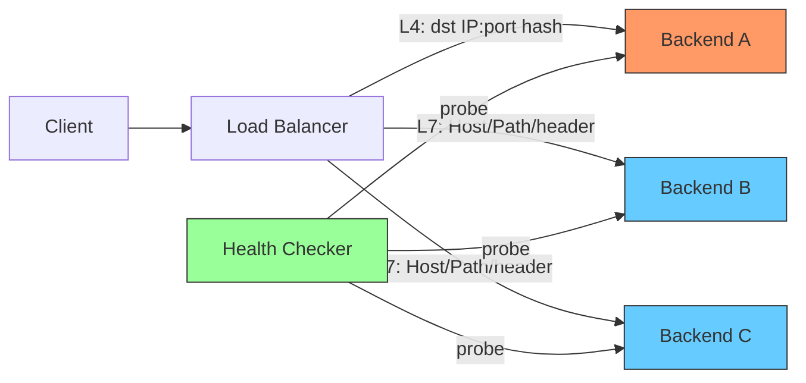
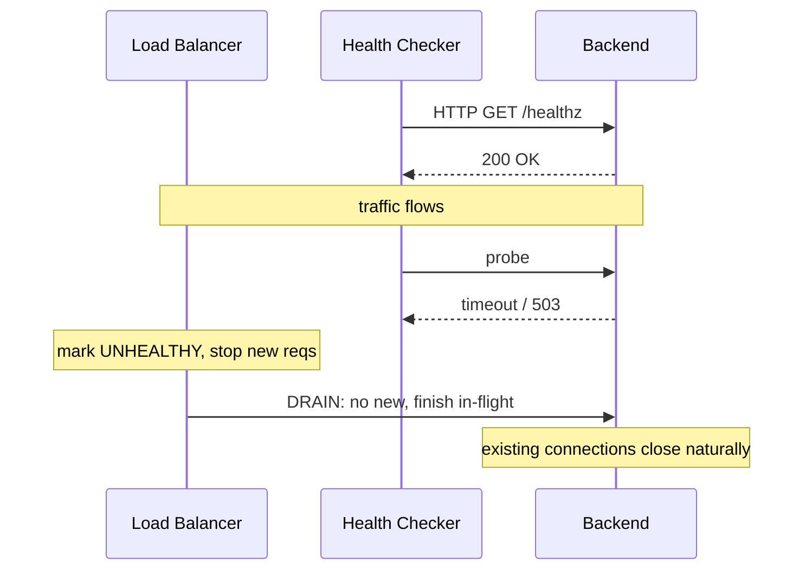

**TL;DR:** How does a load balancer spread load without breaking sessions? L4 routes on IP/port (fast, opaque), L7 routes on HTTP semantics; both use health checks to evict bad backends and **connection draining** to retire live ones without dropping in-flight requests.

> **In plain English (30 sec):** Code you already write — Map, function, API call, just bigger.

**Real repo:** [envoyproxy/envoy](https://github.com/envoyproxy/envoy) — its `HealthCheckerFactory` supports HTTP, TCP, and gRPC health checks, and [nginx/nginx](https://github.com/nginx/nginx) shows weighted round-robin peer selection with `max_conns` caps.

## 1. The Engineering Problem

A single backend can't scale or survive failure. A balancer must distribute traffic, route by the right signal (port vs URL vs header), stop sending to unhealthy nodes, and — critically — take a node out of rotation *without* killing requests already in flight.

## 2. The Technical Solution





**Core truths:**
- **L4** (transport) is blind to content — fast, generic, good for TCP/UDP streams; **L7** (application) can route on URL, header, cookie — smarter, slightly heavier.
- **Health checks** are active probes (HTTP/TCP/gRPC) that flip a backend between healthy/unhealthy; unhealthy nodes get no new traffic.
- **Connection draining** (graceful shutdown) stops *new* connections to a target but lets *existing* ones finish — essential for zero-downtime deploys.

## 3. The clean example

Envoy's health-checker factory picks the probe type from config — HTTP, TCP, or gRPC — and gRPC requires an HTTP/2-capable cluster:

```cpp
// envoy/source/common/upstream/health_checker_impl.cc
case envoy::config::core::v3::HealthCheck::kGrpcHealthCheck:
  if (!(cluster.info()->features() & Upstream::ClusterInfo::Features::HTTP2)) {
    return absl::InvalidArgumentError(fmt::format(
        "{} cluster must support HTTP/2 for gRPC healthchecking",
        cluster.info()->name()));
  }
  factory = ... "envoy.health_checkers.grpc";
  break;
```

nginx selects a backend with weighted round-robin and refuses peers that hit their `max_conns` — a hard flow-control cap that acts like a per-backend health gate:

```c
// nginx/src/http/ngx_http_upstream_round_robin.c
peer->current_weight += peer->effective_weight;
total += peer->effective_weight;
if (peer->effective_weight < peer->weight) { peer->effective_weight++; }
// ...
if (peer->max_conns && peer->conns >= peer->max_conns) {
    continue;   // skip overloaded backend
}
```

## 4. Production reality

Envoy's `PayloadMatcher` implements the TCP health-check "send/receive" fuzzy matching — each expected binary block must appear in order, but not necessarily contiguously:

```cpp
// envoy/source/common/upstream/health_checker_impl.cc
bool PayloadMatcher::match(const MatchSegments& expected,
                           const Buffer::Instance& buffer) {
  uint64_t start_index = 0;
  for (const std::vector<uint8_t>& segment : expected) {
    ssize_t search_result = buffer.search(segment.data(), segment.size(), start_index);
    if (search_result == -1) { return false; }
    start_index = search_result + segment.size();
  }
  return true;
}
```

This is the L4 (TCP) health-check primitive: send a known byte pattern, require the expected reply — the lowest-level liveness signal a balancer can use.

**What this teaches:** L4/L7 is a routing-depth tradeoff; health checks are the feedback loop that keeps the pool honest; draining is what makes membership changes safe. `max_conns` and payload-matching are two faces of the same "protect the backend" goal.

**Stale facts:** HTTP/2 fixed HTTP HOL but TCP HOL persists — HTTP/3/QUIC fixes both; TLS 1.3 removed static RSA key exchange — only ECDHE/DHE, forward secrecy by default; DNS round-robin dead at scale — clients cache A records; "firewalls inspect packets" oversimplified — modern stateful/NGFW do DPI.

## 5. Review checklist

- Is the L4/L7 choice matched to what you actually route on (port vs content)?
- Are health checks active, typed (HTTP/TCP/gRPC), and correctly marking nodes unhealthy?
- Does removal of a backend drain in-flight connections rather than reset them?
- Are per-backend connection caps (`max_conns`) enforced to prevent overload?

## 6. FAQ

- **When is L4 enough?** When you only need to spread TCP/UDP by address and don't care about request content.
- **Why does gRPC health checking need HTTP/2?** The gRPC health protocol runs over HTTP/2 streams.
- **What's the difference between active and passive health checks?** Active probes on a timer; passive reacts to real request failures (e.g., 5xx counts).
- **What happens to existing connections during draining?** They are allowed to complete; only new assignments stop.
- **Is round-robin always fair?** Weighted RR accounts for backend capacity; `max_conns` prevents a slow backend from being buried.

## Source

- **Concept:** L4 vs L7 load balancing, connection draining, active health checks
- **Domain:** networking
- **Repo:** envoyproxy/envoy → [source/common/upstream/health_checker_impl.cc](https://github.com/envoyproxy/envoy/blob/main/source/common/upstream/health_checker_impl.cc) — `HealthCheckerFactory::create`, `PayloadMatcher::match`; nginx/nginx → [src/http/ngx_http_upstream_round_robin.c](https://github.com/nginx/nginx/blob/master/src/http/ngx_http_upstream_round_robin.c) — weighted peer selection, `max_conns`


