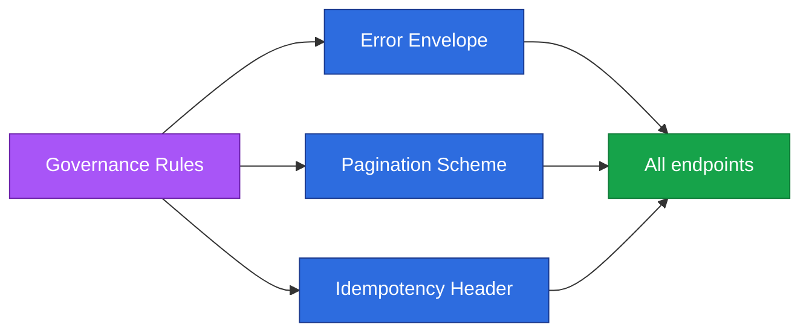

**TL;DR:** How do you make a fleet of APIs feel like one? Govern three cross-cutting contracts — a uniform error envelope, consistent pagination, and idempotency keys for safe retries.

**Real repo:** [strapi/strapi](https://github.com/strapi/strapi) — its OpenAPI assembler standardizes parameter shapes (including `pagination[page]` style query params) across every generated route, the kind of convention governance enforces fleet-wide.

## 1. The Engineering Problem

When many teams ship APIs independently, clients face a different error shape, pagination scheme, and retry story on every endpoint. Integrations become bespoke glue. Governance is the discipline of standardizing the *cross-cutting* parts so a client learns the rules once.

The three highest-leverage conventions:

1. **Error format** — one envelope (`{ error: { code, message, details } }`).
2. **Pagination** — one scheme (cursor or page/offset) with stable param names.
3. **Idempotency keys** — a header that makes retries safe for writes.

## 2. The Technical Solution

Governance turns these into enforced contracts. Strapi's assembler shows the pagination convention being applied uniformly to *every* collection route — nested query objects flatten to bracket notation so clients always see `pagination[page]` / `pagination[pageSize]`:



Core truths:

- A uniform error envelope lets one client error-handler serve every endpoint.
- Cursor pagination is more stable than offset under concurrent writes; govern one scheme.
- Idempotency keys move "safe to retry" from documentation into the protocol.

## 3. The clean example

```ts
// Error envelope (governed)
// HTTP 409
{
  "error": {
    "code": "RESOURCE_CONFLICT",
    "message": "Article slug already exists",
    "details": { "field": "slug" }
  }
}

// Cursor pagination (governed) — Strapi emits pagination[page]/[pageSize]
GET /articles?pagination[page]=2&pagination[pageSize]=25
// response
{ "data": [...], "meta": { "pagination": { "page": 2, "pageSize": 25, "total": 312 } } }

// Idempotency for safe retries
POST /articles
Idempotency-Key: 9f1c2e3b-...
```

## 4. Production reality

Strapi's OpenAPI assembler demonstrates how a single rule propagates to every route's parameters — the pagination convention is generated, not hand-written:

```ts
// packages/core/openapi/src/assemblers/document/path/path-item/operation/parameters.ts
// nested query objects are flattened so clients see consistent bracket notation
if (hasExpandableObjectProperties(resolvedSchema)) {
  for (const [propName, propSchema] of Object.entries(resolvedSchema.properties!)) {
    queryParams.push({
      name: `${name}[${propName}]`,   // e.g. pagination[page]
      in: 'query', required: isRequired, schema: propSchema,
    });
  }
}
```

> Multi-path callout: the same assembler emits `pagination[page]` for `GET /articles`, `GET /authors`, and every collection route — one pagination convention, everywhere.

What this teaches: governance works best when it is *generated/enforced*, not documented. If the contract is produced from a shared assembler, divergence is structurally impossible.

**Stale fact (API Design):** most "REST" APIs are Richardson Level 2, not Level 3/HATEOAS — and governance (errors, pagination, idempotency) is what actually makes Level 2 APIs pleasant to consume at scale, more than hypermedia ever did.

## 5. Review checklist

- Does every error response use the same envelope and status-code mapping?
- Is pagination parameterized identically on every collection endpoint?
- Do all mutating endpoints accept and honor an `Idempotency-Key`?
- Is the convention generated/enforced, not just written in a wiki?

## 6. FAQ

**Q: Offset or cursor pagination?** Cursor for append-heavy data; offset for small, stable datasets.

**Q: Where do idempotency keys live?** An `Idempotency-Key` request header; the server stores the result keyed by it.

**Q: Should errors use HTTP status or a code?** Both — status for transport, machine-readable `code` for logic.

**Q: Can governance be enforced in CI?** Yes — contract linting (e.g. Spectral) fails PRs that violate the rules.

**Q: Does OpenAPI help governance?** Yes — it's the artifact you lint for consistent errors/pagination.

## Source

- **Concept:** API governance (errors / pagination / idempotency)
- **Domain:** api-design
- **Repo:** strapi/strapi → [packages/core/openapi/src/assemblers/document/path/path-item/operation/parameters.ts](https://github.com/strapi/strapi/blob/main/packages/core/openapi/src/assemblers/document/path/path-item/operation/parameters.ts) — uniform pagination/query param generation across all routes.


