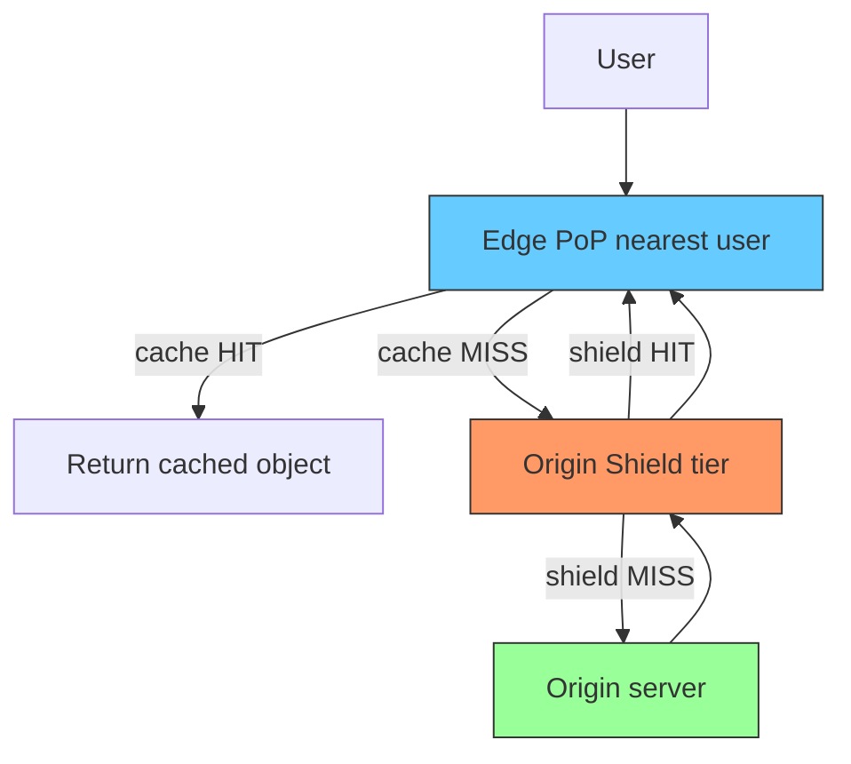
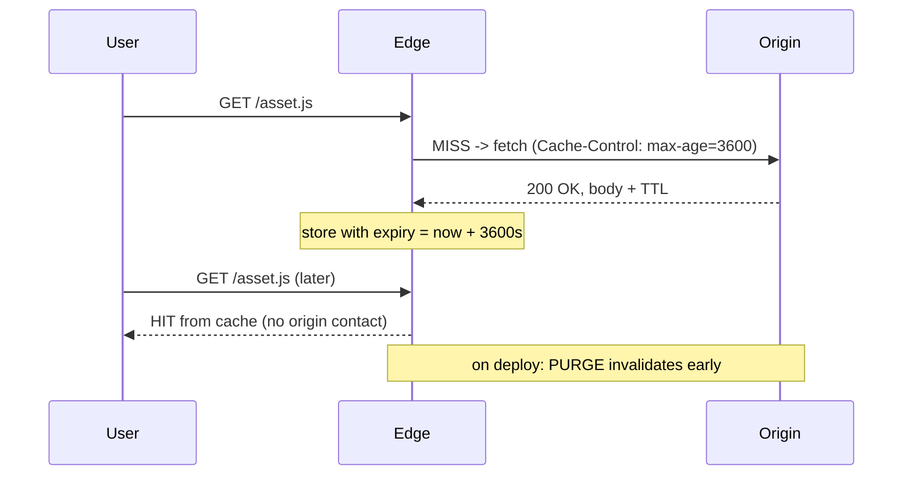

**TL;DR:** How do CDNs make the world feel local? They terminate user requests at edge PoPs that cache responses, invalidate by TTL/purge, and funnel cache misses through an **origin shield** so the origin sees far fewer requests.

> **In plain English (30 sec):** Memoization you already do: check Map first, only call DB on miss.

**Real repo:** [nginx/nginx](https://github.com/nginx/nginx) — the canonical edge/proxy cache; its upstream + connection-cap model mirrors how an edge node fronts and shields an origin.

## 1. The Engineering Problem

Serving every request from a single origin is slow (high RTT) and fragile (one box, one point of failure). A CDN must put bytes near users, keep them fresh, let operators purge fast, and stop a thundering herd of cache misses from overwhelming the origin.

## 2. The Technical Solution





**Core truths:**
- **Edge caching** answers requests at the PoP; the controlling knob is `Cache-Control`/`Expires` (TTL), not manual per-request logic.
- **Invalidation** is dual-mode: passive (wait for TTL expiry) and active (**purge/ban**) for instant updates on deploy.
- **Origin shield** is a second cache tier between edges and origin — collapses many edge misses for the same object into one origin fetch.

## 3. The clean example

An edge node configured to cache and front an origin, with a connection cap that protects the origin (the shield behavior):

```nginx
# nginx-style edge config (conceptual)
proxy_cache_path /var/cache levels=1:2 keys_zone=edge:10m max_size=10g;
server {
    location / {
        proxy_cache edge;
        proxy_cache_valid 200 3600s;          # TTL-based invalidation
        proxy_cache_use_stale error timeout;  # serve stale under origin trouble
        proxy_pass http://origin-shield;       # shield tier, not raw origin
        proxy_cache_purge PURGE from 10.0.0.0/8; # active invalidation
    }
}
```

The pattern: edge → shield → origin, each tier reducing origin load.

## 4. Production reality

nginx's upstream layer — the same code that powers edge-to-shield fan-in — caps connections per backend so a cache miss storm can't bury the origin. From `ngx_http_upstream_round_robin.c`:

```c
// nginx/src/http/ngx_http_upstream_round_robin.c
if (peer->max_conns && peer->conns >= peer->max_conns) {
    continue;   // don't open more than the backend can take
}
// weighted selection spreads the (now capped) load across shield nodes
peer->current_weight += peer->effective_weight;
total += peer->effective_weight;
```

Combined with `proxy_cache_use_stale`, this is the origin-shield guarantee: misses are rate-limited and stale-while-revalidate keeps users served even when the origin is slow.

> Multi-tier callout: edge PoP (user-facing cache) → origin shield (regional aggregator cache) → origin (source of truth). Each tier has its own TTL and purge domain.

**What this teaches:** A CDN is layered caching. TTLs give passive freshness; purges give active control; the shield tier is what turns N edge misses into 1 origin request. `max_conns` is the mechanical backstop against origin overload.

**Stale facts:** HTTP/2 fixed HTTP HOL but TCP HOL persists — HTTP/3/QUIC fixes both; TLS 1.3 removed static RSA key exchange — only ECDHE/DHE, forward secrecy by default; DNS round-robin dead at scale — clients cache A records; "firewalls inspect packets" oversimplified — modern stateful/NGFW do DPI.

## 5. Review checklist

- Is every cacheable response stamped with an explicit `Cache-Control`/TTL?
- Is there an active purge path for instant invalidation on deploy?
- Does a shield tier sit between edges and origin to collapse misses?
- Are `max_conns`/stale-while-revalidate set so the origin survives a miss storm?

## 6. FAQ

- **TTL vs purge — which wins?** Purge forces invalidation immediately; TTL bounds passive expiry. Both can coexist.
- **Why an origin shield if edges already cache?** Edges are many and geographically spread; the shield coalesces their misses so the origin gets one fetch, not thousands.
- **What is stale-while-revalidate?** Serve the old object while fetching a fresh one in the background.
- **Can dynamic content be CDN-cached?** Only with care (per-user keys, short TTLs); otherwise it stays uncached or edge-computed.
- **Is CDN caching the same as browser caching?** Related but separate layers; both honor `Cache-Control`.

## Source

- **Concept:** edge caching, TTL/purge invalidation, origin shield tiering
- **Domain:** networking
- **Repo:** nginx/nginx → [src/http/ngx_http_upstream_round_robin.c](https://github.com/nginx/nginx/blob/master/src/http/ngx_http_upstream_round_robin.c) — `max_conns` cap modeling shield/edge backpressure


