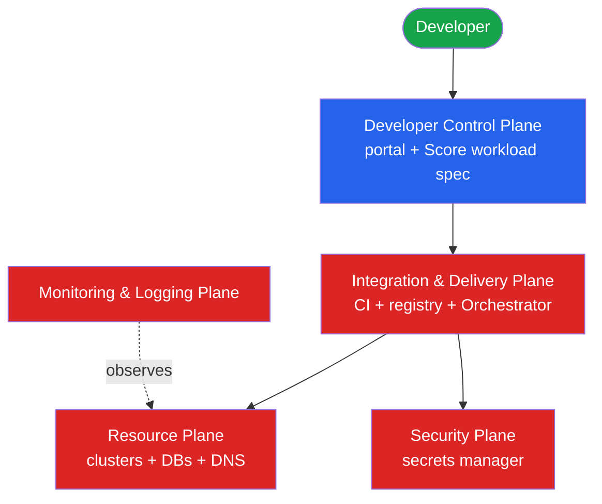

**TL;DR:** *How should a platform team be organized so it accelerates developers instead of becoming the new bottleneck?* Run the platform as a product — with users, a roadmap, and inner-source contribution — not as an ops ticket queue.

**Real repo:** [humanitec-architecture/reference-architecture-aws](https://github.com/humanitec-architecture/reference-architecture-aws)

## 1. The Engineering Problem

Most platform teams start as an ops team wearing a new title. They take tickets, provision infrastructure by hand, and firefight. This scales linearly with headcount and collapses under growth: the team becomes the constraint the platform was supposed to remove.

The organizational failure is treating the platform as a **cost center that services requests** rather than a **product that has customers**. Without product thinking, there's no roadmap, no measurement of adoption, no notion of who the users are or what they actually need — so the platform accretes features nobody uses while the real friction goes unaddressed.

The **platform-as-a-product** operating model fixes the org, not just the tech: the platform team has internal customers (developers), a product manager, adoption metrics, and — via **inner-source** — a way for those customers to contribute back.

## 2. The Technical Solution

Humanitec's reference architecture encodes this by splitting the IDP into **five planes**, each with a clear owner and contract. The platform team owns the messy planes (Integration/Delivery, Resource, Security); developers interact through the **Developer Control Plane** (portal + workload spec). This separation is what makes the platform a *product* — there's a defined interface, and the team behind it can iterate without breaking users.



Three core truths:

1. **The platform has a product interface.** The Developer Control Plane is the contract; everything behind it can change without breaking developers.
2. **Dynamic Configuration Management replaces per-team YAML.** The Orchestrator generates app + infra config on every deploy from a high-level spec, so the platform team maintains *definitions*, not thousands of manifests.
3. **Inner-source makes the platform co-owned.** The reference architecture *is code* (Terraform modules) developers can read, fork, and contribute to — not a black box.

## 3. The clean example

The product boundary in one artifact: developers write a workload spec (Score), the platform turns it into real infra. The developer's side is deliberately minimal:

```yaml
# score.yaml — the developer's entire contract with the platform
apiVersion: score.dev/v1b1
metadata:
  name: hello-world
containers:
  hello:
    image: nginx:latest
resources:
  db:
    type: postgres   # "I need a database" — platform decides HOW
```

The developer declares *what* they need (`type: postgres`). The platform team's Orchestrator and resource definitions decide *how* it's provisioned. That split is the operating model made concrete.

## 4. Production reality

Here's verbatim Terraform from the reference architecture that provisions the **portal plane** — note it's the *platform team's* code, versioned and modular, wiring Backstage plus its backing Postgres via reusable resource definitions:

> **Where things live (reference-architecture-aws):**
> ```
> reference-architecture-aws/
> ├── main.tf                          # base: VPC, EKS, IAM
> └── modules/
>     ├── base/                        # cluster + resource defs
>     └── portal-backstage/main.tf     # the portal plane (shown below)
> ```

```hcl
# humanitec_application: the portal itself is managed as a platform app
resource "humanitec_application" "backstage" {
  id   = "backstage"
  name = "backstage"
}

# module portal_backstage: shared, versioned module — inner-source reuse
module "portal_backstage" {
  source = "github.com/humanitec-architecture/shared-terraform-modules//modules/portal-backstage?ref=v2024-06-12"

  cloud_provider   = "aws"
  humanitec_org_id = var.humanitec_org_id
  humanitec_app_id = humanitec_application.backstage.id
  # github_* refs: platform wires portal <-> VCS for scaffolding
  github_org_id                = var.github_org_id
  github_app_client_id_ref     = local.secret_refs["github-app-client-id"]
  github_app_private_key_ref   = local.secret_refs["github-app-private-key"]
}

# backstage_postgres: a Resource Definition — "postgres" as a platform capability
module "backstage_postgres" {
  source = "github.com/humanitec-architecture/resource-packs-in-cluster//humanitec-resource-defs/postgres/basic?ref=v2024-06-05"
  prefix = local.res_def_prefix
}

# criteria: WHEN this postgres definition applies (to the backstage app)
resource "humanitec_resource_definition_criteria" "backstage_postgres" {
  resource_definition_id = module.backstage_postgres.id
  app_id                 = humanitec_application.backstage.id
  force_delete           = true
}
```

**What this teaches:** the platform is **built as a product in versioned, shared modules** (`?ref=v2024-06-12`) — pinned, reusable, contributable. The `humanitec_resource_definition` + `criteria` pattern is Dynamic Configuration Management: the platform team defines "here's how to make a Postgres, and here's *when* to apply it," so developers just say `type: postgres`. That's the operating model — the team maintains capabilities and definitions, not per-app infrastructure.

**Stale facts worth correcting:**
- *"Platform engineering is just DevOps with a new name."* This is the core myth. DevOps is a **culture** of shared delivery ownership. Platform engineering is a **product discipline** — a team building an IDP *for* internal customers, with a roadmap and adoption metrics.
- *"The platform team should own everything and take tickets."* No — that's the ops anti-pattern this model replaces. They own the platform *product*; developers self-serve through its interface.
- *"Inner-source is just open source internally."* Close, but the point here is co-ownership: developers can read and contribute to the platform's versioned modules instead of it being a black box.

## 5. Review checklist

- Does the platform have a named product owner and a roadmap, not just a backlog of tickets?
- Is there a clear product interface (a control plane) that decouples developers from the internals?
- Is the platform built from versioned, shareable modules developers can contribute to (inner-source)?
- Are capabilities defined once (resource definitions) rather than re-implemented per team?

## 6. FAQ

**What does "platform-as-a-product" actually change day to day?** The team measures adoption and DX, prioritizes a roadmap, and treats developer friction as bugs — instead of just clearing a queue.

**What are the five planes?** Developer Control, Integration & Delivery, Monitoring & Logging, Security, and Resource. Each has an owner and a contract; developers touch only the Control Plane.

**What is Dynamic Configuration Management?** The Orchestrator generates app + infra config on every deploy from a high-level spec (like Score), so the platform maintains definitions, not static manifests per app.

**How does inner-source fit in?** The platform is code in shared, versioned modules; internal developers can read, fork, and contribute — keeping the platform aligned with real needs.

**Is Humanitec required for this model?** No — it's a reference implementation. The operating model (product thinking, planes, self-service interface, inner-source) applies with Backstage + Crossplane + Argo CD too.

## Source

- **Concept:** Platform team operating model — platform-as-a-product and inner-source
- **Domain:** platform-engineering
- **Repo:** [humanitec-architecture/reference-architecture-aws](https://github.com/humanitec-architecture/reference-architecture-aws) → [modules/portal-backstage/main.tf](https://github.com/humanitec-architecture/reference-architecture-aws/blob/main/modules/portal-backstage/main.tf) — portal plane built from versioned shared modules + resource definitions
- **Repo:** [humanitec-architecture/reference-architecture-aws](https://github.com/humanitec-architecture/reference-architecture-aws) → [README.md](https://github.com/humanitec-architecture/reference-architecture-aws/blob/main/README.md) — the five planes and Platform-as-a-Product definition


