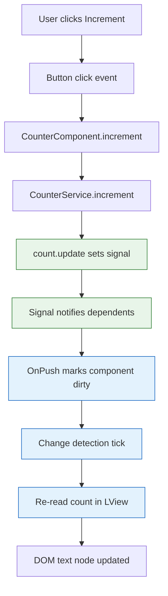

**TL;DR:** Angular is a component-and-DI framework where a component's template renders from an `LView`, signals make reactivity explicit and fine-grained, and an injector tree wires services by scope. The real angular/angular repo shows exactly how this works — and the traps (default change detection, zone confusion, DI scoping) are what make UIs go stale. Worked example below: a signal counter, an injected service, and OnPush.
> **In plain English (30 sec):** Think of this like concepts you already use, but in a production system at scale.


## 1. What is Angular (and what it isn't)

A **library** like React gives you a render function and lets you bolt on routing, state, and DI yourself. **Angular** is a framework: it ships components, a templating language compiled by its own AOT compiler, a hierarchical dependency-injection container, a router, forms, and HTTP — all wired together by the runtime.

The win is convention and cohesion: the compiler, the DI container, and the renderer are designed to agree on one `LView` data structure, so a binding in your template maps to a known slot in memory. The cost is opinionation — you write components and services the Angular way, and the framework owns the lifecycle.

## 2. A real example: a counter with a signal and an injected service

Take a real shape from how Angular apps are written against the angular/angular source. A `CounterService` holds a count as a signal; a `CounterComponent` injects it, renders the count, and exposes increment. Here is the component:


```typescript
import { Component, inject, ChangeDetectionStrategy, signal } from '@angular/core';
import { CounterService } from './counter.service';

@Component({
  selector: 'app-counter',
  standalone: true,
  changeDetection: ChangeDetectionStrategy.OnPush,
  template: `
    <p>Count: {{ count() }}</p>
    <button (click)="increment()">Increment</button>
  `
})
export class CounterComponent {
  private counter = inject(CounterService);
  count = this.counter.count;

  increment() {
    this.counter.increment();
  }
}
```


And the service it depends on:

```typescript
import { Injectable, signal } from '@angular/core';

@Injectable({ providedIn: 'root' })
export class CounterService {
  readonly count = signal(0);

  increment() {
    this.count.update(c => c + 1);
  }
}
```

What this small example already demonstrates:

- **The component is a class plus metadata.** `@Component` ties the selector, template, and `OnPush` strategy to a TypeScript class; the template is compiled into Ivy instructions, not parsed at runtime.
- **State is a signal.** `signal(0)` is a getter; reading `count()` in the template registers a dependency so the view updates only when it changes.
- **The service is injected, not constructed.** `inject(CounterService)` asks the root injector for the singleton; `providedIn: 'root'` is the provider recipe.

## 3. How the pieces connect

The component, the signal, and the injector are three subsystems that meet at render time. Here is the flow from a click to a repainted DOM:



Walk the path:

- **The event fires inside Angular's zone** (unless you opted out), so Zone.js schedules a change-detection tick when the microtask queue drains.
- **The signal write is the real trigger.** `count.update` notifies dependents; because the component reads `count()` in its template, that read was recorded as a dependency, so OnPush marks exactly this component dirty rather than the whole tree.
- **The tick re-reads the `LView` slot** for the interpolated text and writes the new value to the DOM node. No other component is checked.

This is the contrast with the default strategy: without OnPush, the tick would walk every component regardless of whether its inputs or signals changed.

## 4. What breaks: the change-detection, zone, and DI traps

This is the section to internalize before you trust the UI.

**Default change detection checks everything.** With `ChangeDetectionStrategy.Default`, every tick re-evaluates every bound expression in every component. A single high-frequency event (a timer, a mousemove) can make a large app stutter because the whole tree is reconciled. OnPush narrows the work to dirty components and signal-dependent views — but only if you actually use it and only if your inputs are immutable references.

**Zone.js can mask or magnify bugs.** Because the zone patches async APIs, a state change outside the zone (a third-party callback, a `setTimeout` you forgot, a WebSocket push) never schedules a tick, and the UI goes stale even though the model changed. The fix is `NgZone.run(() => ...)` to re-enter the zone, or `runOutsideAngular` deliberately. In zoneless mode there is no zone to hide behind: you must mark for check or use signals, and a forgotten `markForCheck` is the new stale-UI cause.

**DI scoping surprises people.** `providedIn: 'root'` makes one app-wide singleton, but a provider listed in a component's `providers` array creates a *new instance per component instance* — so two sibling components do not share it. Put a service at the wrong level and you get "why are my values not shared" or, worse, two services holding divergent state. The injector walks up the tree, so a provider on a parent component shadows the root one for its subtree.

**Mutating an input without changing its reference breaks OnPush.** OnPush keys off `@Input` reference equality, not deep equality. Passing a mutated object whose identity is unchanged leaves the component clean and the view stale. Signals sidestep this for internal state, but inputs still need new references (or input signals) to trigger.

## 5. What to care about when building Angular apps

If you take one thing from this post: **make reactivity explicit with signals, scope providers deliberately, and treat change detection as something you opt into with OnPush rather than something that sweeps the whole tree.**

- **Prefer signals for component and service state** — they give fine-grained, traceable updates and are the path to zoneless.
- **Use OnPush everywhere** it applies, and keep inputs immutable or use input signals so reference checks fire correctly.
- **Decide provider scope on purpose** — root singleton vs per-component instance vs feature NgModule — because it determines lifetime and sharing.
- **Understand the zone** even if you go zoneless; know when code runs inside vs outside Angular so stale UIs are debuggable.
- **Lean on the AOT compiler** — template type errors surface at build time, not in production.

## Review checklist

- [ ] Component state that the template reads is a signal (or input signal), so updates are tracked.
- [ ] `ChangeDetectionStrategy.OnPush` is set and inputs are treated as immutable references.
- [ ] Services are provided at the intended scope (`root` singleton vs per-component) and the injector tree is understood.
- [ ] Async callbacks that change state either run inside the zone or explicitly `markForCheck`/use signals.
- [ ] The template compiles under AOT with no binding type errors.

## FAQ

**Is Angular harder than React?** Different, not harder. Angular asks you to learn its conventions (components, DI, templates, change detection) up front; React asks you to assemble those pieces from libraries. Angular's compiler and DI container remove whole categories of runtime ambiguity in exchange for less freedom.

**Do I have to use signals?** No, but they are the recommended reactivity model and the foundation of zoneless change detection. The older `BehaviorSubject` + `AsyncPipe` pattern still works; signals just make dependencies and updates explicit.

**What is the single most common Angular bug?** A stale UI from a missed change-detection trigger — usually a state change outside the zone, a mutated (non-replaced) OnPush input, or a provider scoped to the wrong injector. All three are covered above.

**Where do I start reading next?** The deeper posts take each subsystem one at a time — start with how the renderer actually walks the view: [Angular Internals: The LView and Ivy Renderer]({{ '/angular/angular-internals-lview-and-ivy/' | relative_url }}).

## Source

Mechanics verified against the real [angular/angular](https://github.com/angular/angular) repository — `packages/core/src/render.ts` and `packages/core/src/render3/instructions/` for `LView` and Ivy instructions, `packages/core/src/di/` for the injector and `Injector`/`inject`, `packages/core/src/signals/` for `signal`/`computed`/`effect`, and `packages/core/src/zone/` plus `packages/core/src/change_detection/` for zones and change detection.

## Next in the series

→ [Angular Internals: The LView and Ivy Renderer]({{ '/angular/angular-internals-lview-and-ivy/' | relative_url }})


